# JAVA 知识点

## 一、JAVA基础（Jdk 8为准）

### 1、JAVA基础知识

#### 一、数据类型

##### 基本类型

- byte/8
- char/16
- short/16
- int/32
- float/32
- long/64
- double/64
- boolean/~

boolean 只有两个值：true、false，可以使用 1 bit 来存储，但是具体大小没有明确规定。JVM 会在编译时期将 boolean 类型的数据转换为 int，使用 1 来表示 true，0 表示 false。JVM 并不支持 boolean 数组，而是使用 byte 数组来表示 int 数组来表示。

- [Primitive Data Types](https://docs.oracle.com/javase/tutorial/java/nutsandbolts/datatypes.html)
- [The Java® Virtual Machine Specification](https://docs.oracle.com/javase/specs/jvms/se8/jvms8.pdf)

##### 包装类型

基本类型都有对应的包装类型，基本类型与其对应的包装类型之间的赋值使用自动装箱与拆箱完成。

```java
Integer x = 2;     // 装箱
int y = x;         // 拆箱
```

##### 缓存池

new Integer(123) 与 Integer.valueOf(123) 的区别在于：

- new Integer(123) 每次都会新建一个对象；
- Integer.valueOf(123) 会使用缓存池中的对象，多次调用会取得同一个对象的引用。

```java
Integer x = new Integer(123);
Integer y = new Integer(123);
System.out.println(x == y);    // false
Integer z = Integer.valueOf(123);
Integer k = Integer.valueOf(123);
System.out.println(z == k);   // true
```

valueOf() 方法的实现比较简单，就是先判断值是否在缓存池中，如果在的话就直接返回缓存池的内容。

```java
public static Integer valueOf(int i) {
    if (i >= IntegerCache.low && i <= IntegerCache.high)
        return IntegerCache.cache[i + (-IntegerCache.low)];
    return new Integer(i);
}
```

在 Java 8 中，Integer 缓存池的大小默认为 -128~127。

```java
static final int low = -128;
static final int high;
static final Integer cache[];

static {
    // high value may be configured by property
    int h = 127;
    String integerCacheHighPropValue =
        sun.misc.VM.getSavedProperty("java.lang.Integer.IntegerCache.high");
    if (integerCacheHighPropValue != null) {
        try {
            int i = parseInt(integerCacheHighPropValue);
            i = Math.max(i, 127);
            // Maximum array size is Integer.MAX_VALUE
            h = Math.min(i, Integer.MAX_VALUE - (-low) -1);
        } catch( NumberFormatException nfe) {
            // If the property cannot be parsed into an int, ignore it.
        }
    }
    high = h;

    cache = new Integer[(high - low) + 1];
    int j = low;
    for(int k = 0; k < cache.length; k++)
        cache[k] = new Integer(j++);

    // range [-128, 127] must be interned (JLS7 5.1.7)
    assert IntegerCache.high >= 127;
}
```

编译器会在自动装箱过程调用 valueOf() 方法，因此多个 Integer 实例使用自动装箱来创建并且值相同，那么就会引用相同的对象。

```java
Integer m = 123;
Integer n = 123;
System.out.println(m == n); // true
```

基本类型对应的缓冲池如下：

- boolean values true and false
- all byte values
- short values between -128 and 127
- int values between -128 and 127
- char in the range \u0000 to \u007F

在使用这些基本类型对应的包装类型时，就可以直接使用缓冲池中的对象。

[StackOverflow : Differences between new Integer(123), Integer.valueOf(123) and just 123](https://stackoverflow.com/questions/9030817/differences-between-new-integer123-integer-valueof123-and-just-123)

#### 二、String

##### 概览

String 被声明为 final，因此它不可被继承。

在 Java 8 中，String 内部使用 char 数组存储数据。

```java
public final class String
    implements java.io.Serializable, Comparable<String>, CharSequence {
    /** The value is used for character storage. */
    private final char value[];
}
```

在 Java 9 之后，String 类的实现改用 byte 数组存储字符串，同时使用 `coder` 来标识使用了哪种编码。

```java
public final class String
    implements java.io.Serializable, Comparable<String>, CharSequence {
    /** The value is used for character storage. */
    private final byte[] value;

    /** The identifier of the encoding used to encode the bytes in {@code value}. */
    private final byte coder;
}
```

value 数组被声明为 final，这意味着 value 数组初始化之后就不能再引用其它数组。并且 String 内部没有改变 value 数组的方法，因此可以保证 String 不可变。

##### 不可变的好处

**1. 可以缓存 hash 值**

因为 String 的 hash 值经常被使用，例如 String 用做 HashMap 的 key。不可变的特性可以使得 hash 值也不可变，因此只需要进行一次计算。

**2. String Pool 的需要**

如果一个 String 对象已经被创建过了，那么就会从 String Pool 中取得引用。只有 String 是不可变的，才可能使用 String Pool。

<div align="center">  </div><br>

**3. 安全性**

String 经常作为参数，String 不可变性可以保证参数不可变。例如在作为网络连接参数的情况下如果 String 是可变的，那么在网络连接过程中，String 被改变，改变 String 对象的那一方以为现在连接的是其它主机，而实际情况却不一定是。

**4. 线程安全**

String 不可变性天生具备线程安全，可以在多个线程中安全地使用。

[Program Creek : Why String is immutable in Java?](https://www.programcreek.com/2013/04/why-string-is-immutable-in-java/)

##### String, StringBuffer and StringBuilder

**1. 可变性**

- String 不可变
- StringBuffer 和 StringBuilder 可变

**2. 线程安全**

- String 不可变，因此是线程安全的
- StringBuilder 不是线程安全的
- StringBuffer 是线程安全的，内部使用 synchronized 进行同步

[StackOverflow : String, StringBuffer, and StringBuilder](https://stackoverflow.com/questions/2971315/string-stringbuffer-and-stringbuilder)

##### String Pool

字符串常量池（String Pool）保存着所有字符串字面量（literal strings），这些字面量在编译时期就确定。不仅如此，还可以使用 String 的 intern() 方法在运行过程中将字符串添加到 String Pool 中。

当一个字符串调用 intern() 方法时，如果 String Pool 中已经存在一个字符串和该字符串值相等（使用 equals() 方法进行确定），那么就会返回 String Pool 中字符串的引用；否则，就会在 String Pool 中添加一个新的字符串，并返回这个新字符串的引用。

下面示例中，s1 和 s2 采用 new String() 的方式新建了两个不同字符串，而 s3 和 s4 是通过 s1.intern() 方法取得一个字符串引用。intern() 首先把 s1 引用的字符串放到 String Pool 中，然后返回这个字符串引用。因此 s3 和 s4 引用的是同一个字符串。

```java
String s1 = new String("aaa");
String s2 = new String("aaa");
System.out.println(s1 == s2);           // false
String s3 = s1.intern();
String s4 = s1.intern();
System.out.println(s3 == s4);           // true
```

如果是采用 "bbb" 这种字面量的形式创建字符串，会自动地将字符串放入 String Pool 中。

```java
String s5 = "bbb";
String s6 = "bbb";
System.out.println(s5 == s6);  // true
```

在 Java 7 之前，String Pool 被放在运行时常量池中，它属于永久代。而在 Java 7，String Pool 被移到堆中。这是因为永久代的空间有限，在大量使用字符串的场景下会导致 OutOfMemoryError 错误。

- [StackOverflow : What is String interning?](https://stackoverflow.com/questions/10578984/what-is-string-interning)
- [深入解析 String#intern](https://tech.meituan.com/in_depth_understanding_string_intern.html)

##### new String("abc")

使用这种方式一共会创建两个字符串对象（前提是 String Pool 中还没有 "abc" 字符串对象）。

- "abc" 属于字符串字面量，因此编译时期会在 String Pool 中创建一个字符串对象，指向这个 "abc" 字符串字面量；
- 而使用 new 的方式会在堆中创建一个字符串对象。

创建一个测试类，其 main 方法中使用这种方式来创建字符串对象。

```java
public class NewStringTest {
    public static void main(String[] args) {
        String s = new String("abc");
    }
}
```

使用 javap -verbose 进行反编译，得到以下内容：

```java
// ...
Constant pool:
// ...
   #2 = Class              #18            // java/lang/String
   #3 = String             #19            // abc
// ...
  #18 = Utf8               java/lang/String
  #19 = Utf8               abc
// ...

  public static void main(java.lang.String[]);
    descriptor: ([Ljava/lang/String;)V
    flags: ACC_PUBLIC, ACC_STATIC
    Code:
      stack=3, locals=2, args_size=1
         0: new           #2                  // class java/lang/String
         3: dup
         4: ldc           #3                  // String abc
         6: invokespecial #4                  // Method java/lang/String."<init>":(Ljava/lang/String;)V
         9: astore_1
// ...
```

在 Constant Pool 中，#19 存储这字符串字面量 "abc"，#3 是 String Pool 的字符串对象，它指向 #19 这个字符串字面量。在 main 方法中，0: 行使用 new #2 在堆中创建一个字符串对象，并且使用 ldc #3 将 String Pool 中的字符串对象作为 String 构造函数的参数。

以下是 String 构造函数的源码，可以看到，在将一个字符串对象作为另一个字符串对象的构造函数参数时，并不会完全复制 value 数组内容，而是都会指向同一个 value 数组。

```java
public String(String original) {
    this.value = original.value;
    this.hash = original.hash;
}
```

#### 三、运算

##### 参数传递

Java 的参数是以值传递的形式传入方法中，而不是引用传递。

以下代码中 Dog dog 的 dog 是一个指针，存储的是对象的地址。在将一个参数传入一个方法时，本质上是将对象的地址以值的方式传递到形参中。因此在方法中使指针引用其它对象，那么这两个指针此时指向的是完全不同的对象，在一方改变其所指向对象的内容时对另一方没有影响。

```java
public class Dog {

    String name;

    Dog(String name) {
        this.name = name;
    }

    String getName() {
        return this.name;
    }

    void setName(String name) {
        this.name = name;
    }

    String getObjectAddress() {
        return super.toString();
    }
}
public class PassByValueExample {
    public static void main(String[] args) {
        Dog dog = new Dog("A");
        System.out.println(dog.getObjectAddress()); // Dog@4554617c
        func(dog);
        System.out.println(dog.getObjectAddress()); // Dog@4554617c
        System.out.println(dog.getName());          // A
    }

    private static void func(Dog dog) {
        System.out.println(dog.getObjectAddress()); // Dog@4554617c
        dog = new Dog("B");
        System.out.println(dog.getObjectAddress()); // Dog@74a14482
        System.out.println(dog.getName());          // B
    }
}
```

如果在方法中改变对象的字段值会改变原对象该字段值，因为改变的是同一个地址指向的内容。

```java
class PassByValueExample {
    public static void main(String[] args) {
        Dog dog = new Dog("A");
        func(dog);
        System.out.println(dog.getName());          // B
    }

    private static void func(Dog dog) {
        dog.setName("B");
    }
}
```

[StackOverflow: Is Java “pass-by-reference” or “pass-by-value”?](https://stackoverflow.com/questions/40480/is-java-pass-by-reference-or-pass-by-value)

##### float 与 double

Java 不能隐式执行向下转型，因为这会使得精度降低。

1.1 字面量属于 double 类型，不能直接将 1.1 直接赋值给 float 变量，因为这是向下转型。

```java
// float f = 1.1;
```

1.1f 字面量才是 float 类型。

```java
float f = 1.1f;
```

##### 隐式类型转换

因为字面量 1 是 int 类型，它比 short 类型精度要高，因此不能隐式地将 int 类型下转型为 short 类型。

```java
short s1 = 1;
// s1 = s1 + 1;
```

但是使用 += 或者 ++ 运算符可以执行隐式类型转换。

```java
s1 += 1;
// s1++;
```

上面的语句相当于将 s1 + 1 的计算结果进行了向下转型：

```java
s1 = (short) (s1 + 1);
```

[StackOverflow : Why don't Java's +=, -=, *=, /= compound assignment operators require casting?](https://stackoverflow.com/questions/8710619/why-dont-javas-compound-assignment-operators-require-casting)

##### switch

从 Java 7 开始，可以在 switch 条件判断语句中使用 String 对象。

```java
String s = "a";
switch (s) {
    case "a":
        System.out.println("aaa");
        break;
    case "b":
        System.out.println("bbb");
        break;
}
```

switch 不支持 long，是因为 switch 的设计初衷是对那些只有少数的几个值进行等值判断，如果值过于复杂，那么还是用 if 比较合适。

```java
// long x = 111;
// switch (x) { // Incompatible types. Found: 'long', required: 'char, byte, short, int, Character, Byte, Short, Integer, String, or an enum'
//     case 111:
//         System.out.println(111);
//         break;
//     case 222:
//         System.out.println(222);
//         break;
// }
```

[StackOverflow : Why can't your switch statement data type be long, Java?](https://stackoverflow.com/questions/2676210/why-cant-your-switch-statement-data-type-be-long-java)

#### 四、继承

##### 访问权限

Java 中有三个访问权限修饰符：private、protected 以及 public，如果不加访问修饰符，表示包级可见。

可以对类或类中的成员（字段以及方法）加上访问修饰符。

- 类可见表示其它类可以用这个类创建实例对象。
- 成员可见表示其它类可以用这个类的实例对象访问到该成员；

protected 用于修饰成员，表示在继承体系中成员对于子类可见，但是这个访问修饰符对于类没有意义。

设计良好的模块会隐藏所有的实现细节，把它的 API 与它的实现清晰地隔离开来。模块之间只通过它们的 API 进行通信，一个模块不需要知道其他模块的内部工作情况，这个概念被称为信息隐藏或封装。因此访问权限应当尽可能地使每个类或者成员不被外界访问。

如果子类的方法重写了父类的方法，那么子类中该方法的访问级别不允许低于父类的访问级别。这是为了确保可以使用父类实例的地方都可以使用子类实例，也就是确保满足里氏替换原则。

字段决不能是公有的，因为这么做的话就失去了对这个字段修改行为的控制，客户端可以对其随意修改。例如下面的例子中，AccessExample 拥有 id 公有字段，如果在某个时刻，我们想要使用 int 存储 id 字段，那么就需要修改所有的客户端代码。

```java
public class AccessExample {
    public String id;
}
```

可以使用公有的 getter 和 setter 方法来替换公有字段，这样的话就可以控制对字段的修改行为。

```java
public class AccessExample {

    private int id;

    public String getId() {
        return id + "";
    }

    public void setId(String id) {
        this.id = Integer.valueOf(id);
    }
}
```

但是也有例外，如果是包级私有的类或者私有的嵌套类，那么直接暴露成员不会有特别大的影响。

```java
public class AccessWithInnerClassExample {

    private class InnerClass {
        int x;
    }

    private InnerClass innerClass;

    public AccessWithInnerClassExample() {
        innerClass = new InnerClass();
    }

    public int getValue() {
        return innerClass.x;  // 直接访问
    }
}
```

##### 抽象类与接口

**1. 抽象类**

抽象类和抽象方法都使用 abstract 关键字进行声明。抽象类一般会包含抽象方法，抽象方法一定位于抽象类中。

抽象类和普通类最大的区别是，抽象类不能被实例化，需要继承抽象类才能实例化其子类。

```java
public abstract class AbstractClassExample {

    protected int x;
    private int y;

    public abstract void func1();

    public void func2() {
        System.out.println("func2");
    }
}
public class AbstractExtendClassExample extends AbstractClassExample {
    @Override
    public void func1() {
        System.out.println("func1");
    }
}
// AbstractClassExample ac1 = new AbstractClassExample(); // 'AbstractClassExample' is abstract; cannot be instantiated
AbstractClassExample ac2 = new AbstractExtendClassExample();
ac2.func1();
```

**2. 接口**

接口是抽象类的延伸，在 Java 8 之前，它可以看成是一个完全抽象的类，也就是说它不能有任何的方法实现。

从 Java 8 开始，接口也可以拥有默认的方法实现，这是因为不支持默认方法的接口的维护成本太高了。在 Java 8 之前，如果一个接口想要添加新的方法，那么要修改所有实现了该接口的类。

接口的成员（字段 + 方法）默认都是 public 的，并且不允许定义为 private 或者 protected。

接口的字段默认都是 static 和 final 的。

```java
public interface InterfaceExample {

    void func1();

    default void func2(){
        System.out.println("func2");
    }

    int x = 123;
    // int y;               // Variable 'y' might not have been initialized
    public int z = 0;       // Modifier 'public' is redundant for interface fields
    // private int k = 0;   // Modifier 'private' not allowed here
    // protected int l = 0; // Modifier 'protected' not allowed here
    // private void fun3(); // Modifier 'private' not allowed here
}
public class InterfaceImplementExample implements InterfaceExample {
    @Override
    public void func1() {
        System.out.println("func1");
    }
}
// InterfaceExample ie1 = new InterfaceExample(); // 'InterfaceExample' is abstract; cannot be instantiated
InterfaceExample ie2 = new InterfaceImplementExample();
ie2.func1();
System.out.println(InterfaceExample.x);
```

**3. 比较**

- 从设计层面上看，抽象类提供了一种 IS-A 关系，那么就必须满足里式替换原则，即子类对象必须能够替换掉所有父类对象。而接口更像是一种 LIKE-A 关系，它只是提供一种方法实现契约，并不要求接口和实现接口的类具有 IS-A 关系。
- 从使用上来看，一个类可以实现多个接口，但是不能继承多个抽象类。
- 接口的字段只能是 static 和 final 类型的，而抽象类的字段没有这种限制。
- 接口的成员只能是 public 的，而抽象类的成员可以有多种访问权限。

**4. 使用选择**

使用接口：

- 需要让不相关的类都实现一个方法，例如不相关的类都可以实现 Compareable 接口中的 compareTo() 方法；
- 需要使用多重继承。

使用抽象类：

- 需要在几个相关的类中共享代码。
- 需要能控制继承来的成员的访问权限，而不是都为 public。
- 需要继承非静态和非常量字段。

在很多情况下，接口优先于抽象类。因为接口没有抽象类严格的类层次结构要求，可以灵活地为一个类添加行为。并且从 Java 8 开始，接口也可以有默认的方法实现，使得修改接口的成本也变的很低。

- [深入理解 abstract class 和 interface](https://www.ibm.com/developerworks/cn/java/l-javainterface-abstract/)
- [When to Use Abstract Class and Interface](https://dzone.com/articles/when-to-use-abstract-class-and-intreface)

##### super

- 访问父类的构造函数：可以使用 super() 函数访问父类的构造函数，从而委托父类完成一些初始化的工作。
- 访问父类的成员：如果子类重写了父类的某个方法，可以通过使用 super 关键字来引用父类的方法实现。

```java
public class SuperExample {

    protected int x;
    protected int y;

    public SuperExample(int x, int y) {
        this.x = x;
        this.y = y;
    }

    public void func() {
        System.out.println("SuperExample.func()");
    }
}
public class SuperExtendExample extends SuperExample {

    private int z;

    public SuperExtendExample(int x, int y, int z) {
        super(x, y);
        this.z = z;
    }

    @Override
    public void func() {
        super.func();
        System.out.println("SuperExtendExample.func()");
    }
}
SuperExample e = new SuperExtendExample(1, 2, 3);
e.func();
SuperExample.func()
SuperExtendExample.func()
```

[Using the Keyword super](https://docs.oracle.com/javase/tutorial/java/IandI/super.html)

##### 重写与重载

**1. 重写（Override）**

存在于继承体系中，指子类实现了一个与父类在方法声明上完全相同的一个方法。

为了满足里式替换原则，重写有有以下两个限制：

- 子类方法的访问权限必须大于等于父类方法；
- 子类方法的返回类型必须是父类方法返回类型或为其子类型。

使用 @Override 注解，可以让编译器帮忙检查是否满足上面的两个限制条件。

**2. 重载（Overload）**

存在于同一个类中，指一个方法与已经存在的方法名称上相同，但是参数类型、个数、顺序至少有一个不同。

应该注意的是，返回值不同，其它都相同不算是重载。

**3. 实例**

```java
class A {
    public String show(D obj) {
        return ("A and D");
    }

    public String show(A obj) {
        return ("A and A");
    }
}

class B extends A {
    public String show(B obj) {
        return ("B and B");
    }

    public String show(A obj) {
        return ("B and A");
    }
}

class C extends B {
}

class D extends B {
}
public class Test {

    public static void main(String[] args) {
        A a1 = new A();
        A a2 = new B();
        B b = new B();
        C c = new C();
        D d = new D();
        System.out.println(a1.show(b)); // A and A
        System.out.println(a1.show(c)); // A and A
        System.out.println(a1.show(d)); // A and D
        System.out.println(a2.show(b)); // B and A
        System.out.println(a2.show(c)); // B and A
        System.out.println(a2.show(d)); // A and D
        System.out.println(b.show(b));  // B and B
        System.out.println(b.show(c));  // B and B
        System.out.println(b.show(d));  // A and D
    }
}
```

涉及到重写时，方法调用的优先级为：

- this.show(O)
- super.show(O)
- this.show((super)O)
- super.show((super)O)

#### 五、Object 通用方法

##### 概览

```java
public native int hashCode()

public boolean equals(Object obj)

protected native Object clone() throws CloneNotSupportedException

public String toString()

public final native Class<?> getClass()

protected void finalize() throws Throwable {}

public final native void notify()

public final native void notifyAll()

public final native void wait(long timeout) throws InterruptedException

public final void wait(long timeout, int nanos) throws InterruptedException

public final void wait() throws InterruptedException
```

##### equals()

**1. 等价关系**

Ⅰ 自反性

```java
x.equals(x); // true
```

Ⅱ 对称性

```java
x.equals(y) == y.equals(x); // true
```

Ⅲ 传递性

```java
if (x.equals(y) && y.equals(z))
    x.equals(z); // true;
```

Ⅳ 一致性

多次调用 equals() 方法结果不变

```java
x.equals(y) == x.equals(y); // true
```

Ⅴ 与 null 的比较

对任何不是 null 的对象 x 调用 x.equals(null) 结果都为 false

```java
x.equals(null); // false;
```

**2. 等价与相等**

- 对于基本类型，== 判断两个值是否相等，基本类型没有 equals() 方法。
- 对于引用类型，== 判断两个变量是否引用同一个对象，而 equals() 判断引用的对象是否等价。

```java
Integer x = new Integer(1);
Integer y = new Integer(1);
System.out.println(x.equals(y)); // true
System.out.println(x == y);      // false
```

**3. 实现**

- 检查是否为同一个对象的引用，如果是直接返回 true；
- 检查是否是同一个类型，如果不是，直接返回 false；
- 将 Object 对象进行转型；
- 判断每个关键域是否相等。

```java
public class EqualExample {

    private int x;
    private int y;
    private int z;

    public EqualExample(int x, int y, int z) {
        this.x = x;
        this.y = y;
        this.z = z;
    }

    @Override
    public boolean equals(Object o) {
        if (this == o) return true;
        if (o == null || getClass() != o.getClass()) return false;

        EqualExample that = (EqualExample) o;

        if (x != that.x) return false;
        if (y != that.y) return false;
        return z == that.z;
    }
}
```

##### hashCode()

hashCode() 返回散列值，而 equals() 是用来判断两个对象是否等价。等价的两个对象散列值一定相同，但是散列值相同的两个对象不一定等价。

在覆盖 equals() 方法时应当总是覆盖 hashCode() 方法，保证等价的两个对象散列值也相等。

下面的代码中，新建了两个等价的对象，并将它们添加到 HashSet 中。我们希望将这两个对象当成一样的，只在集合中添加一个对象，但是因为 EqualExample 没有实现 hasCode() 方法，因此这两个对象的散列值是不同的，最终导致集合添加了两个等价的对象。

```java
EqualExample e1 = new EqualExample(1, 1, 1);
EqualExample e2 = new EqualExample(1, 1, 1);
System.out.println(e1.equals(e2)); // true
HashSet<EqualExample> set = new HashSet<>();
set.add(e1);
set.add(e2);
System.out.println(set.size());   // 2
```

理想的散列函数应当具有均匀性，即不相等的对象应当均匀分布到所有可能的散列值上。这就要求了散列函数要把所有域的值都考虑进来。可以将每个域都当成 R 进制的某一位，然后组成一个 R 进制的整数。R 一般取 31，因为它是一个奇素数，如果是偶数的话，当出现乘法溢出，信息就会丢失，因为与 2 相乘相当于向左移一位。

一个数与 31 相乘可以转换成移位和减法：`31*x == (x<<5)-x`，编译器会自动进行这个优化。

```java
@Override
public int hashCode() {
    int result = 17;
    result = 31 * result + x;
    result = 31 * result + y;
    result = 31 * result + z;
    return result;
}
```

##### toString()

默认返回 ToStringExample@4554617c 这种形式，其中 @ 后面的数值为散列码的无符号十六进制表示。

```java
public class ToStringExample {

    private int number;

    public ToStringExample(int number) {
        this.number = number;
    }
}
ToStringExample example = new ToStringExample(123);
System.out.println(example.toString());
ToStringExample@4554617c
```

##### clone()

**1. cloneable**

clone() 是 Object 的 protected 方法，它不是 public，一个类不显式去重写 clone()，其它类就不能直接去调用该类实例的 clone() 方法。

```java
public class CloneExample {
    private int a;
    private int b;
}
CloneExample e1 = new CloneExample();
// CloneExample e2 = e1.clone(); // 'clone()' has protected access in 'java.lang.Object'
```

重写 clone() 得到以下实现：

```java
public class CloneExample {
    private int a;
    private int b;

    @Override
    public CloneExample clone() throws CloneNotSupportedException {
        return (CloneExample)super.clone();
    }
}
CloneExample e1 = new CloneExample();
try {
    CloneExample e2 = e1.clone();
} catch (CloneNotSupportedException e) {
    e.printStackTrace();
}
java.lang.CloneNotSupportedException: CloneExample
```

以上抛出了 CloneNotSupportedException，这是因为 CloneExample 没有实现 Cloneable 接口。

应该注意的是，clone() 方法并不是 Cloneable 接口的方法，而是 Object 的一个 protected 方法。Cloneable 接口只是规定，如果一个类没有实现 Cloneable 接口又调用了 clone() 方法，就会抛出 CloneNotSupportedException。

```java
public class CloneExample implements Cloneable {
    private int a;
    private int b;

    @Override
    public Object clone() throws CloneNotSupportedException {
        return super.clone();
    }
}
```

**2. 浅拷贝**

拷贝对象和原始对象的引用类型引用同一个对象。

```java
public class ShallowCloneExample implements Cloneable {

    private int[] arr;

    public ShallowCloneExample() {
        arr = new int[10];
        for (int i = 0; i < arr.length; i++) {
            arr[i] = i;
        }
    }

    public void set(int index, int value) {
        arr[index] = value;
    }

    public int get(int index) {
        return arr[index];
    }

    @Override
    protected ShallowCloneExample clone() throws CloneNotSupportedException {
        return (ShallowCloneExample) super.clone();
    }
}
ShallowCloneExample e1 = new ShallowCloneExample();
ShallowCloneExample e2 = null;
try {
    e2 = e1.clone();
} catch (CloneNotSupportedException e) {
    e.printStackTrace();
}
e1.set(2, 222);
System.out.println(e2.get(2)); // 222
```

**3. 深拷贝**

拷贝对象和原始对象的引用类型引用不同对象。

```java
public class DeepCloneExample implements Cloneable {

    private int[] arr;

    public DeepCloneExample() {
        arr = new int[10];
        for (int i = 0; i < arr.length; i++) {
            arr[i] = i;
        }
    }

    public void set(int index, int value) {
        arr[index] = value;
    }

    public int get(int index) {
        return arr[index];
    }

    @Override
    protected DeepCloneExample clone() throws CloneNotSupportedException {
        DeepCloneExample result = (DeepCloneExample) super.clone();
        result.arr = new int[arr.length];
        for (int i = 0; i < arr.length; i++) {
            result.arr[i] = arr[i];
        }
        return result;
    }
}
DeepCloneExample e1 = new DeepCloneExample();
DeepCloneExample e2 = null;
try {
    e2 = e1.clone();
} catch (CloneNotSupportedException e) {
    e.printStackTrace();
}
e1.set(2, 222);
System.out.println(e2.get(2)); // 2
```

**4. clone() 的替代方案**

使用 clone() 方法来拷贝一个对象即复杂又有风险，它会抛出异常，并且还需要类型转换。Effective Java 书上讲到，最好不要去使用 clone()，可以使用拷贝构造函数或者拷贝工厂来拷贝一个对象。

```java
public class CloneConstructorExample {

    private int[] arr;

    public CloneConstructorExample() {
        arr = new int[10];
        for (int i = 0; i < arr.length; i++) {
            arr[i] = i;
        }
    }

    public CloneConstructorExample(CloneConstructorExample original) {
        arr = new int[original.arr.length];
        for (int i = 0; i < original.arr.length; i++) {
            arr[i] = original.arr[i];
        }
    }

    public void set(int index, int value) {
        arr[index] = value;
    }

    public int get(int index) {
        return arr[index];
    }
}
CloneConstructorExample e1 = new CloneConstructorExample();
CloneConstructorExample e2 = new CloneConstructorExample(e1);
e1.set(2, 222);
System.out.println(e2.get(2)); // 2
```

#### 六、关键字

##### final

**1. 数据**

声明数据为常量，可以是编译时常量，也可以是在运行时被初始化后不能被改变的常量。

- 对于基本类型，final 使数值不变；
- 对于引用类型，final 使引用不变，也就不能引用其它对象，但是被引用的对象本身是可以修改的。

```
final int x = 1;
// x = 2;  // cannot assign value to final variable 'x'
final A y = new A();
y.a = 1;
```

**2. 方法**

声明方法不能被子类重写。

private 方法隐式地被指定为 final，如果在子类中定义的方法和基类中的一个 private 方法签名相同，此时子类的方法不是重写基类方法，而是在子类中定义了一个新的方法。

**3. 类**

声明类不允许被继承。

##### static

**1. 静态变量**

- 静态变量：又称为类变量，也就是说这个变量属于类的，类所有的实例都共享静态变量，可以直接通过类名来访问它。静态变量在内存中只存在一份。
- 实例变量：每创建一个实例就会产生一个实例变量，它与该实例同生共死。

```java
public class A {

    private int x;         // 实例变量
    private static int y;  // 静态变量

    public static void main(String[] args) {
        // int x = A.x;  // Non-static field 'x' cannot be referenced from a static context
        A a = new A();
        int x = a.x;
        int y = A.y;
    }
}
```

**2. 静态方法**

静态方法在类加载的时候就存在了，它不依赖于任何实例。所以静态方法必须有实现，也就是说它不能是抽象方法。

```java
public abstract class A {
    public static void func1(){
    }
    // public abstract static void func2();  // Illegal combination of modifiers: 'abstract' and 'static'
}
```

只能访问所属类的静态字段和静态方法，方法中不能有 this 和 super 关键字。

```java
public class A {

    private static int x;
    private int y;

    public static void func1(){
        int a = x;
        // int b = y;  // Non-static field 'y' cannot be referenced from a static context
        // int b = this.y;     // 'A.this' cannot be referenced from a static context
    }
}
```

**3. 静态语句块**

静态语句块在类初始化时运行一次。

```java
public class A {
    static {
        System.out.println("123");
    }

    public static void main(String[] args) {
        A a1 = new A();
        A a2 = new A();
    }
}
```

**4. 静态内部类**

非静态内部类依赖于外部类的实例，而静态内部类不需要。

```java
public class OuterClass {

    class InnerClass {
    }

    static class StaticInnerClass {
    }

    public static void main(String[] args) {
        // InnerClass innerClass = new InnerClass(); // 'OuterClass.this' cannot be referenced from a static context
        OuterClass outerClass = new OuterClass();
        InnerClass innerClass = outerClass.new InnerClass();
        StaticInnerClass staticInnerClass = new StaticInnerClass();
    }
}
```

静态内部类不能访问外部类的非静态的变量和方法。

**5. 静态导包**

在使用静态变量和方法时不用再指明 ClassName，从而简化代码，但可读性大大降低。

```java
import static com.xxx.ClassName.*
```

**6. 初始化顺序**

静态变量和静态语句块优先于实例变量和普通语句块，静态变量和静态语句块的初始化顺序取决于它们在代码中的顺序。

```java
public static String staticField = "静态变量";
static {
    System.out.println("静态语句块");
}
public String field = "实例变量";
{
    System.out.println("普通语句块");
}
```

最后才是构造函数的初始化。

```java
public InitialOrderTest() {
    System.out.println("构造函数");
}
```

存在继承的情况下，初始化顺序为：

- 父类（静态变量、静态语句块）
- 子类（静态变量、静态语句块）
- 父类（实例变量、普通语句块）
- 父类（构造函数）
- 子类（实例变量、普通语句块）
- 子类（构造函数）

#### 七、反射

每个类都有一个  **Class** 对象，包含了与类有关的信息。当编译一个新类时，会产生一个同名的 .class 文件，该文件内容保存着 Class 对象。

类加载相当于 Class 对象的加载，类在第一次使用时才动态加载到 JVM 中。也可以使用 `Class.forName("com.mysql.jdbc.Driver")` 这种方式来控制类的加载，该方法会返回一个 Class 对象。

反射可以提供运行时的类信息，并且这个类可以在运行时才加载进来，甚至在编译时期该类的 .class 不存在也可以加载进来。

Class 和 java.lang.reflect 一起对反射提供了支持，java.lang.reflect 类库主要包含了以下三个类：

- **Field** ：可以使用 get() 和 set() 方法读取和修改 Field 对象关联的字段；
- **Method** ：可以使用 invoke() 方法调用与 Method 对象关联的方法；
- **Constructor** ：可以用 Constructor 创建新的对象。

**反射的优点：**

- **可扩展性** ：应用程序可以利用全限定名创建可扩展对象的实例，来使用来自外部的用户自定义类。
- **类浏览器和可视化开发环境** ：一个类浏览器需要可以枚举类的成员。可视化开发环境（如 IDE）可以从利用反射中可用的类型信息中受益，以帮助程序员编写正确的代码。
- **调试器和测试工具** ： 调试器需要能够检查一个类里的私有成员。测试工具可以利用反射来自动地调用类里定义的可被发现的 API 定义，以确保一组测试中有较高的代码覆盖率。

**反射的缺点：**

尽管反射非常强大，但也不能滥用。如果一个功能可以不用反射完成，那么最好就不用。在我们使用反射技术时，下面几条内容应该牢记于心。

- **性能开销** ：反射涉及了动态类型的解析，所以 JVM 无法对这些代码进行优化。因此，反射操作的效率要比那些非反射操作低得多。我们应该避免在经常被执行的代码或对性能要求很高的程序中使用反射。
- **安全限制** ：使用反射技术要求程序必须在一个没有安全限制的环境中运行。如果一个程序必须在有安全限制的环境中运行，如 Applet，那么这就是个问题了。
- **内部暴露** ：由于反射允许代码执行一些在正常情况下不被允许的操作（比如访问私有的属性和方法），所以使用反射可能会导致意料之外的副作用，这可能导致代码功能失调并破坏可移植性。反射代码破坏了抽象性，因此当平台发生改变的时候，代码的行为就有可能也随着变化。

- [Trail: The Reflection API](https://docs.oracle.com/javase/tutorial/reflect/index.html)
- [深入解析 Java 反射（1）- 基础](http://www.sczyh30.com/posts/Java/java-reflection-1/)

#### 八、异常

Throwable 可以用来表示任何可以作为异常抛出的类，分为两种： **Error** 和 **Exception**。其中 Error 用来表示 JVM 无法处理的错误，Exception 分为两种：

- **受检异常** ：需要用 try...catch... 语句捕获并进行处理，并且可以从异常中恢复；
- **非受检异常** ：是程序运行时错误，例如除 0 会引发 Arithmetic Exception，此时程序崩溃并且无法恢复。

<div align="center">  </div><br>

- [Java 入门之异常处理](https://www.tianmaying.com/tutorial/Java-Exception)
- [Java 异常的面试问题及答案 -Part 1](http://www.importnew.com/7383.html)

从图中可以看出所有异常类型都是内置类`Throwable`的子类，因而`Throwable`在异常类的层次结构的顶层。接下来`Throwable`分成了两个不同的分支，一个分支是`Error`，它表示不希望被程序捕获或者是程序无法处理的错误。另一个分支是`Exception`，它表示用户程序可能捕捉的异常情况或者说是程序可以处理的异常。其中异常类`Exception`又分为运行时异常(`RuntimeException`)和非运行时异常。Java异常又可以分为不受检查异常（`Unchecked Exception`）和检查异常（`Checked Exception`）。下面将详细讲述这些异常之间的区别与联系：

`Error`：`Error`类对象由 Java 虚拟机生成并抛出，大多数错误与代码编写者所执行的操作无关。例如，Java虚拟机运行错误（`Virtual MachineError`），当JVM不再有继续执行操作所需的内存资源时，将出现 `OutOfMemoryError`。这些异常发生时，Java虚拟机（JVM）一般会选择线程终止；还有发生在虚拟机试图执行应用时，如类定义错误（`NoClassDefFoundError`）、链接错误（`LinkageError`）。这些错误是不可查的，因为它们在应用程序的控制和处理能力之 外，而且绝大多数是程序运行时不允许出现的状况。对于设计合理的应用程序来说，即使确实发生了错误，本质上也不应该试图去处理它所引起的异常状况。在Java中，错误通常是使用`Error`的子类描述。

`Exception`：在`Exception`分支中有一个重要的子类`RuntimeException`（运行时异常），该类型的异常自动为你所编写的程序定义`ArrayIndexOutOfBoundsException`（数组下标越界）、`NullPointerException`（空指针异常）、`ArithmeticException`（算术异常）、`MissingResourceException`（丢失资源）、`ClassNotFoundException`（找不到类）等异常，这些异常是不检查异常，程序中可以选择捕获处理，也可以不处理。这些异常一般是由程序逻辑错误引起的，程序应该从逻辑角度尽可能避免这类异常的发生；而`RuntimeException`之外的异常我们统称为非运行时异常，类型上属于`Exception`类及其子类，从程序语法角度讲是必须进行处理的异常，如果不处理，程序就不能编译通过。如`IOException`、`SQLException`等以及用户自定义的`Exception`异常，一般情况下不自定义检查异常。。

 注意

`Error`和`Exception`的区别：`Error`通常是灾难性的致命的错误，是程序无法控制和处理的，当出现这些异常时，Java虚拟机（JVM）一般会选择终止线程；`Exception`通常情况下是可以被程序处理的，并且在程序中应该尽可能的去处理这些异常。

#### 九、泛型

- [Java 泛型详解](http://www.importnew.com/24029.html)
- [10 道 Java 泛型面试题](https://cloud.tencent.com/developer/article/1033693)

##### 引言

泛型是Java中一个非常重要的知识点，在Java集合类框架中泛型被广泛应用。本文我们将从零开始来看一下Java泛型的设计，将会涉及到通配符处理，以及让人苦恼的类型擦除。

##### 泛型基础

##### 泛型类

我们首先定义一个简单的Box类：

```java
public class Box {
    private String object;
    public void set(String object) { this.object = object; }
    public String get() { return object; }
}
```

这是最常见的做法，这样做的一个坏处是Box里面现在只能装入String类型的元素，今后如果我们需要装入Integer等其他类型的元素，还必须要另外重写一个Box，代码得不到复用，使用泛型可以很好的解决这个问题。

```java
public class Box<T> {
    // T stands for "Type"
    private T t;
    public void set(T t) { this.t = t; }
    public T get() { return t; }
}
```

这样我们的`Box`类便可以得到复用，我们可以将T替换成任何我们想要的类型：

```java
Box<Integer> integerBox = new Box<Integer>();
Box<Double> doubleBox = new Box<Double>();
Box<String> stringBox = new Box<String>();
```

##### 泛型方法

看完了泛型类，接下来我们来了解一下泛型方法。声明一个泛型方法很简单，只要在返回类型前面加上一个类似`<K, V>`的形式就行了：

```java
public class Util {
    public static <K, V> boolean compare(Pair<K, V> p1, Pair<K, V> p2) {
        return p1.getKey().equals(p2.getKey()) &&
               p1.getValue().equals(p2.getValue());
    }
}
public class Pair<K, V> {
    private K key;
    private V value;
    public Pair(K key, V value) {
        this.key = key;
        this.value = value;
    }
    public void setKey(K key) { this.key = key; }
    public void setValue(V value) { this.value = value; }
    public K getKey()   { return key; }
    public V getValue() { return value; }
}
```

我们可以像下面这样去调用泛型方法：

```java
Pair<Integer, String> p1 = new Pair<>(1, "apple");
Pair<Integer, String> p2 = new Pair<>(2, "pear");
boolean same = Util.<Integer, String>compare(p1, p2);
```

或者在Java1.7/1.8利用type inference，让Java自动推导出相应的类型参数：

```java
Pair<Integer, String> p1 = new Pair<>(1, "apple");
Pair<Integer, String> p2 = new Pair<>(2, "pear");
boolean same = Util.compare(p1, p2);
```

##### 边界符

现在我们要实现这样一个功能，查找一个泛型数组中大于某个特定元素的个数，我们可以这样实现：

```java
public static <T> int countGreaterThan(T[] anArray, T elem) {
    int count = 0;
    for (T e : anArray)
        if (e > elem)  // compiler error
            ++count;
    return count;
}
```

但是这样很明显是错误的，因为除了`short, int, double, long, float, byte, char`等原始类型，其他的类并不一定能使用操作符`>`，所以编译器报错，那怎么解决这个问题呢？答案是使用边界符。

```java
public interface Comparable<T> {
    public int compareTo(T o);
}
```

做一个类似于下面这样的声明，这样就等于告诉编译器类型参数`T`代表的都是实现了`Comparable`接口的类，这样等于告诉编译器它们都至少实现了`compareTo`方法。

```java
public static <T extends Comparable<T>> int countGreaterThan(T[] anArray, T elem) {
    int count = 0;
    for (T e : anArray)
        if (e.compareTo(elem) > 0)
            ++count;
    return count;
}
```

##### 通配符

在了解通配符之前，我们首先必须要澄清一个概念，还是借用我们上面定义的Box类，假设我们添加一个这样的方法：

```java
public void boxTest(Box<Number> n) { /* ... */ }
```

那么现在`Box<Number> n`允许接受什么类型的参数？我们是否能够传入`Box<Integer>`或者`Box<Double>`呢？答案是否定的，虽然Integer和Double是Number的子类，但是在泛型中`Box<Integer>`或者`Box<Double>`与`Box<Number>`之间并没有任何的关系。这一点非常重要，接下来我们通过一个完整的例子来加深一下理解。

首先我们先定义几个简单的类，下面我们将用到它：

```java
class Fruit {}
class Apple extends Fruit {}
class Orange extends Fruit {}
```

下面这个例子中，我们创建了一个泛型类`Reader`，然后在`f1()`中当我们尝试`Fruit f = fruitReader.readExact(apples);`编译器会报错，因为`List<Fruit>`与`List<Apple>`之间并没有任何的关系。

```java
public class GenericReading {
    static List<Apple> apples = Arrays.asList(new Apple());
    static List<Fruit> fruit = Arrays.asList(new Fruit());
    static class Reader<T> {
        T readExact(List<T> list) {
            return list.get(0);
        }
    }
    static void f1() {
        Reader<Fruit> fruitReader = new Reader<Fruit>();
        // Errors: List<Fruit> cannot be applied to List<Apple>.
        // Fruit f = fruitReader.readExact(apples);
    }
    public static void main(String[] args) {
        f1();
    }
}
```

但是按照我们通常的思维习惯，Apple和Fruit之间肯定是存在联系，然而编译器却无法识别，那怎么在泛型代码中解决这个问题呢？我们可以通过使用通配符来解决这个问题：

```java
static class CovariantReader<T> {
    T readCovariant(List<? extends T> list) {
        return list.get(0);
    }
}
static void f2() {
    CovariantReader<Fruit> fruitReader = new CovariantReader<Fruit>();
    Fruit f = fruitReader.readCovariant(fruit);
    Fruit a = fruitReader.readCovariant(apples);
}
public static void main(String[] args) {
    f2();
}
```

这样就相当与告诉编译器， fruitReader的readCovariant方法接受的参数只要是满足Fruit的子类就行(包括Fruit自身)，这样子类和父类之间的关系也就关联上了。

##### PECS原则

上面我们看到了类似`<? extends T>`的用法，利用它我们可以从list里面get元素，那么我们可不可以往list里面add元素呢？我们来尝试一下：

```java
public class GenericsAndCovariance {
    public static void main(String[] args) {
        // Wildcards allow covariance:
        List<? extends Fruit> flist = new ArrayList<Apple>();
        // Compile Error: can't add any type of object:
        // flist.add(new Apple())
        // flist.add(new Orange())
        // flist.add(new Fruit())
        // flist.add(new Object())
        flist.add(null); // Legal but uninteresting
        // We Know that it returns at least Fruit:
        Fruit f = flist.get(0);
    }
}
```

答案是否定，Java编译器不允许我们这样做，为什么呢？对于这个问题我们不妨从编译器的角度去考虑。因为`List<? extends Fruit> flist`它自身可以有多种含义：

```java
List<? extends Fruit> flist = new ArrayList<Fruit>();
List<? extends Fruit> flist = new ArrayList<Apple>();
List<? extends Fruit> flist = new ArrayList<Orange>();
```

- 当我们尝试add一个Apple的时候，flist可能指向`new ArrayList<Orange>()`;
- 当我们尝试add一个Orange的时候，flist可能指向`new ArrayList<Apple>()`;
- 当我们尝试add一个Fruit的时候，这个Fruit可以是任何类型的Fruit，而flist可能只想某种特定类型的Fruit，编译器无法识别所以会报错。

所以对于实现了`<? extends T>`的集合类只能将它视为Producer向外提供(get)元素，而不能作为Consumer来对外获取(add)元素。

如果我们要add元素应该怎么做呢？可以使用`<? super T>`：

```java
public class GenericWriting {
    static List<Apple> apples = new ArrayList<Apple>();
    static List<Fruit> fruit = new ArrayList<Fruit>();
    static <T> void writeExact(List<T> list, T item) {
        list.add(item);
    }
    static void f1() {
        writeExact(apples, new Apple());
        writeExact(fruit, new Apple());
    }
    static <T> void writeWithWildcard(List<? super T> list, T item) {
        list.add(item)
    }
    static void f2() {
        writeWithWildcard(apples, new Apple());
        writeWithWildcard(fruit, new Apple());
    }
    public static void main(String[] args) {
        f1(); f2();
    }
}
```

这样我们可以往容器里面添加元素了，但是使用super的坏处是以后不能get容器里面的元素了，原因很简单，我们继续从编译器的角度考虑这个问题，对于`List<? super Apple> list`，它可以有下面几种含义：

```java
List<? super Apple> list = new ArrayList<Apple>();
List<? super Apple> list = new ArrayList<Fruit>();
List<? super Apple> list = new ArrayList<Object>();
```

当我们尝试通过list来get一个Apple的时候，可能会get得到一个Fruit，这个Fruit可以是Orange等其他类型的Fruit。

根据上面的例子，我们可以总结出一条规律，”Producer Extends, Consumer Super”：

- “Producer Extends” – 如果你需要一个只读List，用它来produce T，那么使用`? extends T`。
- “Consumer Super” – 如果你需要一个只写List，用它来consume T，那么使用`? super T`。
- 如果需要同时读取以及写入，那么我们就不能使用通配符了。

如何阅读过一些Java集合类的源码，可以发现通常我们会将两者结合起来一起用，比如像下面这样：

```java
public class Collections {
    public static <T> void copy(List<? super T> dest, List<? extends T> src) {
        for (int i=0; i<src.size(); i++)
            dest.set(i, src.get(i));
    }
}
```

##### 类型擦除

Java泛型中最令人苦恼的地方或许就是类型擦除了，特别是对于有C++经验的程序员。类型擦除就是说Java泛型只能用于在编译期间的静态类型检查，然后编译器生成的代码会擦除相应的类型信息，这样到了运行期间实际上JVM根本就知道泛型所代表的具体类型。这样做的目的是因为Java泛型是1.5之后才被引入的，为了保持向下的兼容性，所以只能做类型擦除来兼容以前的非泛型代码。对于这一点，如果阅读Java集合框架的源码，可以发现有些类其实并不支持泛型。

说了这么多，那么泛型擦除到底是什么意思呢？我们先来看一下下面这个简单的例子：

```java
public class Node<T> {
    private T data;
    private Node<T> next;
    public Node(T data, Node<T> next) {
        this.data = data;
        this.next = next;
    }
    public T getData() { return data; }
    // ...
}
```

编译器做完相应的类型检查之后，实际上到了运行期间上面这段代码实际上将转换成：

```java
public class Node {
    private Object data;
    private Node next;
    public Node(Object data, Node next) {
        this.data = data;
        this.next = next;
    }
    public Object getData() { return data; }
    // ...
}
```

这意味着不管我们声明`Node<String>`还是`Node<Integer>`，到了运行期间，JVM统统视为`Node<Object>`。有没有什么办法可以解决这个问题呢？这就需要我们自己重新设置bounds了，将上面的代码修改成下面这样：

```java
public class Node<T extends Comparable<T>> {
    private T data;
    private Node<T> next;
    public Node(T data, Node<T> next) {
        this.data = data;
        this.next = next;
    }
    public T getData() { return data; }
    // ...
}
```

这样编译器就会将`T`出现的地方替换成`Comparable`而不再是默认的`Object`了：

```java
public class Node {
    private Comparable data;
    private Node next;
    public Node(Comparable data, Node next) {
        this.data = data;
        this.next = next;
    }
    public Comparable getData() { return data; }
    // ...
}
```

上面的概念或许还是比较好理解，但其实泛型擦除带来的问题远远不止这些，接下来我们系统地来看一下类型擦除所带来的一些问题，有些问题在C++的泛型中可能不会遇见，但是在Java中却需要格外小心。

##### 问题一

在Java中不允许创建泛型数组，类似下面这样的做法编译器会报错：

```java
List<Integer>[] arrayOfLists = new List<Integer>[2];  // compile-time error
```

为什么编译器不支持上面这样的做法呢？继续使用逆向思维，我们站在编译器的角度来考虑这个问题。

我们先来看一下下面这个例子：

```java
Object[] strings = new String[2];
strings[0] = "hi";   // OK
strings[1] = 100;    // An ArrayStoreException is thrown.
```

对于上面这段代码还是很好理解，字符串数组不能存放整型元素，而且这样的错误往往要等到代码运行的时候才能发现，编译器是无法识别的。接下来我们再来看一下假设Java支持泛型数组的创建会出现什么后果：

```java
Object[] stringLists = new List<String>[];  // compiler error, but pretend it's allowed
stringLists[0] = new ArrayList<String>();   // OK
// An ArrayStoreException should be thrown, but the runtime can't detect it.
stringLists[1] = new ArrayList<Integer>();
```

假设我们支持泛型数组的创建，由于运行时期类型信息已经被擦除，JVM实际上根本就不知道`new ArrayList<String>()`和`new ArrayList<Integer>()`的区别。类似这样的错误假如出现才实际的应用场景中，将非常难以察觉。

如果你对上面这一点还抱有怀疑的话，可以尝试运行下面这段代码：

```java
public class ErasedTypeEquivalence {
    public static void main(String[] args) {
        Class c1 = new ArrayList<String>().getClass();
        Class c2 = new ArrayList<Integer>().getClass();
        System.out.println(c1 == c2); // true
    }
}
```

##### 问题二

继续复用我们上面的`Node`的类，对于泛型代码，Java编译器实际上还会偷偷帮我们实现一个Bridge method。

```java
public class Node<T> {
    public T data;
    public Node(T data) { this.data = data; }
    public void setData(T data) {
        System.out.println("Node.setData");
        this.data = data;
    }
}
public class MyNode extends Node<Integer> {
    public MyNode(Integer data) { super(data); }
    public void setData(Integer data) {
        System.out.println("MyNode.setData");
        super.setData(data);
    }
}
```

看完上面的分析之后，你可能会认为在类型擦除后，编译器会将Node和MyNode变成下面这样：

```java
public class Node {
    public Object data;
    public Node(Object data) { this.data = data; }
    public void setData(Object data) {
        System.out.println("Node.setData");
        this.data = data;
    }
}
public class MyNode extends Node {
    public MyNode(Integer data) { super(data); }
    public void setData(Integer data) {
        System.out.println("MyNode.setData");
        super.setData(data);
    }
}
```

实际上不是这样的，我们先来看一下下面这段代码，这段代码运行的时候会抛出`ClassCastException`异常，提示String无法转换成Integer：

```java
MyNode mn = new MyNode(5);
Node n = mn; // A raw type - compiler throws an unchecked warning
n.setData("Hello"); // Causes a ClassCastException to be thrown.
// Integer x = mn.data;
```

如果按照我们上面生成的代码，运行到第3行的时候不应该报错(注意我注释掉了第4行)，因为MyNode中不存在`setData(String data)`方法，所以只能调用父类Node的`setData(Object data)`方法，既然这样上面的第3行代码不应该报错，因为String当然可以转换成Object了，那`ClassCastException`到底是怎么抛出的？

实际上Java编译器对上面代码自动还做了一个处理：

```java
class MyNode extends Node {
    // Bridge method generated by the compiler
    public void setData(Object data) {
        setData((Integer) data);
    }
    public void setData(Integer data) {
        System.out.println("MyNode.setData");
        super.setData(data);
    }
    // ...
}
```

这也就是为什么上面会报错的原因了，`setData((Integer) data);`的时候String无法转换成Integer。所以上面第2行编译器提示`unchecked warning`的时候，我们不能选择忽略，不然要等到运行期间才能发现异常。如果我们一开始加上`Node<Integer> n = mn`就好了，这样编译器就可以提前帮我们发现错误。

##### 问题三

正如我们上面提到的，Java泛型很大程度上只能提供静态类型检查，然后类型的信息就会被擦除，所以像下面这样利用类型参数创建实例的做法编译器不会通过：

```java
public static <E> void append(List<E> list) {
    E elem = new E();  // compile-time error
    list.add(elem);
}
```

但是如果某些场景我们想要需要利用类型参数创建实例，我们应该怎么做呢？可以利用反射解决这个问题：

```java
public static <E> void append(List<E> list, Class<E> cls) throws Exception {
    E elem = cls.newInstance();   // OK
    list.add(elem);
}
```

我们可以像下面这样调用：

```java
List<String> ls = new ArrayList<>();
append(ls, String.class);
```

实际上对于上面这个问题，还可以采用Factory和Template两种[设计模式](http://www.amazon.cn/gp/product/B001130JN8/ref=as_li_qf_sp_asin_il_tl?ie=UTF8&tag=importnew-23&linkCode=as2&camp=536&creative=3200&creativeASIN=B001130JN8)解决，感兴趣的朋友不妨去看一下[Thinking in Java](http://www.amazon.com/gp/product/0131872486/ref=as_li_qf_sp_asin_il_tl?ie=UTF8&camp=1789&creative=9325&creativeASIN=0131872486&linkCode=as2&tag=job0ae-20)中第15章中关于Creating instance of types(英文版第664页)的讲解，这里我们就不深入了。

##### 问题四

我们无法对泛型代码直接使用`instanceof`关键字，因为Java编译器在生成代码的时候会擦除所有相关泛型的类型信息，正如我们上面验证过的JVM在运行时期无法识别出`ArrayList<Integer>`和`ArrayList<String>`的之间的区别：

```java
public static <E> void rtti(List<E> list) {
    if (list instanceof ArrayList<Integer>) {  // compile-time error
        // ...
    }
}
=> { ArrayList<Integer>, ArrayList<String>, LinkedList<Character>, ... }
```

和上面一样，我们可以使用通配符重新设置bounds来解决这个问题：

```java
public static void rtti(List<?> list) {
    if (list instanceof ArrayList<?>) {  // OK; instanceof requires a reifiable type
        // ...
    }
}
```

##### 工厂模式

接下来我们利用泛型来简单的实现一下工厂模式，首先我们先声明一个接口`Factory`：

```java
package typeinfo.factory;
public interface Factory<T> {
    T create();
}
```

接下来我们来创建几个实体类`FuelFilter`和`AirFilter`以及`FanBelt`和`GeneratorBelt`。

```java
class Belt extends Part {}
class FanBelt extends Belt {
    public static class Factory implements typeinfo.factory.Factory<FanBelt> {
        public FanBelt create() {
            return new FanBelt();
        }
    }
}
class GeneratorBelt extends Belt {
    public static class Factory implements typeinfo.factory.Factory<GeneratorBelt> {
        public GeneratorBelt create() {
            return new GeneratorBelt();
        }
    }
}
```

`Part`类的实现如下，注意我们上面的实体类都是`Part`类的间接子类。在Part类我们`注册`了我们上面的声明的实体类。所以以后我们如果要创建相关的实体类的话，只需要在调用Part类的相关方法了。这么做的一个好处就是如果的业务中出现了`CabinAirFilter`或者`PowerSteeringBelt`的话，我们不需要修改太多的代码，只需要在Part类中将它们注册即可。

```java
class Part {
    static List<Factory<? extends Part>> partFactories =
        new ArrayList<Factory<? extends Part>>();
    static {
        partFactories.add(new FuelFilter.Factory());
        partFactories.add(new AirFilter.Factory());
        partFactories.add(new FanBelt.Factory());
        partFactories.add(new PowerSteeringBelt.Factory());
    }
    private static Random rand = new Random(47);
    public static Part createRandom() {
        int n = rand.nextInt(partFactories.size());
        return partFactories.get(n).create();
    }
    public String toString() {
        return getClass().getSimpleName();
    }
}
```

最后我们来测试一下：

```java
public class RegisteredFactories {
    public static void main(String[] args) {
        for (int i = 0; i < 10; i++) {
            System.out.println(Part.createRandom());
        }
    }
}
```

#### 十、注解

Java 注解是附加在代码中的一些元信息，用于一些工具在编译、运行时进行解析和使用，起到说明、配置的功能。注解不会也不能影响代码的实际逻辑，仅仅起到辅助性的作用。

[注解 Annotation 实现原理与自定义注解例子](https://www.cnblogs.com/acm-bingzi/p/javaAnnotation.html)

##### 注解的用处：

​      1、生成文档。这是最常见的，也是java 最早提供的注解。常用的有@param @return 等
​      2、跟踪代码依赖性，实现替代配置文件功能。比如Dagger 2 依赖注入，未来java 开发，将大量注解配置，具有很大用处;
​      3、在编译时进行格式检查。如@override 放在方法前，如果你这个方法并不是覆盖了超类方法，则编译时就能检查出。

##### 注解的原理：

　　注解本质是一个继承了Annotation 的特殊接口，其具体实现类是Java 运行时生成的动态代理类。而我们通过反射获取注解时，返回的是Java 运行时生成的动态代理对象$Proxy1。通过代理对象调用自定义注解（接口）的方法，会最终调用AnnotationInvocationHandler 的invoke 方法。该方法会从memberValues 这个Map 中索引出对应的值。而memberValues 的来源是Java 常量池。

##### 元注解：

java.lang.annotation 提供了四种元注解，专门注解其他的注解（在自定义注解的时候，需要使用到元注解）：
   @Documented – 注解是否将包含在JavaDoc中
   @Retention – 什么时候使用该注解
   @Target – 注解用于什么地方
   @Inherited – 是否允许子类继承该注解

  1.）@Retention – 定义该注解的生命周期
  ●   RetentionPolicy.SOURCE : 在编译阶段丢弃。这些注解在编译结束之后就不再有任何意义，所以它们不会写入字节码。@Override, @SuppressWarnings都属于这类注解。
  ●   RetentionPolicy.CLASS : 在类加载的时候丢弃。在字节码文件的处理中有用。注解默认使用这种方式
  ●   RetentionPolicy.RUNTIME : 始终不会丢弃，运行期也保留该注解，因此可以使用反射机制读取该注解的信息。我们自定义的注解通常使用这种方式。

  2.）Target – 表示该注解用于什么地方。默认值为任何元素，表示该注解用于什么地方。可用的ElementType 参数包括
  ● ElementType.CONSTRUCTOR: 用于描述构造器
  ● ElementType.FIELD: 成员变量、对象、属性（包括enum实例）
  ● ElementType.LOCAL_VARIABLE: 用于描述局部变量
  ● ElementType.METHOD: 用于描述方法
  ● ElementType.PACKAGE: 用于描述包
  ● ElementType.PARAMETER: 用于描述参数
  ● ElementType.TYPE: 用于描述类、接口(包括注解类型) 或enum声明

 3.)@Documented – 一个简单的Annotations 标记注解，表示是否将注解信息添加在java 文档中。

 4.)@Inherited – 定义该注释和子类的关系
​     @Inherited 元注解是一个标记注解，@Inherited 阐述了某个被标注的类型是被继承的。如果一个使用了@Inherited 修饰的annotation 类型被用于一个class，则这个annotation 将被用于该class 的子类。

##### 自定义注解：

自定义注解类编写的一些规则:
​        1. Annotation 型定义为@interface, 所有的Annotation 会自动继承java.lang.Annotation这一接口,并且不能再去继承别的类或是接口.
​        2. 参数成员只能用public 或默认(default) 这两个访问权修饰
​        3. 参数成员只能用基本类型byte、short、char、int、long、float、double、boolean八种基本数据类型和String、Enum、Class、annotations等数据类型，以及这一些类型的数组.
​        4. 要获取类方法和字段的注解信息，必须通过Java的反射技术来获取 Annotation 对象，因为你除此之外没有别的获取注解对象的方法
​        5. 注解也可以没有定义成员,，不过这样注解就没啥用了

    PS:自定义注解需要使用到元注解

##### 自定义注解实例：

```java
import java.lang.annotation.Documented;
import java.lang.annotation.Retention;
import java.lang.annotation.Target;
import static java.lang.annotation.ElementType.FIELD;
import static java.lang.annotation.RetentionPolicy.RUNTIME;

/**
 * 水果名称注解
 */
@Target(FIELD)
@Retention(RUNTIME)
@Documented
public @interface FruitName {
    String value() default "";
}
```

```java
import java.lang.annotation.Documented;
import java.lang.annotation.Retention;
import java.lang.annotation.Target;
import static java.lang.annotation.ElementType.FIELD;
import static java.lang.annotation.RetentionPolicy.RUNTIME;

/**
 * 水果颜色注解
 */
@Target(FIELD)
@Retention(RUNTIME)
@Documented
public @interface FruitColor {
    /**
     * 颜色枚举
     */
    public enum Color{ BLUE,RED,GREEN};
    
    /**
     * 颜色属性
     */
    Color fruitColor() default Color.GREEN;

}
```

``` java
import java.lang.annotation.Documented;
import java.lang.annotation.Retention;
import java.lang.annotation.Target;
import static java.lang.annotation.ElementType.FIELD;
import static java.lang.annotation.RetentionPolicy.RUNTIME;


/**
 * 水果供应者注解
 */
@Target(FIELD)
@Retention(RUNTIME)
@Documented
public @interface FruitProvider {
    /**
     * 供应商编号
     */
    public int id() default -1;
    
    /**
     * 供应商名称
     */
    public String name() default "";
    
    /**
     * 供应商地址
     */
    public String address() default "";
}
```

```java
import java.lang.reflect.Field;

/**
 * 注解处理器
 */
public class FruitInfoUtil {
    public static void getFruitInfo(Class<?> clazz){
        
        String strFruitName=" 水果名称：";
        String strFruitColor=" 水果颜色：";
        String strFruitProvicer="供应商信息：";
        
        Field[] fields = clazz.getDeclaredFields();
        
        for(Field field :fields){
            if(field.isAnnotationPresent(FruitName.class)){
                FruitName fruitName = (FruitName) field.getAnnotation(FruitName.class);
                strFruitName=strFruitName+fruitName.value();
                System.out.println(strFruitName);
            }
            else if(field.isAnnotationPresent(FruitColor.class)){
                FruitColor fruitColor= (FruitColor) field.getAnnotation(FruitColor.class);
                strFruitColor=strFruitColor+fruitColor.fruitColor().toString();
                System.out.println(strFruitColor);
            }
            else if(field.isAnnotationPresent(FruitProvider.class)){
                FruitProvider fruitProvider= (FruitProvider) field.getAnnotation(FruitProvider.class);
                strFruitProvicer=" 供应商编号："+fruitProvider.id()+" 供应商名称："+fruitProvider.name()+" 供应商地址："+fruitProvider.address();
                System.out.println(strFruitProvicer);
            }
        }
    }
}
```

```java
import test.FruitColor.Color;

/**
 * 注解使用
 */
public class Apple {
    
    @FruitName("Apple")
    private String appleName;
    
    @FruitColor(fruitColor=Color.RED)
    private String appleColor;
    
    @FruitProvider(id=1,name="陕西红富士集团",address="陕西省西安市延安路89号红富士大厦")
    private String appleProvider;
    
    public void setAppleColor(String appleColor) {
        this.appleColor = appleColor;
    }
    public String getAppleColor() {
        return appleColor;
    }
    
    public void setAppleName(String appleName) {
        this.appleName = appleName;
    }
    public String getAppleName() {
        return appleName;
    }
    
    public void setAppleProvider(String appleProvider) {
        this.appleProvider = appleProvider;
    }
    public String getAppleProvider() {
        return appleProvider;
    }
    
    public void displayName(){
        System.out.println("水果的名字是：苹果");
    }
}
```

```java
/**
 * 输出结果
 */
public class FruitRun {
    public static void main(String[] args) {
        FruitInfoUtil.getFruitInfo(Apple.class);
    }
}

/**输出结果：
	水果名称：Apple
 	水果颜色：RED
 	供应商编号：1 供应商名称：陕西红富士集团 供应商地址：陕西省西安市延安路89号红富士大厦
 **/
```

#### 十一、JDK 8特性

[Java 8 特性](http://www.importnew.com/19345.html)](http://www.importnew.com/19345.html)

##### **1. Lambda 表达式和函数式接口**

Lambda表达式（也叫做闭包）是Java  8中最大的也是期待已久的变化。它允许我们将一个函数当作方法的参数（传递函数），或者说把代码当作数据，这是每个函数式编程者熟悉的概念。很多基于JVM平台的语言一开始就支持Lambda表达式，但是Java程序员没有选择，只能使用匿名内部类来替代Lambda表达式。

Lambda表达式的设计被讨论了很久，而且花费了很多的功夫来交流。不过最后取得了一个折中的办法，得到了一个新的简明并且紧凑的Lambda表达式结构。最简单的Lambda表达式可以用逗号分隔的参数列表、->符号和功能语句块来表示。示例如下：

```java
Arrays.asList( "a", "b", "d" ).forEach( e -> System.out.println( e ) );
```

请注意到编译器会根据上下文来推测参数的类型，或者你也可以显示地指定参数类型，只需要将类型包在括号里。举个例子：

```java
Arrays.asList( "a", "b", "d" ).forEach( ( String e ) -> System.out.println( e ) );
```

如果Lambda的功能语句块太复杂，我们可以用大括号包起来，跟普通的Java方法一样，如下：

```java
String separator = ",";
Arrays.asList( "a", "b", "d" ).forEach(
    ( String e ) -> System.out.print( e + separator ) );
```

Lambda表达式可能会引用类的成员或者局部变量（会被隐式地转变成final类型），下面两种写法的效果是一样的：

```java
String separator = ",";
Arrays.asList( "a", "b", "d" ).forEach(
    ( String e ) -> System.out.print( e + separator ) );
```

和

```java
final String separator = ",";
Arrays.asList( "a", "b", "d" ).forEach(
    ( String e ) -> System.out.print( e + separator ) );
```

Lambda表达式可能会有返回值，编译器会根据上下文推断返回值的类型。如果lambda的语句块只有一行，不需要return关键字。下面两个写法是等价的：

```java
Arrays.asList( "a", "b", "d" ).sort( ( e1, e2 ) -> e1.compareTo( e2 ) );
```

和

```java
Arrays.asList( "a", "b", "d" ).sort( ( e1, e2 ) -> {
    int result = e1.compareTo( e2 );
    return result;
} );
```

语言的设计者们思考了很多如何让现有的功能和lambda表达式友好兼容。于是就有了函数接口这个概念。函数接口是一种只有一个方法的接口，像这样地，函数接口可以隐式地转换成lambda表达式。

java.lang.Runnable  和java.util.concurrent.Callable是函数接口两个最好的例子。但是在实践中，函数接口是非常脆弱的，只要有人在接口里添加多一个方法，那么这个接口就不是函数接口了，就会导致编译失败。Java   8提供了一个特殊的注解@FunctionalInterface来克服上面提到的脆弱性并且显示地表明函数接口的目的（java里所有现存的接口都已经加上了@FunctionalInterface）。让我们看看一个简单的函数接口定义：

```java
@FunctionalInterface
public interface Functional {
    void method();
}
```

我们要记住默认的方法和静态方法（下一节会具体解释）不会违反函数接口的约定，例子如下：

```java
@FunctionalInterface
public interface FunctionalDefaultMethods {
    void method();
 
    default void defaultMethod() {
    }
}
```

支持Lambda是Java 8最大的卖点，他有巨大的潜力吸引越来越多的开发人员转到这个开发平台来，并且在纯Java里提供最新的函数式编程的概念。对于更多的细节，请参考[官方文档](http://docs.oracle.com/javase/tutorial/java/javaOO/lambdaexpressions.html)。

##### **2. 接口的默认方法和静态方法**

Java 8增加了两个新的概念在接口声明的时候：默认和静态方法。默认方法和Trait有些类似，但是目标不一样。默认方法允许我们在接口里添加新的方法，而不会破坏实现这个接口的已有类的兼容性，也就是说不会强迫实现接口的类实现默认方法。

默认方法和抽象方法的区别是抽象方法必须要被实现，默认方法不是。作为替代方式，接口可以提供一个默认的方法实现，所有这个接口的实现类都会通过继承得倒这个方法（如果有需要也可以重写这个方法），让我们来看看下面的例子：

```java
private interface Defaulable {
    // Interfaces now allow default methods, the implementer may or
    // may not implement (override) them.
    default String notRequired() {
        return "Default implementation";
    }
}
 
private static class DefaultableImpl implements Defaulable {
}
 
private static class OverridableImpl implements Defaulable {
    @Override
    public String notRequired() {
        return "Overridden implementation";
    }
}
```

接口Defaulable使用default关键字声明了一个默认方法notRequired()，类DefaultableImpl实现了Defaulable接口，没有对默认方法做任何修改。另外一个类OverridableImpl重写类默认实现，提供了自己的实现方法。

Java 8 的另外一个有意思的新特性是接口里可以声明静态方法，并且可以实现。例子如下：

```java
private interface DefaulableFactory {
    // Interfaces now allow static methods
    static Defaulable create( Supplier< Defaulable > supplier ) {
        return supplier.get();
    }
}
```

下面是把接口的静态方法和默认方法放在一起的示例（::new 是构造方法引用，后面会有详细描述）：

```java
public static void main( String[] args ) {
    Defaulable defaulable = DefaulableFactory.create( DefaultableImpl::new );
    System.out.println( defaulable.notRequired() );
 
    defaulable = DefaulableFactory.create( OverridableImpl::new );
    System.out.println( defaulable.notRequired() );
}
```

控制台的输出如下：

```java
Default implementation
Overridden implementation
```

JVM平台的接口的默认方法实现是很高效的，并且方法调用的字节码指令支持默认方法。默认方法使已经存在的接口可以修改而不会影响编译的过程。java.util.Collection中添加的额外方法就是最好的例子：**stream()**, **parallelStream()**, **forEach()**, **removeIf()**

虽然默认方法很强大，但是使用之前一定要仔细考虑是不是真的需要使用默认方法，因为在层级很复杂的情况下很容易引起模糊不清甚至变异错误。更多的详细信息请参考[官方文档](http://docs.oracle.com/javase/tutorial/java/IandI/defaultmethods.html)。

##### **3.**   **方法引用**

方法引用提供了一个很有用的语义来直接访问类或者实例的已经存在的方法或者构造方法。结合Lambda表达式，方法引用使语法结构紧凑简明。不需要复杂的引用。

下面我们用**Car** 这个类来做示例，Car这个类有不同的方法定义。让我们来看看java 8支持的4种方法引用。

```java
public static class Car {
    public static Car create( final Supplier< Car > supplier ) {
        return supplier.get();
    }              
 
    public static void collide( final Car car ) {
        System.out.println( "Collided " + car.toString() );
    }
 
    public void follow( final Car another ) {
        System.out.println( "Following the " + another.toString() );
    }
 
    public void repair() {
        System.out.println( "Repaired " + this.toString() );
    }
}
```

第一种方法引用是构造方法引用，语法是：**Class::new** ，对于泛型来说语法是：**Class<T >::new**，请注意构造方法没有参数:

```java
final Car car = Car.create( Car::new );
final List< Car > cars = Arrays.asList( car );
```

第二种方法引用是静态方法引用，语法是：**Class::static_method**请注意这个静态方法只支持一个类型为Car的参数。

```java
cars.forEach( Car::collide );
```

第三种方法引用是类实例的方法引用，语法是：**Class::method**请注意方法没有参数。

```java
cars.forEach( Car::repair );
```

最后一种方法引用是引用特殊类的方法，语法是：**instance::method****，**请注意只接受Car类型的一个参数。

```java
final Car police = Car.create( Car::new );
cars.forEach( police::follow );
```

运行这些例子我们将会在控制台得到如下信息（Car的实例可能会不一样）： 

```java
Collided com.javacodegeeks.java8.method.references.MethodReferences$Car@7a81197d
Repaired com.javacodegeeks.java8.method.references.MethodReferences$Car@7a81197d
Following the com.javacodegeeks.java8.method.references.MethodReferences$Car@7a81197d
```

关于方法引用更多的示例和详细信息，请参考[官方文档](http://docs.oracle.com/javase/tutorial/java/javaOO/methodreferences.html)

##### **4. **   **重复注释**

自从Java 5支持注释以来，注释变得特别受欢迎因而被广泛使用。但是有一个限制，同一个地方的不能使用同一个注释超过一次。 Java 8打破了这个规则，引入了重复注释，允许相同注释在声明使用的时候重复使用超过一次。 

重复注释本身需要被@Repeatable注释。实际上，他不是一个语言上的改变，只是编译器层面的改动，技术层面仍然是一样的。让我们来看看例子：

```java
package com.javacodegeeks.java8.repeatable.annotations;
 
import java.lang.annotation.ElementType;
import java.lang.annotation.Repeatable;
import java.lang.annotation.Retention;
import java.lang.annotation.RetentionPolicy;
import java.lang.annotation.Target;
 
public class RepeatingAnnotations {
    @Target( ElementType.TYPE )
    @Retention( RetentionPolicy.RUNTIME )
    public @interface Filters {
        Filter[] value();
    }
 
    @Target( ElementType.TYPE )
    @Retention( RetentionPolicy.RUNTIME )
    @Repeatable( Filters.class )
    public @interface Filter {
        String value();
    };
 
    @Filter( "filter1" )
    @Filter( "filter2" )
    public interface Filterable {
    }
 
    public static void main(String[] args) {
        for( Filter filter: Filterable.class.getAnnotationsByType( Filter.class ) ) {
            System.out.println( filter.value() );
        }
    }
}
```

我们可以看到，注释Filter被@Repeatable( Filters.class )注释。Filters 只是一个容器，它持有Filter, 编译器尽力向程序员隐藏它的存在。通过这样的方式，Filterable接口可以被Filter注释两次。

另外，反射的API提供一个新方法getAnnotationsByType() 来返回重复注释的类型（请注意Filterable.class.getAnnotation( Filters.class )将会返回编译器注入的Filters实例）。

程序的输出将会是这样：

```java
filter1
filter2
```

更多详细信息请参考[官方文档](http://docs.oracle.com/javase/tutorial/java/annotations/repeating.html)。

##### **5. **   **更好的类型推断**

Java 8在类型推断方面改进了很多，在很多情况下，编译器可以推断参数的类型，从而保持代码的整洁。让我们看看例子：

package com.javacodegeeks.java8.type.inference;

```java
package com.javacodegeeks.java8.type.inference;
 
public class Value<T> {
    public static<T> T defaultValue() {
        return null;
    }
 
    public T getOrDefault( T value, T defaultValue ) {
        return ( value != null ) ? value : defaultValue;
    }
}
```

这里是Value< String >的用法

```java
package com.javacodegeeks.java8.type.inference;
 
public class TypeInference {
    public static void main(String[] args) {
        final Value<String> value = new Value<>();
        value.getOrDefault( "22", Value.defaultValue() );
    }
}
```

参数Value.defaultValue()的类型被编译器推断出来，不需要显式地提供类型。在java 7, 相同的代码不会被编译，需要写成：Value.< String >defaultValue()

##### **6. **   **注解的扩展**

Java 8扩展了注解可以使用的范围，现在我们几乎可以在所有的地方：局部变量、泛型、超类和接口实现、甚至是方法的Exception声明。一些例子如下：

```java
package com.javacodegeeks.java8.annotations;
 
import java.lang.annotation.ElementType;
import java.lang.annotation.Retention;
import java.lang.annotation.RetentionPolicy;
import java.lang.annotation.Target;
import java.util.ArrayList;
import java.util.Collection;
 
public class Annotations {
    @Retention( RetentionPolicy.RUNTIME )
    @Target( { ElementType.TYPE_USE, ElementType.TYPE_PARAMETER } )
    public @interface NonEmpty {
    }
 
    public static class Holder< @NonEmpty T > extends @NonEmpty Object {
        public void method() throws @NonEmpty Exception {
        }
    }
 
    @SuppressWarnings( "unused" )
    public static void main(String[] args) {
        final Holder< String > holder = new @NonEmpty Holder< String >();
        @NonEmpty Collection< @NonEmpty String > strings = new ArrayList<>();
    }
}
```

Java 8 新增加了两个注解的程序元素类型**ElementType.TYPE_USE** 和**ElementType.TYPE_PARAMETER** ，这两个新类型描述了可以使用注解的新场合。注解处理API（**Annotation Processing API**）也做了一些细微的改动，来识别这些新添加的注解类型。

##### **7. Optional**

著名的[**NullPointerException**](http://examples.javacodegeeks.com/java-basics/exceptions/java-lang-nullpointerexception-how-to-handle-null-pointer-exception/) 是引起系统失败最常见的原因。很久以前[Google Guava](http://code.google.com/p/guava-libraries/)项目引入了**Optional**作为解决空指针异常的一种方式，不赞成代码被null检查的代码污染，期望程序员写整洁的代码。受[Google Guava](http://code.google.com/p/guava-libraries/)的鼓励，**Optional** 现在是Java 8库的一部分。

**Optional** 只是一个容器，它可以保存一些类型的值或者null。它提供很多有用的方法，所以没有理由不显式地检查null。请参照java 8的[文档](http://docs.oracle.com/javase/8/docs/api/java/util/Optional.html)查看详细信息。

让我们看看两个**Optional** 用法的小例子：一个是允许为空的值，另外一个是不允许为空的值。

```java
Optional< String > fullName = Optional.ofNullable( null );
System.out.println( "Full Name is set? " + fullName.isPresent() );        
System.out.println( "Full Name: " + fullName.orElseGet( () -> "[none]" ) ); 
System.out.println( fullName.map( s -> "Hey " + s + "!" ).orElse( "Hey Stranger!" ) );
```

如果Optional实例有非空的值，方法 isPresent() 返回true否则返回false。方法orElseGet提供了回退机制，当Optional的值为空时接受一个方法返回默认值。map()方法转化Optional当前的值并且返回一个新的Optional实例。orElse方法和orElseGet类似，但是它不接受一个方法，而是接受一个默认值。上面代码运行结果如下：

```java
Full Name is set? false
Full Name: [none]
Hey Stranger!
```

让我们大概看看另外一个例子。

```java
Optional< String > firstName = Optional.of( "Tom" );
System.out.println( "First Name is set? " + firstName.isPresent() );        
System.out.println( "First Name: " + firstName.orElseGet( () -> "[none]" ) ); 
System.out.println( firstName.map( s -> "Hey " + s + "!" ).orElse( "Hey Stranger!" ) );
System.out.println();
```

输出如下：

```java
First Name is set? true
First Name: Tom
Hey Tom!
```

##### **8. stream**

新增加的Stream API (**java.util.stream**)引入了在Java里可以工作的函数式编程。这是目前为止对java库最大的一次功能添加，希望程序员通过编写有效、整洁和简明的代码，能够大大提高生产率。

Stream API让集合处理简化了很多（我们后面会看到不仅限于Java集合类）。让我们从一个简单的类Task开始来看看Stream的用法。

```java
public class Streams {
  private enum Status {
  OPEN, CLOSED
  };
 
  private static final class Task {
    private final Status status;
    private final Integer points;

    Task( final Status status, final Integer points ) {
      this.status = status;
      this.points = points;
    }

    public Integer getPoints() {
    	return points;
    }

    public Status getStatus() {
    	return status;
    }
 
    @Override
    public String toString() {
    	return String.format( "[%s, %d]", status, points );
    }
  }
}
```

Task类有一个分数的概念（或者说是伪复杂度），其次是还有一个值可以为OPEN或CLOSED的状态.让我们引入一个Task的小集合作为演示例子：

```java
final Collection< Task > tasks = Arrays.asList(
    new Task( Status.OPEN, 5 ),
    new Task( Status.OPEN, 13 ),
    new Task( Status.CLOSED, 8 ) 
);
```

第一个问题是所有的开放的Task的点数是多少？在java 8 之前，通常的做法是用foreach迭代。但是Java8里头我们会用Stream。Stream是多个元素的序列，支持串行和并行操作。

```java
// Calculate total points of all active tasks using sum()
final long totalPointsOfOpenTasks = tasks
    .stream()
    .filter( task -> task.getStatus() == Status.OPEN )
    .mapToInt( Task::getPoints )
    .sum();
 
System.out.println( "Total points: " + totalPointsOfOpenTasks );
```

控制台的输出将会是：

```java
Total points: 18
```

上面代码执行的流程是这样的，首先Task集合会被转化为Stream表示，然后filter操作会过滤掉所有关闭的Task，接下来使用Task::getPoints 方法取得每个Task实例的点数，mapToInt方法会把Task Stream转换成Integer Stream，最后使用Sum方法将所有的点数加起来得到最终的结果。

在我们看下一个例子之前，我们要记住一些关于Stream的说明。Stream操作被分为中间操作和终点操作。

中间操作返回一个新的Stream。这些中间操作是延迟的，执行一个中间操作比如filter实际上不会真的做过滤操作，而是创建一个新的Stream，当这个新的Stream被遍历的时候，它里头会包含有原来Stream里符合过滤条件的元素。

终点操作比如说forEach或者sum会遍历Stream从而产生最终结果或附带结果。终点操作执行完之后，Stream管道就被消费完了，不再可用。在几乎所有的情况下，终点操作都是即时完成对数据的遍历操作。

Stream的另外一个价值是Stream创造性地支持并行处理。让我们看看下面这个例子，这个例子把所有task的点数加起来。

```java
// Calculate total points of all tasks
final double totalPoints = tasks
   .stream()
   .parallel()
   .map( task -> task.getPoints() ) // or map( Task::getPoints ) 
   .reduce( 0, Integer::sum );
 
System.out.println( "Total points (all tasks): " + totalPoints );
```

这个例子跟上面那个非常像，除了这个例子里使用了parallel()方法       并且计算最终结果的时候使用了reduce方法。

输出如下：

```java
Total points (all tasks): 26.0
```

经常会有这个一个需求：我们需要按照某种准则来对集合中的元素进行分组。Stream也可以处理这样的需求，下面是一个例子：

```java
// Group tasks by their status
final Map< Status, List< Task > > map = tasks
    .stream()
    .collect( Collectors.groupingBy( Task::getStatus ) );
System.out.println( map );
```

控制台的输出如下：

```java
{CLOSED=[[CLOSED, 8]], OPEN=[[OPEN, 5], [OPEN, 13]]}
```

让我们来计算整个集合中每个task分数（或权重）的平均值来结束task的例子。

```java
// Calculate the weight of each tasks (as percent of total points) 
final Collection< String > result = tasks
    .stream()                                        // Stream< String >
    .mapToInt( Task::getPoints )                     // IntStream
    .asLongStream()                                  // LongStream
    .mapToDouble( points -> points / totalPoints )   // DoubleStream
    .boxed()                                         // Stream< Double >
    .mapToLong( weigth -> ( long )( weigth * 100 ) ) // LongStream
    .mapToObj( percentage -> percentage + "%" )      // Stream< String> 
    .collect( Collectors.toList() );                 // List< String > 
 
System.out.println( result );
```

控制台输出如下：

```java
[19%, 50%, 30%]
```

最后，就像前面提到的，Stream API不仅仅处理Java集合框架。像从文本文件中逐行读取数据这样典型的I/O操作也很适合用Stream API来处理。下面用一个例子来应证这一点。

```java
final Path path = new File( filename ).toPath();
try( Stream< String > lines = Files.lines( path, StandardCharsets.UTF_8 ) ) {
    lines.onClose( () -> System.out.println("Done!") ).forEach( System.out::println );
}
```

Stream的方法**onClose** 返回一个等价的有额外句柄的Stream，当Stream的close（）方法被调用的时候这个句柄会被执行。

Stream API、Lambda表达式还有接口默认方法和静态方法支持的方法引用，是Java 8对软件开发的现代范式的响应。

##### **9. 并行数组**

Java 8新增加了很多方法支持并行的数组处理。最重要的大概是**parallelSort()**这个方法显著地使排序在多核计算机上速度加快。下面的小例子演示了这个新的方法（**parallelXXX**）的行为。

```java
package com.javacodegeeks.java8.parallel.arrays;
 
import java.util.Arrays;
import java.util.concurrent.ThreadLocalRandom;
 
public class ParallelArrays {
    public static void main( String[] args ) {
        long[] arrayOfLong = new long [ 20000 ];        
 
        Arrays.parallelSetAll( arrayOfLong,
            index -> ThreadLocalRandom.current().nextInt( 1000000 ) );
        Arrays.stream( arrayOfLong ).limit( 10 ).forEach(
            i -> System.out.print( i + " " ) );
        System.out.println();
 
        Arrays.parallelSort( arrayOfLong );
        Arrays.stream( arrayOfLong ).limit( 10 ).forEach(
            i -> System.out.print( i + " " ) );
        System.out.println();
    }
}
```

这一小段代码使用**parallelSetAll()** t方法填充这个长度是2000的数组，然后使用**parallelSort()** 排序。这个程序输出了排序前和排序后的10个数字来验证数组真的已经被排序了。示例可能的输出如下（请注意这些数字是随机产生的）

```java
Unsorted: 591217 891976 443951 424479 766825 351964 242997 642839 119108 552378
Sorted: 39 220 263 268 325 607 655 678 723 793
```

##### **10. 并发**

在新增Stream机制与lambda的基础之上，在java.util.concurrent.ConcurrentHashMap中加入了一些新方法来支持聚集操作。同时也在java.util.concurrent.ForkJoinPool类中加入了一些新方法来支持共有资源池（common pool）（请查看我们关于Java 并发的免费课程）。

新增的java.util.concurrent.locks.StampedLock类提供一直基于容量的锁，这种锁有三个模型来控制读写操作（它被认为是不太有名的java.util.concurrent.locks.ReadWriteLock类的替代者）。

在java.util.concurrent.atomic包中还增加了下面这些类：

- DoubleAccumulator
- DoubleAdder
- LongAccumulator
- LongAdder

##### **11. JVM的新特性**

JVM内存永久区已经被metaspace替换（JEP 122）。JVM参数 **-XX:PermSize** 和 –**XX:MaxPermSize**被**XX:MetaSpaceSize** 和 **-XX:MaxMetaspaceSize代替**。

- [Java 8 特性](http://www.importnew.com/19345.html)

#### Java 与 C++ 的区别

- Java 是纯粹的面向对象语言，所有的对象都继承自 java.lang.Object，C++ 为了兼容 C 即支持面向对象也支持面向过程。
- Java 通过虚拟机从而实现跨平台特性，但是 C++ 依赖于特定的平台。
- Java 没有指针，它的引用可以理解为安全指针，而 C++ 具有和 C 一样的指针。
- Java 支持自动垃圾回收，而 C++ 需要手动回收。
- Java 不支持多重继承，只能通过实现多个接口来达到相同目的，而 C++ 支持多重继承。
- Java 不支持操作符重载，虽然可以对两个 String 对象执行加法运算，但是这是语言内置支持的操作，不属于操作符重载，而 C++ 可以。
- Java 的 goto 是保留字，但是不可用，C++ 可以使用 goto。
- Java 不支持条件编译，C++ 通过 #ifdef #ifndef 等预处理命令从而实现条件编译。

[What are the main differences between Java and C++?](http://cs-fundamentals.com/tech-interview/java/differences-between-java-and-cpp.php)

#### JRE or JDK

- JRE is the JVM program, Java application need to run on JRE.
- JDK is a superset of JRE, JRE + tools for developing java programs. e.g, it provides the compiler "javac"

#### 参考资料

- Eckel B. Java 编程思想[M]. 机械工业出版社, 2002.
- Bloch J. Effective java[M]. Addison-Wesley Professional, 2017.

### 2、源码部分（集合）

#### 一、概览

容器主要包括 Collection 和 Map 两种，Collection 存储着对象的集合，而 Map 存储着键值对（两个对象）的映射表。

##### Collection

<div align="center">  </div><br>

###### 1. Set

- TreeSet：基于红黑树实现，支持有序性操作，例如根据一个范围查找元素的操作。但是查找效率不如 HashSet，HashSet 查找的时间复杂度为 O(1)，TreeSet 则为 O(logN)。
- HashSet：基于哈希表实现，支持快速查找，但不支持有序性操作。并且失去了元素的插入顺序信息，也就是说使用 Iterator 遍历 HashSet 得到的结果是不确定的。
- LinkedHashSet：具有 HashSet 的查找效率，且内部使用双向链表维护元素的插入顺序。

###### 2. List

- ArrayList：基于动态数组实现，支持随机访问。
- Vector：和 ArrayList 类似，但它是线程安全的。
- LinkedList：基于双向链表实现，只能顺序访问，但是可以快速地在链表中间插入和删除元素。不仅如此，LinkedList 还可以用作栈、队列和双向队列。

###### 3. Queue

- LinkedList：可以用它来实现双向队列。
- PriorityQueue：基于堆结构实现，可以用它来实现优先队列。

##### Map

<div align="center">  </div><br>

- TreeMap：基于红黑树实现。
- HashMap：基于哈希表实现。
- HashTable：和 HashMap 类似，但它是线程安全的，这意味着同一时刻多个线程可以同时写入 HashTable 并且不会导致数据不一致。它是遗留类，不应该去使用它。现在可以使用 ConcurrentHashMap 来支持线程安全，并且 ConcurrentHashMap 的效率会更高，因为 ConcurrentHashMap 引入了分段锁。
- LinkedHashMap：使用双向链表来维护元素的顺序，顺序为插入顺序或者最近最少使用（LRU）顺序。

#### 二、容器中的设计模式

##### 迭代器模式

<div align="center">  </div><br>

Collection 继承了 Iterable 接口，其中的 iterator() 方法能够产生一个 Iterator 对象，通过这个对象就可以迭代遍历 Collection 中的元素。

从 JDK 1.5 之后可以使用 foreach 方法来遍历实现了 Iterable 接口的聚合对象。

```java
List<String> list = new ArrayList<>();
list.add("a");
list.add("b");
for (String item : list) {
    System.out.println(item);
}
```

##### 适配器模式

java.util.Arrays#asList() 可以把数组类型转换为 List 类型。

```java
@SafeVarargs
public static <T> List<T> asList(T... a)
```

应该注意的是 asList() 的参数为泛型的变长参数，不能使用基本类型数组作为参数，只能使用相应的包装类型数组。

```java
Integer[] arr = {1, 2, 3};
List list = Arrays.asList(arr);
```

也可以使用以下方式调用 asList()：

```java
List list = Arrays.asList(1, 2, 3);
```

#### 三、源码分析

[Java8容器源码](http://cmsblogs.com/?p=3980)

如果没有特别说明，以下源码分析基于 JDK 1.8。

在 IDEA 中 double shift 调出 Search EveryWhere，查找源码文件，找到之后就可以阅读源码。

##### ArrayList

###### 1. 概览

实现了 RandomAccess 接口，因此支持随机访问。这是理所当然的，因为 ArrayList 是基于数组实现的。

```java
public class ArrayList<E> extends AbstractList<E>
        implements List<E>, RandomAccess, Cloneable, java.io.Serializable
```

数组的默认大小为 10。

```java
private static final int DEFAULT_CAPACITY = 10;
```

<div align="center">  </div><br>

###### 2. 扩容

添加元素时使用 ensureCapacityInternal() 方法来保证容量足够，如果不够时，需要使用 grow() 方法进行扩容，新容量的大小为 `oldCapacity + (oldCapacity >> 1)`，也就是旧容量的 1.5 倍。

扩容操作需要调用 `Arrays.copyOf()` 把原数组整个复制到新数组中，这个操作代价很高，因此最好在创建 ArrayList 对象时就指定大概的容量大小，减少扩容操作的次数。

```java
public boolean add(E e) {
    ensureCapacityInternal(size + 1);  // Increments modCount!!
    elementData[size++] = e;
    return true;
}

private void ensureCapacityInternal(int minCapacity) {
    if (elementData == DEFAULTCAPACITY_EMPTY_ELEMENTDATA) {
        minCapacity = Math.max(DEFAULT_CAPACITY, minCapacity);
    }
    ensureExplicitCapacity(minCapacity);
}

private void ensureExplicitCapacity(int minCapacity) {
    modCount++;
    // overflow-conscious code
    if (minCapacity - elementData.length > 0)
        grow(minCapacity);
}

private void grow(int minCapacity) {
    // overflow-conscious code
    int oldCapacity = elementData.length;
    int newCapacity = oldCapacity + (oldCapacity >> 1);
    if (newCapacity - minCapacity < 0)
        newCapacity = minCapacity;
    if (newCapacity - MAX_ARRAY_SIZE > 0)
        newCapacity = hugeCapacity(minCapacity);
    // minCapacity is usually close to size, so this is a win:
    elementData = Arrays.copyOf(elementData, newCapacity);
}
```

###### 3. 删除元素

需要调用 System.arraycopy() 将 index+1 后面的元素都复制到 index 位置上，该操作的时间复杂度为 O(N)，可以看出 ArrayList 删除元素的代价是非常高的。

```java
public E remove(int index) {
    rangeCheck(index);
    modCount++;
    E oldValue = elementData(index);
    int numMoved = size - index - 1;
    if (numMoved > 0)
        System.arraycopy(elementData, index+1, elementData, index, numMoved);
    elementData[--size] = null; // clear to let GC do its work
    return oldValue;
}
```

###### 4. Fail-Fast

modCount 用来记录 ArrayList 结构发生变化的次数。结构发生变化是指添加或者删除至少一个元素的所有操作，或者是调整内部数组的大小，仅仅只是设置元素的值不算结构发生变化。

在进行序列化或者迭代等操作时，需要比较操作前后 modCount 是否改变，如果改变了需要抛出 ConcurrentModificationException。

```java
private void writeObject(java.io.ObjectOutputStream s)
    throws java.io.IOException{
    // Write out element count, and any hidden stuff
    int expectedModCount = modCount;
    s.defaultWriteObject();

    // Write out size as capacity for behavioural compatibility with clone()
    s.writeInt(size);

    // Write out all elements in the proper order.
    for (int i=0; i<size; i++) {
        s.writeObject(elementData[i]);
    }

    if (modCount != expectedModCount) {
        throw new ConcurrentModificationException();
    }
}
```

###### 5. 序列化

ArrayList 基于数组实现，并且具有动态扩容特性，因此保存元素的数组不一定都会被使用，那么就没必要全部进行序列化。

保存元素的数组 elementData 使用 transient 修饰，该关键字声明数组默认不会被序列化。

```java
transient Object[] elementData; // non-private to simplify nested class access
```

ArrayList 实现了 writeObject() 和 readObject() 来控制只序列化数组中有元素填充那部分内容。

```java
private void readObject(java.io.ObjectInputStream s)
    throws java.io.IOException, ClassNotFoundException {
    elementData = EMPTY_ELEMENTDATA;

    // Read in size, and any hidden stuff
    s.defaultReadObject();

    // Read in capacity
    s.readInt(); // ignored

    if (size > 0) {
        // be like clone(), allocate array based upon size not capacity
        ensureCapacityInternal(size);

        Object[] a = elementData;
        // Read in all elements in the proper order.
        for (int i=0; i<size; i++) {
            a[i] = s.readObject();
        }
    }
}
```

```java
private void writeObject(java.io.ObjectOutputStream s)
    throws java.io.IOException{
    // Write out element count, and any hidden stuff
    int expectedModCount = modCount;
    s.defaultWriteObject();

    // Write out size as capacity for behavioural compatibility with clone()
    s.writeInt(size);

    // Write out all elements in the proper order.
    for (int i=0; i<size; i++) {
        s.writeObject(elementData[i]);
    }

    if (modCount != expectedModCount) {
        throw new ConcurrentModificationException();
    }
}
```

序列化时需要使用 ObjectOutputStream 的 writeObject() 将对象转换为字节流并输出。而 writeObject() 方法在传入的对象存在 writeObject() 的时候会去反射调用该对象的 writeObject() 来实现序列化。反序列化使用的是 ObjectInputStream 的 readObject() 方法，原理类似。

```java
ArrayList list = new ArrayList();
ObjectOutputStream oos = new ObjectOutputStream(new FileOutputStream(file));
oos.writeObject(list);
```

##### Vector

###### 1. 同步

它的实现与 ArrayList 类似，但是使用了 synchronized 进行同步。

```java
public synchronized boolean add(E e) {
    modCount++;
    ensureCapacityHelper(elementCount + 1);
    elementData[elementCount++] = e;
    return true;
}

public synchronized E get(int index) {
    if (index >= elementCount)
        throw new ArrayIndexOutOfBoundsException(index);

    return elementData(index);
}
```

###### 2. 与 ArrayList 的比较

- Vector 是同步的，因此开销就比 ArrayList 要大，访问速度更慢。最好使用 ArrayList 而不是 Vector，因为同步操作完全可以由程序员自己来控制；
- Vector 每次扩容请求其大小的 2 倍空间，而 ArrayList 是 1.5 倍。

###### 3. 替代方案

可以使用 `Collections.synchronizedList();` 得到一个线程安全的 ArrayList。

```java
List<String> list = new ArrayList<>();
List<String> synList = Collections.synchronizedList(list);
```

也可以使用 concurrent 并发包下的 CopyOnWriteArrayList 类。

```java
List<String> list = new CopyOnWriteArrayList<>();
```

##### CopyOnWriteArrayList

###### 读写分离

写操作在一个复制的数组上进行，读操作还是在原始数组中进行，读写分离，互不影响。

写操作需要加锁，防止并发写入时导致写入数据丢失。

写操作结束之后需要把原始数组指向新的复制数组。

```java
public boolean add(E e) {
    final ReentrantLock lock = this.lock;
    lock.lock();
    try {
        Object[] elements = getArray();
        int len = elements.length;
        Object[] newElements = Arrays.copyOf(elements, len + 1);
        newElements[len] = e;
        setArray(newElements);
        return true;
    } finally {
        lock.unlock();
    }
}

final void setArray(Object[] a) {
    array = a;
}
```

```java
@SuppressWarnings("unchecked")
private E get(Object[] a, int index) {
    return (E) a[index];
}
```

###### 适用场景

CopyOnWriteArrayList 在写操作的同时允许读操作，大大提高了读操作的性能，因此很适合读多写少的应用场景。

但是 CopyOnWriteArrayList 有其缺陷：

- 内存占用：在写操作时需要复制一个新的数组，使得内存占用为原来的两倍左右；
- 数据不一致：读操作不能读取实时性的数据，因为部分写操作的数据还未同步到读数组中。

所以 CopyOnWriteArrayList 不适合内存敏感以及对实时性要求很高的场景。

##### LinkedList

###### 1. 概览

基于双向链表实现，使用 Node 存储链表节点信息。

```java
private static class Node<E> {
    E item;
    Node<E> next;
    Node<E> prev;
}
```

每个链表存储了 first 和 last 指针：

```java
transient Node<E> first;
transient Node<E> last;
```

<div align="center">  </div><br>

###### 2. 与 ArrayList 的比较

- ArrayList 基于动态数组实现，LinkedList 基于双向链表实现；
- ArrayList 支持随机访问，LinkedList 不支持；
- LinkedList 在任意位置添加删除元素更快。

##### HashMap

[hashMap死循环例子](https://juejin.im/post/5a224e1551882535c56cb940)

为了便于理解，以下源码分析以 JDK 1.7 为主。

###### 1. 存储结构

内部包含了一个 Entry 类型的数组 table。

```java
transient Entry[] table;
```

Entry 存储着键值对。它包含了四个字段，从 next 字段我们可以看出 Entry 是一个链表。即数组中的每个位置被当成一个桶，一个桶存放一个链表。HashMap 使用拉链法来解决冲突，同一个链表中存放哈希值相同的 Entry。

<div align="center">  </div><br>

```java
static class Entry<K,V> implements Map.Entry<K,V> {
    final K key;
    V value;
    Entry<K,V> next;
    int hash;

    Entry(int h, K k, V v, Entry<K,V> n) {
        value = v;
        next = n;
        key = k;
        hash = h;
    }

    public final K getKey() {
        return key;
    }

    public final V getValue() {
        return value;
    }

    public final V setValue(V newValue) {
        V oldValue = value;
        value = newValue;
        return oldValue;
    }

    public final boolean equals(Object o) {
        if (!(o instanceof Map.Entry))
            return false;
        Map.Entry e = (Map.Entry)o;
        Object k1 = getKey();
        Object k2 = e.getKey();
        if (k1 == k2 || (k1 != null && k1.equals(k2))) {
            Object v1 = getValue();
            Object v2 = e.getValue();
            if (v1 == v2 || (v1 != null && v1.equals(v2)))
                return true;
        }
        return false;
    }

    public final int hashCode() {
        return Objects.hashCode(getKey()) ^ Objects.hashCode(getValue());
    }

    public final String toString() {
        return getKey() + "=" + getValue();
    }
}
```

###### 2. 拉链法的工作原理

```java
HashMap<String, String> map = new HashMap<>();
map.put("K1", "V1");
map.put("K2", "V2");
map.put("K3", "V3");
```

- 新建一个 HashMap，默认大小为 16；
- 插入 &lt;K1,V1> 键值对，先计算 K1 的 hashCode 为 115，使用除留余数法得到所在的桶下标 115%16=3。
- 插入 &lt;K2,V2> 键值对，先计算 K2 的 hashCode 为 118，使用除留余数法得到所在的桶下标 118%16=6。
- 插入 &lt;K3,V3> 键值对，先计算 K3 的 hashCode 为 118，使用除留余数法得到所在的桶下标 118%16=6，插在 &lt;K2,V2> 前面。

应该注意到链表的插入是以头插法方式进行的，例如上面的 &lt;K3,V3> 不是插在 &lt;K2,V2> 后面，而是插入在链表头部。

查找需要分成两步进行：

- 计算键值对所在的桶；
- 在链表上顺序查找，时间复杂度显然和链表的长度成正比。

<div align="center">  </div><br>

###### 3. put 操作

```java
public V put(K key, V value) {
    if (table == EMPTY_TABLE) {
        inflateTable(threshold);
    }
    // 键为 null 单独处理
    if (key == null)
        return putForNullKey(value);
    int hash = hash(key);
    // 确定桶下标
    int i = indexFor(hash, table.length);
    // 先找出是否已经存在键为 key 的键值对，如果存在的话就更新这个键值对的值为 value
    for (Entry<K,V> e = table[i]; e != null; e = e.next) {
        Object k;
        if (e.hash == hash && ((k = e.key) == key || key.equals(k))) {
            V oldValue = e.value;
            e.value = value;
            e.recordAccess(this);
            return oldValue;
        }
    }

    modCount++;
    // 插入新键值对
    addEntry(hash, key, value, i);
    return null;
}
```

HashMap 允许插入键为 null 的键值对。但是因为无法调用 null 的 hashCode() 方法，也就无法确定该键值对的桶下标，只能通过强制指定一个桶下标来存放。HashMap 使用第 0 个桶存放键为 null 的键值对。

```java
private V putForNullKey(V value) {
    for (Entry<K,V> e = table[0]; e != null; e = e.next) {
        if (e.key == null) {
            V oldValue = e.value;
            e.value = value;
            e.recordAccess(this);
            return oldValue;
        }
    }
    modCount++;
    addEntry(0, null, value, 0);
    return null;
}
```

使用链表的头插法，也就是新的键值对插在链表的头部，而不是链表的尾部。

```java
void addEntry(int hash, K key, V value, int bucketIndex) {
    if ((size >= threshold) && (null != table[bucketIndex])) {
        resize(2 * table.length);
        hash = (null != key) ? hash(key) : 0;
        bucketIndex = indexFor(hash, table.length);
    }

    createEntry(hash, key, value, bucketIndex);
}

void createEntry(int hash, K key, V value, int bucketIndex) {
    Entry<K,V> e = table[bucketIndex];
    // 头插法，链表头部指向新的键值对
    table[bucketIndex] = new Entry<>(hash, key, value, e);
    size++;
}
```

```java
Entry(int h, K k, V v, Entry<K,V> n) {
    value = v;
    next = n;
    key = k;
    hash = h;
}
```

###### 4. 确定桶下标

很多操作都需要先确定一个键值对所在的桶下标。

```java
int hash = hash(key);
int i = indexFor(hash, table.length);
```

**4.1 计算 hash 值** 

```java
final int hash(Object k) {
    int h = hashSeed;
    if (0 != h && k instanceof String) {
        return sun.misc.Hashing.stringHash32((String) k);
    }

    h ^= k.hashCode();

    // This function ensures that hashCodes that differ only by
    // constant multiples at each bit position have a bounded
    // number of collisions (approximately 8 at default load factor).
    h ^= (h >>> 20) ^ (h >>> 12);
    return h ^ (h >>> 7) ^ (h >>> 4);
}
```

```java
public final int hashCode() {
    return Objects.hashCode(key) ^ Objects.hashCode(value);
}
```

**4.2 取模** 

令 x = 1<<4，即 x 为 2 的 4 次方，它具有以下性质：

```
x   : 00010000
x-1 : 00001111

```

令一个数 y 与 x-1 做与运算，可以去除 y 位级表示的第 4 位以上数：

```
y       : 10110010
x-1     : 00001111
y&(x-1) : 00000010

```

这个性质和 y 对 x 取模效果是一样的：

```
y   : 10110010
x   : 00010000
y%x : 00000010

```

我们知道，位运算的代价比求模运算小的多，因此在进行这种计算时用位运算的话能带来更高的性能。

确定桶下标的最后一步是将 key 的 hash 值对桶个数取模：hash%capacity，如果能保证 capacity 为 2 的 n 次方，那么就可以将这个操作转换为位运算。

```java
static int indexFor(int h, int length) {
    return h & (length-1);
}
```

###### 5. 扩容-基本原理

设 HashMap 的 table 长度为 M，需要存储的键值对数量为 N，如果哈希函数满足均匀性的要求，那么每条链表的长度大约为 N/M，因此平均查找次数的复杂度为 O(N/M)。

为了让查找的成本降低，应该尽可能使得 N/M 尽可能小，因此需要保证 M 尽可能大，也就是说 table 要尽可能大。HashMap 采用动态扩容来根据当前的 N 值来调整 M 值，使得空间效率和时间效率都能得到保证。

和扩容相关的参数主要有：capacity、size、threshold 和 load_factor。

|    参数    | 含义                                                         |
| :--------: | :----------------------------------------------------------- |
|  capacity  | table 的容量大小，默认为 16。需要注意的是 capacity 必须保证为 2 的 n 次方。 |
|    size    | 键值对数量。                                                 |
| threshold  | size 的临界值，当 size 大于等于 threshold 就必须进行扩容操作。 |
| loadFactor | 装载因子，table 能够使用的比例，threshold = capacity * loadFactor。 |

```java
static final int DEFAULT_INITIAL_CAPACITY = 16;

static final int MAXIMUM_CAPACITY = 1 << 30;

static final float DEFAULT_LOAD_FACTOR = 0.75f;

transient Entry[] table;

transient int size;

int threshold;

final float loadFactor;

transient int modCount;
```

从下面的添加元素代码中可以看出，当需要扩容时，令 capacity 为原来的两倍。

```java
void addEntry(int hash, K key, V value, int bucketIndex) {
    Entry<K,V> e = table[bucketIndex];
    table[bucketIndex] = new Entry<>(hash, key, value, e);
    if (size++ >= threshold)
        resize(2 * table.length);
}
```

扩容使用 resize() 实现，需要注意的是，扩容操作同样需要把 oldTable 的所有键值对重新插入 newTable 中，因此这一步是很费时的。

```java
void resize(int newCapacity) {
    Entry[] oldTable = table;
    int oldCapacity = oldTable.length;
    if (oldCapacity == MAXIMUM_CAPACITY) {
        threshold = Integer.MAX_VALUE;
        return;
    }
    Entry[] newTable = new Entry[newCapacity];
    transfer(newTable);
    table = newTable;
    threshold = (int)(newCapacity * loadFactor);
}

void transfer(Entry[] newTable) {
    Entry[] src = table;
    int newCapacity = newTable.length;
    for (int j = 0; j < src.length; j++) {
        Entry<K,V> e = src[j];
        if (e != null) {
            src[j] = null;
            do {
                Entry<K,V> next = e.next;
                int i = indexFor(e.hash, newCapacity);
                e.next = newTable[i];
                newTable[i] = e;
                e = next;
            } while (e != null);
        }
    }
}
```

###### 6. 扩容-重新计算桶下标

在进行扩容时，需要把键值对重新放到对应的桶上。HashMap 使用了一个特殊的机制，可以降低重新计算桶下标的操作。

假设原数组长度 capacity 为 16，扩容之后 new capacity 为 32：

```html
capacity     : 00010000
new capacity : 00100000
```

对于一个 Key，

- 它的哈希值如果在第 5 位上为 0，那么取模得到的结果和之前一样；
- 如果为 1，那么得到的结果为原来的结果 +16。

###### 7. 计算数组容量

HashMap 构造函数允许用户传入的容量不是 2 的 n 次方，因为它可以自动地将传入的容量转换为 2 的 n 次方。

先考虑如何求一个数的掩码，对于 10010000，它的掩码为 11111111，可以使用以下方法得到：

```
mask |= mask >> 1    11011000
mask |= mask >> 2    11111110
mask |= mask >> 4    11111111

```

mask+1 是大于原始数字的最小的 2 的 n 次方。

```
num     10010000
mask+1 100000000

```

以下是 HashMap 中计算数组容量的代码：

```java
static final int tableSizeFor(int cap) {
    int n = cap - 1;
    n |= n >>> 1;
    n |= n >>> 2;
    n |= n >>> 4;
    n |= n >>> 8;
    n |= n >>> 16;
    return (n < 0) ? 1 : (n >= MAXIMUM_CAPACITY) ? MAXIMUM_CAPACITY : n + 1;
}
```

###### 8. 链表转红黑树

从 JDK 1.8 开始，一个桶存储的链表长度大于 8 时会将链表转换为红黑树。

###### 9. 与 HashTable 的比较

- HashTable 使用 synchronized 来进行同步。
- HashMap 可以插入键为 null 的 Entry。
- HashMap 的迭代器是 fail-fast 迭代器。
- HashMap 不能保证随着时间的推移 Map 中的元素次序是不变的。

##### ConcurrentHashMap

###### 1. 存储结构

```java
static final class HashEntry<K,V> {
    final int hash;
    final K key;
    volatile V value;
    volatile HashEntry<K,V> next;
}
```

ConcurrentHashMap 和 HashMap 实现上类似，最主要的差别是 ConcurrentHashMap 采用了分段锁（Segment），每个分段锁维护着几个桶（HashEntry），多个线程可以同时访问不同分段锁上的桶，从而使其并发度更高（并发度就是 Segment 的个数）。

Segment 继承自 ReentrantLock。

```java
static final class Segment<K,V> extends ReentrantLock implements Serializable {

    private static final long serialVersionUID = 2249069246763182397L;

    static final int MAX_SCAN_RETRIES =
        Runtime.getRuntime().availableProcessors() > 1 ? 64 : 1;

    transient volatile HashEntry<K,V>[] table;

    transient int count;

    transient int modCount;

    transient int threshold;

    final float loadFactor;
}
```

```java
final Segment<K,V>[] segments;
```

默认的并发级别为 16，也就是说默认创建 16 个 Segment。

```java
static final int DEFAULT_CONCURRENCY_LEVEL = 16;
```

<div align="center">  </div><br>

###### 2. size 操作

每个 Segment 维护了一个 count 变量来统计该 Segment 中的键值对个数。

```java
/**
 * The number of elements. Accessed only either within locks
 * or among other volatile reads that maintain visibility.
 */
transient int count;
```

在执行 size 操作时，需要遍历所有 Segment 然后把 count 累计起来。

ConcurrentHashMap 在执行 size 操作时先尝试不加锁，如果连续两次不加锁操作得到的结果一致，那么可以认为这个结果是正确的。

尝试次数使用 RETRIES_BEFORE_LOCK 定义，该值为 2，retries 初始值为 -1，因此尝试次数为 3。

如果尝试的次数超过 3 次，就需要对每个 Segment 加锁。

```java
/**
 * Number of unsynchronized retries in size and containsValue
 * methods before resorting to locking. This is used to avoid
 * unbounded retries if tables undergo continuous modification
 * which would make it impossible to obtain an accurate result.
 */
static final int RETRIES_BEFORE_LOCK = 2;

public int size() {
    // Try a few times to get accurate count. On failure due to
    // continuous async changes in table, resort to locking.
    final Segment<K,V>[] segments = this.segments;
    int size;
    boolean overflow; // true if size overflows 32 bits
    long sum;         // sum of modCounts
    long last = 0L;   // previous sum
    int retries = -1; // first iteration isn't retry
    try {
        for (;;) {
            // 超过尝试次数，则对每个 Segment 加锁
            if (retries++ == RETRIES_BEFORE_LOCK) {
                for (int j = 0; j < segments.length; ++j)
                    ensureSegment(j).lock(); // force creation
            }
            sum = 0L;
            size = 0;
            overflow = false;
            for (int j = 0; j < segments.length; ++j) {
                Segment<K,V> seg = segmentAt(segments, j);
                if (seg != null) {
                    sum += seg.modCount;
                    int c = seg.count;
                    if (c < 0 || (size += c) < 0)
                        overflow = true;
                }
            }
            // 连续两次得到的结果一致，则认为这个结果是正确的
            if (sum == last)
                break;
            last = sum;
        }
    } finally {
        if (retries > RETRIES_BEFORE_LOCK) {
            for (int j = 0; j < segments.length; ++j)
                segmentAt(segments, j).unlock();
        }
    }
    return overflow ? Integer.MAX_VALUE : size;
}
```

###### 3. JDK 1.8 的改动

JDK 1.7 使用分段锁机制来实现并发更新操作，核心类为 Segment，它继承自重入锁 ReentrantLock，并发度与 Segment 数量相等。

JDK 1.8 使用了 CAS 操作来支持更高的并发度，在 CAS 操作失败时使用内置锁 synchronized。

并且 JDK 1.8 的实现也在链表过长时会转换为红黑树。

##### LinkedHashMap

###### 存储结构

继承自 HashMap，因此具有和 HashMap 一样的快速查找特性。

```java
public class LinkedHashMap<K,V> extends HashMap<K,V> implements Map<K,V>
```

内部维护了一个双向链表，用来维护插入顺序或者 LRU 顺序。

```java
/**
 * The head (eldest) of the doubly linked list.
 */
transient LinkedHashMap.Entry<K,V> head;

/**
 * The tail (youngest) of the doubly linked list.
 */
transient LinkedHashMap.Entry<K,V> tail;
```

accessOrder 决定了顺序，默认为 false，此时维护的是插入顺序。

```java
final boolean accessOrder;
```

LinkedHashMap 最重要的是以下用于维护顺序的函数，它们会在 put、get 等方法中调用。

```java
void afterNodeAccess(Node<K,V> p) { }
void afterNodeInsertion(boolean evict) { }
```

###### afterNodeAccess()

当一个节点被访问时，如果 accessOrder 为 true，则会将该节点移到链表尾部。也就是说指定为 LRU 顺序之后，在每次访问一个节点时，会将这个节点移到链表尾部，保证链表尾部是最近访问的节点，那么链表首部就是最近最久未使用的节点。

```java
void afterNodeAccess(Node<K,V> e) { // move node to last
    LinkedHashMap.Entry<K,V> last;
    if (accessOrder && (last = tail) != e) {
        LinkedHashMap.Entry<K,V> p =
            (LinkedHashMap.Entry<K,V>)e, b = p.before, a = p.after;
        p.after = null;
        if (b == null)
            head = a;
        else
            b.after = a;
        if (a != null)
            a.before = b;
        else
            last = b;
        if (last == null)
            head = p;
        else {
            p.before = last;
            last.after = p;
        }
        tail = p;
        ++modCount;
    }
}
```

###### afterNodeInsertion()

在 put 等操作之后执行，当 removeEldestEntry() 方法返回 true 时会移除最晚的节点，也就是链表首部节点 first。

evict 只有在构建 Map 的时候才为 false，在这里为 true。

```java
void afterNodeInsertion(boolean evict) { // possibly remove eldest
    LinkedHashMap.Entry<K,V> first;
    if (evict && (first = head) != null && removeEldestEntry(first)) {
        K key = first.key;
        removeNode(hash(key), key, null, false, true);
    }
}
```

removeEldestEntry() 默认为 false，如果需要让它为 true，需要继承 LinkedHashMap 并且覆盖这个方法的实现，这在实现 LRU 的缓存中特别有用，通过移除最近最久未使用的节点，从而保证缓存空间足够，并且缓存的数据都是热点数据。

```java
protected boolean removeEldestEntry(Map.Entry<K,V> eldest) {
    return false;
}
```

###### LRU 缓存

以下是使用 LinkedHashMap 实现的一个 LRU 缓存：

- 设定最大缓存空间 MAX_ENTRIES  为 3；
- 使用 LinkedHashMap 的构造函数将 accessOrder 设置为 true，开启 LRU 顺序；
- 覆盖 removeEldestEntry() 方法实现，在节点多于 MAX_ENTRIES 就会将最近最久未使用的数据移除。

```java
class LRUCache<K, V> extends LinkedHashMap<K, V> {
    private static final int MAX_ENTRIES = 3;

    protected boolean removeEldestEntry(Map.Entry eldest) {
        return size() > MAX_ENTRIES;
    }

    LRUCache() {
        super(MAX_ENTRIES, 0.75f, true);
    }
}
```

```java
public static void main(String[] args) {
    LRUCache<Integer, String> cache = new LRUCache<>();
    cache.put(1, "a");
    cache.put(2, "b");
    cache.put(3, "c");
    cache.get(1);
    cache.put(4, "d");
    System.out.println(cache.keySet());
}
```

```html
[3, 1, 4]
```

##### WeakHashMap

###### 存储结构

WeakHashMap 的 Entry 继承自 WeakReference，被 WeakReference 关联的对象在下一次垃圾回收时会被回收。

WeakHashMap 主要用来实现缓存，通过使用 WeakHashMap 来引用缓存对象，由 JVM 对这部分缓存进行回收。

```java
private static class Entry<K,V> extends WeakReference<Object> implements Map.Entry<K,V>
```

###### ConcurrentCache

Tomcat 中的 ConcurrentCache 使用了 WeakHashMap 来实现缓存功能。

ConcurrentCache 采取的是分代缓存：

- 经常使用的对象放入 eden 中，eden 使用 ConcurrentHashMap 实现，不用担心会被回收（伊甸园）；
- 不常用的对象放入 longterm，longterm 使用 WeakHashMap 实现，这些老对象会被垃圾收集器回收。
- 当调用  get() 方法时，会先从 eden 区获取，如果没有找到的话再到 longterm 获取，当从 longterm 获取到就把对象放入 eden 中，从而保证经常被访问的节点不容易被回收。
- 当调用 put() 方法时，如果 eden 的大小超过了 size，那么就将 eden 中的所有对象都放入 longterm 中，利用虚拟机回收掉一部分不经常使用的对象。

```java
public final class ConcurrentCache<K, V> {

    private final int size;

    private final Map<K, V> eden;

    private final Map<K, V> longterm;

    public ConcurrentCache(int size) {
        this.size = size;
        this.eden = new ConcurrentHashMap<>(size);
        this.longterm = new WeakHashMap<>(size);
    }

    public V get(K k) {
        V v = this.eden.get(k);
        if (v == null) {
            v = this.longterm.get(k);
            if (v != null)
                this.eden.put(k, v);
        }
        return v;
    }

    public void put(K k, V v) {
        if (this.eden.size() >= size) {
            this.longterm.putAll(this.eden);
            this.eden.clear();
        }
        this.eden.put(k, v);
    }
}
```

#### 参考资料

- Eckel B. Java 编程思想 [M]. 机械工业出版社, 2002.
- [Java Collection Framework](https://www.w3resource.com/java-tutorial/java-collections.php)
- [Iterator 模式](https://openhome.cc/Gossip/DesignPattern/IteratorPattern.htm)
- [Java 8 系列之重新认识 HashMap](https://tech.meituan.com/java_hashmap.html)
- [What is difference between HashMap and Hashtable in Java?](http://javarevisited.blogspot.hk/2010/10/difference-between-hashmap-and.html)
- [Java 集合之 HashMap](http://www.zhangchangle.com/2018/02/07/Java%E9%9B%86%E5%90%88%E4%B9%8BHashMap/)
- [The principle of ConcurrentHashMap analysis](http://www.programering.com/a/MDO3QDNwATM.html)
- [探索 ConcurrentHashMap 高并发性的实现机制](https://www.ibm.com/developerworks/cn/java/java-lo-concurrenthashmap/)
- [HashMap 相关面试题及其解答](https://www.jianshu.com/p/75adf47958a7)
- [Java 集合细节（二）：asList 的缺陷](http://wiki.jikexueyuan.com/project/java-enhancement/java-thirtysix.html)
- [Java Collection Framework – The LinkedList Class](http://javaconceptoftheday.com/java-collection-framework-linkedlist-class/)

### 3、并发包

#### 一、线程状态转换

<div align="center">  </div><br>

##### 新建（New）

创建后尚未启动。

##### 可运行（Runnable）

可能正在运行，也可能正在等待 CPU 时间片。

包含了操作系统线程状态中的 Running 和 Ready。

##### 阻塞（Blocking）

等待获取一个排它锁，如果其线程释放了锁就会结束此状态。

##### 无限期等待（Waiting）

等待其它线程显式地唤醒，否则不会被分配 CPU 时间片。

| 进入方法                                   | 退出方法                             |
| ------------------------------------------ | ------------------------------------ |
| 没有设置 Timeout 参数的 Object.wait() 方法 | Object.notify() / Object.notifyAll() |
| 没有设置 Timeout 参数的 Thread.join() 方法 | 被调用的线程执行完毕                 |
| LockSupport.park() 方法                    | LockSupport.unpark(Thread)           |

##### 限期等待（Timed Waiting）

无需等待其它线程显式地唤醒，在一定时间之后会被系统自动唤醒。

调用 Thread.sleep() 方法使线程进入限期等待状态时，常常用“使一个线程睡眠”进行描述。

调用 Object.wait() 方法使线程进入限期等待或者无限期等待时，常常用“挂起一个线程”进行描述。

睡眠和挂起是用来描述行为，而阻塞和等待用来描述状态。

阻塞和等待的区别在于，阻塞是被动的，它是在等待获取一个排它锁。而等待是主动的，通过调用 Thread.sleep() 和 Object.wait() 等方法进入。

| 进入方法                                 | 退出方法                                        |
| ---------------------------------------- | ----------------------------------------------- |
| Thread.sleep() 方法                      | 时间结束                                        |
| 设置了 Timeout 参数的 Object.wait() 方法 | 时间结束 / Object.notify() / Object.notifyAll() |
| 设置了 Timeout 参数的 Thread.join() 方法 | 时间结束 / 被调用的线程执行完毕                 |
| LockSupport.parkNanos() 方法             | LockSupport.unpark(Thread)                      |
| LockSupport.parkUntil() 方法             | LockSupport.unpark(Thread)                      |

##### 死亡（Terminated）

##### 可以是线程结束任务之后自己结束，或者产生了异常而结束。

#### 二、使用线程

有三种使用线程的方法：

- 实现 Runnable 接口；
- 实现 Callable 接口；
- 继承 Thread 类。

实现 Runnable 和 Callable 接口的类只能当做一个可以在线程中运行的任务，不是真正意义上的线程，因此最后还需要通过 Thread 来调用。可以说任务是通过线程驱动从而执行的。

##### 实现 Runnable 接口

需要实现 run() 方法。

通过 Thread 调用 start() 方法来启动线程。

```java
public class MyRunnable implements Runnable {
    public void run() {
        // ...
    }
}
```

```java
public static void main(String[] args) {
    MyRunnable instance = new MyRunnable();
    Thread thread = new Thread(instance);
    thread.start();
}
```

##### 实现 Callable 接口

与 Runnable 相比，Callable 可以有返回值，返回值通过 FutureTask 进行封装。

```java
public class MyCallable implements Callable<Integer> {
    public Integer call() {
        return 123;
    }
}
```

```java
public static void main(String[] args) throws ExecutionException, InterruptedException {
    MyCallable mc = new MyCallable();
    FutureTask<Integer> ft = new FutureTask<>(mc);
    Thread thread = new Thread(ft);
    thread.start();
    System.out.println(ft.get());
}
```

##### 继承 Thread 类

同样也是需要实现 run() 方法，因为 Thread 类也实现了 Runable 接口。

当调用 start() 方法启动一个线程时，虚拟机会将该线程放入就绪队列中等待被调度，当一个线程被调度时会执行该线程的 run() 方法。

```java
public class MyThread extends Thread {
    public void run() {
        // ...
    }
}
```

```java
public static void main(String[] args) {
    MyThread mt = new MyThread();
    mt.start();
}
```

##### 实现接口 VS 继承 Thread

实现接口会更好一些，因为：

- Java 不支持多重继承，因此继承了 Thread 类就无法继承其它类，但是可以实现多个接口；
- 类可能只要求可执行就行，继承整个 Thread 类开销过大。

#### 三、基础线程机制

##### 线程池原理    

如果并发的线程数量很多，并且每个线程都是执行一个时间很短的任务就结束了，这样频繁创建线程就会大大降低系统的效率，因为频繁创建线程和销毁线程需要时间。

那么有没有一种办法使得线程可以复用，就是执行完一个任务，并不被销毁，而是可以继续执行其他的任务。

```java
public class ThreadPoolExecutor extends AbstractExecutorService {
    .....
    public ThreadPoolExecutor(int corePoolSize,int maximumPoolSize,long keepAliveTime,TimeUnit unit,
            BlockingQueue<Runnable> workQueue);
 
    public ThreadPoolExecutor(int corePoolSize,int maximumPoolSize,long keepAliveTime,TimeUnit unit,
            BlockingQueue<Runnable> workQueue,ThreadFactory threadFactory);
 
    public ThreadPoolExecutor(int corePoolSize,int maximumPoolSize,long keepAliveTime,TimeUnit unit,
            BlockingQueue<Runnable> workQueue,RejectedExecutionHandler handler);
 
    public ThreadPoolExecutor(int corePoolSize,int maximumPoolSize,long keepAliveTime,TimeUnit unit,
        BlockingQueue<Runnable> workQueue,ThreadFactory threadFactory,RejectedExecutionHandler handler);
    ...
}
```

<div align="center">  </div><br>

```
* 如果正在运行的线程数量小于 corePoolSize，那么马上创建线程运行这个任务；   
* 如果正在运行的线程数量大于或等于 corePoolSize，那么将这个任务放入队列；
* 如果这时候队列满了，而且正在运行的线程数量小于 maximumPoolSize，那么还是要创建非核心线程立刻运行这个任务；
* 如果队列满了，而且正在运行的线程数量大于或等于 maximumPoolSize，那么线程池会抛出异常RejectExecutionException。
拒绝策略
ThreadPoolExecutor.AbortPolicy:丢弃任务并抛出RejectedExecutionException异常。 
ThreadPoolExecutor.DiscardPolicy：也是丢弃任务，但是不抛出异常。 
ThreadPoolExecutor.DiscardOldestPolicy：丢弃队列最前面的任务，然后重新尝试执行任务（重复此过程）
ThreadPoolExecutor.CallerRunsPolicy：由调用线程处理该任务
```

[简单线程池的实现](https://github.com/Fi-Null/WUWThreadPool)

##### Executor

Executor 管理多个异步任务的执行，而无需程序员显式地管理线程的生命周期。这里的异步是指多个任务的执行互不干扰，不需要进行同步操作。

主要有三种 Executor：

- CachedThreadPool：一个任务创建一个线程；
- FixedThreadPool：所有任务只能使用固定大小的线程；
- SingleThreadExecutor：相当于大小为 1 的 FixedThreadPool。

```java
public static void main(String[] args) {
    ExecutorService executorService = Executors.newCachedThreadPool();
    for (int i = 0; i < 5; i++) {
        executorService.execute(new MyRunnable());
    }
    executorService.shutdown();
}
```

##### Daemon

守护线程是程序运行时在后台提供服务的线程，不属于程序中不可或缺的部分。

当所有非守护线程结束时，程序也就终止，同时会杀死所有守护线程。

main() 属于非守护线程。

使用 setDaemon() 方法将一个线程设置为守护线程。

```java
public static void main(String[] args) {
    Thread thread = new Thread(new MyRunnable());
    thread.setDaemon(true);
}
```

##### sleep()

Thread.sleep(millisec) 方法会休眠当前正在执行的线程，millisec 单位为毫秒。

sleep() 可能会抛出 InterruptedException，因为异常不能跨线程传播回 main() 中，因此必须在本地进行处理。线程中抛出的其它异常也同样需要在本地进行处理。

```java
public void run() {
    try {
        Thread.sleep(3000);
    } catch (InterruptedException e) {
        e.printStackTrace();
    }
}
```

##### yield()

对静态方法 Thread.yield() 的调用声明了当前线程已经完成了生命周期中最重要的部分，可以切换给其它线程来执行。该方法只是对线程调度器的一个建议，而且也只是建议具有相同优先级的其它线程可以运行。

```java
public void run() {
    Thread.yield();
}
```

#### 四、中断

一个线程执行完毕之后会自动结束，如果在运行过程中发生异常也会提前结束。

##### InterruptedException

通过调用一个线程的 interrupt() 来中断该线程，如果该线程处于阻塞、限期等待或者无限期等待状态，那么就会抛出 InterruptedException，从而提前结束该线程。但是不能中断 I/O 阻塞和 synchronized 锁阻塞。

对于以下代码，在 main() 中启动一个线程之后再中断它，由于线程中调用了 Thread.sleep() 方法，因此会抛出一个 InterruptedException，从而提前结束线程，不执行之后的语句。

```java
public class InterruptExample {

    private static class MyThread1 extends Thread {
        @Override
        public void run() {
            try {
                Thread.sleep(2000);
                System.out.println("Thread run");
            } catch (InterruptedException e) {
                e.printStackTrace();
            }
        }
    }
}
```

```java
public static void main(String[] args) throws InterruptedException {
    Thread thread1 = new MyThread1();
    thread1.start();
    thread1.interrupt();
    System.out.println("Main run");
}
```

```java
Main run
java.lang.InterruptedException: sleep interrupted
    at java.lang.Thread.sleep(Native Method)
    at InterruptExample.lambda$main$0(InterruptExample.java:5)
    at InterruptExample$$Lambda$1/713338599.run(Unknown Source)
    at java.lang.Thread.run(Thread.java:745)
```

##### interrupted()

如果一个线程的 run() 方法执行一个无限循环，并且没有执行 sleep() 等会抛出 InterruptedException 的操作，那么调用线程的 interrupt() 方法就无法使线程提前结束。

但是调用 interrupt() 方法会设置线程的中断标记，此时调用 interrupted() 方法会返回 true。因此可以在循环体中使用 interrupted() 方法来判断线程是否处于中断状态，从而提前结束线程。

```java
public class InterruptExample {

    private static class MyThread2 extends Thread {
        @Override
        public void run() {
            while (!interrupted()) {
                // ..
            }
            System.out.println("Thread end");
        }
    }
}
```

```java
public static void main(String[] args) throws InterruptedException {
    Thread thread2 = new MyThread2();
    thread2.start();
    thread2.interrupt();
}
```

```html
Thread end
```

##### Executor 的中断操作

调用 Executor 的 shutdown() 方法会等待线程都执行完毕之后再关闭，但是如果调用的是 shutdownNow() 方法，则相当于调用每个线程的 interrupt() 方法。

以下使用 Lambda 创建线程，相当于创建了一个匿名内部线程。

```java
public static void main(String[] args) {
    ExecutorService executorService = Executors.newCachedThreadPool();
    executorService.execute(() -> {
        try {
            Thread.sleep(2000);
            System.out.println("Thread run");
        } catch (InterruptedException e) {
            e.printStackTrace();
        }
    });
    executorService.shutdownNow();
    System.out.println("Main run");
}
```

```就是
Main run
java.lang.InterruptedException: sleep interrupted
    at java.lang.Thread.sleep(Native Method)
    at ExecutorInterruptExample.lambda$main$0(ExecutorInterruptExample.java:9)
    at ExecutorInterruptExample$$Lambda$1/1160460865.run(Unknown Source)
    at java.util.concurrent.ThreadPoolExecutor.runWorker(ThreadPoolExecutor.java:1142)
    at java.util.concurrent.ThreadPoolExecutor$Worker.run(ThreadPoolExecutor.java:617)
    at java.lang.Thread.run(Thread.java:745)
```

如果只想中断 Executor 中的一个线程，可以通过使用 submit() 方法来提交一个线程，它会返回一个 Future<?> 对象，通过调用该对象的 cancel(true) 方法就可以中断线程。

```java
Future<?> future = executorService.submit(() -> {
    // ..
});
future.cancel(true);
```

#### 五、互斥同步

Java 提供了两种锁机制来控制多个线程对共享资源的互斥访问，第一个是 JVM 实现的 synchronized，而另一个是 JDK 实现的 ReentrantLock。

##### synchronized

**1. 同步一个代码块** 

```java
public void func() {
    synchronized (this) {
        // ...
    }
}
```

它只作用于同一个对象，如果调用两个对象上的同步代码块，就不会进行同步。

对于以下代码，使用 ExecutorService 执行了两个线程，由于调用的是同一个对象的同步代码块，因此这两个线程会进行同步，当一个线程进入同步语句块时，另一个线程就必须等待。

```java
public class SynchronizedExample {

    public void func1() {
        synchronized (this) {
            for (int i = 0; i < 10; i++) {
                System.out.print(i + " ");
            }
        }
    }
}
```

```java
public static void main(String[] args) {
    SynchronizedExample e1 = new SynchronizedExample();
    ExecutorService executorService = Executors.newCachedThreadPool();
    executorService.execute(() -> e1.func1());
    executorService.execute(() -> e1.func1());
}
```

```html
0 1 2 3 4 5 6 7 8 9 0 1 2 3 4 5 6 7 8 9
```

对于以下代码，两个线程调用了不同对象的同步代码块，因此这两个线程就不需要同步。从输出结果可以看出，两个线程交叉执行。

```java
public static void main(String[] args) {
    SynchronizedExample e1 = new SynchronizedExample();
    SynchronizedExample e2 = new SynchronizedExample();
    ExecutorService executorService = Executors.newCachedThreadPool();
    executorService.execute(() -> e1.func1());
    executorService.execute(() -> e2.func1());
}
```

```html
0 0 1 1 2 2 3 3 4 4 5 5 6 6 7 7 8 8 9 9
```

**2. 同步一个方法** 

```java
public synchronized void func () {
    // ...
}
```

它和同步代码块一样，作用于同一个对象。

**3. 同步一个类** 

```java
public void func() {
    synchronized (SynchronizedExample.class) {
        // ...
    }
}
```

作用于整个类，也就是说两个线程调用同一个类的不同对象上的这种同步语句，也会进行同步。

```java
public class SynchronizedExample {

    public void func2() {
        synchronized (SynchronizedExample.class) {
            for (int i = 0; i < 10; i++) {
                System.out.print(i + " ");
            }
        }
    }
}
```

```java
public static void main(String[] args) {
    SynchronizedExample e1 = new SynchronizedExample();
    SynchronizedExample e2 = new SynchronizedExample();
    ExecutorService executorService = Executors.newCachedThreadPool();
    executorService.execute(() -> e1.func2());
    executorService.execute(() -> e2.func2());
}
```

```html
0 1 2 3 4 5 6 7 8 9 0 1 2 3 4 5 6 7 8 9
```

**4. 同步一个静态方法** 

```java
public synchronized static void fun() {
    // ...
}
```

作用于整个类。

##### ReentrantLock

ReentrantLock 是 java.util.concurrent（J.U.C）包中的锁。

```java
public class LockExample {

    private Lock lock = new ReentrantLock();

    public void func() {
        lock.lock();
        try {
            for (int i = 0; i < 10; i++) {
                System.out.print(i + " ");
            }
        } finally {
            lock.unlock(); // 确保释放锁，从而避免发生死锁。
        }
    }
}
```

```java
public static void main(String[] args) {
    LockExample lockExample = new LockExample();
    ExecutorService executorService = Executors.newCachedThreadPool();
    executorService.execute(() -> lockExample.func());
    executorService.execute(() -> lockExample.func());
}
```

```html
0 1 2 3 4 5 6 7 8 9 0 1 2 3 4 5 6 7 8 9
```

##### 比较

**1. 锁的实现** 

synchronized 是 JVM 实现的，而 ReentrantLock 是 JDK 实现的。

**2. 性能** 

新版本 Java 对 synchronized 进行了很多优化，例如自旋锁等，synchronized 与 ReentrantLock 大致相同。

**3. 等待可中断** 

当持有锁的线程长期不释放锁的时候，正在等待的线程可以选择放弃等待，改为处理其他事情。

ReentrantLock 可中断，而 synchronized 不行。

**4. 公平锁** 

公平锁是指多个线程在等待同一个锁时，必须按照申请锁的时间顺序来依次获得锁。

synchronized 中的锁是非公平的，ReentrantLock 默认情况下也是非公平的，但是也可以是公平的。

**5. 锁绑定多个条件** 

一个 ReentrantLock 可以同时绑定多个 Condition 对象。

##### 使用选择

除非需要使用 ReentrantLock 的高级功能，否则优先使用 synchronized。这是因为 synchronized 是 JVM 实现的一种锁机制，JVM 原生地支持它，而 ReentrantLock 不是所有的 JDK 版本都支持。并且使用 synchronized 不用担心没有释放锁而导致死锁问题，因为 JVM 会确保锁的释放。

#### 六、线程之间的协作

当多个线程可以一起工作去解决某个问题时，如果某些部分必须在其它部分之前完成，那么就需要对线程进行协调。

##### join()

在线程中调用另一个线程的 join() 方法，会将当前线程挂起，而不是忙等待，直到目标线程结束。

[**Thread类中的join()方法原理**](https://blog.csdn.net/u010983881/article/details/80257703)

join()方法的作用，是等待这个线程结束；但显然，这样的定义并不清晰。个人认为”Java 7 Concurrency Cookbook”的定义较为清晰：

>join() method suspends the execution of the calling thread until the object called finishes its execution

也就是说，t.join()方法阻塞调用此方法的线程(calling thread)，直到线程t完成，此线程再继续；通常用于在main()主线程内，等待其它线程完成再结束main()主线程。我们来看看下面的例子。

```java
public static void main(String[] args){
    System.out.println("MainThread run start.");

    //启动一个子线程
    Thread threadA = new Thread(new Runnable() {
        @Override
        public void run() {
            System.out.println("threadA run start.");
            try {
                Thread.sleep(1000);
            } catch (Exception e) {
                e.printStackTrace();
            }
            System.out.println("threadA run finished.");
        }
    });
    threadA.start();

    System.out.println("MainThread join before");
    try {
        threadA.join();    //调用join()
    } catch (InterruptedException e) {
        e.printStackTrace();
    }
    System.out.println("MainThread run finished.");
}
```

运行结果如下：

```java
MainThread run start. 
threadA run start. 
MainThread join before 
threadA run finished. 
MainThread run finished.
```

Java层次的Thread状态转换图

<div align="center"> </div><br>

我们来深入源码了解一下join()：

```java
/Thread类中
public final void join() throws InterruptedException {
    join(0);
}

public final synchronized void join(long millis) throws InterruptedException {
    long base = System.currentTimeMillis();  //获取当前时间
    long now = 0;

    if (millis < 0) {
        throw new IllegalArgumentException("timeout value is negative");
    }

    if (millis == 0) {    //这个分支是无限期等待直到b线程结束
        while (isAlive()) {
            wait(0);
        }
    } else {    //这个分支是等待固定时间，如果b没结束，那么就不等待了。
        while (isAlive()) {
            long delay = millis - now;
            if (delay <= 0) {
                break;
            }
            wait(delay);
            now = System.currentTimeMillis() - base;
        }
    }
}
```

我们重点关注一下这两句，无限期等待的情况：：

```java
while (isAlive()) {
    wait(0);    //wait操作，那必然有synchronized与之对应
}
```

注意这个`wait()`方法是Object类中的方法，再来看sychronized的是谁：

```java
public final synchronized void join(long millis) throws InterruptedException { ... }
```

成员方法加了synchronized说明是synchronized(this)，this是谁啊？this就是threadA子线程对象本身。也就是说，主线程持有了threadA这个对象的锁。

大家都知道，有了wait()，必然有notify()，什么时候才会notify呢？在jvm源码里：

```cpp
// 位于/hotspot/src/share/vm/runtime/thread.cpp中
void JavaThread::exit(bool destroy_vm, ExitType exit_type) {
    // ...

    // Notify waiters on thread object. This has to be done after exit() is called
    // on the thread (if the thread is the last thread in a daemon ThreadGroup the
    // group should have the destroyed bit set before waiters are notified).
    // 有一个贼不起眼的一行代码，就是这行
    ensure_join(this);

    // ...
}


static void ensure_join(JavaThread* thread) {
    // We do not need to grap the Threads_lock, since we are operating on ourself.
    Handle threadObj(thread, thread->threadObj());
    assert(threadObj.not_null(), "java thread object must exist");
    ObjectLocker lock(threadObj, thread);
    // Ignore pending exception (ThreadDeath), since we are exiting anyway
    thread->clear_pending_exception();
    // Thread is exiting. So set thread_status field in  java.lang.Thread class to TERMINATED.
    java_lang_Thread::set_thread_status(threadObj(), java_lang_Thread::TERMINATED);
    // Clear the native thread instance - this makes isAlive return false and allows the join()
    // to complete once we've done the notify_all below
    java_lang_Thread::set_thread(threadObj(), NULL);

    // 同志们看到了没，别的不用看，就看这一句
    // thread就是当前线程，是啥？就是刚才例子中说的threadA线程啊。
    lock.notify_all(thread);

    // Ignore pending exception (ThreadDeath), since we are exiting anyway
    thread->clear_pending_exception();
}
```

当子线程threadA执行完毕的时候，jvm会自动唤醒阻塞在threadA对象上的线程，在我们的例子中也就是主线程。至此，threadA线程对象被notifyall了，那么主线程也就能继续跑下去了。

可以看出，join()方法实现是通过wait()（小提示：Object 提供的方法）。 当main线程调用threadA.join时候，main线程会获得线程对象threadA的锁（wait 意味着拿到该对象的锁),调用该对象的wait(等待时间)，直到该对象唤醒main线程 （也就是子线程threadA执行完毕退出的时候）

**总结**

​	首先join() 是一个synchronized方法， 里面调用了wait()，这个过程的目的是让持有这个同步锁的线程进入等待，那么谁持有了这个同步锁呢？答案是主线程，因为主线程调用了threadA.join()方法，相当于在threadA.join()代码这块写了一个同步代码块，谁去执行了这段代码呢，是主线程，所以主线程被wait()了。然后在子线程threadA执行完毕之后，JVM会调用lock.notify_all(thread);唤醒持有threadA这个对象锁的线程，也就是主线程，会继续执行。

```java
public class JoinExample {

    private class A extends Thread {
        @Override
        public void run() {
            System.out.println("A");
        }
    }

    private class B extends Thread {

        private A a;

        B(A a) {
            this.a = a;
        }

        @Override
        public void run() {
            try {
                a.join();
            } catch (InterruptedException e) {
                e.printStackTrace();
            }
            System.out.println("B");
        }
    }

    public void test() {
        A a = new A();
        B b = new B(a);
        b.start();
        a.start();
    }
}
```

```java
public static void main(String[] args) {
    JoinExample example = new JoinExample();
    example.test();
}
```

##### wait() notify() notifyAll()

调用 wait() 使得线程等待某个条件满足，线程在等待时会被挂起，当其他线程的运行使得这个条件满足时，其它线程会调用 notify() 或者 notifyAll() 来唤醒挂起的线程。

它们都属于 Object 的一部分，而不属于 Thread。

只能用在同步方法或者同步控制块中使用，否则会在运行时抛出 IllegalMonitorStateException。

使用 wait() 挂起期间，线程会释放锁。这是因为，如果没有释放锁，那么其它线程就无法进入对象的同步方法或者同步控制块中，那么就无法执行 notify() 或者 notifyAll() 来唤醒挂起的线程，造成死锁。

```java
public class WaitNotifyExample {

    public synchronized void before() {
        System.out.println("before");
        notifyAll();
    }

    public synchronized void after() {
        try {
            wait();
        } catch (InterruptedException e) {
            e.printStackTrace();
        }
        System.out.println("after");
    }
}
```

```java
public static void main(String[] args) {
    ExecutorService executorService = Executors.newCachedThreadPool();
    WaitNotifyExample example = new WaitNotifyExample();
    executorService.execute(() -> example.after());
    executorService.execute(() -> example.before());
}
```

```html
before
after
```

**wait() 和 sleep() 的区别** 

- wait() 是 Object 的方法，而 sleep() 是 Thread 的静态方法；
- wait() 会释放锁，sleep() 不会。

##### await() signal() signalAll()

java.util.concurrent 类库中提供了 Condition 类来实现线程之间的协调，可以在 Condition 上调用 await() 方法使线程等待，其它线程调用 signal() 或 signalAll() 方法唤醒等待的线程。

相比于 wait() 这种等待方式，await() 可以指定等待的条件，因此更加灵活。

使用 Lock 来获取一个 Condition 对象。

```java
public class AwaitSignalExample {

    private Lock lock = new ReentrantLock();
    private Condition condition = lock.newCondition();

    public void before() {
        lock.lock();
        try {
            System.out.println("before");
            condition.signalAll();
        } finally {
            lock.unlock();
        }
    }

    public void after() {
        lock.lock();
        try {
            condition.await();
            System.out.println("after");
        } catch (InterruptedException e) {
            e.printStackTrace();
        } finally {
            lock.unlock();
        }
    }
}
```

```java
public static void main(String[] args) {
    ExecutorService executorService = Executors.newCachedThreadPool();
    AwaitSignalExample example = new AwaitSignalExample();
    executorService.execute(() -> example.after());
    executorService.execute(() -> example.before());
}
```

```html
before
after
```

#### 七、J.U.C - AQS

java.util.concurrent（J.U.C）大大提高了并发性能，AQS 被认为是 J.U.C 的核心。

[同步工具源码解析](https://segmentfault.com/a/1190000016058789)

##### [AQS原理](https://juejin.im/post/5aeb07ab6fb9a07ac36350c8)

​	AQS：AbstractQueuedSynchronizer，即队列同步器。它是构建锁或者其他同步组件的基础框架（如ReentrantLock、ReentrantReadWriteLock、Semaphore等），JUC并发包的作者（**Doug Lea**）期望它能够成为实现大部分同步需求的基础。它是JUC并发包中的核心基础组件。

​	在基于AQS构建的同步器中，只能在一个时刻发生阻塞，从而降低上下文切换的开销，提高了吞吐量。同时在设计AQS时充分考虑了可伸缩行，因此J.U.C中所有基于AQS构建的同步器均可以获得这个优势。

​	AQS的主要使用方式是继承，子类通过继承同步器并实现它的抽象方法来管理同步状态。

​	AQS使用一个int类型的成员变量state来表示同步状态，当state>0时表示已经获取了锁，当state =  0时表示释放了锁。它提供了三个方法（getState()、setState(int  newState)、compareAndSetState(int expect,int  update)）来对同步状态state进行操作，当然AQS可以确保对state的操作是安全的。

​	AQS通过内置的FIFO同步队列来完成资源获取线程的排队工作，如果当前线程获取同步状态失败（锁）时，AQS则会将当前线程以及等待状态等信息构造成一个节点（Node）并将其加入同步队列，同时会阻塞当前线程，当同步状态释放时，则会把节点中的线程唤醒，使其再次尝试获取同步状态。

**AQS主要提供了如下一些方法：**

- getState()：返回同步状态的当前值；
- setState(int newState)：设置当前同步状态；
- compareAndSetState(int expect, int update)：使用CAS设置当前状态，该方法能够保证状态设置的原子性；
- tryAcquire(int arg)：独占式获取同步状态，获取同步状态成功后，其他线程需要等待该线程释放同步状态才能获取同步状态
- tryRelease(int arg)：独占式释放同步状态；
- tryAcquireShared(int arg)：共享式获取同步状态，返回值大于等于0则表示获取成功，否则获取失败；
- tryReleaseShared(int arg)：共享式释放同步状态；
- isHeldExclusively()：当前同步器是否在独占式模式下被线程占用，一般该方法表示是否被当前线程所独占；
- acquire(int arg)：独占式获取同步状态，如果当前线程获取同步状态成功，则由该方法返回，否则，将会进入同步队列等待，该方法将会调用可重写的tryAcquire(int arg)方法；
- acquireInterruptibly(int arg)：与acquire(int arg)相同，但是该方法响应中断，当前线程为获取到同步状态而进入到同步队列中，如果当前线程被中断，则该方法会抛出InterruptedException异常并返回；
- tryAcquireNanos(int arg,long nanos)：超时获取同步状态，如果当前线程在nanos时间内没有获取到同步状态，那么将会返回false，已经获取则返回true；
- acquireShared(int arg)：共享式获取同步状态，如果当前线程未获取到同步状态，将会进入同步队列等待，与独占式的主要区别是在同一时刻可以有多个线程获取到同步状态；
- acquireSharedInterruptibly(int arg)：共享式获取同步状态，响应中断；
- tryAcquireSharedNanos(int arg, long nanosTimeout)：共享式获取同步状态，增加超时限制；
- release(int arg)：独占式释放同步状态，该方法会在释放同步状态之后，将同步队列中第一个节点包含的线程唤醒；
- releaseShared(int arg)：共享式释放同步状态；

**CLH同步队列**

CLH同步队列是一个FIFO双向队列，AQS依赖它来完成同步状态的管理，当前线程如果获取同步状态失败时，AQS则会将当前线程以及等待状态等信息构造成一个节点（Node）并将其加入到CLH同步队列，同时会阻塞当前线程，当同步状态释放时，会把首节点唤醒（公平锁），使其再次尝试获取同步状态。

在CLH同步队列中，一个节点表示一个线程，它保存着线程的引用（thread）、状态（waitStatus）、前驱节点（prev）、后继节点（next），其定义如下：

```java
static final class Node {    
    /** 共享 */    
    static final Node SHARED = new Node();    
    /** 独占 */    
    static final Node EXCLUSIVE = null;    
    /**     
    * 因为超时或者中断，节点会被设置为取消状态，被取消的节点时不会参与到竞争中的，他会一直保持取消状态不会	转变为其他状态；     
    */    
    static final int CANCELLED =  1;    
    /**    
    * 后继节点的线程处于等待状态，而当前节点的线程如果释放了同步状态或者被取消，将会通知后继节点，使后继节点的线程得以运行     
    */    
    static final int SIGNAL    = -1;    
    /**
    * 节点在等待队列中，节点线程等待在Condition上，当其他线程对Condition调用了signal()后，改节点将会从等待队列中转移到同步队列中，加入到同步状态的获取中     
    */    
    static final int CONDITION = -2;    
    /**     
    * 表示下一次共享式同步状态获取将会无条件地传播下去     
    */    
    static final int PROPAGATE = -3;    
    /** 等待状态 */    
    volatile int waitStatus;    
    /** 前驱节点 */   
    volatile Node prev;    
    /** 后继节点 */    
    volatile Node next;    
    /** 获取同步状态的线程 */    
    volatile Thread thread;    
    Node nextWaiter;    
    final boolean isShared() {        
        return nextWaiter == SHARED;    
    }    
    final Node predecessor() throws NullPointerException {
        Node p = prev;        
        if (p == null)            
            throw new NullPointerException();        
        else            
            return p;    
    }   
    Node() {}    
    Node(Thread thread, Node mode) { 
        this.nextWaiter = mode;       
        this.thread = thread;    
    }    
    Node(Thread thread, int waitStatus) {        
        this.waitStatus = waitStatus;        
        this.thread = thread;    
    }
}
```

CLH同步队列结构图如下：

<div align="center"> 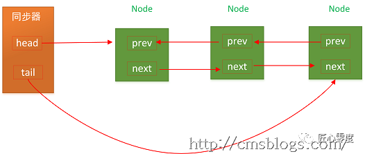 </div><br>

**入列**

学了数据结构的我们，CLH队列入列是再简单不过了，无非就是tail指向新节点、新节点的prev指向当前最后的节点，当前最后一个节点的next指向当前节点。代码我们可以看看addWaiter(Node node)方法：

```java
private Node addWaiter(Node mode) {       
    //新建Node        
    Node node = new Node(Thread.currentThread(), mode);        
    //快速尝试添加尾节点        
    Node pred = tail;        
    if (pred != null) {            
        node.prev = pred;            
        //CAS设置尾节点            
        if (compareAndSetTail(pred, node)) {                
            pred.next = node;                
            return node;            
        }        
    }        
    //多次尝试        
    enq(node);        
    return node;    
}
```

addWaiter(Node node)先通过快速尝试设置尾节点，如果失败，则调用enq(Node node)方法设置尾节点

```java
 private Node enq(final Node node) {        
     //多次尝试，直到成功为止        
     for (;;) {            
         Node t = tail;           
         //tail不存在，设置为首节点            
         if (t == null) {                
             if (compareAndSetHead(new Node()))                   
                 tail = head;            
         } else {                
             //设置为尾节点                
             node.prev = t;                
             if (compareAndSetTail(t, node)) {                    
                 t.next = node;                    
                 return t;                
             }            
         }        
     }    
 }
```

​	在上面代码中，两个方法都是通过一个CAS方法compareAndSetTail(Node expect, Node 
update)来设置尾节点，该方法可以确保节点是线程安全添加的。在enq(Node 
node)方法中，AQS通过“死循环”的方式来保证节点可以正确添加，只有成功添加后，当前线程才会从该方法返回，否则会一直执行下去。

**过程图如下：**

<div align="center"> 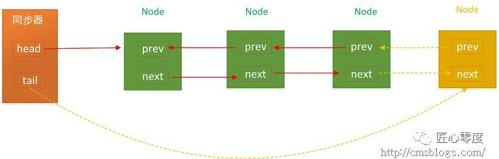 </div><br>

**出列**

​	CLH同步队列遵循FIFO，首节点的线程释放同步状态后，将会唤醒它的后继节点（next），而后继节点将会在获取同步状态成功时将自己设置为首节点，这个过程非常简单，head执行该节点并断开原首节点的next和当前节点的prev即可，注意在这个过程是不需要使用CAS来保证的，因为只有一个线程能够成功获取到同步状态。

**过程图如下：**

<div align="center">  </div><br>

**同步状态的获取与释放**

​	在前面提到过，AQS是构建Java同步组件的基础，我们期待它能够成为实现大部分同步需求的基础。AQS的设计模式采用的模板方法模式，子类通过继承的方式，实现它的抽象方法来管理同步状态，对于子类而言它并没有太多的活要做，AQS提供了大量的模板方法来实现同步，主要是分为三类：独占式获取和释放同步状态、共享式获取和释放同步状态、查询同步队列中的等待线程情况。自定义子类使用AQS提供的模板方法就可以实现自己的同步语义。

**独占式**

独占式，同一时刻仅有一个线程持有同步状态。

**独占式同步状态获取**    

acquire(int arg)方法为AQS提供的模板方法，该方法为独占式获取同步状态，但是该方法对中断不敏感，也就是说由于线程获取同步状态失败加入到CLH同步队列中，后续对线程进行中断操作时，线程不会从同步队列中移除。代码如下：

```java
 public final void acquire(int arg) {       
     if (!tryAcquire(arg) &&            
         acquireQueued(addWaiter(Node.EXCLUSIVE), arg))            
         selfInterrupt();    
 }
```

**各个方法定义如下：**

- tryAcquire：去尝试获取锁，获取成功则设置锁状态并返回true，否则返回false。该方法自定义同步组件自己实现，该方法必须要保证线程安全的获取同步状态。
- addWaiter：如果tryAcquire返回FALSE（获取同步状态失败），则调用该方法将当前线程加入到CLH同步队列尾部。
- acquireQueued：当前线程会根据公平性原则来进行阻塞等待（自旋）,直到获取锁为止；并且返回当前线程在等待过程中有没有中断过。
- selfInterrupt：产生一个中断。

acquireQueued方法为一个自旋的过程，也就是说当前线程（Node）进入同步队列后，就会进入一个自旋的过程，每个节点都会自省地观察，当条件满足，获取到同步状态后，就可以从这个自旋过程中退出，否则会一直执行下去。

如下：

```java
final boolean acquireQueued(final Node node, int arg) {        
    boolean failed = true;        
    try {            
        //中断标志            
        boolean interrupted = false;            
        /*             
        * 自旋过程，其实就是一个死循环而已             
        */            
        for (;;) {               
            //当前线程的前驱节点                
            final Node p = node.predecessor();                
            //当前线程的前驱节点是头结点，且同步状态成功                
            if (p == head && tryAcquire(arg)) {                    
                setHead(node);                    
                p.next = null; // help GC                    
                failed = false;                    
                return interrupted;                
            }                
            //获取失败，线程等待--具体后面介绍                
            if (shouldParkAfterFailedAcquire(p, node) &&  parkAndCheckInterrupt())         
                interrupted = true;            
        }        
    } finally {            
        if (failed)                
            cancelAcquire(node);        
    }    
}
```

从上面代码中可以看到，当前线程会一直尝试获取同步状态，当然**前提是只有其前驱节点为头结点**才能够尝试获取同步状态，理由：

- 保持FIFO同步队列原则。
- 头节点释放同步状态后，将会唤醒其后继节点，后继节点被唤醒后需要检查自己是否为头节点。

**acquire(int arg)方法流程图如下：**

<div align="center"> 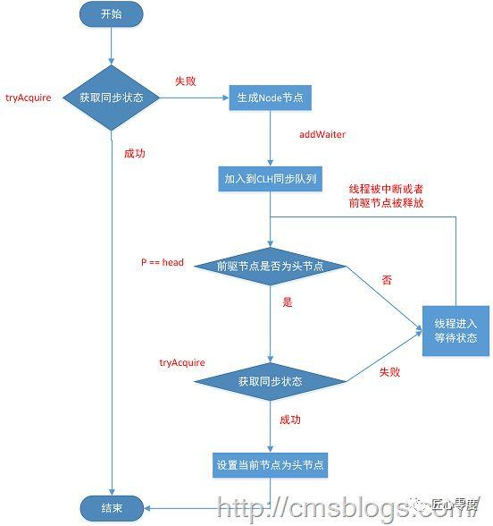</div><br>

独占式锁的获取和释放的过程以及同步队列。可以做一下总结：

1. **线程获取锁失败，线程被封装成Node进行入队操作，核心方法在于addWaiter()和enq()，同时enq()完成对同步队列的头结点初始化工作以及CAS操作失败的重试**;
2. **线程获取锁是一个自旋的过程，当且仅当 当前节点的前驱节点是头结点并且成功获得同步状态时，节点出队即该节点引用的线程获得锁，否则，当不满足条件时就会调用LookSupport.park()方法使得线程阻塞**；
3. **释放锁的时候会唤醒后继节点；**

总体来说：**在获取同步状态时，AQS维护一个同步队列，获取同步状态失败的线程会加入到队列中进行自旋；移除队列（或停止自旋）的条件是前驱节点是头结点并且成功获得了同步状态。在释放同步状态时，同步器会调用unparkSuccessor()方法唤醒后继节点。**

**独占式获取响应中断**  

 	AQS提供了acquire(int arg)方法以供独占式获取同步状态，但是该方法对中断不响应，对线程进行中断操作后，该线程会依然位于CLH同步队列中等待着获取同步状态。为了响应中断，AQS提供了acquireInterruptibly(int arg)方法，该方法在等待获取同步状态时，如果当前线程被中断了，会立刻响应中断抛出异常InterruptedException。

```java
public final void acquireInterruptibly(int arg) throws InterruptedException {        
    if (Thread.interrupted())            
        throw new InterruptedException();        
    if (!tryAcquire(arg))            
        doAcquireInterruptibly(arg);    
}
```

​	首先校验该线程是否已经中断了，如果是则抛出InterruptedException，否则执行tryAcquire(int 
arg)方法获取同步状态，如果获取成功，则直接返回，否则执行doAcquireInterruptibly(int 
arg)。doAcquireInterruptibly(int arg)定义如下：

```java
private void doAcquireInterruptibly(int arg) throws InterruptedException {        
    final Node node = addWaiter(Node.EXCLUSIVE);        
    boolean failed = true;        
    try {            
        for (;;) {                
            final Node p = node.predecessor();                
            if (p == head && tryAcquire(arg)) {                    
                setHead(node);                    
                p.next = null; // help GC                    
                failed = false;                    
                return;                
            }                
            if (shouldParkAfterFailedAcquire(p, node) &&  parkAndCheckInterrupt())         
                throw new InterruptedException();            
        }        
    } finally {            
        if (failed)                
            cancelAcquire(node);        
    }   
}
```

doAcquireInterruptibly(int arg)方法与acquire(int arg)方法仅有两个差别。

1.方法声明抛出InterruptedException异常。

2.在中断方法处不再是使用interrupted标志，而是直接抛出InterruptedException异常。

**独占式超时获取**     

​	AQS除了提供上面两个方法外，还提供了一个增强版的方法：tryAcquireNanos(int arg,long  nanos)。该方法为acquireInterruptibly方法的进一步增强，它除了响应中断外，还有超时控制。即如果当前线程没有在指定时间内获取同步状态，则会返回false，否则返回true。如下：

```java
  public final boolean tryAcquireNanos(int arg, long nanosTimeout) throws InterruptedException {         
      if (Thread.interrupted())            
          throw new InterruptedException();        
      return tryAcquire(arg) ||  doAcquireNanos(arg, nanosTimeout);    
  }
```

​	tryAcquireNanos(int arg, long nanosTimeout)方法超时获取最终是在doAcquireNanos(int arg, long nanosTimeout)中实现的，如下：

```java
 private boolean doAcquireNanos(int arg, long nanosTimeout)            throws InterruptedException {        
     //nanosTimeout <= 0        
     if (nanosTimeout <= 0L)            
         return false;        
     //超时时间       
     final long deadline = System.nanoTime() + nanosTimeout;        
     //新增Node节点        
     final Node node = addWaiter(Node.EXCLUSIVE);        
     boolean failed = true;        
     try {            
         //自旋            
         for (;;) {                
             final Node p = node.predecessor();                
             //获取同步状态成功                
             if (p == head && tryAcquire(arg)) {                    
                 setHead(node);                    
                 p.next = null; // help GC                    
                 failed = false;                    
                 return true;                
             }                
             /*                 
             * 获取失败，做超时、中断判断                 
             */                
             //重新计算需要休眠的时间                
             nanosTimeout = deadline - System.nanoTime();                
             //已经超时，返回false                
             if (nanosTimeout <= 0L)                    
                 return false;                
             //如果没有超时，则等待nanosTimeout纳秒                
             //注：该线程会直接从LockSupport.parkNanos中返回，                
             //LockSupport为JUC提供的一个阻塞和唤醒的工具类，后面做详细介绍                
             if (shouldParkAfterFailedAcquire(p, node) &&                        nanosTimeout > spinForTimeoutThreshold)                    
                 LockSupport.parkNanos(this, nanosTimeout);               
             //线程是否已经中断了                
             if (Thread.interrupted())                    
                 throw new InterruptedException();            
         }        
     } finally {            
         if (failed)                
             cancelAcquire(node);        
     }    
 }
```

​	针对超时控制，程序首先记录唤醒时间deadline ，deadline = System.nanoTime() + nanosTimeout（时间间隔）。如果获取同步状态失败，则需要计算出需要休眠的时间间隔nanosTimeout（= deadline - System.nanoTime()），如果nanosTimeout <= 0 表示已经超时了，返回false，如果大于spinForTimeoutThreshold（1000L）则需要休眠nanosTimeout ，如果nanosTimeout<= spinForTimeoutThreshold ，就不需要休眠了，直接进入快速自旋的过程。原因在于 spinForTimeoutThreshold 已经非常小了，非常短的时间等待无法做到十分精确，如果这时再次进行超时等待，相反会让nanosTimeout 的超时从整体上面表现得不是那么精确，所以在超时非常短的场景中，AQS会进行无条件的快速自旋。

**整个流程如下：**

<div align="center"> 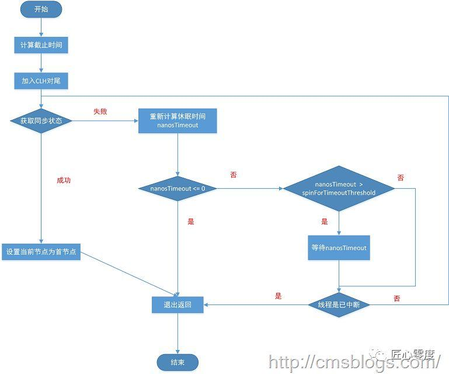 </div><br>

**独占式同步状态释放**    

当线程获取同步状态后，执行完相应逻辑后就需要释放同步状态。AQS提供了release(int arg)方法释放同步状态：

```java
 public final boolean release(int arg) {        
     if (tryRelease(arg)) {            
         Node h = head;            
         if (h != null && h.waitStatus != 0)                
             unparkSuccessor(h);            
         return true;        
     }        
     return false;    
 }
```

​	该方法同样是先调用自定义同步器自定义的tryRelease(int arg)方法来释放同步状态，释放成功后，会调用unparkSuccessor(Node node)方法唤醒后继节点（如何唤醒LZ后面介绍）。

这里稍微总结下：

> **在AQS中维护着一个FIFO的同步队列，当线程获取同步状态失败后，则会加入到这个CLH同步队列的对尾并一直保持着自旋。在CLH同步队列中的线程在自旋时会判断其前驱节点是否为首节点，如果为首节点则不断尝试获取同步状态，获取成功则退出CLH同步队列。当线程执行完逻辑后，会释放同步状态，释放后会唤醒其后继节点。**

**共享式**

​	共享式与独占式的最主要区别在于同一时刻独占式只能有一个线程获取同步状态，而共享式在同一时刻可以有多个线程获取同步状态。例如读操作可以有多个线程同时进行，而写操作同一时刻只能有一个线程进行写操作，其他操作都会被阻	塞。

**共享式同步状态获取**    

AQS提供acquireShared(int arg)方法共享式获取同步状态：

```java
public final void acquireShared(int arg) {        
    if (tryAcquireShared(arg) < 0)            
        //获取失败，自旋获取同步状态            
        doAcquireShared(arg);    
}
```

​	从上面程序可以看出，方法首先是调用tryAcquireShared(int arg)方法尝试获取同步状态，如果获取失败则调用doAcquireShared(int arg)自旋方式获取同步状态，共享式获取同步状态的标志是返回 >= 0 的值表示获取成功。自选式获取同步状态如下：

​	tryAcquireShared(int arg)方法尝试获取同步状态，返回值为int，当其 >= 0 时，表示能够获取到同步状态，这个时候就可以从自旋过程中退出。

​	acquireShared(int  arg)方法不响应中断，与独占式相似，AQS也提供了响应中断、超时的方法，分别是：acquireSharedInterruptibly(int  arg)、tryAcquireSharedNanos(int arg,long nanos)，这里就不做解释了。

**共享式同步状态释放**    

​	获取同步状态后，需要调用release(int arg)方法释放同步状态，方法如下：

```java
public final boolean releaseShared(int arg) {        
    if (tryReleaseShared(arg)) {           
        doReleaseShared();            
        return true;        
    }        
    return false;    
}
```

​	因为可能会存在多个线程同时进行释放同步状态资源，所以需要确保同步状态安全地成功释放，一般都是通过CAS和循环来完成的。

https://blog.csdn.net/javazejian/article/details/76167357

https://www.jianshu.com/p/f584799f1c77

**阻塞和唤醒线程**

​	在线程获取同步状态时如果获取失败，则加入CLH同步队列，通过通过自旋的方式不断获取同步状态，但是在自旋的过程中则需要判断当前线程是否需要阻塞，其主要方法在acquireQueued()：

```java
if (shouldParkAfterFailedAcquire(p, node) && parkAndCheckInterrupt())                    	interrupted = true;
```

​	通过这段代码我们可以看到，在获取同步状态失败后，线程并不是立马进行阻塞，需要检查该线程的状态，检查状态的方法为 shouldParkAfterFailedAcquire(Node pred, Node node) 方法，该方法主要靠前驱节点判断当前线程是否应该被阻塞，代码如下：

```java
    private static boolean shouldParkAfterFailedAcquire(Node pred, Node node) {        
        //前驱节点        
        int ws = pred.waitStatus;        
        //状态为signal，表示当前线程处于等待状态，直接放回true        
        if (ws == Node.SIGNAL)            
            return true;        
        //前驱节点状态 > 0 ，则为Cancelled,表明该节点已经超时或者被中断了，需要从同步队列中取消       
        if (ws > 0) {            
            do {                
                node.prev = pred = pred.prev;            
            } while (pred.waitStatus > 0);            
            pred.next = node;        
        }         
        //前驱节点状态为Condition、propagate        
        else {            
            compareAndSetWaitStatus(pred, ws, Node.SIGNAL);        
        }        
        return false;    
    }
```

这段代码主要检查当前线程是否需要被阻塞，具体规则如下：

1. 如果当前线程的前驱节点状态为SINNAL，则表明当前线程需要被阻塞，调用unpark()方法唤醒，直接返回true，当前线程阻塞
2. 如果当前线程的前驱节点状态为CANCELLED（ws > 0），则表明该线程的前驱节点已经等待超时或者被中断了，则需要从CLH队列中将该前驱节点删除掉，直到回溯到前驱节点状态 <= 0 ，返回false
3. 如果前驱节点非SINNAL，非CANCELLED，则通过CAS的方式将其前驱节点设置为SINNAL，返回false

如果 shouldParkAfterFailedAcquire(Node pred, Node node) 方法返回true，则调用parkAndCheckInterrupt()方法阻塞当前线程：

```java
 private final boolean parkAndCheckInterrupt() {        
     LockSupport.park(this);        
     return Thread.interrupted();    
 }
```

parkAndCheckInterrupt() 方法主要是把当前线程挂起，从而阻塞住线程的调用栈，同时返回当前线程的中断状态。其内部则是调用LockSupport工具类的park()方法来阻塞该方法。

当线程释放同步状态后，则需要唤醒该线程的后继节点：

```java
    public final boolean release(int arg) {        
        if (tryRelease(arg)) {            
            Node h = head;            
            if (h != null && h.waitStatus != 0)                
                //唤醒后继节点                
                unparkSuccessor(h);            
            return true;        
        }        
        return false;    
    }
```

调用unparkSuccessor(Node node)唤醒后继节点：

```java
    private void unparkSuccessor(Node node) {        
        //当前节点状态        
        int ws = node.waitStatus;        
        //当前状态 < 0 则设置为 0        
        if (ws < 0)            
            compareAndSetWaitStatus(node, ws, 0);        
        //当前节点的后继节点        
        Node s = node.next;       
        //后继节点为null或者其状态 > 0 (超时或者被中断了)        
        if (s == null || s.waitStatus > 0) {            
            s = null;            
            //从tail节点来找可用节点            
            for (Node t = tail; t != null && t != node; t = t.prev)                
                if (t.waitStatus <= 0)                    
                    s = t;        
        }       
        //唤醒后继节点        
        if (s != null)            
            LockSupport.unpark(s.thread);    
    }
```

​	可能会存在当前线程的后继节点为null，超时、被中断的情况，如果遇到这种情况了，则需要跳过该节点，但是为何是从tail尾节点开始，而不是从node.next开始呢？原因在于node.next仍然可能会存在null或者取消了，所以采用tail回溯办法找第一个可用的线程。最后调用LockSupport的unpark(Thread  thread)方法唤醒该线程。

##### CountDownLatch

用来控制一个线程等待多个线程。

维护了一个计数器 cnt，每次调用 countDown() 方法会让计数器的值减 1，减到 0 的时候，那些因为调用 await() 方法而在等待的线程就会被唤醒。

<div align="center">  </div><br>

```java
public class CountdownLatchExample {

    public static void main(String[] args) throws InterruptedException {
        final int totalThread = 10;
        CountDownLatch countDownLatch = new CountDownLatch(totalThread);
        ExecutorService executorService = Executors.newCachedThreadPool();
        for (int i = 0; i < totalThread; i++) {
            executorService.execute(() -> {
                System.out.print("run..");
                countDownLatch.countDown();
            });
        }
        countDownLatch.await();
        System.out.println("end");
        executorService.shutdown();
    }
}
```

```html
run..run..run..run..run..run..run..run..run..run..end
```

##### CyclicBarrier

用来控制多个线程互相等待，只有当多个线程都到达时，这些线程才会继续执行。

和 CountdownLatch 相似，都是通过维护计数器来实现的。线程执行 await() 方法之后计数器会减 1，并进行等待，直到计数器为 0，所有调用 await() 方法而在等待的线程才能继续执行。

CyclicBarrier 和 CountdownLatch 的一个区别是，CyclicBarrier 的计数器通过调用 reset() 方法可以循环使用，所以它才叫做循环屏障。

CyclicBarrier 有两个构造函数，其中 parties 指示计数器的初始值，barrierAction 在所有线程都到达屏障的时候会执行一次。

```java
public CyclicBarrier(int parties, Runnable barrierAction) {
    if (parties <= 0) throw new IllegalArgumentException();
    this.parties = parties;
    this.count = parties;
    this.barrierCommand = barrierAction;
}

public CyclicBarrier(int parties) {
    this(parties, null);
}
```

<div align="center">  </div><br>

```java
public class CyclicBarrierExample {

    public static void main(String[] args) {
        final int totalThread = 10;
        CyclicBarrier cyclicBarrier = new CyclicBarrier(totalThread);
        ExecutorService executorService = Executors.newCachedThreadPool();
        for (int i = 0; i < totalThread; i++) {
            executorService.execute(() -> {
                System.out.print("before..");
                try {
                    cyclicBarrier.await();
                } catch (InterruptedException | BrokenBarrierException e) {
                    e.printStackTrace();
                }
                System.out.print("after..");
            });
        }
        executorService.shutdown();
    }
}
```

```html
before..before..before..before..before..before..before..before..before..before..after..after..after..after..after..after..after..after..after..after..
```

##### Semaphore

Semaphore 类似于操作系统中的信号量，可以控制对互斥资源的访问线程数。

以下代码模拟了对某个服务的并发请求，每次只能有 3 个客户端同时访问，请求总数为 10。

```java
public class SemaphoreExample {

    public static void main(String[] args) {
        final int clientCount = 3;
        final int totalRequestCount = 10;
        Semaphore semaphore = new Semaphore(clientCount);
        ExecutorService executorService = Executors.newCachedThreadPool();
        for (int i = 0; i < totalRequestCount; i++) {
            executorService.execute(()->{
                try {
                    semaphore.acquire();
                    System.out.print(semaphore.availablePermits() + " ");
                } catch (InterruptedException e) {
                    e.printStackTrace();
                } finally {
                    semaphore.release();
                }
            });
        }
        executorService.shutdown();
    }
}
```

```html
2 1 2 2 2 2 2 1 2 2
```

#### 八、J.U.C - 其它组件

##### FutureTask

[FutureTask源码解读](https://segmentfault.com/a/1190000016572591)

**Java并发工具类的三板斧**

关于Java并发工具类的三板斧，我们在分析[AQS源码](https://segmentfault.com/a/1190000015739343)的时候已经说过了,即：

> **状态，队列，CAS**

以这三个方面为切入点来看源码，有助于我们快速的看清FutureTask的概貌：

**状态**

首先是找状态。

在FutureTask中，状态是由state属性来表示的，不出所料，它是volatile类型的，确保了不同线程对它修改的可见性：

```java
private volatile int state;
private static final int NEW          = 0;
private static final int COMPLETING   = 1;
private static final int NORMAL       = 2;
private static final int EXCEPTIONAL  = 3;
private static final int CANCELLED    = 4;
private static final int INTERRUPTING = 5;
private static final int INTERRUPTED  = 6;
```

state属性是贯穿整个FutureTask的最核心的属性，该属性的值代表了任务在运行过程中的状态，随着任务的执行，状态将不断地进行转变，从上面的定义中可以看出，总共有7种状态：包括了1个初始态，2个中间态和4个终止态。

虽说状态有这么多，但是状态的转换路径却只有四种：

<div align="center">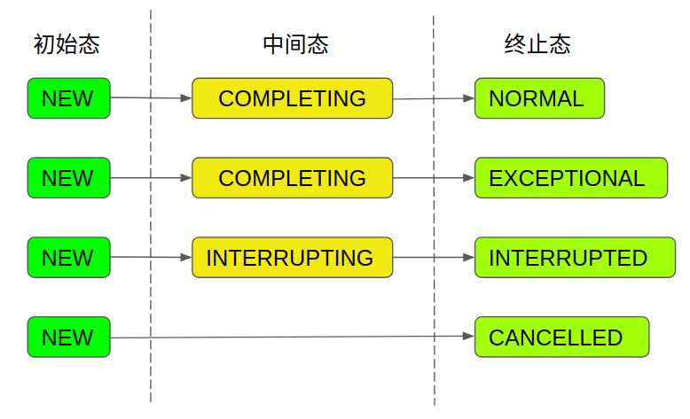</div><br>

**队列**

接着我们来看队列，在FutureTask中，队列的实现是一个单向链表，它表示**所有等待任务执行完毕的线程的集合**。我们知道，FutureTask实现了Future接口，可以获取“Task”的执行结果，那么如果获取结果时，任务还没有执行完毕怎么办呢？那么获取结果的线程就会在一个等待队列中挂起，直到任务执行完毕被唤醒。这一点有点类似于我们之前学习的[AQS](https://segmentfault.com/a/1190000015739343)中的`sync queue`，在下文的分析中，大家可以自己对照它们的异同点。

我们前面说过，在并发编程中使用队列通常是**将当前线程包装成某种类型的数据结构扔到等待队列中**，我们先来看看队列中的每一个节点是怎么个结构：

```java
static final class WaitNode {
    volatile Thread thread;
    volatile WaitNode next;
    WaitNode() { thread = Thread.currentThread(); }
}
```

可见，相比于AQS的`sync queue`所使用的双向链表中的Node，这个WaitNode要简单多了，它只包含了一个记录线程的`thread`属性和指向下一个节点的`next`属性。

值得一提的是，FutureTask中的这个单向链表是当做**栈**来使用的，确切来说是当做Treiber栈来使用的，不了解Treiber栈是个啥的可以简单的把它当做是一个线程安全的栈，它使用CAS来完成入栈出栈操作(想进一步了解的话可以看[这篇文章](https://segmentfault.com/a/1190000012463330))。为啥要使用一个线程安全的栈呢，因为同一时刻可能有多个线程都在获取任务的执行结果，如果任务还在执行过程中，则这些线程就要被包装成`WaitNode`扔到Treiber栈的栈顶，即完成入栈操作，这样就有可能出现多个线程同时入栈的情况，因此需要使用CAS操作保证入栈的线程安全，对于出栈的情况也是同理。

由于FutureTask中的队列本质上是一个Treiber栈，那么使用这个队列就只需要一个指向栈顶节点的指针就行了，在FutureTask中，就是`waiters`属性：

```java
/** Treiber stack of waiting threads */
private volatile WaitNode waiters;
```

事实上，它就是整个单向链表的头节点。

综上，FutureTask中所使用的队列的结构如下：

<div align="center">  </div><br>

**get()**

最后我们来看看获取执行结果的get方法，先来看看无参的版本：

```java
public V get() throws InterruptedException, ExecutionException {
    int s = state;
    if (s <= COMPLETING)
        s = awaitDone(false, 0L);
    return report(s);
}
```

该方法其实很简单，当任务还没有执行完毕或者正在设置执行结果时，我们就使用`awaitDone`方法等待任务进入终止态，注意，**awaitDone的返回值是任务的状态，而不是任务的结果**。任务进入终止态之后，我们就根据任务的执行结果来返回计算结果或者抛出异常。

我们先来看看等待任务完成的`awaitDone`方法，该方法是获取任务结果最核心的方法，它完成了获取结果，挂起线程，响应中断等诸多操作：

```java
private int awaitDone(boolean timed, long nanos) throws InterruptedException {
    final long deadline = timed ? System.nanoTime() + nanos : 0L;
    WaitNode q = null;
    boolean queued = false;
    for (;;) {
        if (Thread.interrupted()) {
            removeWaiter(q);
            throw new InterruptedException();
        }
        int s = state;
        if (s > COMPLETING) {
            if (q != null)
                q.thread = null;
            return s;
        }
        else if (s == COMPLETING) // cannot time out yet
            Thread.yield();
        else if (q == null)
            q = new WaitNode();
        else if (!queued)
            queued = UNSAFE.compareAndSwapObject(this, waitersOffset,
                                                 q.next = waiters, q);
        else if (timed) {
            nanos = deadline - System.nanoTime();
            if (nanos <= 0L) {
                removeWaiter(q);
                return state;
            }
            LockSupport.parkNanos(this, nanos);
        }
        else
            LockSupport.park(this);
    }
}
```

在具体分析它的源码之前，有一点我们先特别说明一下，FutureTask中会涉及到两类线程，一类是执行任务的线程，它只有一个，FutureTask的run方法就由该线程来执行；一类是获取任务执行结果的线程，它可以有多个，这些线程可以并发执行，每一个线程都是独立的，都可以调用get方法来获取任务的执行结果。如果任务还没有执行完，则这些线程就需要进入Treiber栈中挂起，直到任务执行结束，或者等待的线程自身被中断。

理清了这一点后，我们再来详细看看`awaitDone`方法。可以看出，该方法的大框架是一个自旋操作，我们一段一段来看:

```java
for (;;) {
    if (Thread.interrupted()) {
        removeWaiter(q);
        throw new InterruptedException();
    }
    // ...
}
```

首先一开始，我们先检测当前线程是否被中断了，这是因为get方法是阻塞式的，如果等待的任务还没有执行完，则调用get方法的线程会被扔到Treiber栈中挂起等待，直到任务执行完毕。但是，如果任务迟迟没有执行完毕，则我们也有可能直接中断在Treiber栈中的线程，以停止等待。

当检测到线程被中断后，我们调用了removeWaiter:

```java
private void removeWaiter(WaitNode node) {
    if (node != null) {
        ...
    }
}
```

`removeWaiter`的作用是将参数中的node从等待队列（即Treiber栈）中移除。如果此时线程还没有进入Treiber栈，则 q=null，那么removeWaiter(q)啥也不干。在这之后，我们就直接抛出了`InterruptedException`异常。

接着往下看：

```java
for (;;) {
    /*if (Thread.interrupted()) {
        removeWaiter(q);
        throw new InterruptedException();
    }*/
    int s = state;
    if (s > COMPLETING) {
        if (q != null)
            q.thread = null;
        return s;
    }
    else if (s == COMPLETING) // cannot time out yet
        Thread.yield();
    else if (q == null)
        q = new WaitNode();
    else if (!queued)
        queued = UNSAFE.compareAndSwapObject(this, waitersOffset,
                                             q.next = waiters, q);
    else if (timed) {
        nanos = deadline - System.nanoTime();
        if (nanos <= 0L) {
            removeWaiter(q);
            return state;
        }
        LockSupport.parkNanos(this, nanos);
    }
    else
        LockSupport.park(this);
}
```

- 如果任务已经进入终止态（`s > COMPLETING`），我们就直接返回任务的状态;
- 否则，如果任务正在设置执行结果（`s == COMPLETING`），我们就让出当前线程的CPU资源继续等待
- 否则，就说明任务还没有执行，或者任务正在执行过程中，那么这时，如果q现在还为null, 说明当前线程还没有进入等待队列，于是我们新建了一个`WaitNode`, `WaitNode`的构造函数我们之前已经看过了，就是生成了一个记录了当前线程的节点；
- 如果q不为null，说明代表当前线程的WaitNode已经被创建出来了，则接下来如果`queued=false`，表示当前线程还没有入队，所以我们执行了:

```java
queued = UNSAFE.compareAndSwapObject(this, waitersOffset, q.next = waiters, q);
```

这行代码的作用是通过CAS操作将新建的q节点添加到`waiters`链表的头节点之前，**其实就是Treiber栈的入栈操作**，写的还是很简洁的，一行代码就搞定了，如果大家还是觉得晕乎，下面是它等价的伪代码：

```java
q.next = waiters; //当前节点的next指向目前的栈顶元素
//如果栈顶节点在这个过程中没有变，即没有发生并发入栈的情况
if(waiters的值还是上面q.next所使用的waiters值){ 
    waiters = q; //修改栈顶的指针，指向刚刚入栈的节点
}
```

这个CAS操作就是为了保证同一时刻如果有多个线程在同时入栈，则只有一个能够操作成功，也即Treiber栈的规范。

如果以上的条件都不满足，则再接下来因为现在是不带超时机制的get，timed为false，则`else if`代码块跳过，然后来到最后一个else, 把当前线程挂起，此时线程就处于阻塞等待的状态。

至此，在任务没有执行完毕的情况下，获取任务执行结果的线程就会在Treiber栈中被`LockSupport.park(this)`挂起了。

那么这个挂起的线程什么时候会被唤醒呢？有两种情况：

1. 任务执行完毕了，在`finishCompletion`方法中会唤醒所有在Treiber栈中等待的线程
2. 等待的线程自身因为被中断等原因而被唤醒。

我们接下来就继续看看线程被唤醒后的情况，此时，线程将回到`for(;;)`循环的开头，继续下一轮循环：

```java
for (;;) {
    if (Thread.interrupted()) {
        removeWaiter(q);
        throw new InterruptedException();
    }

    int s = state;
    if (s > COMPLETING) {
        if (q != null)
            q.thread = null;
        return s;
    }
    else if (s == COMPLETING) // cannot time out yet
        Thread.yield();
    else if (q == null)
        q = new WaitNode();
    else if (!queued)
        queued = UNSAFE.compareAndSwapObject(this, waitersOffset,
                                             q.next = waiters, q);
    else if (timed) {
        nanos = deadline - System.nanoTime();
        if (nanos <= 0L) {
            removeWaiter(q);
            return state;
        }
        LockSupport.parkNanos(this, nanos);
    }
    else
        LockSupport.park(this); // 挂起的线程从这里被唤醒
}
```

首先自然还是检测中断，所不同的是，此时q已经不为null了，因此在有中断发生的情况下，在抛出中断之前，多了一步removeWaiter(q)操作，该操作是将当前线程从等待的Treiber栈中移除，相比入栈操作，这个出栈操作要复杂一点，这取决于节点是否位于栈顶。下面我们来仔细分析这个出栈操作：

```java
private void removeWaiter(WaitNode node) {
    if (node != null) {
        node.thread = null;
        retry:
        for (;;) {          // restart on removeWaiter race
            for (WaitNode pred = null, q = waiters, s; q != null; q = s) {
                s = q.next;
                if (q.thread != null)
                    pred = q;
                else if (pred != null) {
                    pred.next = s;
                    if (pred.thread == null) // check for race
                        continue retry;
                }
                else if (!UNSAFE.compareAndSwapObject(this, waitersOffset, q, s))
                    continue retry;
            }
            break;
        }
    }
}
```

首先，我们把要出栈的WaitNode的thread属性设置为null, 这相当于一个**标记**，是我们后面在waiters链表中定位该节点的依据。

(1) 要移除的节点就在栈顶

我们先来看看该节点就位于栈顶的情况，这说明在该节点入栈后，并没有别的线程再入栈了。由于一开始我们就将该节点的thread属性设为了null，因此，前面的`q.thread != null` 和 `pred != null`都不满足，我们直接进入到最后一个else if 分支：

```java
else if (!UNSAFE.compareAndSwapObject(this, waitersOffset, q, s))
    continue retry;
```

这一段是栈顶节点出栈的操作，和入栈类似，采用了CAS比较，将栈顶元素设置成原栈顶节点的下一个节点。

值得注意的是，当CAS操作不成功时，程序会回到retry处重来，**但即使CAS操作成功了，程序依旧会遍历完整个链表**，找寻node.thread == null 的节点，并将它们一并从链表中剔除。

(2) 要移除的节点不在栈顶

当要移除的节点不在栈顶时，我们会一直遍历整个链表，直到找到`q.thread == null`的节点，找到之后，我们将进入

```java
else if (pred != null) {
    pred.next = s;
    if (pred.thread == null) // check for race
        continue retry;
}
```

这是**因为节点不在栈顶，则其必然是有前驱节点pred的**，这时，我们只是简单的让前驱节点指向当前节点的下一个节点，从而将目标节点从链表中剔除。

注意，后面多加的那个if判断是很有必要的，因为`removeWaiter`方法并没有加锁，所以可能有多个线程在同时执行，WaitNode的两个成员变量`thread`和`next`都被设置成volatile，这保证了它们的可见性，如果我们在这时发现了`pred.thread == null`，那就意味着它已经被另一个线程标记了，将在另一个线程中被拿出`waiters`链表，而我们当前目标节点的原后继节点现在是接在这个pred节点上的，因此，如果pred已经被其他线程标记为要拿出去的节点，我们现在这个线程再继续往后遍历就没有什么意义了，所以这时就调到retry处，从头再遍历。

如果pred节点没有被其他线程标记，那我们就接着往下遍历，直到整个链表遍历完。

至此，将节点从waiters链表中移除的removeWaiter操作我们就分析完了，我们总结一下该方法：

在该方法中，会传入一个需要移除的节点，我们会将这个节点的`thread`属性设置成null，以标记该节点。然后无论如何，我们会遍历整个链表，清除那些被标记的节点（只是简单的将节点从链表中剔除）。如果要清除的节点就位于栈顶，则还需要注意重新设置`waiters`的值，指向新的栈顶节点。所以可以看出，虽说removeWaiter方法传入了需要剔除的节点，但是事实上它可能剔除的不止是传入的节点，而是所有已经被标记了的节点，这样不仅清除操作容易了些（不需要专门去定位传入的node在哪里），而且提升了效率（可以同时清除所有已经被标记的节点）。

我们再回到`awaitDone`方法里：

```java
private int awaitDone(boolean timed, long nanos) throws InterruptedException {
    final long deadline = timed ? System.nanoTime() + nanos : 0L;
    WaitNode q = null;
    boolean queued = false;
    for (;;) {
        if (Thread.interrupted()) {
            removeWaiter(q); // 刚刚分析到这里了，我们接着往下看
            throw new InterruptedException();
        }

        int s = state;
        if (s > COMPLETING) {
            if (q != null)
                q.thread = null;
            return s;
        }
        else if (s == COMPLETING) // cannot time out yet
            Thread.yield();
        else if (q == null)
            q = new WaitNode();
        else if (!queued)
            queued = UNSAFE.compareAndSwapObject(this, waitersOffset,
                                                 q.next = waiters, q);
        else if (timed) {
            nanos = deadline - System.nanoTime();
            if (nanos <= 0L) {
                removeWaiter(q);
                return state;
            }
            LockSupport.parkNanos(this, nanos);
        }
        else
            LockSupport.park(this);
    }
}
```

如果线程不是因为中断被唤醒，则会继续往下执行，此时会再次获取当前的`state`状态。所不同的是，此时q已经不为null, queued已经为true了，所以已经不需要将当前节点再入waiters栈了。

至此我们知道，除非被中断，否则get方法会在原地自旋等待(用的是Thread.yield，对应于`s == COMPLETING`)或者直接挂起（对应任务还没有执行完的情况），直到任务执行完成。而我们前面分析run方法和cancel方法的时候知道，在run方法结束后，或者cancel方法取消完成后，都会调用`finishCompletion()`来唤醒挂起的线程，使它们得以进入下一轮循环，获取任务执行结果。

最后，等awaitDone函数返回后，get方法返回了`report(s)`，以根据任务的状态，汇报执行结果:

```java
@SuppressWarnings("unchecked")
private V report(int s) throws ExecutionException {
    Object x = outcome;
    if (s == NORMAL)
        return (V)x;
    if (s >= CANCELLED)
        throw new CancellationException();
    throw new ExecutionException((Throwable)x);
}
```

可见，report方法非常简单，它根据当前state状态，返回正常执行的结果，或者抛出指定的异常。

至此，get方法就分析结束了。

值得注意的是，`awaitDone`方法和get方法都没有加锁，这在多个线程同时执行get方法的时候会不会产生线程安全问题呢？通过查看方法内部的参数我们知道，整个方法内部用的大多数是局部变量，因此不会产生线程安全问题，对于全局的共享变量`waiters`的修改时，也使用了CAS操作，保证了线程安全，而state变量本身是volatile的，保证了读取时的可见性，因此整个方法调用虽然没有加锁，它仍然是线程安全的。

**get(long timeout, TimeUnit unit)**

最后我们来看看带超时版本的get方法：

```java
public V get(long timeout, TimeUnit unit) throws InterruptedException, ExecutionException, TimeoutException {
    if (unit == null)
        throw new NullPointerException();
    int s = state;
    if (s <= COMPLETING && (s = awaitDone(true, unit.toNanos(timeout))) <= COMPLETING)
        throw new TimeoutException();
    return report(s);
}
```

它和上面不带超时时间的get方法很类似，只是在`awaitDone`方法中多了超时检测：

```java
else if (timed) {
    nanos = deadline - System.nanoTime();
    if (nanos <= 0L) {
        removeWaiter(q);
        return state;
    }
    LockSupport.parkNanos(this, nanos);
}
```

即，如果指定的超时时间到了，则直接返回，如果返回时，任务还没有进入终止状态，则直接抛出`TimeoutException`异常，否则就像`get()`方法一样，正常的返回执行结果。

**总结**

FutureTask实现了Runnable和Future接口，它表示了一个带有任务状态和任务结果的任务，**它的各种操作都是围绕着任务的状态展开的**，值得注意的是，在所有的7个任务状态中，只要不是`NEW`状态，就表示任务已经执行完毕或者不再执行了，并没有表示“任务正在执行中”的状态。  

除了代表了任务的Callable对象、代表任务执行结果的outcome属性，FutureTask还包含了一个代表所有等待任务结束的线程的Treiber栈，这一点其实和各种锁的等待队列特别像，即如果拿不到锁，则当前线程就会被扔进等待队列中；这里则是如果任务还没有执行结束，则所有等待任务执行完毕的线程就会被扔进Treiber栈中，直到任务执行完毕了，才会被唤醒。

FutureTask虽然为我们提供了获取任务执行结果的途径，遗憾的是，在获取任务结果时，如果任务还没有执行完成，则当前线程会自旋或者挂起等待，这和我们实现异步的初衷是相违背的，我们后面将继续介绍另一个同步工具类CompletableFuture,  它解决了这个问题。

在介绍 Callable 时我们知道它可以有返回值，返回值通过 Future<V> 进行封装。FutureTask 实现了 RunnableFuture 接口，该接口继承自 Runnable 和 Future<V> 接口，这使得 FutureTask 既可以当做一个任务执行，也可以有返回值。

```java
public class FutureTask<V> implements RunnableFuture<V>
```

```java
public interface RunnableFuture<V> extends Runnable, Future<V>
```

FutureTask 可用于异步获取执行结果或取消执行任务的场景。当一个计算任务需要执行很长时间，那么就可以用 FutureTask 来封装这个任务，主线程在完成自己的任务之后再去获取结果。

```java
public class FutureTaskExample {

    public static void main(String[] args) throws ExecutionException, InterruptedException {
        FutureTask<Integer> futureTask = new FutureTask<Integer>(new Callable<Integer>() {
            @Override
            public Integer call() throws Exception {
                int result = 0;
                for (int i = 0; i < 100; i++) {
                    Thread.sleep(10);
                    result += i;
                }
                return result;
            }
        });

        Thread computeThread = new Thread(futureTask);
        computeThread.start();

        Thread otherThread = new Thread(() -> {
            System.out.println("other task is running...");
            try {
                Thread.sleep(1000);
            } catch (InterruptedException e) {
                e.printStackTrace();
            }
        });
        otherThread.start();
        System.out.println(futureTask.get());
    }
}
```

```html
other task is running...
4950
```

##### BlockingQueue

java.util.concurrent.BlockingQueue 接口有以下阻塞队列的实现：

- **FIFO 队列** ：LinkedBlockingQueue、ArrayBlockingQueue（固定长度）
- **优先级队列** ：PriorityBlockingQueue

提供了阻塞的 take() 和 put() 方法：如果队列为空 take() 将阻塞，直到队列中有内容；如果队列为满 put() 将阻塞，直到队列有空闲位置。

**使用 BlockingQueue 实现生产者消费者问题** 

```java
public class ProducerConsumer {

    private static BlockingQueue<String> queue = new ArrayBlockingQueue<>(5);

    private static class Producer extends Thread {
        @Override
        public void run() {
            try {
                queue.put("product");
            } catch (InterruptedException e) {
                e.printStackTrace();
            }
            System.out.print("produce..");
        }
    }

    private static class Consumer extends Thread {

        @Override
        public void run() {
            try {
                String product = queue.take();
            } catch (InterruptedException e) {
                e.printStackTrace();
            }
            System.out.print("consume..");
        }
    }
}
```

```java
public static void main(String[] args) {
    for (int i = 0; i < 2; i++) {
        Producer producer = new Producer();
        producer.start();
    }
    for (int i = 0; i < 5; i++) {
        Consumer consumer = new Consumer();
        consumer.start();
    }
    for (int i = 0; i < 3; i++) {
        Producer producer = new Producer();
        producer.start();
    }
}
```

```html
produce..produce..consume..consume..produce..consume..produce..consume..produce..consume..
```

##### ForkJoin

主要用于并行计算中，和 MapReduce 原理类似，都是把大的计算任务拆分成多个小任务并行计算。

```java
public class ForkJoinExample extends RecursiveTask<Integer> {

    private final int threshold = 5;
    private int first;
    private int last;

    public ForkJoinExample(int first, int last) {
        this.first = first;
        this.last = last;
    }

    @Override
    protected Integer compute() {
        int result = 0;
        if (last - first <= threshold) {
            // 任务足够小则直接计算
            for (int i = first; i <= last; i++) {
                result += i;
            }
        } else {
            // 拆分成小任务
            int middle = first + (last - first) / 2;
            ForkJoinExample leftTask = new ForkJoinExample(first, middle);
            ForkJoinExample rightTask = new ForkJoinExample(middle + 1, last);
            leftTask.fork();
            rightTask.fork();
            result = leftTask.join() + rightTask.join();
        }
        return result;
    }
}
```

```java
public static void main(String[] args) throws ExecutionException, InterruptedException {
    ForkJoinExample example = new ForkJoinExample(1, 10000);
    ForkJoinPool forkJoinPool = new ForkJoinPool();
    Future result = forkJoinPool.submit(example);
    System.out.println(result.get());
}
```

ForkJoin 使用 ForkJoinPool 来启动，它是一个特殊的线程池，线程数量取决于 CPU 核数。

```java
public class ForkJoinPool extends AbstractExecutorService
```

ForkJoinPool 实现了工作窃取算法来提高 CPU 的利用率。每个线程都维护了一个双端队列，用来存储需要执行的任务。工作窃取算法允许空闲的线程从其它线程的双端队列中窃取一个任务来执行。窃取的任务必须是最晚的任务，避免和队列所属线程发生竞争。例如下图中，Thread2 从 Thread1 的队列中拿出最晚的 Task1 任务，Thread1 会拿出 Task2 来执行，这样就避免发生竞争。但是如果队列中只有一个任务时还是会发生竞争。

<div align="center">  </div><br>

#### 九、线程不安全示例

如果多个线程对同一个共享数据进行访问而不采取同步操作的话，那么操作的结果是不一致的。

以下代码演示了 1000 个线程同时对 cnt 执行自增操作，操作结束之后它的值有可能小于 1000。

```java
public class ThreadUnsafeExample {

    private int cnt = 0;

    public void add() {
        cnt++;
    }

    public int get() {
        return cnt;
    }
}
```

```java
public static void main(String[] args) throws InterruptedException {
    final int threadSize = 1000;
    ThreadUnsafeExample example = new ThreadUnsafeExample();
    final CountDownLatch countDownLatch = new CountDownLatch(threadSize);
    ExecutorService executorService = Executors.newCachedThreadPool();
    for (int i = 0; i < threadSize; i++) {
        executorService.execute(() -> {
            example.add();
            countDownLatch.countDown();
        });
    }
    countDownLatch.await();
    executorService.shutdown();
    System.out.println(example.get());
}
```

```html
997
```

#### 十、Java 内存模型

​	Java 内存模型试图屏蔽各种硬件和操作系统的内存访问差异，以实现让 Java 程序在各种平台下都能达到一致的内存访问效果。**JMM是一种规范，目的是解决由于多线程通过共享内存进行通信时，存在的本地内存数据不一致、编译器会对代码指令重排序、处理器会对代码乱序执行等带来的问题。**

##### 主内存与工作内存

​	处理器上的寄存器的读写的速度比内存快几个数量级，为了解决这种速度矛盾，在它们之间加入了高速缓存。

​	加入高速缓存带来了一个新的问题：缓存一致性。如果多个缓存共享同一块主内存区域，那么多个缓存的数据可能会不一致，需要一些协议来解决这个问题。

<div align="center">  </div><br>

​	Java内存模型规定了所有的变量都存储在主内存中，每条线程还有自己的工作内存，线程的工作内存中保存了该线程中是用到的变量的主内存副本拷贝，线程对变量的所有操作都必须在工作内存中进行，而不能直接读写主内存。不同的线程之间也无法直接访问对方工作内存中的变量，线程间变量的传递均需要自己的工作内存和主存之间进行数据同步进行。而JMM就作用于工作内存和主存之间数据同步过程。他规定了如何做数据同步以及什么时候做数据同步。

<div align="center">  </div><br>

##### 内存间交互操作

Java 内存模型定义了 8 个操作来完成主内存和工作内存的交互操作。

<div align="center">  </div><br>

- read：把一个变量的值从主内存传输到工作内存中
- load：在 read 之后执行，把 read 得到的值放入工作内存的变量副本中
- use：把工作内存中一个变量的值传递给执行引擎
- assign：把一个从执行引擎接收到的值赋给工作内存的变量
- store：把工作内存的一个变量的值传送到主内存中
- write：在 store 之后执行，把 store 得到的值放入主内存的变量中
- lock：作用于主内存的变量
- unlock

##### 内存模型三大特性

###### 1. 原子性

Java 内存模型保证了 read、load、use、assign、store、write、lock 和 unlock 操作具有原子性，例如对一个 int 类型的变量执行 assign 赋值操作，这个操作就是原子性的。但是 Java 内存模型允许虚拟机将没有被 volatile 修饰的 64 位数据（long，double）的读写操作划分为两次 32 位的操作来进行，即 load、store、read 和 write 操作可以不具备原子性。

有一个错误认识就是，int 等原子性的类型在多线程环境中不会出现线程安全问题。前面的线程不安全示例代码中，cnt 属于 int 类型变量，1000 个线程对它进行自增操作之后，得到的值为 997 而不是 1000。

为了方便讨论，将内存间的交互操作简化为 3 个：load、assign、store。

下图演示了两个线程同时对 cnt 进行操作，load、assign、store 这一系列操作整体上看不具备原子性，那么在 T1 修改 cnt 并且还没有将修改后的值写入主内存，T2 依然可以读入旧值。可以看出，这两个线程虽然执行了两次自增运算，但是主内存中 cnt 的值最后为 1 而不是 2。因此对 int 类型读写操作满足原子性只是说明 load、assign、store 这些单个操作具备原子性。

<div align="center">  </div><br>

AtomicInteger 能保证多个线程修改的原子性。

<div align="center">  </div><br>

使用 AtomicInteger 重写之前线程不安全的代码之后得到以下线程安全实现：

```java
public class AtomicExample {
    private AtomicInteger cnt = new AtomicInteger();

    public void add() {
        cnt.incrementAndGet();
    }

    public int get() {
        return cnt.get();
    }
}
```

```java
public static void main(String[] args) throws InterruptedException {
    final int threadSize = 1000;
    AtomicExample example = new AtomicExample(); // 只修改这条语句
    final CountDownLatch countDownLatch = new CountDownLatch(threadSize);
    ExecutorService executorService = Executors.newCachedThreadPool();
    for (int i = 0; i < threadSize; i++) {
        executorService.execute(() -> {
            example.add();
            countDownLatch.countDown();
        });
    }
    countDownLatch.await();
    executorService.shutdown();
    System.out.println(example.get());
}
```

```html
1000
```

除了使用原子类之外，也可以使用 synchronized 互斥锁来保证操作的原子性。它对应的内存间交互操作为：lock 和 unlock，在虚拟机实现上对应的字节码指令为 monitorenter 和 monitorexit。

```java
public class AtomicSynchronizedExample {
    private int cnt = 0;

    public synchronized void add() {
        cnt++;
    }

    public synchronized int get() {
        return cnt;
    }
}
```

```java
public static void main(String[] args) throws InterruptedException {
    final int threadSize = 1000;
    AtomicSynchronizedExample example = new AtomicSynchronizedExample();
    final CountDownLatch countDownLatch = new CountDownLatch(threadSize);
    ExecutorService executorService = Executors.newCachedThreadPool();
    for (int i = 0; i < threadSize; i++) {
        executorService.execute(() -> {
            example.add();
            countDownLatch.countDown();
        });
    }
    countDownLatch.await();
    executorService.shutdown();
    System.out.println(example.get());
}
```

```html
1000
```

###### 2. 可见性

可见性指当一个线程修改了共享变量的值，其它线程能够立即得知这个修改。Java 内存模型是通过在变量修改后将新值同步回主内存，在变量读取前从主内存刷新变量值来实现可见性的。

主要有有三种实现可见性的方式：

- volatile https://blog.csdn.net/u012998254/article/details/82429333 https://juejin.im/post/5ad93de66fb9a07aaf34c0a3   为了实现 `volatile` 的内存语义，JMM 会限制 `volatile` 的重排序，如下表。

  | 能否重排序  |           | 第二个操作  |             |
  | ----------- | --------- | ----------- | ----------- |
  | 第一个操作  | 普通读/写 | volatile 读 | volatile 写 |
  | 普通读/写   |           |             | no          |
  | volatile 读 | no        | no          | no          |
  | volatile 写 |           | no          | no          |

  - 当第一个操作是 volatile 读时，不论第二个操作是什么，都不能重排序
  - 当第二个操作是 volatile 写时，不论第一个操作是什么，都不能重排序
  - 当第一个操作是 volatile 写，第二个操作是 volatile 读时，不允许重排序

  为了实现 `volatile` 的内存语义，编译器在生成字节码时，会在指令序列中插入内存屏障。这样，处理器在执行指令时就不会进行优化处理。

  ```java
  public class Singleton{ 
      // 静态属性，volatile保证可见性和禁止指令重排序 
      private volatile static Singleton instance = null; 
      // 私有化构造器  
      private Singleton(){} 
      public static Singleton getInstance(){ 
          // 第一重检查锁定 
          if(instance==null){ 
              // 同步锁定代码块 
              synchronized(Singleton.class){ 
                  // 第二重检查锁定 
                  if(instance==null){ 
                  // 注意：非原子操作 
                      instance=new Singleton(); 
                  } 
              }
          } 
          return instance; 
      } 
  }
  ```

  **禁止指令重排序。**我们知道new Singleton()是一个非原子操作，编译器可能会重排序【构造函数可能在整个对象初始化完成前执行完毕，即赋值操作（只是在内存中开辟一片存储区域后直接返回内存的引用）在初始化对象前完成】。而线程B在线程A赋值完时判断instance就不为null了，此时B拿到的将是一个没有初始化完成的半成品。

  **保证可见性。**线程A在自己的工作线程内创建了实例，但此时还未同步到主存中；此时线程B在主存中判断instance还是null，那么线程B又将在自己的工作线程中创建一个实例，这样就创建了多个实例。

- synchronized，对一个变量执行 unlock 操作之前，必须把变量值同步回主内存。

- final，被 final 关键字修饰的字段在构造器中一旦初始化完成，并且没有发生 this 逃逸（其它线程通过 this 引用访问到初始化了一半的对象），那么其它线程就能看见 final 字段的值。

对前面的线程不安全示例中的 cnt 变量使用 volatile 修饰，不能解决线程不安全问题，因为 volatile 并不能保证操作的原子性。

###### 3. 有序性

有序性是指：在本线程内观察，所有操作都是有序的。在一个线程观察另一个线程，所有操作都是无序的，无序是因为发生了指令重排序。在 Java 内存模型中，允许编译器和处理器对指令进行重排序，重排序过程不会影响到单线程程序的执行，却会影响到多线程并发执行的正确性。

volatile 关键字通过添加内存屏障的方式来禁止指令重排，即重排序时不能把后面的指令放到内存屏障之前。

也可以通过 synchronized 来保证有序性，它保证每个时刻只有一个线程执行同步代码，相当于是让线程顺序执行同步代码。

##### 先行发生原则

上面提到了可以用 volatile 和 synchronized 来保证有序性。除此之外，JVM 还规定了先行发生原则，让一个操作无需控制就能先于另一个操作完成。

###### 1. 单一线程原则

> Single Thread rule

在一个线程内，在程序前面的操作先行发生于后面的操作。

<div align="center">  </div><br>

###### 2. 管程锁定规则

> Monitor Lock Rule

一个 unlock 操作先行发生于后面对同一个锁的 lock 操作。

<div align="center">  </div><br>

###### 3. volatile 变量规则

> Volatile Variable Rule

对一个 volatile 变量的写操作先行发生于后面对这个变量的读操作。

<div align="center">  </div><br>

###### 4. 线程启动规则

> Thread Start Rule

Thread 对象的 start() 方法调用先行发生于此线程的每一个动作。

<div align="center">  </div><br>

###### 5. 线程加入规则

> Thread Join Rule

Thread 对象的结束先行发生于 join() 方法返回。

<div align="center">  </div><br>

###### 6. 线程中断规则

> Thread Interruption Rule

对线程 interrupt() 方法的调用先行发生于被中断线程的代码检测到中断事件的发生，可以通过 interrupted() 方法检测到是否有中断发生。

###### 7. 对象终结规则

> Finalizer Rule

一个对象的初始化完成（构造函数执行结束）先行发生于它的 finalize() 方法的开始。

###### 8. 传递性

> Transitivity

如果操作 A 先行发生于操作 B，操作 B 先行发生于操作 C，那么操作 A 先行发生于操作 C。

#### 十一、线程安全

多个线程不管以何种方式访问某个类，并且在主调代码中不需要进行同步，都能表现正确的行为。

线程安全有以下几种实现方式：

##### 不可变

不可变（Immutable）的对象一定是线程安全的，不需要再采取任何的线程安全保障措施。只要一个不可变的对象被正确地构建出来，永远也不会看到它在多个线程之中处于不一致的状态。多线程环境下，应当尽量使对象成为不可变，来满足线程安全。

不可变的类型：

- final 关键字修饰的基本数据类型
- String
- 枚举类型
- Number 部分子类，如 Long 和 Double 等数值包装类型，BigInteger 和 BigDecimal 等大数据类型。但同为 Number 的原子类 AtomicInteger 和 AtomicLong 则是可变的。

对于集合类型，可以使用 Collections.unmodifiableXXX() 方法来获取一个不可变的集合。

```java
public class ImmutableExample {
    public static void main(String[] args) {
        Map<String, Integer> map = new HashMap<>();
        Map<String, Integer> unmodifiableMap = Collections.unmodifiableMap(map);
        unmodifiableMap.put("a", 1);
    }
}
```

```html
Exception in thread "main" java.lang.UnsupportedOperationException
    at java.util.Collections$UnmodifiableMap.put(Collections.java:1457)
    at ImmutableExample.main(ImmutableExample.java:9)
```

Collections.unmodifiableXXX() 先对原始的集合进行拷贝，需要对集合进行修改的方法都直接抛出异常。

```java
public V put(K key, V value) {
    throw new UnsupportedOperationException();
}
```

##### 互斥同步

synchronized 和 ReentrantLock。

##### 非阻塞同步

互斥同步最主要的问题就是线程阻塞和唤醒所带来的性能问题，因此这种同步也称为阻塞同步。

互斥同步属于一种悲观的并发策略，总是认为只要不去做正确的同步措施，那就肯定会出现问题。无论共享数据是否真的会出现竞争，它都要进行加锁（这里讨论的是概念模型，实际上虚拟机会优化掉很大一部分不必要的加锁）、用户态核心态转换、维护锁计数器和检查是否有被阻塞的线程需要唤醒等操作。

###### 1. CAS

http://objcoding.com/2018/11/29/cas/

随着硬件指令集的发展，我们可以使用基于冲突检测的乐观并发策略：先进行操作，如果没有其它线程争用共享数据，那操作就成功了，否则采取补偿措施（不断地重试，直到成功为止）。这种乐观的并发策略的许多实现都不需要将线程阻塞，因此这种同步操作称为非阻塞同步。

乐观锁需要操作和冲突检测这两个步骤具备原子性，这里就不能再使用互斥同步来保证了，只能靠硬件来完成。硬件支持的原子性操作最典型的是：比较并交换（Compare-and-Swap，CAS）。CAS 指令需要有 3 个操作数，分别是内存地址 V、旧的预期值 A 和新值 B。当执行操作时，只有当 V 的值等于 A，才将 V 的值更新为 B。

###### 2. AtomicInteger

J.U.C 包里面的整数原子类 AtomicInteger 的方法调用了 Unsafe 类的 CAS 操作。

以下代码使用了 AtomicInteger 执行了自增的操作。

```java
private AtomicInteger cnt = new AtomicInteger();

public void add() {
    cnt.incrementAndGet();
}
```

以下代码是 incrementAndGet() 的源码，它调用了 Unsafe 的 getAndAddInt() 。

```java
public final int incrementAndGet() {
    return unsafe.getAndAddInt(this, valueOffset, 1) + 1;
}
```

以下代码是 getAndAddInt() 源码，var1 指示对象内存地址，var2 指示该字段相对对象内存地址的偏移，var4 指示操作需要加的数值，这里为 1。通过 getIntVolatile(var1, var2) 得到旧的预期值，通过调用 compareAndSwapInt() 来进行 CAS 比较，如果该字段内存地址中的值等于 var5，那么就更新内存地址为 var1+var2 的变量为 var5+var4。

可以看到 getAndAddInt() 在一个循环中进行，发生冲突的做法是不断的进行重试。

```java
public final int getAndAddInt(Object var1, long var2, int var4) {
    int var5;
    do {
        var5 = this.getIntVolatile(var1, var2);
    } while(!this.compareAndSwapInt(var1, var2, var5, var5 + var4));

    return var5;
}
```

```java
1.AtomicInteger里面的value原始值为3，即主内存中AtomicInteger的value为3，根据Java内存模型，线程A和线程B各自持有一份value的副本，值为3。
2.线程A通过`getIntVolatile(var1, var2)`拿到value值3，这时线程A被挂起。
3.线程B也通过`getIntVolatile(var1, var2)`方法获取到value值3，运气好，线程B没有被挂起，并执行`compareAndSwapInt`方法比较内存值也为3，成功修改内存值为2。
4.这时线程A恢复，执行`compareAndSwapInt`方法比较，发现自己手里的值(3)和内存的值(2)不一致，说明该值已经被其它线程提前修改过了，那只能重新来一遍了。
5.重新获取value值，因为变量value被volatile修饰，所以其它线程对它的修改，线程A总是能够看到，线程A继续执行`compareAndSwapInt`进行比较替换，直到成功。
```

###### 3. ABA

如果一个变量初次读取的时候是 A 值，它的值被改成了 B，后来又被改回为 A，那 CAS 操作就会误认为它从来没有被改变过。

J.U.C 包提供了一个带有标记的原子引用类 AtomicStampedReference 来解决这个问题，它可以通过控制变量值的版本来保证 CAS 的正确性。大部分情况下 ABA 问题不会影响程序并发的正确性，如果需要解决 ABA 问题，改用传统的互斥同步可能会比原子类更高效。

##### 无同步方案

要保证线程安全，并不是一定就要进行同步。如果一个方法本来就不涉及共享数据，那它自然就无须任何同步措施去保证正确性。

###### **1. 栈封闭**

多个线程访问同一个方法的局部变量时，不会出现线程安全问题，因为局部变量存储在虚拟机栈中，属于线程私有的。

```java
public class StackClosedExample {
    public void add100() {
        int cnt = 0;
        for (int i = 0; i < 100; i++) {
            cnt++;
        }
        System.out.println(cnt);
    }
}
```

```java
public static void main(String[] args) {
    StackClosedExample example = new StackClosedExample();
    ExecutorService executorService = Executors.newCachedThreadPool();
    executorService.execute(() -> example.add100());
    executorService.execute(() -> example.add100());
    executorService.shutdown();
}
```

```html
100
100
```

###### **2. 线程本地存储（Thread Local Storage）**

如果一段代码中所需要的数据必须与其他代码共享，那就看看这些共享数据的代码是否能保证在同一个线程中执行。如果能保证，我们就可以把共享数据的可见范围限制在同一个线程之内，这样，无须同步也能保证线程之间不出现数据争用的问题。

符合这种特点的应用并不少见，大部分使用消费队列的架构模式（如“生产者-消费者”模式）都会将产品的消费过程尽量在一个线程中消费完。其中最重要的一个应用实例就是经典 Web 交互模型中的“一个请求对应一个服务器线程”（Thread-per-Request）的处理方式，这种处理方式的广泛应用使得很多 Web 服务端应用都可以使用线程本地存储来解决线程安全问题。

可以使用 java.lang.ThreadLocal 类来实现线程本地存储功能。

对于以下代码，thread1 中设置 threadLocal 为 1，而 thread2 设置 threadLocal 为 2。过了一段时间之后，thread1 读取 threadLocal 依然是 1，不受 thread2 的影响。

```java
public class ThreadLocalExample {
    public static void main(String[] args) {
        ThreadLocal threadLocal = new ThreadLocal();
        Thread thread1 = new Thread(() -> {
            threadLocal.set(1);
            try {
                Thread.sleep(1000);
            } catch (InterruptedException e) {
                e.printStackTrace();
            }
            System.out.println(threadLocal.get());
            threadLocal.remove();
        });
        Thread thread2 = new Thread(() -> {
            threadLocal.set(2);
            threadLocal.remove();
        });
        thread1.start();
        thread2.start();
    }
}
```

```html
1
```

为了理解 ThreadLocal，先看以下代码：

```java
public class ThreadLocalExample1 {
    public static void main(String[] args) {
        ThreadLocal threadLocal1 = new ThreadLocal();
        ThreadLocal threadLocal2 = new ThreadLocal();
        Thread thread1 = new Thread(() -> {
            threadLocal1.set(1);
            threadLocal2.set(1);
        });
        Thread thread2 = new Thread(() -> {
            threadLocal1.set(2);
            threadLocal2.set(2);
        });
        thread1.start();
        thread2.start();
    }
}
```

它所对应的底层结构图为：

<div align="center">  </div><br>

每个 Thread 都有一个 ThreadLocal.ThreadLocalMap 对象。

```java
/* ThreadLocal values pertaining to this thread. This map is maintained
 * by the ThreadLocal class. */
ThreadLocal.ThreadLocalMap threadLocals = null;
```

当调用一个 ThreadLocal 的 set(T value) 方法时，先得到当前线程的 ThreadLocalMap 对象，然后将 ThreadLocal->value 键值对插入到该 Map 中。

```java
public void set(T value) {
    Thread t = Thread.currentThread();
    ThreadLocalMap map = getMap(t);
    if (map != null)
        map.set(this, value);
    else
        createMap(t, value);
}
```

get() 方法类似。

```java
public T get() {
    Thread t = Thread.currentThread();
    ThreadLocalMap map = getMap(t);
    if (map != null) {
        ThreadLocalMap.Entry e = map.getEntry(this);
        if (e != null) {
            @SuppressWarnings("unchecked")
            T result = (T)e.value;
            return result;
        }
    }
    return setInitialValue();
}
```

ThreadLocal 从理论上讲并不是用来解决多线程并发问题的，因为根本不存在多线程竞争。

在一些场景 (尤其是使用线程池) 下，由于 ThreadLocal.ThreadLocalMap 的底层数据结构导致 ThreadLocal 有内存泄漏的情况，应该尽可能在每次使用 ThreadLocal 后手动调用 remove()，以避免出现 ThreadLocal 经典的内存泄漏甚至是造成自身业务混乱的风险。

###### **3. 可重入代码（Reentrant Code）**

这种代码也叫做纯代码（Pure Code），可以在代码执行的任何时刻中断它，转而去执行另外一段代码（包括递归调用它本身），而在控制权返回后，原来的程序不会出现任何错误。

可重入代码有一些共同的特征，例如不依赖存储在堆上的数据和公用的系统资源、用到的状态量都由参数中传入、不调用非可重入的方法等。

#### 十二、锁优化

这里的锁优化主要是指 JVM 对 synchronized 的优化。

https://blog.csdn.net/u012152619/article/details/85005244

https://www.cnblogs.com/wade-luffy/p/5969418.html

https://www.cnblogs.com/maxigang/p/9039702.html

##### 自旋锁

互斥同步进入阻塞状态的开销都很大，应该尽量避免。在许多应用中，共享数据的锁定状态只会持续很短的一段时间。自旋锁的思想是让一个线程在请求一个共享数据的锁时执行忙循环（自旋）一段时间，如果在这段时间内能获得锁，就可以避免进入阻塞状态。

自旋锁虽然能避免进入阻塞状态从而减少开销，但是它需要进行忙循环操作占用 CPU 时间，它只适用于共享数据的锁定状态很短的场景。

在 JDK 1.6 中引入了自适应的自旋锁。自适应意味着自旋的次数不再固定了，而是由前一次在同一个锁上的自旋次数及锁的拥有者的状态来决定。

##### 锁消除

锁消除是指对于被检测出不可能存在竞争的共享数据的锁进行消除。

锁消除主要是通过逃逸分析来支持，如果堆上的共享数据不可能逃逸出去被其它线程访问到，那么就可以把它们当成私有数据对待，也就可以将它们的锁进行消除。

对于一些看起来没有加锁的代码，其实隐式的加了很多锁。例如下面的字符串拼接代码就隐式加了锁：

```java
public static String concatString(String s1, String s2, String s3) {
    return s1 + s2 + s3;
}
```

String 是一个不可变的类，编译器会对 String 的拼接自动优化。在 JDK 1.5 之前，会转化为 StringBuffer 对象的连续 append() 操作：

```java
public static String concatString(String s1, String s2, String s3) {
    StringBuffer sb = new StringBuffer();
    sb.append(s1);
    sb.append(s2);
    sb.append(s3);
    return sb.toString();
}
```

每个 append() 方法中都有一个同步块。虚拟机观察变量 sb，很快就会发现它的动态作用域被限制在 concatString() 方法内部。也就是说，sb 的所有引用永远不会逃逸到 concatString() 方法之外，其他线程无法访问到它，因此可以进行消除。

##### 锁粗化

如果一系列的连续操作都对同一个对象反复加锁和解锁，频繁的加锁操作就会导致性能损耗。

上一节的示例代码中连续的 append() 方法就属于这类情况。如果虚拟机探测到由这样的一串零碎的操作都对同一个对象加锁，将会把加锁的范围扩展（粗化）到整个操作序列的外部。对于上一节的示例代码就是扩展到第一个 append() 操作之前直至最后一个 append() 操作之后，这样只需要加锁一次就可以了。

##### 对象头

https://www.itcodemonkey.com/article/6726.html

JDK 1.6 引入了偏向锁和轻量级锁，从而让锁拥有了四个状态：无锁状态（unlocked）、偏向锁状态（biasble）、轻量级锁状态（lightweight locked）和重量级锁状态（inflated）。JDK1.6为了减少获得锁和释放锁所带来的性能消耗，引入了“偏向锁”和“轻量级锁”，所以在JDK1.6里锁一共有四种状态，无锁状态，偏向锁状态，轻量级锁状态和重量级锁状态，它会随着竞争情况逐渐升级。**锁可以升级但不能降级**，意味着偏向锁升级成轻量级锁后不能降级成偏向锁。这种锁升级却不能降级的策略，目的是为了提高获得锁和释放锁的效率.

<div align="center"> 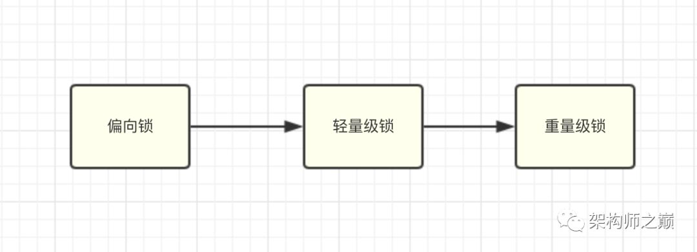 </div><br>

以下是 HotSpot 虚拟机对象头的内存布局，这些数据被称为 Mark Word。其中 tag bits 对应了五个状态，这些状态在右侧的 state 表格中给出。除了 marked for gc 状态，其它四个状态已经在前面介绍过了。

<div align="center"> 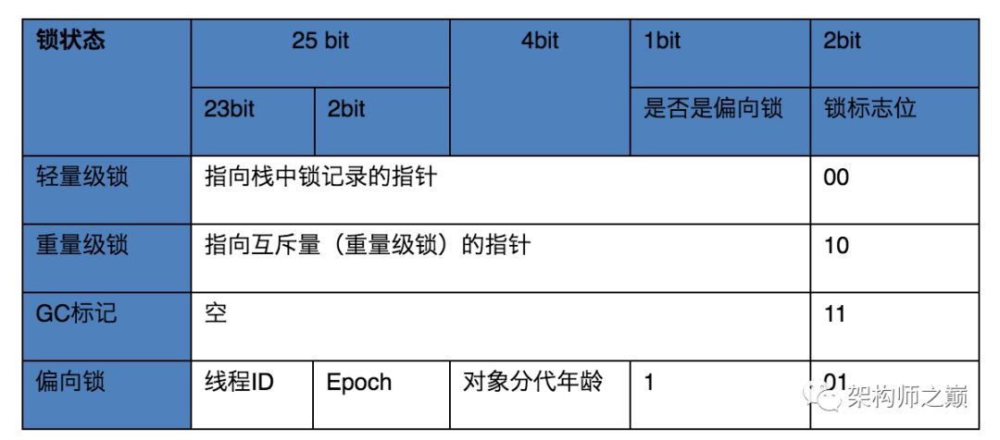 </div><br>

##### 偏向锁

Hotspot的作者经过以往的研究发现大多数情况下锁不仅不存在多线程竞争，而且总是由同一线程多次获得，为了让线程获得锁的代价更低而引入了偏向锁。当一个线程访问同步块并获取锁时，会在对象头和栈帧中的锁记录里存储锁偏向的线程ID，以后该线程在进入和退出同步块时不需要花费CAS操作来加锁和解锁，而只需简单的测试一下对象头的Mark  Word里是否存储着指向当前线程的偏向锁，如果测试成功，表示线程已经获得了锁，如果测试失败，则需要再测试下Mark  Word中偏向锁的标识是否设置成1（表示当前是偏向锁），如果没有设置，则使用CAS竞争锁，如果设置了，则尝试使用CAS将对象头的偏向锁指向当前线程。

偏向锁的撤销：偏向锁使用了一种等到竞争出现才释放锁的机制，所以当其他线程尝试竞争偏向锁时，持有偏向锁的线程才会释放锁。偏向锁的撤销，需要等待全局安全点（在这个时间点上没有字节码正在执行），它会首先暂停拥有偏向锁的线程，然后检查持有偏向锁的线程是否活着，如果线程不处于活动状态，则将对象头设置成无锁状态，如果线程仍然活着，拥有偏向锁的栈会被执行，遍历偏向对象的锁记录，栈中的锁记录和对象头的Mark   Word要么重新偏向于其他线程，要么恢复到无锁或者标记对象不适合作为偏向锁，最后唤醒暂停的线程。下图中的线程1演示了偏向锁初始化的流程，线程2演示了偏向锁撤销的流程。

<div align="center"> 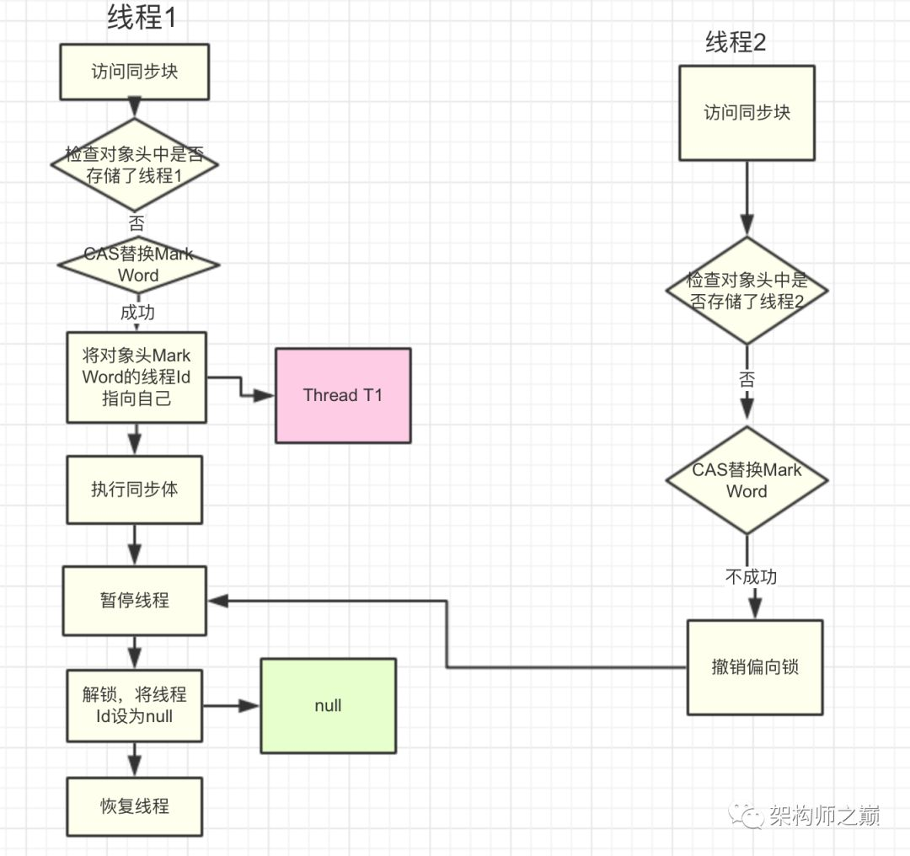 </div><br>

关闭偏向锁：偏向锁在Java  6和Java  7里是默认启用的，但是它在应用程序启动几秒钟之后才激活，如有必要可以使用JVM参数来关闭延迟-XX：BiasedLockingStartupDelay  =  0。如果你确定自己应用程序里所有的锁通常情况下处于竞争状态，可以通过JVM参数关闭偏向锁-XX:-UseBiasedLocking=false，那么默认会进入轻量级锁状态。

膨胀过程：当前线程执行CAS获取偏向锁失败（这一步是偏向锁的关键），表示在该锁对象上存在竞争并且这个时候另外一个线程获得偏向锁所有权。当到达全局安全点（safepoint）时获得偏向锁的线程被挂起，并从偏向锁所有者的私有Monitor  Record列表中获取一个空闲的记录，并将Object设置LightWeight Lock状态并且Mark  Word中的LockRecord指向刚才持有偏向锁线程的Monitor  record，最后被阻塞在安全点的线程被释放，进入到轻量级锁的执行路径中，同时被撤销偏向锁的线程继续往下执行同步代码。

##### 轻量级锁

轻量级锁加锁：线程在执行同步块之前，JVM会先在当前线程的栈桢中创建用于存储锁记录的空间，并将对象头中的Mark  Word复制到锁记录中，官方称为Displaced Mark Word。然后线程尝试使用CAS将对象头中的Mark  Word替换为指向锁记录的指针。如果成功，当前线程获得锁，如果失败，表示其他线程竞争锁，当前线程便尝试使用自旋来获取锁。

轻量级锁解锁：轻量级解锁时，会使用原子的CAS操作来将Displaced Mark Word替换回到对象头，如果成功，则表示没有竞争发生。如果失败，表示当前锁存在竞争，锁就会膨胀成重量级锁。下图是两个线程同时争夺锁，导致锁膨胀的流程图。

<div align="center"> 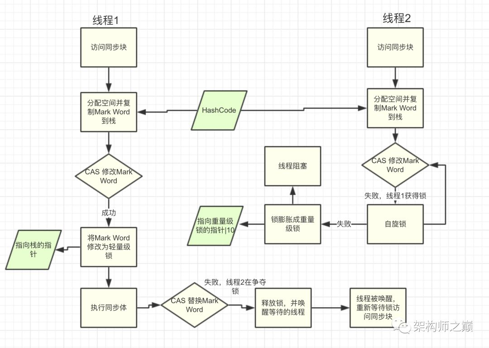 </div><br>

**Syncnized原理**

synchronized的执行过程： 
1. 检测Mark Word里面是不是当前线程的ID，如果是，表示当前线程处于偏向锁 

2. 如果不是，则使用CAS将当前线程的ID替换Mard Word，如果成功则表示当前线程获得偏向锁，置偏向标志位1 

3. 如果失败，则说明发生竞争，撤销偏向锁，进而升级为轻量级锁。 

4. 当前线程使用CAS将对象头的Mark Word替换为锁记录指针，如果成功，当前线程获得锁 

5. 如果失败，表示其他线程竞争锁，当前线程便尝试使用自旋来获取锁。 

6. 如果自旋成功则依然处于轻量级状态。 

7. 如果自旋失败，则升级为重量级锁。

   偏向锁是在无锁争用的情况下使用的，也就是同步开在当前线程没有执行完之前，没有其它线程会执行该同步块，一旦有了第二个线程的争用，偏向锁就会升级为轻量级锁，如果轻量级锁自旋到达阈值后，没有获取到锁，就会升级为重量级锁；

   如果线程争用激烈，那么应该禁用偏向锁。

<div align="center">  </div><br>

**不同锁之间的比较**

1. 偏向锁：

​      **优点**：加锁和解锁不需要额外的消耗，和执行非同步方法比仅存在纳秒级的差距。

​      **缺点**：如果线程间存在锁竞争，会带来额外的锁撤销的消耗。

​    **适用场景**：适用于只有一个线程访问同步块场景。

2. 轻量级锁：

​    **优点**：竞争的线程不会阻塞，提高了程序的响应速度。

   **缺点**：如果始终得不到锁竞争的线程使用自旋会消耗CPU。

  **适用场景**：追求响应时间。同步块执行速度非常快。

3. 重量级锁：

​    **优点**：线程竞争不使用自旋，不会消耗CPU。

​    **缺点**：线程阻塞，响应时间缓慢。

   **适用场景**：追求吞吐量。同步块执行速度较长。

#### 十三、多线程开发良好的实践

- 给线程起个有意义的名字，这样可以方便找 Bug。
- 缩小同步范围，从而减少锁争用。例如对于 synchronized，应该尽量使用同步块而不是同步方法。
- 多用同步工具少用 wait() 和 notify()。首先，CountDownLatch, CyclicBarrier, Semaphore 和 Exchanger 这些同步类简化了编码操作，而用 wait() 和 notify() 很难实现复杂控制流；其次，这些同步类是由最好的企业编写和维护，在后续的 JDK 中还会不断优化和完善。
- 使用 BlockingQueue 实现生产者消费者问题。
- 多用并发集合少用同步集合，例如应该使用 ConcurrentHashMap 而不是 Hashtable。
- 使用本地变量和不可变类来保证线程安全。
- 使用线程池而不是直接创建线程，这是因为创建线程代价很高，线程池可以有效地利用有限的线程来启动任务。

#### 参考资料

- BruceEckel. Java 编程思想: 第 4 版 [M]. 机械工业出版社, 2007.
- 周志明. 深入理解 Java 虚拟机 [M]. 机械工业出版社, 2011.
- [Threads and Locks](https://docs.oracle.com/javase/specs/jvms/se6/html/Threads.doc.html)
- [线程通信](http://ifeve.com/thread-signaling/#missed_signal)
- [Java 线程面试题 Top 50](http://www.importnew.com/12773.html)
- [BlockingQueue](http://tutorials.jenkov.com/java-util-concurrent/blockingqueue.html)
- [thread state java](https://stackoverflow.com/questions/11265289/thread-state-java)
- [CSC 456 Spring 2012/ch7 MN](http://wiki.expertiza.ncsu.edu/index.php/CSC_456_Spring_2012/ch7_MN)
- [Java - Understanding Happens-before relationship](https://www.logicbig.com/tutorials/core-java-tutorial/java-multi-threading/happens-before.html)
- [6장 Thread Synchronization](https://www.slideshare.net/novathinker/6-thread-synchronization)
- [How is Java's ThreadLocal implemented under the hood?](https://stackoverflow.com/questions/1202444/how-is-javas-threadlocal-implemented-under-the-hood/15653015)
- [Concurrent](https://sites.google.com/site/webdevelopart/21-compile/06-java/javase/concurrent?tmpl=%2Fsystem%2Fapp%2Ftemplates%2Fprint%2F&showPrintDialog=1)
- [JAVA FORK JOIN EXAMPLE](http://www.javacreed.com/java-fork-join-example/ "Java Fork Join Example")
- [聊聊并发（八）——Fork/Join 框架介绍](http://ifeve.com/talk-concurrency-forkjoin/)
- [Eliminating SynchronizationRelated Atomic Operations with Biased Locking and Bulk Rebiasing]

### 4、JVM（原理、优化案例）

#### 一、运行时数据区域

<div align="center">  </div><br>

##### 程序计数器

记录正在执行的虚拟机字节码指令的地址（如果正在执行的是本地方法则为空）。

##### Java 虚拟机栈

每个 Java 方法在执行的同时会创建一个栈帧用于存储局部变量表、操作数栈、常量池引用等信息。从方法调用直至执行完成的过程，就对应着一个栈帧在 Java 虚拟机栈中入栈和出栈的过程。

<div align="center">  </div><br>

可以通过 -Xss 这个虚拟机参数来指定每个线程的 Java 虚拟机栈内存大小：

```java
java -Xss512M HackTheJava
```

该区域可能抛出以下异常：

- 当线程请求的栈深度超过最大值，会抛出 StackOverflowError 异常；
- 栈进行动态扩展时如果无法申请到足够内存，会抛出 OutOfMemoryError 异常。

##### 本地方法栈

本地方法栈与 Java 虚拟机栈类似，它们之间的区别只不过是本地方法栈为本地方法服务。

本地方法一般是用其它语言（C、C++ 或汇编语言等）编写的，并且被编译为基于本机硬件和操作系统的程序，对待这些方法需要特别处理。

<div align="center">  </div><br>

##### 堆

所有对象都在这里分配内存，是垃圾收集的主要区域（"GC 堆"）。

现代的垃圾收集器基本都是采用分代收集算法，其主要的思想是针对不同类型的对象采取不同的垃圾回收算法。可以将堆分成两块：

- 新生代（Young Generation）
- 老年代（Old Generation）

堆不需要连续内存，并且可以动态增加其内存，增加失败会抛出 OutOfMemoryError 异常。

可以通过 -Xms 和 -Xmx 这两个虚拟机参数来指定一个程序的堆内存大小，第一个参数设置初始值，第二个参数设置最大值。

```java
java -Xms1M -Xmx2M HackTheJava
```

##### 方法区

用于存放已被加载的类信息、常量、静态变量、即时编译器编译后的代码等数据。

和堆一样不需要连续的内存，并且可以动态扩展，动态扩展失败一样会抛出 OutOfMemoryError 异常。

对这块区域进行垃圾回收的主要目标是对常量池的回收和对类的卸载，但是一般比较难实现。

HotSpot 虚拟机把它当成永久代来进行垃圾回收。但很难确定永久代的大小，因为它受到很多因素影响，并且每次 Full GC 之后永久代的大小都会改变，所以经常会抛出 OutOfMemoryError 异常。为了更容易管理方法区，从 JDK 1.8 开始，移除永久代，并把方法区移至元空间，它位于本地内存中，而不是虚拟机内存中。

##### 运行时常量池

运行时常量池是方法区的一部分。

Class 文件中的常量池（编译器生成的字面量和符号引用）会在类加载后被放入这个区域。

除了在编译期生成的常量，还允许动态生成，例如 String 类的 intern()。

##### 直接内存

在 JDK 1.4 中新引入了 NIO 类，它可以使用 Native 函数库直接分配堆外内存，然后通过 Java 堆里的 DirectByteBuffer 对象作为这块内存的引用进行操作。这样能在一些场景中显著提高性能，因为避免了在堆内存和堆外内存来回拷贝数据。

#### 二、垃圾收集

垃圾收集主要是针对堆和方法区进行。程序计数器、虚拟机栈和本地方法栈这三个区域属于线程私有的，只存在于线程的生命周期内，线程结束之后就会消失，因此不需要对这三个区域进行垃圾回收。

##### 判断一个对象是否可被回收

###### 1. 引用计数算法

为对象添加一个引用计数器，当对象增加一个引用时计数器加 1，引用失效时计数器减 1。引用计数为 0 的对象可被回收。

在两个对象出现循环引用的情况下，此时引用计数器永远不为 0，导致无法对它们进行回收。正是因为循环引用的存在，因此 Java 虚拟机不使用引用计数算法。

```java
public class Test {

    public Object instance = null;

    public static void main(String[] args) {
        Test a = new Test();
        Test b = new Test();
        a.instance = b;
        b.instance = a;
    }
}
```

###### 2. 可达性分析算法

以 GC Roots 为起始点进行搜索，可达的对象都是存活的，不可达的对象可被回收。

Java 虚拟机使用该算法来判断对象是否可被回收，GC Roots 一般包含以下内容：

- 虚拟机栈中局部变量表中引用的对象
- 本地方法栈中 JNI 中引用的对象
- 方法区中类静态属性引用的对象
- 方法区中的常量引用的对象

<div align="center">  </div><br>

###### 3. 方法区的回收

因为方法区主要存放永久代对象，而永久代对象的回收率比新生代低很多，所以在方法区上进行回收性价比不高。

主要是对常量池的回收和对类的卸载。

为了避免内存溢出，在大量使用反射和动态代理的场景都需要虚拟机具备类卸载功能。

类的卸载条件很多，需要满足以下三个条件，并且满足了条件也不一定会被卸载：

- 该类所有的实例都已经被回收，此时堆中不存在该类的任何实例。
- 加载该类的 ClassLoader 已经被回收。
- 该类对应的 Class 对象没有在任何地方被引用，也就无法在任何地方通过反射访问该类方法。

###### 4. finalize()

类似 C++ 的析构函数，用于关闭外部资源。但是 try-finally 等方式可以做得更好，并且该方法运行代价很高，不确定性大，无法保证各个对象的调用顺序，因此最好不要使用。

当一个对象可被回收时，如果需要执行该对象的 finalize() 方法，那么就有可能在该方法中让对象重新被引用，从而实现自救。自救只能进行一次，如果回收的对象之前调用了 finalize() 方法自救，后面回收时不会再调用该方法。

##### 引用类型

无论是通过引用计数算法判断对象的引用数量，还是通过可达性分析算法判断对象是否可达，判定对象是否可被回收都与引用有关。

Java 提供了四种强度不同的引用类型。

###### 1. 强引用

被强引用关联的对象不会被回收。

使用 new 一个新对象的方式来创建强引用。

```java
Object obj = new Object();
```

###### 2. 软引用

被软引用关联的对象只有在内存不够的情况下才会被回收。

使用 SoftReference 类来创建软引用。

```java
Object obj = new Object();
SoftReference<Object> sf = new SoftReference<Object>(obj);
obj = null;  // 使对象只被软引用关联
```

###### 3. 弱引用

被弱引用关联的对象一定会被回收，也就是说它只能存活到下一次垃圾回收发生之前。

使用 WeakReference 类来创建弱引用。

```java
Object obj = new Object();
WeakReference<Object> wf = new WeakReference<Object>(obj);
obj = null;
```

###### 4. 虚引用

又称为幽灵引用或者幻影引用，一个对象是否有虚引用的存在，不会对其生存时间造成影响，也无法通过虚引用得到一个对象。

为一个对象设置虚引用的唯一目的是能在这个对象被回收时收到一个系统通知。

使用 PhantomReference 来创建虚引用。

```java
Object obj = new Object();
PhantomReference<Object> pf = new PhantomReference<Object>(obj);
obj = null;
```

##### 垃圾收集算法

###### 1. 标记 - 清除

<div align="center">  </div><br>

标记要回收的对象，然后清除。

不足：

- 标记和清除过程效率都不高；
- 会产生大量不连续的内存碎片，导致无法给大对象分配内存。

###### 2. 标记 - 整理

<div align="center">  </div><br>

让所有存活的对象都向一端移动，然后直接清理掉端边界以外的内存。

###### 3. 复制

<div align="center">  </div><br>

将内存划分为大小相等的两块，每次只使用其中一块，当这一块内存用完了就将还存活的对象复制到另一块上面，然后再把使用过的内存空间进行一次清理。

主要不足是只使用了内存的一半。

现在的商业虚拟机都采用这种收集算法回收新生代，但是并不是划分为大小相等的两块，而是一块较大的 Eden 空间和两块较小的 Survivor 空间，每次使用 Eden 和其中一块 Survivor。在回收时，将 Eden 和 Survivor 中还存活着的对象全部复制到另一块 Survivor 上，最后清理 Eden 和使用过的那一块 Survivor。

HotSpot 虚拟机的 Eden 和 Survivor 大小比例默认为 8:1，保证了内存的利用率达到 90%。如果每次回收有多于 10% 的对象存活，那么一块 Survivor 就不够用了，此时需要依赖于老年代进行空间分配担保，也就是借用老年代的空间存储放不下的对象。

###### 4. 分代收集

现在的商业虚拟机采用分代收集算法，它根据对象存活周期将内存划分为几块，不同块采用适当的收集算法。

一般将堆分为新生代和老年代。

- 新生代使用：复制算法
- 老年代使用：标记 - 清除 或者 标记 - 整理 算法

##### 垃圾收集器

<div align="center">  </div><br>

以上是 HotSpot 虚拟机中的 7 个垃圾收集器，连线表示垃圾收集器可以配合使用。

- 单线程与多线程：单线程指的是垃圾收集器只使用一个线程，而多线程使用多个线程；
- 串行与并行：串行指的是垃圾收集器与用户程序交替执行，这意味着在执行垃圾收集的时候需要停顿用户程序；并行指的是垃圾收集器和用户程序同时执行。除了 CMS 和 G1 之外，其它垃圾收集器都是以串行的方式执行。

###### 1. Serial 收集器

<div align="center">  </div><br>

Serial 翻译为串行，也就是说它以串行的方式执行。

它是单线程的收集器，只会使用一个线程进行垃圾收集工作。

它的优点是简单高效，在单个 CPU 环境下，由于没有线程交互的开销，因此拥有最高的单线程收集效率。

它是 Client 场景下的默认新生代收集器，因为在该场景下内存一般来说不会很大。它收集一两百兆垃圾的停顿时间可以控制在一百多毫秒以内，只要不是太频繁，这点停顿时间是可以接受的。

-XX:+UseSerialGC 

###### 2. ParNew 收集器

<div align="center">  </div><br>

它是 Serial 收集器的多线程版本。

它是 Server 场景下默认的新生代收集器，除了性能原因外，主要是因为除了 Serial 收集器，只有它能与 CMS 收集器配合使用。

 -XX:+UseParNewGC（new代表新生代，所以适用于新生代） 

-  新生代并行 

 Serial收集器新生代的并行版本
 在新生代回收时使用复制算法
 多线程，需要多核支持
 -XX:ParallelGCThreads 限制线程数量 

###### 3. Parallel Scavenge 收集器

与 ParNew 一样是多线程收集器。

其它收集器目标是尽可能缩短垃圾收集时用户线程的停顿时间，而它的目标是达到一个可控制的吞吐量，因此它被称为“吞吐量优先”收集器。这里的吞吐量指 CPU 用于运行用户程序的时间占总时间的比值。

停顿时间越短就越适合需要与用户交互的程序，良好的响应速度能提升用户体验。而高吞吐量则可以高效率地利用 CPU 时间，尽快完成程序的运算任务，适合在后台运算而不需要太多交互的任务。

缩短停顿时间是以牺牲吞吐量和新生代空间来换取的：新生代空间变小，垃圾回收变得频繁，导致吞吐量下降。

可以通过一个开关参数打开 GC 自适应的调节策略（GC Ergonomics），就不需要手工指定新生代的大小（-Xmn）、Eden 和 Survivor 区的比例、晋升老年代对象年龄等细节参数了。虚拟机会根据当前系统的运行情况收集性能监控信息，动态调整这些参数以提供最合适的停顿时间或者最大的吞吐量。

新生代复制算法   

老年代标记-压缩   

更加关注吞吐量

 -XX:+UseParallelGC    

-  使用Parallel收集器+ 老年代串行 

 -XX:+UseParallelOldGC   

-  使用Parallel收集器+ 老年代并行 

 -XX:MaxGCPauseMills 

-  最大停顿时间，单位毫秒 
-  GC尽力保证回收时间不超过设定值 

 -XX:GCTimeRatio  

-  0-100的取值范围 
-  垃圾收集时间占总时间的比 
-  默认99，即最大允许1%时间做GC 

 这两个参数是矛盾的。因为停顿时间和吞吐量不可能同时调优  

###### 4. Serial Old 收集器

<div align="center">  </div><br>

是 Serial 收集器的老年代版本，也是给 Client 场景下的虚拟机使用。如果用在 Server 场景下，它有两大用途：

- 在 JDK 1.5 以及之前版本（Parallel Old 诞生以前）中与 Parallel Scavenge 收集器搭配使用。
- 作为 CMS 收集器的后备预案，在并发收集发生 Concurrent Mode Failure 时使用。

###### 5. Parallel Old 收集器

<div align="center">  </div><br>

是 Parallel Scavenge 收集器的老年代版本。

在注重吞吐量以及 CPU 资源敏感的场合，都可以优先考虑 Parallel Scavenge 加 Parallel Old 收集器。

###### 6. CMS 收集器

<div align="center">  </div><br>

CMS（Concurrent Mark Sweep），Mark Sweep 指的是标记 - 清除算法。

这里就能很明显的看出，为什么CMS要使用标记清除而不是标记压缩，如果使用标记压缩，需要多对象的内存位置进行改变，这样程序就很难继续执行。但是标记清除会产生大量内存碎片，不利于内存分配。 

分为以下四个流程：

- 初始标记：仅仅只是标记一下 GC Roots 能直接关联到的对象，速度很快，需要停顿。
- 并发标记：进行 GC Roots Tracing 的过程，它在整个回收过程中耗时最长，不需要停顿。
- 重新标记：为了修正并发标记期间因用户程序继续运作而导致标记产生变动的那一部分对象的标记记录，需要停顿。
- 并发清除：不需要停顿。

在整个过程中耗时最长的并发标记和并发清除过程中，收集器线程都可以与用户线程一起工作，不需要进行停顿。

具有以下缺点：

- 吞吐量低：低停顿时间是以牺牲吞吐量为代价的，导致 CPU 利用率不够高。
- 无法处理浮动垃圾，可能出现 Concurrent Mode Failure。浮动垃圾是指并发清除阶段由于用户线程继续运行而产生的垃圾，这部分垃圾只能到下一次 GC 时才能进行回收。由于浮动垃圾的存在，因此需要预留出一部分内存，意味着 CMS 收集不能像其它收集器那样等待老年代快满的时候再回收。如果预留的内存不够存放浮动垃圾，就会出现 Concurrent Mode Failure，这时虚拟机将临时启用 Serial Old 来替代 CMS。
- 标记 - 清除算法导致的空间碎片，往往出现老年代空间剩余，但无法找到足够大连续空间来分配当前对象，不得不提前触发一次 Full GC。

-XX:CMSInitiatingOccupancyFraction设置触发GC的阈值

 CMS也提供了整理碎片的参数： 

 -XX:+ UseCMSCompactAtFullCollection Full GC后，进行一次整理

-  整理过程是独占的，会引起停顿时间变长 

 -XX:+CMSFullGCsBeforeCompaction   

-  设置进行几次Full GC后，进行一次碎片整理 

 -XX:ParallelCMSThreads  

-  设定CMS的线程数量（一般情况约等于可用CPU数量） 

 CMS的提出是想改善GC的停顿时间，在GC过程中的确做到了减少GC时间，但是同样导致产生大量内存碎片，又需要消耗大量时间去整理碎片，从本质上并没有改善时间。  

###### 7. G1 收集器

[G1 收集器原理理解与分析](https://zhuanlan.zhihu.com/p/52841787)

https://blog.csdn.net/lijingyao8206/article/details/80513383

[请教G1算法的原理](https://hllvm-group.iteye.com/group/topic/44381)

[gc paper](https://www.jianshu.com/p/b1609c81cd5f)

https://blog.csdn.net/coderlius/article/details/79272773

[G1日志解读](https://www.jianshu.com/p/ac1ba3479c08)

 G1 GC是设计用来取代CMS的，同CMS相比G1有以下优势：
1、可预测的停顿模型
2、避免了CMS的垃圾碎片
3、超大堆的表现更出色（堆大小的分水岭大概在10GB～15GB左右：以下的-Xmx更适合CMS，以上的才适合试用G1）

**G1使用场景：**

- Java堆的50%以上都是活对象
- 对象的分配速率变化很大
- 由于old gc或压缩导致不可忍受的长时间的暂停

**G1（Garbage-First）**，它是一款面向服务端应用的垃圾收集器，在多 CPU 和大内存的场景下有很好的性能。HotSpot 开发团队赋予它的使命是未来可以替换掉 CMS 收集器。

堆被分为新生代和老年代，其它收集器进行收集的范围都是整个新生代或者老年代，而 G1 可以直接对新生代和老年代一起回收。

<div align="center">  </div><br>

G1 把堆划分成多个大小相等的独立区域（Region），新生代和老年代不再物理隔离。

<div align="center">  </div><br>

通过引入 Region 的概念，从而将原来的一整块内存空间划分成多个的小空间，使得每个小空间可以单独进行垃圾回收。这种划分方法带来了很大的灵活性，使得可预测的停顿时间模型成为可能。通过记录每个 Region 垃圾回收时间以及回收所获得的空间（这两个值是通过过去回收的经验获得），并维护一个优先列表，每次根据允许的收集时间，优先回收价值最大的 Region。

G1算法将堆划分为若干个区域（Region），它仍然属于分代收集器。不过，这些区域的一部分包含新生代，新生代的垃圾收集依然采用暂停所有应用线程的方式，将存活对象拷贝到老年代或者Survivor空间。老年代也分成很多区域，G1收集器通过将对象从一个区域复制到另外一个区域，完成了清理工作。这就意味着，在正常的处理过程中，G1完成了堆的压缩（至少是部分堆的压缩），这样也就不会有cms内存碎片问题的存在了。

在G1中，还有一种特殊的区域，叫Humongous区域。  如果一个对象占用的空间超过了分区容量50%以上，G1收集器就认为这是一个巨型对象。这些巨型对象，默认直接会被分配在年老代，但是如果它是一个短期存在的巨型对象，就会对垃圾收集器造成负面影响。为了解决这个问题，G1划分了一个Humongous区，它用来专门存放巨型对象。如果一个H区装不下一个巨型对象，那么G1会寻找连续的H分区来存储。为了能找到连续的H区，有时候不得不启动Full  GC。

**PS：在java 8中，持久代也移动到了普通的堆内存空间中，改为元空间。**

**G1 Young GC**

Young GC主要是对Eden区进行GC，它在Eden空间耗尽时会被触发。在这种情况下，Eden空间的数据移动到Survivor空间中，如果Survivor空间不够，Eden空间的部分数据会直接晋升到年老代空间。Survivor区的数据移动到新的Survivor区中，也有部分数据晋升到老年代空间中。最终Eden空间的数据为空，GC停止工作，应用线程继续执行。

**G1中的GC收集**

**G1保留了YGC并加上了一种全新的MIXGC用于收集老年代。G1中没有Full GC，G1中的Full GC是采用serial old Full GC。**

**YGC**

当Eden空间被占满之后，就会触发YGC。在G1中YGC依然采用复制存活对象到survivor空间的方式，当对象的存活年龄满足晋升条件时，把对象提升到old generation regions(老年代)。

G1控制YGC开销的手段是动态改变young region的个数，YGC的过程中依然会STW(stop the world 应用停顿)，并采用多线程并发复制对象，减少GC停顿时间。

YoungGC的回收过程如下：

    根扫描,跟CMS类似，Stop the world，扫描GC Roots对象。
    处理Dirty card,更新RSet.
    扫描RSet,扫描RSet中所有old区对扫描到的young区或者survivor区的引用。
    拷贝扫描出的存活的对象到survivor2/old区
    处理引用队列，软引用，弱引用，虚引用
**YGC是否需要扫描整个老年代？**

CMS中使用了Card Table的结构，里面记录了老年代对象到新生代引用。**Card Table的结构是一个连续的byte[]数组，扫描Card Table的时间比扫描整个老年代的代价要小很多！G1也参照了这个思路，不过采用了一种新的数据结构 Remembered Set 简称Rset。**RSet记录了其他Region中的对象引用本Region中对象的关系，属于points-into结构（谁引用了我的对象）。而Card Table则是一种points-out（我引用了谁的对象）的结构，每个Card 覆盖一定范围的Heap（一般为512Bytes）。G1的RSet是在Card Table的基础上实现的：每个Region会记录下别的Region有指向自己的指针，并标记这些指针分别在哪些Card的范围内。 这个RSet其实是一个Hash Table，Key是别的Region的起始地址，Value是一个集合，里面的元素是Card Table的Index。**每个Region都有一个对应的Rset**。

<div align="center"> 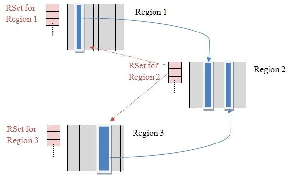 </div><br>

RSet究竟是怎么辅助GC的呢？在做YGC的时候，只需要选定young generation region的RSet作为根集，这些RSet记录了old->young的跨代引用，避免了扫描整个old generation。 而mixed gc的时候，old generation中记录了old->old的RSet，young->old的引用由扫描全部young generation region得到，这样也不用扫描全部old generation region。所以RSet的引入大大减少了GC的工作量。

**所以G1中YGC不需要扫描整个老年代，只需要扫描Rset就可以知道老年代引用了哪些新生代中的对象。**

**MIXGC**

G1中的MIXGC选定所有新生代里的Region，外加根据global concurrent marking统计得出收集收益高的若干老年代Region，在用户指定的开销目标范围内尽可能选择收益高的老年代Region进行回收。所以MIXGC回收的内存区域是新生代+老年代。

在介绍MIXGC之前我们需要先了解global concurrent marking，全局并发标记。因为老年代回收要依赖该过程。

**全局并发标记**

全局并发标记过程分为五个阶段

(1) Initial Mark初始标记 STW

Initial Mark初始标记是一个STW事件，其完成工作是标记GC ROOTS 直接可达的对象。并将它们的字段压入扫描栈（marking stack）中等到后续扫描。G1使用外部的bitmap来记录mark信息，而不使用对象头的mark word里的mark bit。因为 STW，所以通常YGC的时候借用YGC的STW顺便启动Initial Mark，也就是启动全局并发标记，全局并发标记与YGC在逻辑上独立。initial mark往往伴随着一次YGC。

> (1) Initial Mark
> *(Stop the World Event)*This is a stop the world event. With G1, it is piggybacked on a normal young GC. Mark survivor regions (root regions) which may have references to objects in old generation.

(2)Root Region Scanning 根区域扫描

根区域扫描是从Survior区的对象出发，标记被引用到老年代中的对象，并把它们的字段在压入扫描栈（marking stack）中等到后续扫描。与Initial Mark不一样的是，Root Region Scanning不需要STW与应用程序是并发运行。Root Region Scanning必须在YGC开始前完成。

> (2) Root Region Scanning
> Scan survivor regions for references into the old generation. This happens while the application continues to run. The phase must be completed before a young GC can occur.

(3)Concurrent Marking 并发标记

不需要STW。不断从扫描栈取出引用递归扫描整个堆里的对象。每扫描到一个对象就会对其标记，并将其字段压入扫描栈。重复扫描过程直到扫描栈清空。过程中还会扫描SATB write barrier所记录下的引用。Concurrent Marking 可以被YGC中断

> (3) Concurrent Marking
> Find live objects over the entire heap. This happens while the application is running. This phase can be interrupted by young generation garbage collections.

(4)Remark 最终标记 STW

STW操作。在完成并发标记后，每个Java线程还会有一些剩下的SATB write barrier记录的引用尚未处理。这个阶段就负责把剩下的引用处理完。同时这个阶段也进行弱引用处理（reference processing）。注意这个暂停与CMS的remark有一个本质上的区别，那就是这个暂停只需要扫描SATB buffer，而CMS的remark需要重新扫描mod-union table里的dirty card外加整个根集合，而此时整个young gen（不管对象死活）都会被当作根集合的一部分，因而CMS remark有可能会非常慢。

> (4) Remark
> Completes the marking of live object in the heap. Uses an algorithm called snapshot-at-the-beginning (SATB) which is much faster than what was used in the CMS collector.

(5)Cleanup 清除 STW AND *Concurrent*

STW操作，清点出有存活对象的Region和没有存活对象的Region(Empty Region)

STW操作，更新Rset

Concurrent操作，把Empty Region收集起来到可分配Region队列。

**经过global concurrent marking，collector就知道哪些Region有存活的对象。并将那些完全可回收的Region(没有存活对象)收集起来加入到可分配Region队列，实现对该部分内存的回收。对于有存活对象的Region，G1会根据统计模型找处收益最高、开销不超过用户指定的上限的若干Region进行对象回收。这些选中被回收的Region组成的集合就叫做collection set 简称Cset！**

**在MIXGC中的Cset是选定所有young gen里的region，外加根据global concurrent marking统计得出收集收益高的若干old gen region。**

**在YGC中的Cset是选定所有young gen里的region。通过控制young gen的region个数来控制young GC的开销。**

**YGC与MIXGC都是采用多线程复制清除，整个过程会STW。 G1的低延迟原理在于其回收的区域变得精确并且范围变小了。**

**并发标记，G1在mutator一侧需要使用write barrier来实现： **

* SATB snapshot的完整性 
* 跨region的引用记录到RSet里。 

这两个动作都使用了logging barrier，其处理有一部分由collector一侧并发执行。

**STAB**

G1 使用的是 SATB 标记算法，主要应用于垃圾收集的并发标记阶段，解决了CMS 垃圾收 集器重新标记阶段长时间 Stop The World（STW） 的潜在风险。其算法全称是 Snapshot At The Beginning，由字面理解，是垃圾回收器开始时活着的对象的一个快照。

它是通过 “根集合”穷举可达对象得到的，穷举过程中采用了三色标记法：

```
白：对象没有被标记到，标记阶段结束后，会被当做垃圾回收掉。
灰：对象被标记了，但是它所在的Field还没有被标记或标记完（可达对象还未被标记）。
黑：对象被标记了，且它的所有Field也被标记完了。
```

所以，漏标的情况只会发生在白色对象中，且满足以下任意一个条件：

```
并发标记时，应用线程给一个黑色对象的引用类型字段赋值了该白色对象
并发标记时，应用线程删除所有灰色对象到该白色对象的引用
```

SATB 利用 write barrier 将所有即将被删除的引用关系的旧引用记录下来，最后以这些旧引用为根 Stop The World 地重新扫描一遍即可避免漏标问题。 因此 G1 Remark阶段 Stop The World 与 CMS 了的remark有一个本质上的区别，那就是这个暂停只需要扫描有 write barrier 所追中对象为根的对象， 而 CMS 的remark 需要重新扫描整个根 集合，因而CMS remark有可能会非常慢。

上面global concurrent marking提到了STAB算法，那这个STAB到底为何物？STAB全称为snapshot-at-the-beginning，其目的是了维持并发GC的正确性。**GC的正确性是保证存活的对象不被回收，换句话来说就是保证回收的都是垃圾**。如果标记过程是STW的话，那GC的正确性是一定能保证的。但如果一边标记，一边应用在变更堆里面对象的引用，那么标记的正确性就不一定能保证了。

**为了解决这个问题，STAB的做法在GC开始时对内存进行一个对象图的逻辑快照(snapshot)，通过GC Roots tracing 参照并发标记的过程，只要被快照到对象是活的，那在整个GC的过程中对象就被认定的是活的，即使该对象的引用稍后被修改或者删除。同时新分配的对象也会被认为是活的，除此之外其它不可达的对象就被认为是死掉了。这样STAB就保证了真正存活的对象不会被GC误回收，但同时也造成了某些可以被回收的对象逃过了GC，导致了内存里面存在浮动的垃圾(float garbage)。**


**Full GC**

下面我们来介绍特殊情况，那就是会导致 **Full GC** 的情况，也是我们需要极力避免的：

1. concurrent mode failure：并发模式失败，CMS 收集器也有同样的概念。G1 并发标记期间，如果在标记结束前，老年代被填满，G1 会放弃标记。

   > 这个时候说明
   >
   > - 堆需要增加了，
   > - 或者需要调整并发周期，如增加并发标记的线程数量，让并发标记尽快结束
   > - 或者就是更早地进行并发周期，默认是整堆内存的 45% 被占用就开始进行并发周期。

2. 晋升失败：并发周期结束后，是混合垃圾回收周期，伴随着年轻代垃圾收集，进行清理老年代空间，如果这个时候清理的速度小于消耗的速度，导致老年代不够用，那么会发生晋升失败。

   > 说明混合垃圾回收需要更迅速完成垃圾收集，也就是说在混合回收阶段，每次年轻代的收集应该处理更多的老年代已标记区块。

3. 疏散失败：年轻代垃圾收集的时候，如果 Survivor 和 Old 区没有足够的空间容纳所有的存活对象。这种情况肯定是非常致命的，因为基本上已经没有多少空间可以用了，这个时候会触发 Full GC 也是很合理的。

   > 最简单的就是增加堆大小

4. 大对象分配失败，我们应该尽可能地不创建大对象，尤其是大于一个区块大小的那种对象。

**STAB具体细节：**

每个Region中都有那么几个指针

|<-- (1) -->|<-- (2) -->|<-- (3) -->|<-- (4) -->|
bottom prevTAMS nextTAMS top end

<div align="center"> 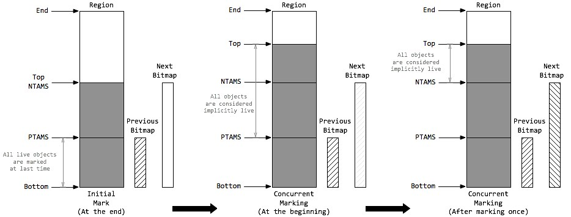 </div><br>

其中top是该region的当前分配指针，[bottom, top)是当前该region已用（used）的部分，[top, end)是尚未使用的可分配空间（unused）。

(1): [bottom, prevTAMS): 这部分里的对象存活信息可以通过prevBitmap来得知

(2): [prevTAMS, nextTAMS): 这部分里的对象在第n-1轮concurrent marking是隐式存活的

(3): [nextTAMS, top): 这部分里的对象在第n轮concurrent marking是隐式存活的

为什么会用prevTAMS和nextTAMS两个指针？

因为G1的并发标记的过程用了两个bitmap：

一个prevBitmap记录第n-1轮concurrent mark所得的对象存活状态。由于第n－1轮concurrent marking已经完成，这个bitmap的信息可以直接使用。

一个nextBitmap记录第n轮concurrent mark的结果。这个bitmap是当前将要或正在进行的concurrent mark的结果，尚未完成，所以还不能使用。

所以Region会同时存在prevTAMS和nextTAMS两个指针，这两个指针是在 Initial Mark阶段就会设置好。

所以我们很容易知道哪些对象在一次GC开始之后新分配的：在TAMS以上的对象就是新分配的，因而被视为隐式marked，标记为存活。

切换到另外一个场景：如果在标记的过程中mark了某个对象但对象中某些引用这字段还没有被mark到,此时应用并发修改引用字段的值，那collecotr就拿不到完整的快照了，这不符合STAB的设想。

为了解决这个问题就有了SATB write barrier。G1 GC具体使用的是Yuasa式的SATB write barrier的变种。Write barrier是对“对引用类型字段赋值”这个动作的环切，也就是说赋值的前后都在barrier覆盖的范畴内。在赋值前的部分的write barrier叫做pre-write barrier，在赋值后的则叫做post-write barrier。

<div align="center"> 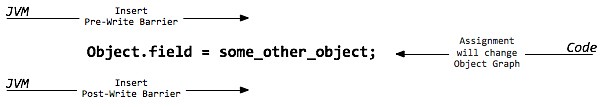 </div><br>

**栅栏 Barrier**

我们首先介绍一下栅栏(Barrier)的概念。栅栏是指在原生代码片段中，当某些语句被执行时，栅栏代码也会被执行。而G1主要在赋值语句中，使用写前栅栏(Pre-Write Barrrier)和写后栅栏(Post-Write Barrrier)。事实上，写栅栏的指令序列开销非常昂贵，应用吞吐量也会根据栅栏复杂度而降低。

**写前栅栏 Pre-Write Barrrier**

即将执行一段赋值语句时，等式左侧对象将修改引用到另一个对象，那么等式左侧对象原先引用的对象所在分区将因此丧失一个引用，那么JVM就需要在赋值语句生效之前，记录丧失引用的对象。JVM并不会立即维护RSet，而是通过批量处理，在将来RSet更新(见SATB)。

**写后栅栏 Post-Write Barrrier**

​	当执行一段赋值语句后，等式右侧对象获取了左侧对象的引用，那么等式右侧对象所在分区的RSet也应该得到更新。同样为了降低开销，写后栅栏发生后，RSet也不会立即更新，同样只是记录此次更新日志，在将来批量处理(见Concurrence Refinement Threads)。

​	跟SATB marking queue类似，每个Java线程有一个dirty card queue，也就是论文里说的每个线程的remembered set log；然后有一个全局的DirtyCardQueueSet，也就是论文里说的全局的filled RS buffers。 
实际更新RSet的动作就交由多个ConcurrentG1RefineThread并发完成。每当全局队列集合超过一定阈值后，ConcurrentG1RefineThread就会取出若干个队列，遍历每个队列记录的card并将card加到对应的region的RSet里去。 

**1、Pre/Post-write barrier与SATB的关系**

​	前面提到SATB要维持“在GC开始时活的对象”的状态这个逻辑snapshot。除了从root出发把整个对象图mark下来之外，其实只需要用pre-write barrier把每次引用关系变化时旧的引用值记下来就好了。这样，等concurrent marker到达某个对象时，这个对象的所有引用类型字段的变化全都有记录在案，就不会漏掉任何在snapshot里活的对象。当然，很可能有对象在snapshot中是活的，但随着并发GC的进行它可能本来已经死了，但SATB还是会让它活过这次GC。

​	所以在G1 GC里，整个write barrier+oop_field_store是这样的：

```cpp
void oop_field_store(oop* field, oop new_value) {
  pre_write_barrier(field);             // pre-write barrier: for maintaining SATB invariant
  *field = new_value;                   // the actual store
  post_write_barrier(field, new_value); // post-write barrier: for tracking cross-region reference
}
```

按照Yuasa式SATB barrier的设计，pre-write barrier里面的抽象逻辑应当如下：

```cpp
void pre_write_barrier(oop* field) {
  if ($gc_phase == GC_CONCURRENT_MARK) { // SATB invariant only maintained during concurrent marking
    oop old_value = *field;
    if (old_value != null && !is_marked(old_value)) {
      mark_object(old_value);
      $mark_stack->push(old_value); // scan all of old_value's fields later
    }
  }
}
```

​	这比原本的Yuasa式设计少了些东西：没有检查目标对象是否已经mark，也不去对目标对象做mark和扫描它的字段。实际上该做的事情还是得做，只是不在这里做而已。那放在那里做呢放到了后面的logging barrier，这个后面讲到。

Pre-write barrier的实际代码有好几个版本，其中最简单明白的版本是：

```cpp
  // This notes that we don't need to access any BarrierSet data
  // structures, so this can be called from a static context.
  template <class T> static void write_ref_field_pre_static(T* field, oop newVal) {
    T heap_oop = oopDesc::load_heap_oop(field);
    if (!oopDesc::is_null(heap_oop)) {
      enqueue(oopDesc::decode_heap_oop(heap_oop));
    }
  }
```

enqueue动作的实际代码则在G1SATBCardTableModRefBS::enqueue(oop pre_val)。

它判断当前是否在concurrent marking phase用的是：

```cpp
JavaThread::satb_mark_queue_set().is_active()  
```

为了维持这种RSet，G1 GC的post-write barrier的抽象逻辑需要做下面的事情： 

There are two concepts that help maintain RSets:

1. Post-write barriers
2. Concurrent refinement threads

```cpp
void post_write_barrier(oop* field, oop new_value) {  
  uintptr_t field_uint = (uintptr_t) field;  
  uintptr_t new_value_uint = (uintptr_t) new_value;  
  uintptr_t comb = (field_uint ^ new_value_uint) >> HeapRegion::LogOfHRGrainBytes;  
  
  if (comb == 0) return; // field and new_value are in the same region  
  if (new_value == null) return; // filter out null stores  
  
  // Otherwise, log it  
  volatile jbyte* card_ptr = card_for(field); // get address of the card for this field  
  
  // in generational G1 mode, skip dirtying cards for young gen regions,  
  // -- young gen regions are always collected  
  // if (*card_ptr == g1_young_gen) return;  
  
  if (*card_ptr != dirty_card) {  
    // dirty the card to reduce the work for multiple stores to the same card  
    *card_ptr = dirty_card;  
    // log the card for concurrent remembered set refinement  
    JavaThread::current()->dirty_card_queue->enqueue(card_ptr);  
  }  
} 
```

这是logging barrier在G1 write barrier上的又一次应用。 

​	跟SATB marking queue类似，每个Java线程有一个dirty card queue，也就是论文里说的每个线程的remembered set log；然后有一个全局的DirtyCardQueueSet，也就是论文里说的全局的filled RS buffers。 
实际更新RSet的动作就交由多个ConcurrentG1RefineThread并发完成。每当全局队列集合超过一定阈值后，ConcurrentG1RefineThread就会取出若干个队列，遍历每个队列记录的card并将card加到对应的region的RSet里去。 

**2、logging write barrier**

​	为了尽量减少write barrier对应用mutator性能的影响，G1将一部分原本要在barrier里做的事情挪到别的线程上并发执行。 
实现这种分离的方式就是通过logging形式的write barrier：mutator只在barrier里把要做的事情的信息记（log）到一个队列里，然后另外的线程从队列里取出信息批量完成剩余的动作。 

​	以SATB write barrier为例，每个Java线程有一个独立的、定长的SATBMarkQueue，mutator在barrier里只把old_value压入该队列中。一个队列满了之后，它就会被加到全局的SATB队列集合SATBMarkQueueSet里等待处理，然后给对应的Java线程换一个新的、干净的队列继续执行下去。 

​	并发标记（concurrent marker）会定期检查全局SATB队列集合的大小。当全局集合中队列数量超过一定阈值后，concurrent marker就会处理集合里的所有队列：把队列里记录的每个oop都标记上，并将其引用字段压到标记栈（marking stack）上等后面做进一步标记。

**简单理解**

​	每个 Region 都有一个 Remembered Set，用来记录该 Region 对象的引用对象所在的 Region。通过使用 Remembered Set，在做可达性分析的时候就可以避免全堆扫描。

<div align="center">  </div><br>

如果不计算维护 Remembered Set 的操作，G1 收集器的运作大致可划分为以下几个步骤：

- 初始标记
- 并发标记
- 最终标记：为了修正在并发标记期间因用户程序继续运作而导致标记产生变动的那一部分标记记录，虚拟机将这段时间对象变化记录在线程的 Remembered Set Logs 里面，最终标记阶段需要把 Remembered Set Logs 的数据合并到 Remembered Set 中。这阶段需要停顿线程，但是可并行执行。
- 筛选回收：首先对各个 Region 中的回收价值和成本进行排序，根据用户所期望的 GC 停顿时间来制定回收计划。此阶段其实也可以做到与用户程序一起并发执行，但是因为只回收一部分 Region，时间是用户可控制的，而且停顿用户线程将大幅度提高收集效率。

具备如下特点：

- 空间整合：整体来看是基于“标记 - 整理”算法实现的收集器，从局部（两个 Region 之间）上来看是基于“复制”算法实现的，这意味着运行期间不会产生内存空间碎片。
- 可预测的停顿：能让使用者明确指定在一个长度为 M 毫秒的时间片段内，消耗在 GC 上的时间不得超过 N 毫秒。

**G1命令行选项与最佳实践**

**1、命令行选项**

**-XX:+UseG1GC** 告诉JVM使用G1收集器

**-XX:MaxGCPauseMillis=200** 设置最大GC目标最大停顿时间为200ms，这是一个软指标。JVM会最大努力去达到它，因此有时停顿时间会达不到设置目标。G1配置是200ms

**-XX:InitiatingHeapOccupancyPercent=45** 启动并发标记标记百分比，当整堆内存使用量达到百分比时，G1使用它来触发一个基于整个堆的并发标记循环，而不仅仅是一个代。默念值是45%

**2、最佳实践**

下面有几个关于使用G1的最佳实践

**不要设置Young Generation大小**

因为显式通过-Xmn设置young generation大小将会干预G1收集器的默认行为

- G1将不再尊重设定的pause time,本质来说是因为设置young generation大小使得设定的pause time目标失效。
- G1不再能够根据需要扩展和收缩young generation的空间。由于大小是固定的，所以不能更改大小。

**响应时间指标**

不要使用平均响应时间(ART)作为指标来设置XX:MaxGCPauseMillis=<N>，而要考虑设置90%以上时间都能达到目标的值。这意味着90%发出请求的用户不会经历高于目标的响应时间。记住，暂停时间是一个目标，并不能保证总能达到。

**什么是Evacuation Failure**

当JVM在GC期间复制对象到Survior区或或者提升对象时，堆空间被耗尽，堆区域升级失败。堆无法扩展，因为它已经处于最大值。这种情况在-XX:+PrintGCDetails将会以TO空间溢出**(to-space overflow)**的形式表示。代价是十分昂贵的，因为

- GC仍然需要继续，所以必须释放空间
- 未成功复制的对象必须在适当的位置保留
- 对CSet中区域的rset的任何更新都必须重新生成
- 所有这些步骤都很昂贵。

**如何避免Evacuation Failure**

为了避免Evacuation Failure，考虑以下选项。

- 增大堆（内存)大小

  + 增大**-XX:G1ReservePercent=n**，默认是10

  - G1会预留一部分内存，制造一个假天花板，当真正Evacuation Failure时还有内存可用。

- 早点启动标记周期

- 增大并行标记的线程数，使用**-XX:ConcGCThreads=n**选项。

**完整的G1 GC开关列表**

- -XX:+UseG1GC 使用G1 GC。
- -XX:MaxGCPauseMillis=n 设置最大GC停顿时间，这是一个软目标，JVM会尽最大努力去达到它。
- -XX:InitiatingHeapOccupancyPercent=n 启动并发标记循环的堆占用率的百分比，当整个堆的占用达到比例时，启动一个全局并发标记循环，0代表并发标记一直运行。默认值是45%。
- -XX：G1NewSizePercent：初始年轻代占整个Java Heap的大小，默认值为5%；
- -XX：G1MaxNewSizePercent：最大年轻代占整个Java Heap的大小，默认值为60%；
- -XX:NewRatio=n 新生代和老年代大小的比例，默认是2。
- -XX:SurvivorRatio=n eden和survivor区域空间大小的比例，默认是8。
- -XX:MaxTenuringThreshold=n 晋升的阈值，默认是15（一个存活对象经历多少次GC周期之后晋升到老年代)。
- -XX:ParallelGCThreads=n 设置GC并发阶段的线程数，默认值与JVM运行平台相关。
- -XX:ConcGCThreads=n 设置并发标记的线程数，与Java应用一起执行的GC线程数量。默认是Java线程的1/4。减少这个参数的数值可能会提升并行回收的效率，即提高系统内部吞吐量（系统是一个整体，CPU资源大家都需要占用），不过如果这个数值过低，也会导致并行回收机制耗时加长；
- -XX:G1ReservePercent=n 设置保留java堆大小比例，用于防止晋升失败/Evacuation Failure,默认值是10%。
- -XX:G1HeapRegionSize=n 设置Region的大小，默认是根据堆的大小动态决定，大小范围是[1M,32M]
- -XX:G1ConcRefinementThreads=n:默认等于ParallelGCThreads，g1优化线程数（处理全局的DirtyCardQueueSet，也就是论文里说的全局的filled RS buffers）
- -XX:G1RSetUpdatingPauseTimePercent=10:默认10，更新Rset占gc暂停时间（GC evacuation pause）的比例
- –XX:G1MixedGCLiveThresholdPercent: old generation region中的存活对象的占比，只有在此参数之下，才会被选入CSet
- –XX:G1MixedGCCountTarget: 一次global concurrent marking之后，最多执行Mixed GC的次数。与G1MixedGCLIveThresholdPercent参数合用
- –XX:G1HeapWastePercent: 设置您愿意浪费的堆百分比。如果可回收百分比小于堆废物百分比，Java HotSpot VM 不会启动混合垃圾回收周期。默认值是 10%
- –XX:G1OldCSetRegionThresholdPercent: 设置混合垃圾回收期间要回收的最大旧区域数。默认值是 Java 堆的 10%。

**使用G1记录GC**

这里简要介绍可以用来收集GC日志信息的相关配置开关。

**1、日志详细级别**

**(1) -verbosegc(相当于-XX:+PrintGC)**将日志的详细级别设置为详细。

样例输出

> [GC pause (G1 Humongous Allocation) (young) (initial-mark) 24M- >21M(64M), 0.2349730 secs]
> [GC pause (G1 Evacuation Pause) (mixed) 66M->21M(236M), 0.1625268 secs] 

**(2) -XX:+PrintGCDetails**将细节级别设置为更精细。选项显示以下信息:

显示每个阶段的平均时间、最小时间和最大时间。

根扫描、RSet更新(带有已处理缓冲区信息)、RSet扫描、对象复制、终止(带有尝试次数)。

还显示“其他”时间，如选择CSet所花费的时间、引用处理时间、引用排队时间和释放CSet时间。

显示Eden、Survivor空间和总堆占用率。

样例输出

> [Ext Root Scanning (ms): Avg: 1.7 Min: 0.0 Max: 3.7 Diff: 3.7]
> [Eden: 818M(818M)->0B(714M) Survivors: 0B->104M Heap: 836M(4096M)->409M(4096M)]

**(3)-XX:+UnlockExperimentalVMOptions -XX:G1LogLevel=finest** 细节级别最为精细。精细到单个工作线程信息

样例输出

> [Ext Root Scanning (ms): 2.1 2.4 2.0 0.0
> Avg: 1.6 Min: 0.0 Max: 2.4 Diff: 2.3][Update RS (ms): 0.4 0.2 0.4 0.0 Avg: 0.2 Min: 0.0 Max: 0.4 Diff: 0.4]
> [Processed Buffers : 5 1 10 0
> Sum: 16, Avg: 4, Min: 0, Max: 10, Diff: 10]

**(4))-XX:+UnlockExperimentalVMOptions  -XX:+G1SummarizeRSetStats** **-XX:G1SummarizeRSetStatsPeriod=period**  如果观察到RS的处理时间较长，可以使用**-XX:+G1SummarizeRSetStats**参数，在GC结束后打印RSet的详细信息。一般在debug环境排查用。还有一个辅助参数**-XX G1SummarizeRSetStatsPeriod=0**用来控制第几次GC后统计一次RSet信息。

>A sample output of **-XX:+G1SummarizeRSetStats** with the period set to one **-XX:G1SummarizeRSetStatsPeriod=1:**
>Concurrent RS processed 784125 cards
>
>Of 4870 completed buffers:
>
>4870 **(100.0%) by concurrent RS threads.**
>
>0 ( **0.0%) by mutator threads**.
>
>Concurrent RS threads times (s)
>
>0.64 0.30 0.26 0.18 0.17 0.16 0.17 0.15 0.15 0.12 0.13 0.08 0.13 0.13 0.12 0.13 0.12 0.11 0.12 0.11 0.12 0.13 0.11
>
>Concurrent sampling threads times (s)
>
>0.00
>
>Total heap region rem set sizes = 199140K. Max = 661K.
>
>Static structures = 660K, free_lists = 15052K.
>
>1009422114 occupied cards represented.
>
>Max size region =
>313:(O)[0x000000054e400000,0x000000054e800000,0x000000054e800000], size = 662K, occupied = 1214K.
>
>Did 2759 coarsenings.

**-XX：+G1PrintRegionLivenessInfo：**这个参数需要和-XX：+UnlockDiagnosticVMOptions配合启动，这可以理解，它们本身就是属于VM的调试信息。如果开启了，VM会打印堆内存里每个Region的存活对象信息。这个信息在标记循环结束后可以打印出来；

**-XX：+G1TraceConcRefinement：**这个也是一个VM的调试信息。如果启用，并行回收阶段的日志就会被详细打印出来；

**2、时间打印**

这里有两个关于时间的开关

**(1)** **-XX:+PrintGCTimeStamps** - 显示JVM启动后经过的时间。

样例输出

> 1.729: [GC pause (young) 46M->35M(1332M), 0.0310029 secs]

**(2)** **-XX:+PrintGCDateStamps** - 为每个条目添加日期前缀。

样例输出

> 2012-05-02T11:16:32.057+0200: [GC pause (young) 46M->35M(1332M), 0.0317225 secs]

##### 总结

吞吐量优先的应用（PS）
响应时间优先的应用(CMS、G1)

##### Gc调优重要参数

**并行收集器（吞吐量优先）**

-XX:+UseParallelGC：设置为并行收集器。此配置仅对年轻代有效。

-XX:ParallelGCThreads=20：配置并行收集器的线程数，此值建议配置与CPU数目相等。

-XX:+UseParallelOldGC：配置年老代垃圾收集方式为并行收集。JDK6.0开始支持对年老代并行收集。

-XX:GCTimeRatio：设置垃圾回收时间占程序运行时间的百分比，默认99，即最大允许1%时间做GC.

-XX:MaxGCPauseMillis=100(谨慎使用)：设置每次年轻代垃圾回收的最长时间（单位毫秒）

-XX:+UseAdaptiveSizePolicy(**默认开启，surviveRatio参数实效**)：自适应策略

**并发收集器（响应时间优先）**

-XX:+UseConcMarkSweepGC：即CMS收集，设置年老代为并发收集。

-XX:+UseParNewGC：设置年轻代为并发收集。

-XX:ParallelCMSThreads:CMS默认启动的回收线程数目是 (ParallelGCThreads + 3)/4)

-XX:CMSFullGCsBeforeCompaction=0：此参数设置运行0次Full GC后对内存空间进行压缩和整理

XX:+UseCMSCompactAtFullCollection：设置CMS收集器在完成垃圾回收了之后是否进行一次内存碎片整理(整理过程是独占的，会引起停顿时间变长)

-XX:+UseCMSInitiatingOccupancyOnly：使用手动定义初始化定义开始CMS收集

-XX:CMSInitiatingOccupancyFraction=70：表示年老代内存空间使用到70%时就开始执行CMS收集

-XX:+CMSParallelRemarkEnabled：开启并行remark,降低标记停顿

-XX:+CMSScavengeBeforeRemark：强制remark之前开始一次minor gc，减少remark的暂停时间

-XX:+CMSClassUnloadingEnabled -XX:+CMSPermGenSweepingEnabled：清理永久代

##### GC日志解读(以Parallel Gc为例)

https://github.com/cncounter/gc-handbook/blob/master/04_GC_Algorithms_Implementations_CN.md

##### JVM诊断分析-命令和分析工具

http://www.ligen.pro/2018/10/27/JVM%E8%AF%8A%E6%96%AD%E5%88%86%E6%9E%90/

http://www.importnew.com/23761.html

1. gc日志使用[gcEasy](https://gceasy.io/)分析

2. 线程快照日志使用[fastthread](https://fastthread.io/)分析

3. dump文件使用**Eclipse mat**分析

##### CMS Young Gc标记过程

1. 标记直接和根引用的对象
2. 标记间接和根引用的对象
3. 被老年代对象所引用的新生代的对象(统计信息显示，老年代持有新生代对象引用的情况不足1%)对于第三种，JVM采用了Card Marking(卡片标记)的方法，避免了在做Minor GC时需要对整个老年代扫描表的具体策略是将老年代的空间分成大小为512B的若干张卡（card）。卡表本身是单字节数组，数组中的每个元素对应着一张卡，当发生老年代引用新生代时，虚拟机将该卡对应的卡表元素设置为适当的值。如上图所示，卡表3被标记为脏（卡表还有另外的作用，标识并发标记阶段哪些块被修改过），之后Minor GC时通过扫描卡表就可以很快的识别哪些卡中存在老年代指向新生代的引用。

<div align="center"> 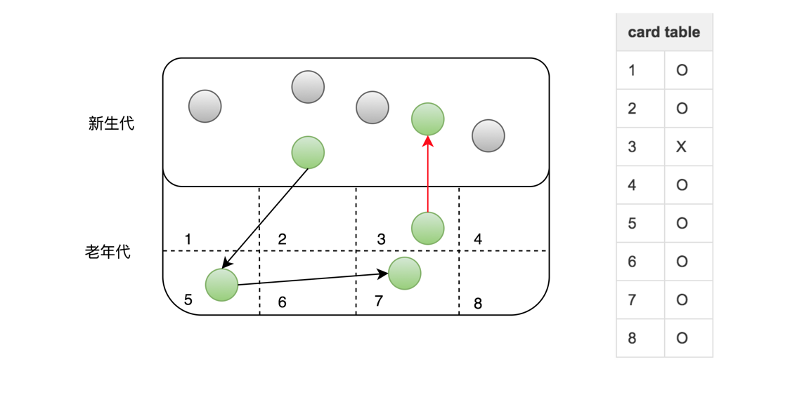 </div><br>

##### GC对应用的影响

举例：假设单位时间T内发生一次持续25ms的GC，接口平均响应时间为50ms，且请求均匀到达，根据下图所示：

<div align="center"> 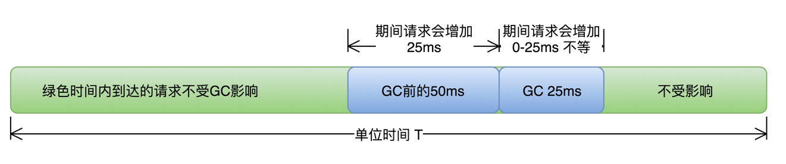 </div><br>

​    那么有(50ms+25ms)/T比例的请求会受GC影响，其中GC前的50ms内到达的请求都会增加25ms，GC期间的25ms内到达的请求，会增加0-25ms不等，如果时间T内发生N次GC，受GC影响请求占比=(接口响应时间+GC时间)×N/T 。可见无论降低单次GC时间还是降低GC次数N都可以有效减少GC对响应时间的影响。
​    假设T为1分钟，N为10:
   受GC影响请求占比 =（50ms + 25ms） * 10 / 1 * 60 * 1000 = 1.17%

#### 三、内存分配与回收策略

##### Minor GC 和 Full GC

- Minor GC：回收新生代上，因为新生代对象存活时间很短，因此 Minor GC 会频繁执行，执行的速度一般也会比较快。
- Full GC：回收老年代和新生代，老年代对象其存活时间长，因此 Full GC 很少执行，执行速度会比 Minor GC 慢很多。

##### 内存分配策略

###### 1. 对象优先在 Eden 分配

大多数情况下，对象在新生代 Eden 区分配，当 Eden 区空间不够时，发起 Minor GC。

###### 2. 大对象直接进入老年代

大对象是指需要连续内存空间的对象，最典型的大对象是那种很长的字符串以及数组。

经常出现大对象会提前触发垃圾收集以获取足够的连续空间分配给大对象。

-XX:PretenureSizeThreshold，大于此值的对象直接在老年代分配，避免在 Eden 区和 Survivor 区之间的大量内存复制。

###### 3. 长期存活的对象进入老年代

为对象定义年龄计数器，对象在 Eden 出生并经过 Minor GC 依然存活，将移动到 Survivor 中，年龄就增加 1 岁，增加到一定年龄则移动到老年代中。

-XX:MaxTenuringThreshold 用来定义年龄的阈值。

###### 4. 动态对象年龄判定

虚拟机并不是永远地要求对象的年龄必须达到 MaxTenuringThreshold 才能晋升老年代，如果在 Survivor 中相同年龄所有对象大小的总和大于 Survivor 空间的一半，则年龄大于或等于该年龄的对象可以直接进入老年代，无需等到 MaxTenuringThreshold 中要求的年龄。

###### 5. 空间分配担保

在发生 Minor GC 之前，虚拟机先检查老年代最大可用的连续空间是否大于新生代所有对象总空间，如果条件成立的话，那么 Minor GC 可以确认是安全的。

如果不成立的话虚拟机会查看 HandlePromotionFailure 设置值是否允许担保失败，如果允许那么就会继续检查老年代最大可用的连续空间是否大于历次晋升到老年代对象的平均大小，如果大于，将尝试着进行一次 Minor GC；如果小于，或者 HandlePromotionFailure 设置不允许冒险，那么就要进行一次 Full GC。

##### Full GC 的触发条件

对于 Minor GC，其触发条件非常简单，当 Eden 空间满时，就将触发一次 Minor GC。而 Full GC 则相对复杂，有以下条件：

###### 1. 调用 System.gc()

只是建议虚拟机执行 Full GC，但是虚拟机不一定真正去执行。不建议使用这种方式，而是让虚拟机管理内存。

###### 2. 老年代空间不足

老年代空间不足的常见场景为前文所讲的大对象直接进入老年代、长期存活的对象进入老年代等。

为了避免以上原因引起的 Full GC，应当尽量不要创建过大的对象以及数组。除此之外，可以通过 -Xmn 虚拟机参数调大新生代的大小，让对象尽量在新生代被回收掉，不进入老年代。还可以通过 -XX:MaxTenuringThreshold 调大对象进入老年代的年龄，让对象在新生代多存活一段时间。

###### 3. 空间分配担保失败

使用复制算法的 Minor GC 需要老年代的内存空间作担保，如果担保失败会执行一次 Full GC。具体内容请参考上面的第五小节。

###### 4. JDK 1.7 及以前的永久代空间不足

在 JDK 1.7 及以前，HotSpot 虚拟机中的方法区是用永久代实现的，永久代中存放的为一些 Class 的信息、常量、静态变量等数据。

当系统中要加载的类、反射的类和调用的方法较多时，永久代可能会被占满，在未配置为采用 CMS GC 的情况下也会执行 Full GC。如果经过 Full GC 仍然回收不了，那么虚拟机会抛出 java.lang.OutOfMemoryError。

为避免以上原因引起的 Full GC，可采用的方法为增大永久代空间或转为使用 CMS GC。

###### 5. Concurrent Mode Failure

执行 CMS GC 的过程中同时有对象要放入老年代，而此时老年代空间不足（可能是 GC 过程中浮动垃圾过多导致暂时性的空间不足），便会报 Concurrent Mode Failure 错误，并触发 Full GC。

#### 四、类加载机制

类是在运行期间第一次使用时动态加载的，而不是一次性加载。因为如果一次性加载，那么会占用很多的内存。

##### 类的生命周期

<div align="center">  </div><br>

包括以下 7 个阶段：

- **加载（Loading）** 
- **验证（Verification）** 
- **准备（Preparation）** 
- **解析（Resolution）** 
- **初始化（Initialization）** 
- 使用（Using）
- 卸载（Unloading）

##### 类加载过程

包含了加载、验证、准备、解析和初始化这 5 个阶段。

###### 1. 加载

加载是类加载的一个阶段，注意不要混淆。

加载过程完成以下三件事：

- 通过类的完全限定名称获取定义该类的二进制字节流。
- 将该字节流表示的静态存储结构转换为方法区(metaspace)的运行时存储结构（在metaspace区生成代表该类的InstanceKlass对象[表示其元数据，包括常量池、字段、方法等]）。
- 在内存中生成一个代表该类的 Class 对象，用于作为运行时访问该类的各种数据的接口 。(在堆区生成改类的Class对象。类的实例对象的对象头里klass指针指向该类的InstanceKlass对象，该类的InstanceKlass对象的_java_mirror指向该类的Class对象，klass，_java_mirror双向)

其中二进制字节流可以从以下方式中获取：

- 从 ZIP 包读取，成为 JAR、EAR、WAR 格式的基础。
- 从网络中获取，最典型的应用是 Applet。
- 运行时计算生成，例如动态代理技术，在 java.lang.reflect.Proxy 使用 ProxyGenerator.generateProxyClass 的代理类的二进制字节流。
- 由其他文件生成，例如由 JSP 文件生成对应的 Class 类。

###### 2. 验证

确保 Class 文件的字节流中包含的信息符合当前虚拟机的要求，并且不会危害虚拟机自身的安全。

###### 3. 准备

类变量是被 static 修饰的变量，准备阶段为类变量分配内存并设置初始值，使用的是方法区的内存。

实例变量不会在这阶段分配内存，它会在对象实例化时随着对象一起被分配在堆中。应该注意到，实例化不是类加载的一个过程，类加载发生在所有实例化操作之前，并且类加载只进行一次，实例化可以进行多次。

初始值一般为 0 值，例如下面的类变量 value 被初始化为 0 而不是 123。

```java
public static int value = 123;
```

如果类变量是常量，那么它将初始化为表达式所定义的值而不是 0。例如下面的常量 value 被初始化为 123 而不是 0。

```java
public static final int value = 123;
```

###### 4. 解析

将常量池的符号引用替换为直接引用的过程。

其中解析过程在某些情况下可以在初始化阶段之后再开始，这是为了支持 Java 的动态绑定。

###### 5. 初始化

初始化阶段才真正开始执行类中定义的 Java 程序代码。初始化阶段是虚拟机执行类构造器 &lt;clinit>() 方法的过程。在准备阶段，类变量已经赋过一次系统要求的初始值，而在初始化阶段，根据程序员通过程序制定的主观计划去初始化类变量和其它资源。

在准备阶段，已经为类变量分配了系统所需的初始值，并且在初始化阶段，根据程序员通过程序进行的主观计划来初始化类变量和其他资源。

&lt;clinit>() 是由编译器自动收集类中所有类变量的赋值动作和静态语句块中的语句合并产生的，编译器收集的顺序由语句在源文件中出现的顺序决定。特别注意的是，静态语句块只能访问到定义在它之前的类变量，定义在它之后的类变量只能赋值，不能访问。例如以下代码：

```java
public class Test {
    static {
        i = 0;                // 给变量赋值可以正常编译通过
        System.out.print(i);  // 这句编译器会提示“非法向前引用”
    }
    static int i = 1;
}
```

由于父类的 &lt;clinit>() 方法先执行，也就意味着父类中定义的静态语句块的执行要优先于子类。例如以下代码：

```java
static class Parent {
    public static int A = 1;
    static {
        A = 2;
    }
}

static class Sub extends Parent {
    public static int B = A;
}

public static void main(String[] args) {
     System.out.println(Sub.B);  // 2
}
```

接口中不可以使用静态语句块，但仍然有类变量初始化的赋值操作，因此接口与类一样都会生成 &lt;clinit>() 方法。但接口与类不同的是，执行接口的 &lt;clinit>() 方法不需要先执行父接口的 &lt;clinit>() 方法。只有当父接口中定义的变量使用时，父接口才会初始化。另外，接口的实现类在初始化时也一样不会执行接口的 &lt;clinit>() 方法。

虚拟机会保证一个类的 &lt;clinit>() 方法在多线程环境下被正确的加锁和同步，如果多个线程同时初始化一个类，只会有一个线程执行这个类的 &lt;clinit>() 方法，其它线程都会阻塞等待，直到活动线程执行 &lt;clinit>() 方法完毕。如果在一个类的 &lt;clinit>() 方法中有耗时的操作，就可能造成多个线程阻塞，在实际过程中此种阻塞很隐蔽。

##### 类初始化时机

###### 1. 主动引用

虚拟机规范中并没有强制约束何时进行加载，但是规范严格规定了有且只有下列五种情况必须对类进行初始化（加载、验证、准备都会随之发生）：

- 遇到 new、getstatic、putstatic、invokestatic 这四条字节码指令时，如果类没有进行过初始化，则必须先触发其初始化。最常见的生成这 4 条指令的场景是：使用 new 关键字实例化对象的时候；读取或设置一个类的静态字段（被 final 修饰、已在编译期把结果放入常量池的静态字段除外）的时候；以及调用一个类的静态方法的时候。
- 使用 java.lang.reflect 包的方法对类进行反射调用的时候，如果类没有进行初始化，则需要先触发其初始化。
- 当初始化一个类的时候，如果发现其父类还没有进行过初始化，则需要先触发其父类的初始化。
- 当虚拟机启动时，用户需要指定一个要执行的主类（包含 main() 方法的那个类），虚拟机会先初始化这个主类；
- 当使用 JDK 1.7 的动态语言支持时，如果一个 java.lang.invoke.MethodHandle 实例最后的解析结果为 REF_getStatic, REF_putStatic, REF_invokeStatic 的方法句柄，并且这个方法句柄所对应的类没有进行过初始化，则需要先触发其初始化；

###### 2. 被动引用

以上 5 种场景中的行为称为对一个类进行主动引用。除此之外，所有引用类的方式都不会触发初始化，称为被动引用。被动引用的常见例子包括：

- 通过子类引用父类的静态字段，不会导致子类初始化。

```java
System.out.println(SubClass.value);  // value 字段在 SuperClass 中定义
```

- 通过数组定义来引用类，不会触发此类的初始化。该过程会对数组类进行初始化，数组类是一个由虚拟机自动生成的、直接继承自 Object 的子类，其中包含了数组的属性和方法。

```java
SuperClass[] sca = new SuperClass[10];
```

- 常量在编译阶段会存入调用类的常量池中，本质上并没有直接引用到定义常量的类，因此不会触发定义常量的类的初始化。

```java
System.out.println(ConstClass.HELLOWORLD);
```

##### 类与类加载器

两个类相等，需要类本身相等，并且使用同一个类加载器进行加载。这是因为每一个类加载器都拥有一个独立的类名称空间。

这里的相等，包括类的 Class 对象的 equals() 方法、isAssignableFrom() 方法、isInstance() 方法的返回结果为 true，也包括使用 instanceof 关键字做对象所属关系判定结果为 true。

##### 类加载器分类

从 Java 虚拟机的角度来讲，只存在以下两种不同的类加载器：

- 启动类加载器（Bootstrap ClassLoader），使用 C++ 实现，是虚拟机自身的一部分；
- 所有其它类的加载器，使用 Java 实现，独立于虚拟机，继承自抽象类 java.lang.ClassLoader。

从 Java 开发人员的角度看，类加载器可以划分得更细致一些：

- 启动类加载器（Bootstrap ClassLoader）此类加载器负责将存放在 &lt;JRE_HOME>\lib 目录中的，或者被 -Xbootclasspath 参数所指定的路径中的，并且是虚拟机识别的（仅按照文件名识别，如 rt.jar，名字不符合的类库即使放在 lib 目录中也不会被加载）类库加载到虚拟机内存中。启动类加载器无法被 Java 程序直接引用，用户在编写自定义类加载器时，如果需要把加载请求委派给启动类加载器，直接使用 null 代替即可。
- 扩展类加载器（Extension ClassLoader）这个类加载器是由 ExtClassLoader（sun.misc.Launcher$ExtClassLoader）实现的。它负责将 &lt;JAVA_HOME>/lib/ext 或者被 java.ext.dir 系统变量所指定路径中的所有类库加载到内存中，开发者可以直接使用扩展类加载器。
- 应用程序类加载器（Application ClassLoader）这个类加载器是由 AppClassLoader（sun.misc.Launcher$AppClassLoader）实现的。由于这个类加载器是 ClassLoader 中的 getSystemClassLoader() 方法的返回值，因此一般称为系统类加载器。它负责加载用户类路径（ClassPath）上所指定的类库，开发者可以直接使用这个类加载器，如果应用程序中没有自定义过自己的类加载器，一般情况下这个就是程序中默认的类加载器。

<div data="modify <--"></div>

##### 双亲委派模型

应用程序是由三种类加载器互相配合从而实现类加载，除此之外还可以加入自己定义的类加载器。

下图展示了类加载器之间的层次关系，称为双亲委派模型（Parents Delegation Model）。该模型要求除了顶层的启动类加载器外，其它的类加载器都要有自己的父类加载器。类加载器之间的父子关系一般通过组合关系（Composition）来实现，而不是继承关系（Inheritance）。

<div align="center">  </div><br>

###### 1. 工作过程

一个类加载器首先将类加载请求转发到父类加载器，只有当父类加载器无法完成时才尝试自己加载。

###### 2. 好处

使得 Java 类随着它的类加载器一起具有一种带有优先级的层次关系，从而使得基础类得到统一。

例如 java.lang.Object 存放在 rt.jar 中，如果编写另外一个 java.lang.Object 并放到 ClassPath 中，程序可以编译通过。由于双亲委派模型的存在，所以在 rt.jar 中的 Object 比在 ClassPath 中的 Object 优先级更高，这是因为 rt.jar 中的 Object 使用的是启动类加载器，而 ClassPath 中的 Object 使用的是应用程序类加载器。rt.jar 中的 Object 优先级更高，那么程序中所有的 Object 都是这个 Object。

###### 3. 实现

以下是抽象类 java.lang.ClassLoader 的代码片段，其中的 loadClass() 方法运行过程如下：先检查类是否已经加载过，如果没有则让父类加载器去加载。当父类加载器加载失败时抛出 ClassNotFoundException，此时尝试自己去加载。

```java
public abstract class ClassLoader {
    // The parent class loader for delegation
    private final ClassLoader parent;

    public Class<?> loadClass(String name) throws ClassNotFoundException {
        return loadClass(name, false);
    }

    protected Class<?> loadClass(String name, boolean resolve) throws ClassNotFoundException {
        synchronized (getClassLoadingLock(name)) {
            // First, check if the class has already been loaded
            Class<?> c = findLoadedClass(name);
            if (c == null) {
                try {
                    if (parent != null) {
                        c = parent.loadClass(name, false);
                    } else {
                        c = findBootstrapClassOrNull(name);
                    }
                } catch (ClassNotFoundException e) {
                    // ClassNotFoundException thrown if class not found
                    // from the non-null parent class loader
                }

                if (c == null) {
                    // If still not found, then invoke findClass in order
                    // to find the class.
                    c = findClass(name);
                }
            }
            if (resolve) {
                resolveClass(c);
            }
            return c;
        }
    }

    protected Class<?> findClass(String name) throws ClassNotFoundException {
        throw new ClassNotFoundException(name);
    }
}
```

##### 自定义类加载器实现

FileSystemClassLoader 是自定义类加载器，继承自 java.lang.ClassLoader，用于加载文件系统上的类。它首先根据类的全名在文件系统上查找类的字节代码文件（.class 文件），然后读取该文件内容，最后通过 defineClass() 方法来把这些字节代码转换成 java.lang.Class 类的实例。

java.lang.ClassLoader 的 loadClass() 实现了双亲委派模型的逻辑，自定义类加载器一般不去重写它，但是需要重写 findClass() 方法。

```java
public class FileSystemClassLoader extends ClassLoader {

    private String rootDir;

    public FileSystemClassLoader(String rootDir) {
        this.rootDir = rootDir;
    }

    protected Class<?> findClass(String name) throws ClassNotFoundException {
        byte[] classData = getClassData(name);
        if (classData == null) {
            throw new ClassNotFoundException();
        } else {
            return defineClass(name, classData, 0, classData.length);
        }
    }

    private byte[] getClassData(String className) {
        String path = classNameToPath(className);
        try {
            InputStream ins = new FileInputStream(path);
            ByteArrayOutputStream baos = new ByteArrayOutputStream();
            int bufferSize = 4096;
            byte[] buffer = new byte[bufferSize];
            int bytesNumRead;
            while ((bytesNumRead = ins.read(buffer)) != -1) {
                baos.write(buffer, 0, bytesNumRead);
            }
            return baos.toByteArray();
        } catch (IOException e) {
            e.printStackTrace();
        }
        return null;
    }

    private String classNameToPath(String className) {
        return rootDir + File.separatorChar
                + className.replace('.', File.separatorChar) + ".class";
    }
}
```

#### 五、JVM对象模型、对象创建过程

##### **1、JVM中OOP-KLASS模型**

**Klass**

`Klass`: 包含元数据和方法信息，用来描述Java类

Klass主要有两个功能：

- 实现语言层面的Java类
- 实现Java对象的分发功能

一般jvm在加载class文件时，会在方法区（metaspace）创建instanceKlass，表示其元数据，包括常量池、字段、方法等。

**OOP**

`OOP`: Ordinary Object Pointer （普通对象指针），它用来表示对象的实例信息，看起来像个指针实际上是藏在指针里的对象

Klass是在class文件在加载过程中创建的，OOP则是在Java程序运行过程中new对象时创建的。

一个OOP对象包含以下几个部分：

- instanceOopDesc，也叫对象头 
  - Mark Word，主要存储对象运行时记录信息，如hashcode, GC分代年龄，锁状态标志，线程ID，时间戳等
  - 元数据指针，即指向方法区(jdk8以上是Metaspace)的instanceKlass实例
- 实例数据
- 另外，如果是数组对象，还多了一个数组长度

**目的**

​	HotSopt JVM的设计者不想让每个对象中都含有一个vtable（虚函数表），所以就把对象模型拆成klass和oop，其中oop中不含有任何虚函数，而Klass就含有虚函数表，可以进行method dispatch。

**在JVM中，使用了OOP-KLASS模型来表示java对象，即：**
​	1.jvm在加载class时，创建instanceKlass，表示其元数据，包括常量池、字段、方法等，存放在方法区；instanceKlass是jvm中的数据结构；	

​	2.在new一个对象时，jvm创建instanceOopDesc，来表示这个对象，存放在堆区，其引用，存放在栈区；它用来表示对象的实例信息，看起来像个指针实际上是藏在指针里的对象；instanceOopDesc对应java中的对象实例；

​	3.HotSpot并不把instanceKlass暴露给Java，而会另外创建对应的instanceOopDesc来表示java.lang.Class对象，并将后者称为前者的“Java镜像”，klass持有指向oop引用(_java_mirror便是该instanceKlass对Class对象的引用)；

​	4.要注意，new操作返回的instanceOopDesc类型指针指向instanceKlass，而instanceKlass指向了对应的类型的Class实例的instanceOopDesc；有点绕，简单说，就是Person实例——>Person的instanceKlass——>Person的Class。

```java
class Model
{
    public static int a = 1;
    public int b;

    public Model(int b) {
        this.b = b;
    }
}

public static void main(String[] args) {
    int c = 10;
    Model modelA = new Model(2);
    Model modelB = new Model(3);
}
```

<div align="center"> 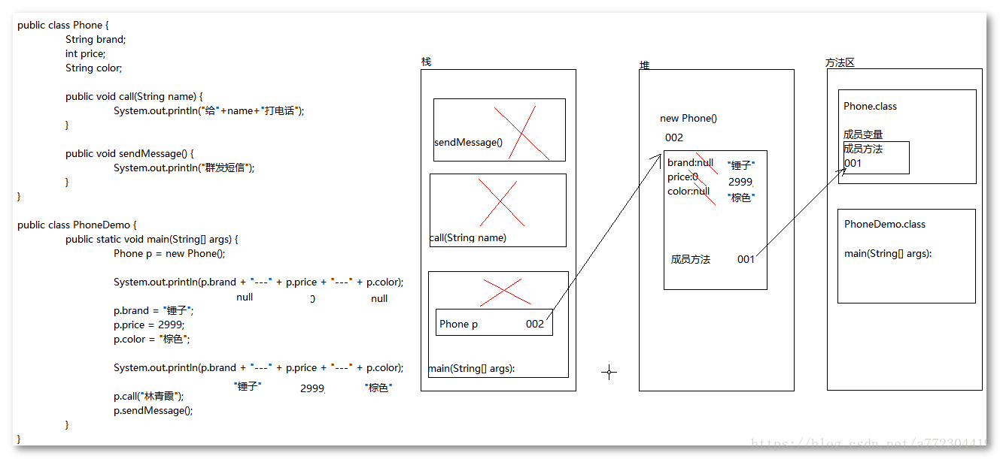 </div><br>

##### **2、对象的创建**

<div align="center"> 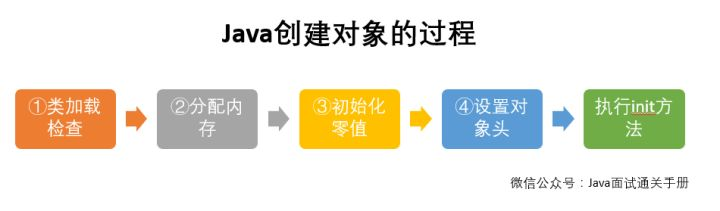 </div><br>

**①类加载检查：** 虚拟机遇到一条 new 指令时，首先将去检查这个指令的参数是否能在常量池中定位到这个类的符号引用，并且检查这个符号引用代表的类是否已被加载过、解析和初始化过。如果没有，那必须先执行相应的类加载过程。

**②分配内存：** 在**类加载检查**通过后，接下来虚拟机将为新生对象**分配内存**。对象所需的内存大小在类加载完成后便可确定，为对象分配空间的任务等同于把一块确定大小的内存从 Java 堆中划分出来。**分配方式**有 **“指针碰撞”** 和 **“空闲列表”** 两种，**选择那种分配方式由 Java 堆是否规整决定，而Java堆是否规整又由所采用的垃圾收集器是否带有压缩整理功能决定**。

**内存分配的两种方式：（补充内容，需要掌握）**

选择以上两种方式中的哪一种，取决于 Java 堆内存是否规整。而 Java 堆内存是否规整，取决于 GC 收集器的算法是"标记-清除"，还是"标记-整理"（也称作"标记-压缩"），值得注意的是，复制算法内存也是规整的

<div align="center"> 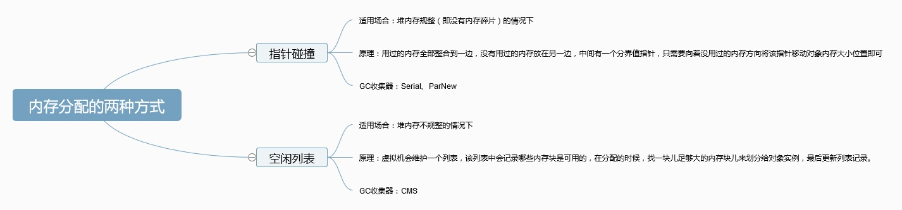 </div><br>

**内存分配并发问题（补充内容，需要掌握）**

在创建对象的时候有一个很重要的问题，就是线程安全，因为在实际开发过程中，创建对象是很频繁的事情，作为虚拟机来说，必须要保证线程是安全的，通常来讲，虚拟机采用两种方式来保证线程安全：

- **CAS+失败重试：** CAS 是乐观锁的一种实现方式。所谓乐观锁就是，每次不加锁而是假设没有冲突而去完成某项操作，如果因为冲突失败就重试，直到成功为止。**虚拟机采用 CAS 配上失败重试的方式保证更新操作的原子性。**
- **TLAB：** 为每一个线程预先在Eden区分配一块儿内存，JVM在给线程中的对象分配内存时，首先在TLAB分配，当对象大于TLAB中的剩余内存或TLAB的内存已用尽时，再采用上述的CAS进行内存分配

**③初始化零值：**内存分配完成后，虚拟机需要将分配到的内存空间都初始化为零值（不包括对象头），这一步操作保证了对象的实例字段在 Java 代码中可以不赋初始值就直接使用，程序能访问到这些字段的数据类型所对应的零值。

**④设置对象头：** 初始化零值完成之后，**虚拟机要对对象进行必要的设置**，例如这个对象是那个类的实例、如何才能找到类的元数据信息、对象的哈希吗、对象的 GC 分代年龄等信息。 **这些信息存放在对象头中。** 另外，根据虚拟机当前运行状态的不同，如是否启用偏向锁等，对象头会有不同的设置方式。

**⑤执行 init 方法：** 在上面工作都完成之后，从虚拟机的视角来看，一个新的对象已经产生了，但从 Java 程序的视角来看，对象创建才刚开始，`<init>` 方法还没有执行，所有的字段都还为零。所以一般来说，执行 new 指令之后会接着执行 `<init>` 方法，把对象按照程序员的意愿进行初始化，这样一个真正可用的对象才算完全产生出来。

##### 3、对象的访问定位

建立对象就是为了使用对象，我们的Java程序通过栈上的 reference 数据来操作堆上的具体对象。对象的访问方式有虚拟机实现而定，目前主流的访问方式有**①使用句柄**和**②直接指针**两种：

1. **句柄：** 如果使用句柄的话，那么Java堆中将会划分出一块内存来作为句柄池，reference 中存储的就是对象的句柄地址，而句柄中包含了对象实例数据与类型数据各自的具体地址信息；

   <div align="center"> 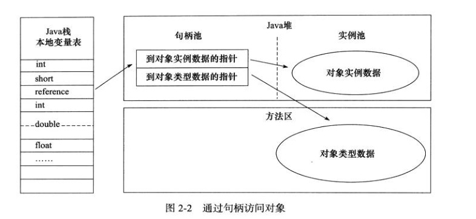 </div><br>

2. **直接指针：** 如果使用直接指针访问，那么 Java 堆对像的布局中就必须考虑如何防止访问类型数据的相关信息，reference 中存储的直接就是对象的地址。

   <div align="center"> 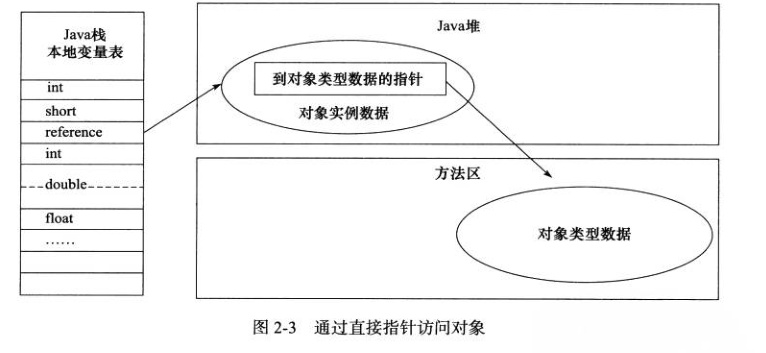 </div><br>

**这两种对象访问方式各有优势。使用句柄来访问的最大好处是 reference中存储的是稳定的句柄地址，在对象被移动时只会改变句柄中的实例数据指针，而 reference 本身不需要修改。使用直接指针访问方式最大的好处就是速度快，它节省了一次指针定位的时间开销。**

**参考：**

http://www.cnblogs.com/dqrcsc/p/4671879.html

https://zhuanlan.zhihu.com/p/42747056

https://www.jianshu.com/p/424a920771a3

https://zhuanlan.zhihu.com/p/51695160

https://cgiirw.github.io/2018/04/16/JVM_Oop_Desc/

https://www.zhihu.com/question/30300585/answer/51335493

https://www.cnblogs.com/xy-nb/p/6773051.html

#### 参考资料

- 周志明. 深入理解 Java 虚拟机 [M]. 机械工业出版社, 2011.
- [Chapter 2. The Structure of the Java Virtual Machine](https://docs.oracle.com/javase/specs/jvms/se8/html/jvms-2.html#jvms-2.5.4)
- [Jvm memory](https://www.slideshare.net/benewu/jvm-memory)
  [Getting Started with the G1 Garbage Collector](http://www.oracle.com/webfolder/technetwork/tutorials/obe/java/G1GettingStarted/index.html)
- [JNI Part1: Java Native Interface Introduction and “Hello World” application](http://electrofriends.com/articles/jni/jni-part1-java-native-interface/)
- [Memory Architecture Of JVM(Runtime Data Areas)](https://hackthejava.wordpress.com/2015/01/09/memory-architecture-by-jvmruntime-data-areas/)
- [JVM Run-Time Data Areas](https://www.programcreek.com/2013/04/jvm-run-time-data-areas/)
- [Android on x86: Java Native Interface and the Android Native Development Kit](http://www.drdobbs.com/architecture-and-design/android-on-x86-java-native-interface-and/240166271)
- [深入理解 JVM(2)——GC 算法与内存分配策略](https://crowhawk.github.io/2017/08/10/jvm_2/)
- [深入理解 JVM(3)——7 种垃圾收集器](https://crowhawk.github.io/2017/08/15/jvm_3/)
- [JVM Internals](http://blog.jamesdbloom.com/JVMInternals.html)
- [深入探讨 Java 类加载器](https://www.ibm.com/developerworks/cn/java/j-lo-classloader/index.html#code6)
- [Guide to WeakHashMap in Java](http://www.baeldung.com/java-weakhashmap)
- [Tomcat example source code file (ConcurrentCache.java)]

### 5、常用设计模式

#### 一、概述

设计模式是解决问题的方案，学习现有的设计模式可以做到经验复用。

拥有设计模式词汇，在沟通时就能用更少的词汇来讨论，并且不需要了解底层细节。

[源码以及 UML 图](https://github.com/CyC2018/Design-Pattern-Java)

#### 二、创建型

##### 1. 单例（Singleton）

###### Intent

确保一个类只有一个实例，并提供该实例的全局访问点。

###### Class Diagram

使用一个私有构造函数、一个私有静态变量以及一个公有静态函数来实现。

私有构造函数保证了不能通过构造函数来创建对象实例，只能通过公有静态函数返回唯一的私有静态变量。

<div align="center">  </div><br>

###### Implementation

###### Ⅰ 懒汉式-线程不安全

以下实现中，私有静态变量 uniqueInstance 被延迟实例化，这样做的好处是，如果没有用到该类，那么就不会实例化 uniqueInstance，从而节约资源。

这个实现在多线程环境下是不安全的，如果多个线程能够同时进入 `if (uniqueInstance == null)` ，并且此时 uniqueInstance 为 null，那么会有多个线程执行 `uniqueInstance = new Singleton();` 语句，这将导致实例化多次 uniqueInstance。

```java
public class Singleton {

    private static Singleton uniqueInstance;

    private Singleton() {
    }

    public static Singleton getUniqueInstance() {
        if (uniqueInstance == null) {
            uniqueInstance = new Singleton();
        }
        return uniqueInstance;
    }
}
```

###### Ⅱ 饿汉式-线程安全

线程不安全问题主要是由于 uniqueInstance 被实例化多次，采取直接实例化 uniqueInstance 的方式就不会产生线程不安全问题。

但是直接实例化的方式也丢失了延迟实例化带来的节约资源的好处。

```java
private static Singleton uniqueInstance = new Singleton();
```

###### Ⅲ 懒汉式-线程安全

只需要对 getUniqueInstance() 方法加锁，那么在一个时间点只能有一个线程能够进入该方法，从而避免了实例化多次 uniqueInstance。

但是当一个线程进入该方法之后，其它试图进入该方法的线程都必须等待，即使 uniqueInstance 已经被实例化了。这会让线程阻塞时间过长，因此该方法有性能问题，不推荐使用。

```java
public static synchronized Singleton getUniqueInstance() {
    if (uniqueInstance == null) {
        uniqueInstance = new Singleton();
    }
    return uniqueInstance;
}
```

###### Ⅳ 双重校验锁-线程安全

uniqueInstance 只需要被实例化一次，之后就可以直接使用了。加锁操作只需要对实例化那部分的代码进行，只有当 uniqueInstance 没有被实例化时，才需要进行加锁。

双重校验锁先判断 uniqueInstance 是否已经被实例化，如果没有被实例化，那么才对实例化语句进行加锁。

```java
public class Singleton {

    private volatile static Singleton uniqueInstance;

    private Singleton() {
    }

    public static Singleton getUniqueInstance() {
        if (uniqueInstance == null) {
            synchronized (Singleton.class) {
                if (uniqueInstance == null) {
                    uniqueInstance = new Singleton();
                }
            }
        }
        return uniqueInstance;
    }
}
```

考虑下面的实现，也就是只使用了一个 if 语句。在 uniqueInstance == null 的情况下，如果两个线程都执行了 if 语句，那么两个线程都会进入 if 语句块内。虽然在 if 语句块内有加锁操作，但是两个线程都会执行 `uniqueInstance = new Singleton();` 这条语句，只是先后的问题，那么就会进行两次实例化。因此必须使用双重校验锁，也就是需要使用两个 if 语句。

```java
if (uniqueInstance == null) {
    synchronized (Singleton.class) {
        uniqueInstance = new Singleton();
    }
}
```

uniqueInstance 采用 volatile 关键字修饰也是很有必要的， `uniqueInstance = new Singleton();` 这段代码其实是分为三步执行：

1. 为 uniqueInstance 分配内存空间
2. 初始化 uniqueInstance
3. 将 uniqueInstance 指向分配的内存地址

但是由于 JVM 具有指令重排的特性，执行顺序有可能变成 1>3>2。指令重排在单线程环境下不会出现问题，但是在多线程环境下会导致一个线程获得还没有初始化的实例。例如，线程 T<sub>1</sub> 执行了 1 和 3，此时 T<sub>2</sub> 调用 getUniqueInstance() 后发现 uniqueInstance 不为空，因此返回 uniqueInstance，但此时 uniqueInstance 还未被初始化。

使用 volatile 可以禁止 JVM 的指令重排，保证在多线程环境下也能正常运行。

###### Ⅴ 静态内部类实现

当 Singleton 类加载时，静态内部类 SingletonHolder 没有被加载进内存。只有当调用 `getUniqueInstance()` 方法从而触发 `SingletonHolder.INSTANCE` 时 SingletonHolder 才会被加载，此时初始化 INSTANCE 实例，并且 JVM 能确保 INSTANCE 只被实例化一次。

这种方式不仅具有延迟初始化的好处，而且由 JVM 提供了对线程安全的支持。

```java
public class Singleton {

    private Singleton() {
    }

    private static class SingletonHolder {
        private static final Singleton INSTANCE = new Singleton();
    }

    public static Singleton getUniqueInstance() {
        return SingletonHolder.INSTANCE;
    }
}
```

###### Ⅵ 枚举实现

```java
public enum Singleton {

    INSTANCE;

    private String objName;


    public String getObjName() {
        return objName;
    }


    public void setObjName(String objName) {
        this.objName = objName;
    }


    public static void main(String[] args) {

        // 单例测试
        Singleton firstSingleton = Singleton.INSTANCE;
        firstSingleton.setObjName("firstName");
        System.out.println(firstSingleton.getObjName());
        Singleton secondSingleton = Singleton.INSTANCE;
        secondSingleton.setObjName("secondName");
        System.out.println(firstSingleton.getObjName());
        System.out.println(secondSingleton.getObjName());

        // 反射获取实例测试
        try {
            Singleton[] enumConstants = Singleton.class.getEnumConstants();
            for (Singleton enumConstant : enumConstants) {
                System.out.println(enumConstant.getObjName());
            }
        } catch (Exception e) {
            e.printStackTrace();
        }
    }
}
```

```html
firstName
secondName
secondName
secondName
```

该实现在多次序列化再进行反序列化之后，不会得到多个实例。而其它实现需要使用 transient 修饰所有字段，并且实现序列化和反序列化的方法。

该实现可以防止反射攻击。在其它实现中，通过 setAccessible() 方法可以将私有构造函数的访问级别设置为 public，然后调用构造函数从而实例化对象，如果要防止这种攻击，需要在构造函数中添加防止多次实例化的代码。该实现是由 JVM 保证只会实例化一次，因此不会出现上述的反射攻击。

###### Examples

- Logger Classes
- Configuration Classes
- Accesing resources in shared mode
- Factories implemented as Singletons

###### JDK

- [java.lang.Runtime#getRuntime()](http://docs.oracle.com/javase/8/docs/api/java/lang/Runtime.html#getRuntime%28%29)
- [java.awt.Desktop#getDesktop()](http://docs.oracle.com/javase/8/docs/api/java/awt/Desktop.html#getDesktop--)
- [java.lang.System#getSecurityManager()](http://docs.oracle.com/javase/8/docs/api/java/lang/System.html#getSecurityManager--)

##### 2. 简单工厂（Simple Factory）

###### Intent

在创建一个对象时不向客户暴露内部细节，并提供一个创建对象的通用接口。

###### Class Diagram

简单工厂把实例化的操作单独放到一个类中，这个类就成为简单工厂类，让简单工厂类来决定应该用哪个具体子类来实例化。

这样做能把客户类和具体子类的实现解耦，客户类不再需要知道有哪些子类以及应当实例化哪个子类。客户类往往有多个，如果不使用简单工厂，那么所有的客户类都要知道所有子类的细节。而且一旦子类发生改变，例如增加子类，那么所有的客户类都要进行修改。

<div align="center">  </div><br>

###### Implementation

```java
public interface Product {
}
```

```java
public class ConcreteProduct implements Product {
}
```

```java
public class ConcreteProduct1 implements Product {
}
```

```java
public class ConcreteProduct2 implements Product {
}
```

以下的 Client 类包含了实例化的代码，这是一种错误的实现。如果在客户类中存在这种实例化代码，就需要考虑将代码放到简单工厂中。

```java
public class Client {

    public static void main(String[] args) {
        int type = 1;
        Product product;
        if (type == 1) {
            product = new ConcreteProduct1();
        } else if (type == 2) {
            product = new ConcreteProduct2();
        } else {
            product = new ConcreteProduct();
        }
        // do something with the product
    }
}
```

以下的 SimpleFactory 是简单工厂实现，它被所有需要进行实例化的客户类调用。

```java
public class SimpleFactory {

    public Product createProduct(int type) {
        if (type == 1) {
            return new ConcreteProduct1();
        } else if (type == 2) {
            return new ConcreteProduct2();
        }
        return new ConcreteProduct();
    }
}
```

```java
public class Client {

    public static void main(String[] args) {
        SimpleFactory simpleFactory = new SimpleFactory();
        Product product = simpleFactory.createProduct(1);
        // do something with the product
    }
}
```

##### 3. 工厂方法（Factory Method）

###### Intent

定义了一个创建对象的接口，但由子类决定要实例化哪个类。工厂方法把实例化操作推迟到子类。

###### Class Diagram

在简单工厂中，创建对象的是另一个类，而在工厂方法中，是由子类来创建对象。

下图中，Factory 有一个 doSomething() 方法，这个方法需要用到一个产品对象，这个产品对象由 factoryMethod() 方法创建。该方法是抽象的，需要由子类去实现。

<div align="center">  </div><br>

###### Implementation

```java
public abstract class Factory {
    abstract public Product factoryMethod();
    public void doSomething() {
        Product product = factoryMethod();
        // do something with the product
    }
}
```

```java
public class ConcreteFactory extends Factory {
    public Product factoryMethod() {
        return new ConcreteProduct();
    }
}
```

```java
public class ConcreteFactory1 extends Factory {
    public Product factoryMethod() {
        return new ConcreteProduct1();
    }
}
```

```java
public class ConcreteFactory2 extends Factory {
    public Product factoryMethod() {
        return new ConcreteProduct2();
    }
}
```

###### JDK

- [java.util.Calendar](http://docs.oracle.com/javase/8/docs/api/java/util/Calendar.html#getInstance--)
- [java.util.ResourceBundle](http://docs.oracle.com/javase/8/docs/api/java/util/ResourceBundle.html#getBundle-java.lang.String-)
- [java.text.NumberFormat](http://docs.oracle.com/javase/8/docs/api/java/text/NumberFormat.html#getInstance--)
- [java.nio.charset.Charset](http://docs.oracle.com/javase/8/docs/api/java/nio/charset/Charset.html#forName-java.lang.String-)
- [java.net.URLStreamHandlerFactory](http://docs.oracle.com/javase/8/docs/api/java/net/URLStreamHandlerFactory.html#createURLStreamHandler-java.lang.String-)
- [java.util.EnumSet](https://docs.oracle.com/javase/8/docs/api/java/util/EnumSet.html#of-E-)
- [javax.xml.bind.JAXBContext](https://docs.oracle.com/javase/8/docs/api/javax/xml/bind/JAXBContext.html#createMarshaller--)

##### 4. 抽象工厂（Abstract Factory）

###### Intent

提供一个接口，用于创建  **相关的对象家族** 。

###### Class Diagram

抽象工厂模式创建的是对象家族，也就是很多对象而不是一个对象，并且这些对象是相关的，也就是说必须一起创建出来。而工厂方法模式只是用于创建一个对象，这和抽象工厂模式有很大不同。

抽象工厂模式用到了工厂方法模式来创建单一对象，AbstractFactory 中的 createProductA() 和 createProductB() 方法都是让子类来实现，这两个方法单独来看就是在创建一个对象，这符合工厂方法模式的定义。

至于创建对象的家族这一概念是在 Client 体现，Client 要通过 AbstractFactory 同时调用两个方法来创建出两个对象，在这里这两个对象就有很大的相关性，Client 需要同时创建出这两个对象。

从高层次来看，抽象工厂使用了组合，即 Cilent 组合了 AbstractFactory，而工厂方法模式使用了继承。

<div align="center">  </div><br>

###### Implementation

```java
public class AbstractProductA {
}
```

```java
public class AbstractProductB {
}
```

```java
public class ProductA1 extends AbstractProductA {
}
```

```java
public class ProductA2 extends AbstractProductA {
}
```

```java
public class ProductB1 extends AbstractProductB {
}
```

```java
public class ProductB2 extends AbstractProductB {
}
```

```java
public abstract class AbstractFactory {
    abstract AbstractProductA createProductA();
    abstract AbstractProductB createProductB();
}
```

```java
public class ConcreteFactory1 extends AbstractFactory {
    AbstractProductA createProductA() {
        return new ProductA1();
    }

    AbstractProductB createProductB() {
        return new ProductB1();
    }
}
```

```java
public class ConcreteFactory2 extends AbstractFactory {
    AbstractProductA createProductA() {
        return new ProductA2();
    }

    AbstractProductB createProductB() {
        return new ProductB2();
    }
}
```

```java
public class Client {
    public static void main(String[] args) {
        AbstractFactory abstractFactory = new ConcreteFactory1();
        AbstractProductA productA = abstractFactory.createProductA();
        AbstractProductB productB = abstractFactory.createProductB();
        // do something with productA and productB
    }
}
```

###### JDK

- [javax.xml.parsers.DocumentBuilderFactory](http://docs.oracle.com/javase/8/docs/api/javax/xml/parsers/DocumentBuilderFactory.html)
- [javax.xml.transform.TransformerFactory](http://docs.oracle.com/javase/8/docs/api/javax/xml/transform/TransformerFactory.html#newInstance--)
- [javax.xml.xpath.XPathFactory](http://docs.oracle.com/javase/8/docs/api/javax/xml/xpath/XPathFactory.html#newInstance--)

##### 5. 生成器（Builder）

###### Intent

封装一个对象的构造过程，并允许按步骤构造。

###### Class Diagram

<div align="center">  </div><br>

###### Implementation

以下是一个简易的 StringBuilder 实现，参考了 JDK 1.8 源码。

```java
public class AbstractStringBuilder {
    protected char[] value;

    protected int count;

    public AbstractStringBuilder(int capacity) {
        count = 0;
        value = new char[capacity];
    }

    public AbstractStringBuilder append(char c) {
        ensureCapacityInternal(count + 1);
        value[count++] = c;
        return this;
    }

    private void ensureCapacityInternal(int minimumCapacity) {
        // overflow-conscious code
        if (minimumCapacity - value.length > 0)
            expandCapacity(minimumCapacity);
    }

    void expandCapacity(int minimumCapacity) {
        int newCapacity = value.length * 2 + 2;
        if (newCapacity - minimumCapacity < 0)
            newCapacity = minimumCapacity;
        if (newCapacity < 0) {
            if (minimumCapacity < 0) // overflow
                throw new OutOfMemoryError();
            newCapacity = Integer.MAX_VALUE;
        }
        value = Arrays.copyOf(value, newCapacity);
    }
}
```

```java
public class StringBuilder extends AbstractStringBuilder {
    public StringBuilder() {
        super(16);
    }

    @Override
    public String toString() {
        // Create a copy, don't share the array
        return new String(value, 0, count);
    }
}
```

```java
public class Client {
    public static void main(String[] args) {
        StringBuilder sb = new StringBuilder();
        final int count = 26;
        for (int i = 0; i < count; i++) {
            sb.append((char) ('a' + i));
        }
        System.out.println(sb.toString());
    }
}
```

```html
abcdefghijklmnopqrstuvwxyz
```

###### JDK

- [java.lang.StringBuilder](http://docs.oracle.com/javase/8/docs/api/java/lang/StringBuilder.html)
- [java.nio.ByteBuffer](http://docs.oracle.com/javase/8/docs/api/java/nio/ByteBuffer.html#put-byte-)
- [java.lang.StringBuffer](http://docs.oracle.com/javase/8/docs/api/java/lang/StringBuffer.html#append-boolean-)
- [java.lang.Appendable](http://docs.oracle.com/javase/8/docs/api/java/lang/Appendable.html)
- [Apache Camel builders](https://github.com/apache/camel/tree/0e195428ee04531be27a0b659005e3aa8d159d23/camel-core/src/main/java/org/apache/camel/builder)

##### 6. 原型模式（Prototype）

###### Intent

使用原型实例指定要创建对象的类型，通过复制这个原型来创建新对象。

###### Class Diagram

<div align="center">  </div><br>

###### Implementation

```java
public abstract class Prototype {
    abstract Prototype myClone();
}
```

```java
public class ConcretePrototype extends Prototype {

    private String filed;

    public ConcretePrototype(String filed) {
        this.filed = filed;
    }

    @Override
    Prototype myClone() {
        return new ConcretePrototype(filed);
    }

    @Override
    public String toString() {
        return filed;
    }
}
```

```java
public class Client {
    public static void main(String[] args) {
        Prototype prototype = new ConcretePrototype("abc");
        Prototype clone = prototype.myClone();
        System.out.println(clone.toString());
    }
}
```

```html
abc
```

###### JDK

- [java.lang.Object#clone()](http://docs.oracle.com/javase/8/docs/api/java/lang/Object.html#clone%28%29)

#### 三、行为型

##### 1. 责任链（Chain Of Responsibility）

###### Intent

使多个对象都有机会处理请求，从而避免请求的发送者和接收者之间的耦合关系。将这些对象连成一条链，并沿着这条链发送该请求，直到有一个对象处理它为止。

###### Class Diagram

- Handler：定义处理请求的接口，并且实现后继链（successor）

<div align="center">  </div><br>

###### Implementation

```java
public abstract class Handler {

    protected Handler successor;


    public Handler(Handler successor) {
        this.successor = successor;
    }


    protected abstract void handleRequest(Request request);
}
```

```java
public class ConcreteHandler1 extends Handler {

    public ConcreteHandler1(Handler successor) {
        super(successor);
    }


    @Override
    protected void handleRequest(Request request) {
        if (request.getType() == RequestType.TYPE1) {
            System.out.println(request.getName() + " is handle by ConcreteHandler1");
            return;
        }
        if (successor != null) {
            successor.handleRequest(request);
        }
    }
}
```

```java
public class ConcreteHandler2 extends Handler {

    public ConcreteHandler2(Handler successor) {
        super(successor);
    }


    @Override
    protected void handleRequest(Request request) {
        if (request.getType() == RequestType.TYPE2) {
            System.out.println(request.getName() + " is handle by ConcreteHandler2");
            return;
        }
        if (successor != null) {
            successor.handleRequest(request);
        }
    }
}
```

```java
public class Request {

    private RequestType type;
    private String name;


    public Request(RequestType type, String name) {
        this.type = type;
        this.name = name;
    }


    public RequestType getType() {
        return type;
    }


    public String getName() {
        return name;
    }
}

```

```java
public enum RequestType {
    TYPE1, TYPE2
}
```

```java
public class Client {

    public static void main(String[] args) {

        Handler handler1 = new ConcreteHandler1(null);
        Handler handler2 = new ConcreteHandler2(handler1);

        Request request1 = new Request(RequestType.TYPE1, "request1");
        handler2.handleRequest(request1);

        Request request2 = new Request(RequestType.TYPE2, "request2");
        handler2.handleRequest(request2);
    }
}
```

```html
request1 is handle by ConcreteHandler1
request2 is handle by ConcreteHandler2
```

###### JDK

- [java.util.logging.Logger#log()](http://docs.oracle.com/javase/8/docs/api/java/util/logging/Logger.html#log%28java.util.logging.Level,%20java.lang.String%29)
- [Apache Commons Chain](https://commons.apache.org/proper/commons-chain/index.html)
- [javax.servlet.Filter#doFilter()](http://docs.oracle.com/javaee/7/api/javax/servlet/Filter.html#doFilter-javax.servlet.ServletRequest-javax.servlet.ServletResponse-javax.servlet.FilterChain-)

##### 2. 命令（Command）

###### Intent

将命令封装成对象中，具有以下作用：

- 使用命令来参数化其它对象
- 将命令放入队列中进行排队
- 将命令的操作记录到日志中
- 支持可撤销的操作

###### Class Diagram

- Command：命令
- Receiver：命令接收者，也就是命令真正的执行者
- Invoker：通过它来调用命令
- Client：可以设置命令与命令的接收者

<div align="center">  </div><br>

###### Implementation

设计一个遥控器，可以控制电灯开关。

<div align="center">  </div><br>

```java
public interface Command {
    void execute();
}
```

```java
public class LightOnCommand implements Command {
    Light light;

    public LightOnCommand(Light light) {
        this.light = light;
    }

    @Override
    public void execute() {
        light.on();
    }
}
```

```java
public class LightOffCommand implements Command {
    Light light;

    public LightOffCommand(Light light) {
        this.light = light;
    }

    @Override
    public void execute() {
        light.off();
    }
}
```

```java
public class Light {

    public void on() {
        System.out.println("Light is on!");
    }

    public void off() {
        System.out.println("Light is off!");
    }
}
```

```java
/**
 * 遥控器
 */
public class Invoker {
    private Command[] onCommands;
    private Command[] offCommands;
    private final int slotNum = 7;

    public Invoker() {
        this.onCommands = new Command[slotNum];
        this.offCommands = new Command[slotNum];
    }

    public void setOnCommand(Command command, int slot) {
        onCommands[slot] = command;
    }

    public void setOffCommand(Command command, int slot) {
        offCommands[slot] = command;
    }

    public void onButtonWasPushed(int slot) {
        onCommands[slot].execute();
    }

    public void offButtonWasPushed(int slot) {
        offCommands[slot].execute();
    }
}
```

```java
public class Client {
    public static void main(String[] args) {
        Invoker invoker = new Invoker();
        Light light = new Light();
        Command lightOnCommand = new LightOnCommand(light);
        Command lightOffCommand = new LightOffCommand(light);
        invoker.setOnCommand(lightOnCommand, 0);
        invoker.setOffCommand(lightOffCommand, 0);
        invoker.onButtonWasPushed(0);
        invoker.offButtonWasPushed(0);
    }
}
```

###### JDK

- [java.lang.Runnable](http://docs.oracle.com/javase/8/docs/api/java/lang/Runnable.html)
- [Netflix Hystrix](https://github.com/Netflix/Hystrix/wiki)
- [javax.swing.Action](http://docs.oracle.com/javase/8/docs/api/javax/swing/Action.html)

##### 3. 解释器（Interpreter）

###### Intent

为语言创建解释器，通常由语言的语法和语法分析来定义。

###### Class Diagram

- TerminalExpression：终结符表达式，每个终结符都需要一个 TerminalExpression。
- Context：上下文，包含解释器之外的一些全局信息。

<div align="center">  </div><br>

###### Implementation

以下是一个规则检验器实现，具有 and 和 or 规则，通过规则可以构建一颗解析树，用来检验一个文本是否满足解析树定义的规则。

例如一颗解析树为 D And (A Or (B C))，文本 "D A" 满足该解析树定义的规则。

这里的 Context 指的是 String。

```java
public abstract class Expression {
    public abstract boolean interpret(String str);
}
```

```java
public class TerminalExpression extends Expression {

    private String literal = null;

    public TerminalExpression(String str) {
        literal = str;
    }

    public boolean interpret(String str) {
        StringTokenizer st = new StringTokenizer(str);
        while (st.hasMoreTokens()) {
            String test = st.nextToken();
            if (test.equals(literal)) {
                return true;
            }
        }
        return false;
    }
}
```

```java
public class AndExpression extends Expression {

    private Expression expression1 = null;
    private Expression expression2 = null;

    public AndExpression(Expression expression1, Expression expression2) {
        this.expression1 = expression1;
        this.expression2 = expression2;
    }

    public boolean interpret(String str) {
        return expression1.interpret(str) && expression2.interpret(str);
    }
}
```

```java
public class OrExpression extends Expression {
    private Expression expression1 = null;
    private Expression expression2 = null;

    public OrExpression(Expression expression1, Expression expression2) {
        this.expression1 = expression1;
        this.expression2 = expression2;
    }

    public boolean interpret(String str) {
        return expression1.interpret(str) || expression2.interpret(str);
    }
}
```

```java
public class Client {

    /**
     * 构建解析树
     */
    public static Expression buildInterpreterTree() {
        // Literal
        Expression terminal1 = new TerminalExpression("A");
        Expression terminal2 = new TerminalExpression("B");
        Expression terminal3 = new TerminalExpression("C");
        Expression terminal4 = new TerminalExpression("D");
        // B C
        Expression alternation1 = new OrExpression(terminal2, terminal3);
        // A Or (B C)
        Expression alternation2 = new OrExpression(terminal1, alternation1);
        // D And (A Or (B C))
        return new AndExpression(terminal4, alternation2);
    }

    public static void main(String[] args) {
        Expression define = buildInterpreterTree();
        String context1 = "D A";
        String context2 = "A B";
        System.out.println(define.interpret(context1));
        System.out.println(define.interpret(context2));
    }
}
```

```html
true
false
```

###### JDK

- [java.util.Pattern](http://docs.oracle.com/javase/8/docs/api/java/util/regex/Pattern.html)
- [java.text.Normalizer](http://docs.oracle.com/javase/8/docs/api/java/text/Normalizer.html)
- All subclasses of [java.text.Format](http://docs.oracle.com/javase/8/docs/api/java/text/Format.html)
- [javax.el.ELResolver](http://docs.oracle.com/javaee/7/api/javax/el/ELResolver.html)

##### 4. 迭代器（Iterator）

###### Intent

提供一种顺序访问聚合对象元素的方法，并且不暴露聚合对象的内部表示。

###### Class Diagram

- Aggregate 是聚合类，其中 createIterator() 方法可以产生一个 Iterator；
- Iterator 主要定义了 hasNext() 和 next() 方法。
- Client 组合了 Aggregate，为了迭代遍历 Aggregate，也需要组合 Iterator。

<div align="center">  </div><br>

###### Implementation

```java
public interface Aggregate {
    Iterator createIterator();
}
```

```java
public class ConcreteAggregate implements Aggregate {

    private Integer[] items;

    public ConcreteAggregate() {
        items = new Integer[10];
        for (int i = 0; i < items.length; i++) {
            items[i] = i;
        }
    }

    @Override
    public Iterator createIterator() {
        return new ConcreteIterator<Integer>(items);
    }
}
```

```java
public interface Iterator<Item> {

    Item next();

    boolean hasNext();
}
```

```java
public class ConcreteIterator<Item> implements Iterator {

    private Item[] items;
    private int position = 0;

    public ConcreteIterator(Item[] items) {
        this.items = items;
    }

    @Override
    public Object next() {
        return items[position++];
    }

    @Override
    public boolean hasNext() {
        return position < items.length;
    }
}
```

```java
public class Client {

    public static void main(String[] args) {
        Aggregate aggregate = new ConcreteAggregate();
        Iterator<Integer> iterator = aggregate.createIterator();
        while (iterator.hasNext()) {
            System.out.println(iterator.next());
        }
    }
}
```

###### JDK

- [java.util.Iterator](http://docs.oracle.com/javase/8/docs/api/java/util/Iterator.html)
- [java.util.Enumeration](http://docs.oracle.com/javase/8/docs/api/java/util/Enumeration.html)

##### 5. 中介者（Mediator）

###### Intent

集中相关对象之间复杂的沟通和控制方式。

###### Class Diagram

- Mediator：中介者，定义一个接口用于与各同事（Colleague）对象通信。
- Colleague：同事，相关对象

<div align="center">  </div><br>

###### Implementation

Alarm（闹钟）、CoffeePot（咖啡壶）、Calendar（日历）、Sprinkler（喷头）是一组相关的对象，在某个对象的事件产生时需要去操作其它对象，形成了下面这种依赖结构：

<div align="center">  </div><br>

使用中介者模式可以将复杂的依赖结构变成星形结构：

<div align="center">  </div><br>

```java
public abstract class Colleague {
    public abstract void onEvent(Mediator mediator);
}
```

```java
public class Alarm extends Colleague {

    @Override
    public void onEvent(Mediator mediator) {
        mediator.doEvent("alarm");
    }

    public void doAlarm() {
        System.out.println("doAlarm()");
    }
}
```

```java
public class CoffeePot extends Colleague {
    @Override
    public void onEvent(Mediator mediator) {
        mediator.doEvent("coffeePot");
    }

    public void doCoffeePot() {
        System.out.println("doCoffeePot()");
    }
}
```

```java
public class Calender extends Colleague {
    @Override
    public void onEvent(Mediator mediator) {
        mediator.doEvent("calender");
    }

    public void doCalender() {
        System.out.println("doCalender()");
    }
}
```

```java
public class Sprinkler extends Colleague {
    @Override
    public void onEvent(Mediator mediator) {
        mediator.doEvent("sprinkler");
    }

    public void doSprinkler() {
        System.out.println("doSprinkler()");
    }
}
```

```java
public abstract class Mediator {
    public abstract void doEvent(String eventType);
}
```

```java
public class ConcreteMediator extends Mediator {
    private Alarm alarm;
    private CoffeePot coffeePot;
    private Calender calender;
    private Sprinkler sprinkler;

    public ConcreteMediator(Alarm alarm, CoffeePot coffeePot, Calender calender, Sprinkler sprinkler) {
        this.alarm = alarm;
        this.coffeePot = coffeePot;
        this.calender = calender;
        this.sprinkler = sprinkler;
    }

    @Override
    public void doEvent(String eventType) {
        switch (eventType) {
            case "alarm":
                doAlarmEvent();
                break;
            case "coffeePot":
                doCoffeePotEvent();
                break;
            case "calender":
                doCalenderEvent();
                break;
            default:
                doSprinklerEvent();
        }
    }

    public void doAlarmEvent() {
        alarm.doAlarm();
        coffeePot.doCoffeePot();
        calender.doCalender();
        sprinkler.doSprinkler();
    }

    public void doCoffeePotEvent() {
        // ...
    }

    public void doCalenderEvent() {
        // ...
    }

    public void doSprinklerEvent() {
        // ...
    }
}
```

```java
public class Client {
    public static void main(String[] args) {
        Alarm alarm = new Alarm();
        CoffeePot coffeePot = new CoffeePot();
        Calender calender = new Calender();
        Sprinkler sprinkler = new Sprinkler();
        Mediator mediator = new ConcreteMediator(alarm, coffeePot, calender, sprinkler);
        // 闹钟事件到达，调用中介者就可以操作相关对象
        alarm.onEvent(mediator);
    }
}
```

```java
doAlarm()
doCoffeePot()
doCalender()
doSprinkler()
```

###### JDK

- All scheduleXXX() methods of [java.util.Timer](http://docs.oracle.com/javase/8/docs/api/java/util/Timer.html)
- [java.util.concurrent.Executor#execute()](http://docs.oracle.com/javase/8/docs/api/java/util/concurrent/Executor.html#execute-java.lang.Runnable-)
- submit() and invokeXXX() methods of [java.util.concurrent.ExecutorService](http://docs.oracle.com/javase/8/docs/api/java/util/concurrent/ExecutorService.html)
- scheduleXXX() methods of [java.util.concurrent.ScheduledExecutorService](http://docs.oracle.com/javase/8/docs/api/java/util/concurrent/ScheduledExecutorService.html)
- [java.lang.reflect.Method#invoke()](http://docs.oracle.com/javase/8/docs/api/java/lang/reflect/Method.html#invoke-java.lang.Object-java.lang.Object...-)

##### 6. 备忘录（Memento）

###### Intent

在不违反封装的情况下获得对象的内部状态，从而在需要时可以将对象恢复到最初状态。

###### Class Diagram

- Originator：原始对象
- Caretaker：负责保存好备忘录
- Menento：备忘录，存储原始对象的的状态。备忘录实际上有两个接口，一个是提供给 Caretaker 的窄接口：它只能将备忘录传递给其它对象；一个是提供给 Originator 的宽接口，允许它访问到先前状态所需的所有数据。理想情况是只允许 Originator 访问本备忘录的内部状态。

<div align="center">  </div><br>

###### Implementation

以下实现了一个简单计算器程序，可以输入两个值，然后计算这两个值的和。备忘录模式允许将这两个值存储起来，然后在某个时刻用存储的状态进行恢复。

实现参考：[Memento Pattern - Calculator Example - Java Sourcecode](https://www.oodesign.com/memento-pattern-calculator-example-java-sourcecode.html)

```java
/**
 * Originator Interface
 */
public interface Calculator {

    // Create Memento
    PreviousCalculationToCareTaker backupLastCalculation();

    // setMemento
    void restorePreviousCalculation(PreviousCalculationToCareTaker memento);

    int getCalculationResult();

    void setFirstNumber(int firstNumber);

    void setSecondNumber(int secondNumber);
}
```

```java
/**
 * Originator Implementation
 */
public class CalculatorImp implements Calculator {

    private int firstNumber;
    private int secondNumber;

    @Override
    public PreviousCalculationToCareTaker backupLastCalculation() {
        // create a memento object used for restoring two numbers
        return new PreviousCalculationImp(firstNumber, secondNumber);
    }

    @Override
    public void restorePreviousCalculation(PreviousCalculationToCareTaker memento) {
        this.firstNumber = ((PreviousCalculationToOriginator) memento).getFirstNumber();
        this.secondNumber = ((PreviousCalculationToOriginator) memento).getSecondNumber();
    }

    @Override
    public int getCalculationResult() {
        // result is adding two numbers
        return firstNumber + secondNumber;
    }

    @Override
    public void setFirstNumber(int firstNumber) {
        this.firstNumber = firstNumber;
    }

    @Override
    public void setSecondNumber(int secondNumber) {
        this.secondNumber = secondNumber;
    }
}
```

```java
/**
 * Memento Interface to Originator
 *
 * This interface allows the originator to restore its state
 */
public interface PreviousCalculationToOriginator {
    int getFirstNumber();
    int getSecondNumber();
}
```

```java
/**
 *  Memento interface to CalculatorOperator (Caretaker)
 */
public interface PreviousCalculationToCareTaker {
    // no operations permitted for the caretaker
}
```

```java
/**
 * Memento Object Implementation
 * <p>
 * Note that this object implements both interfaces to Originator and CareTaker
 */
public class PreviousCalculationImp implements PreviousCalculationToCareTaker,
        PreviousCalculationToOriginator {

    private int firstNumber;
    private int secondNumber;

    public PreviousCalculationImp(int firstNumber, int secondNumber) {
        this.firstNumber = firstNumber;
        this.secondNumber = secondNumber;
    }

    @Override
    public int getFirstNumber() {
        return firstNumber;
    }

    @Override
    public int getSecondNumber() {
        return secondNumber;
    }
}
```

```java
/**
 * CareTaker object
 */
public class Client {

    public static void main(String[] args) {
        // program starts
        Calculator calculator = new CalculatorImp();

        // assume user enters two numbers
        calculator.setFirstNumber(10);
        calculator.setSecondNumber(100);

        // find result
        System.out.println(calculator.getCalculationResult());

        // Store result of this calculation in case of error
        PreviousCalculationToCareTaker memento = calculator.backupLastCalculation();

        // user enters a number
        calculator.setFirstNumber(17);

        // user enters a wrong second number and calculates result
        calculator.setSecondNumber(-290);

        // calculate result
        System.out.println(calculator.getCalculationResult());

        // user hits CTRL + Z to undo last operation and see last result
        calculator.restorePreviousCalculation(memento);

        // result restored
        System.out.println(calculator.getCalculationResult());
    }
}
```

```html
110
-273
110
```

###### JDK

- java.io.Serializable

##### 7. 观察者（Observer）

###### Intent

定义对象之间的一对多依赖，当一个对象状态改变时，它的所有依赖都会收到通知并且自动更新状态。

主题（Subject）是被观察的对象，而其所有依赖者（Observer）称为观察者。

<div align="center">  </div><br>

###### Class Diagram

主题（Subject）具有注册和移除观察者、并通知所有观察者的功能，主题是通过维护一张观察者列表来实现这些操作的。

观察者（Observer）的注册功能需要调用主题的 registerObserver() 方法。

<div align="center">  </div><br>

###### Implementation

天气数据布告板会在天气信息发生改变时更新其内容，布告板有多个，并且在将来会继续增加。

<div align="center">  </div><br>

```java
public interface Subject {
    void registerObserver(Observer o);

    void removeObserver(Observer o);

    void notifyObserver();
}
```

```java
public class WeatherData implements Subject {
    private List<Observer> observers;
    private float temperature;
    private float humidity;
    private float pressure;

    public WeatherData() {
        observers = new ArrayList<>();
    }

    public void setMeasurements(float temperature, float humidity, float pressure) {
        this.temperature = temperature;
        this.humidity = humidity;
        this.pressure = pressure;
        notifyObserver();
    }

    @Override
    public void registerObserver(Observer o) {
        observers.add(o);
    }

    @Override
    public void removeObserver(Observer o) {
        int i = observers.indexOf(o);
        if (i >= 0) {
            observers.remove(i);
        }
    }

    @Override
    public void notifyObserver() {
        for (Observer o : observers) {
            o.update(temperature, humidity, pressure);
        }
    }
}
```

```java
public interface Observer {
    void update(float temp, float humidity, float pressure);
}
```

```java
public class StatisticsDisplay implements Observer {

    public StatisticsDisplay(Subject weatherData) {
        weatherData.reisterObserver(this);
    }

    @Override
    public void update(float temp, float humidity, float pressure) {
        System.out.println("StatisticsDisplay.update: " + temp + " " + humidity + " " + pressure);
    }
}
```

```java
public class CurrentConditionsDisplay implements Observer {

    public CurrentConditionsDisplay(Subject weatherData) {
        weatherData.registerObserver(this);
    }

    @Override
    public void update(float temp, float humidity, float pressure) {
        System.out.println("CurrentConditionsDisplay.update: " + temp + " " + humidity + " " + pressure);
    }
}
```

```java
public class WeatherStation {
    public static void main(String[] args) {
        WeatherData weatherData = new WeatherData();
        CurrentConditionsDisplay currentConditionsDisplay = new CurrentConditionsDisplay(weatherData);
        StatisticsDisplay statisticsDisplay = new StatisticsDisplay(weatherData);

        weatherData.setMeasurements(0, 0, 0);
        weatherData.setMeasurements(1, 1, 1);
    }
}
```

```html
CurrentConditionsDisplay.update: 0.0 0.0 0.0
StatisticsDisplay.update: 0.0 0.0 0.0
CurrentConditionsDisplay.update: 1.0 1.0 1.0
StatisticsDisplay.update: 1.0 1.0 1.0
```

###### JDK

- [java.util.Observer](http://docs.oracle.com/javase/8/docs/api/java/util/Observer.html)
- [java.util.EventListener](http://docs.oracle.com/javase/8/docs/api/java/util/EventListener.html)
- [javax.servlet.http.HttpSessionBindingListener](http://docs.oracle.com/javaee/7/api/javax/servlet/http/HttpSessionBindingListener.html)
- [RxJava](https://github.com/ReactiveX/RxJava)

##### 8. 状态（State）

###### Intent

允许对象在内部状态改变时改变它的行为，对象看起来好像修改了它所属的类。

###### Class Diagram

<div align="center">  </div><br>

###### Implementation

糖果销售机有多种状态，每种状态下销售机有不同的行为，状态可以发生转移，使得销售机的行为也发生改变。

<div align="center">  </div><br>

```java
public interface State {
    /**
     * 投入 25 分钱
     */
    void insertQuarter();

    /**
     * 退回 25 分钱
     */
    void ejectQuarter();

    /**
     * 转动曲柄
     */
    void turnCrank();

    /**
     * 发放糖果
     */
    void dispense();
}
```

```java
public class HasQuarterState implements State {

    private GumballMachine gumballMachine;

    public HasQuarterState(GumballMachine gumballMachine) {
        this.gumballMachine = gumballMachine;
    }

    @Override
    public void insertQuarter() {
        System.out.println("You can't insert another quarter");
    }

    @Override
    public void ejectQuarter() {
        System.out.println("Quarter returned");
        gumballMachine.setState(gumballMachine.getNoQuarterState());
    }

    @Override
    public void turnCrank() {
        System.out.println("You turned...");
        gumballMachine.setState(gumballMachine.getSoldState());
    }

    @Override
    public void dispense() {
        System.out.println("No gumball dispensed");
    }
}
```

```java
public class NoQuarterState implements State {

    GumballMachine gumballMachine;

    public NoQuarterState(GumballMachine gumballMachine) {
        this.gumballMachine = gumballMachine;
    }

    @Override
    public void insertQuarter() {
        System.out.println("You insert a quarter");
        gumballMachine.setState(gumballMachine.getHasQuarterState());
    }

    @Override
    public void ejectQuarter() {
        System.out.println("You haven't insert a quarter");
    }

    @Override
    public void turnCrank() {
        System.out.println("You turned, but there's no quarter");
    }

    @Override
    public void dispense() {
        System.out.println("You need to pay first");
    }
}
```

```java
public class SoldOutState implements State {

    GumballMachine gumballMachine;

    public SoldOutState(GumballMachine gumballMachine) {
        this.gumballMachine = gumballMachine;
    }

    @Override
    public void insertQuarter() {
        System.out.println("You can't insert a quarter, the machine is sold out");
    }

    @Override
    public void ejectQuarter() {
        System.out.println("You can't eject, you haven't inserted a quarter yet");
    }

    @Override
    public void turnCrank() {
        System.out.println("You turned, but there are no gumballs");
    }

    @Override
    public void dispense() {
        System.out.println("No gumball dispensed");
    }
}
```

```java
public class SoldState implements State {

    GumballMachine gumballMachine;

    public SoldState(GumballMachine gumballMachine) {
        this.gumballMachine = gumballMachine;
    }

    @Override
    public void insertQuarter() {
        System.out.println("Please wait, we're already giving you a gumball");
    }

    @Override
    public void ejectQuarter() {
        System.out.println("Sorry, you already turned the crank");
    }

    @Override
    public void turnCrank() {
        System.out.println("Turning twice doesn't get you another gumball!");
    }

    @Override
    public void dispense() {
        gumballMachine.releaseBall();
        if (gumballMachine.getCount() > 0) {
            gumballMachine.setState(gumballMachine.getNoQuarterState());
        } else {
            System.out.println("Oops, out of gumballs");
            gumballMachine.setState(gumballMachine.getSoldOutState());
        }
    }
}
```

```java
public class GumballMachine {

    private State soldOutState;
    private State noQuarterState;
    private State hasQuarterState;
    private State soldState;

    private State state;
    private int count = 0;

    public GumballMachine(int numberGumballs) {
        count = numberGumballs;
        soldOutState = new SoldOutState(this);
        noQuarterState = new NoQuarterState(this);
        hasQuarterState = new HasQuarterState(this);
        soldState = new SoldState(this);

        if (numberGumballs > 0) {
            state = noQuarterState;
        } else {
            state = soldOutState;
        }
    }

    public void insertQuarter() {
        state.insertQuarter();
    }

    public void ejectQuarter() {
        state.ejectQuarter();
    }

    public void turnCrank() {
        state.turnCrank();
        state.dispense();
    }

    public void setState(State state) {
        this.state = state;
    }

    public void releaseBall() {
        System.out.println("A gumball comes rolling out the slot...");
        if (count != 0) {
            count -= 1;
        }
    }

    public State getSoldOutState() {
        return soldOutState;
    }

    public State getNoQuarterState() {
        return noQuarterState;
    }

    public State getHasQuarterState() {
        return hasQuarterState;
    }

    public State getSoldState() {
        return soldState;
    }

    public int getCount() {
        return count;
    }
}
```

```java
public class Client {

    public static void main(String[] args) {
        GumballMachine gumballMachine = new GumballMachine(5);

        gumballMachine.insertQuarter();
        gumballMachine.turnCrank();

        gumballMachine.insertQuarter();
        gumballMachine.ejectQuarter();
        gumballMachine.turnCrank();

        gumballMachine.insertQuarter();
        gumballMachine.turnCrank();
        gumballMachine.insertQuarter();
        gumballMachine.turnCrank();
        gumballMachine.ejectQuarter();

        gumballMachine.insertQuarter();
        gumballMachine.insertQuarter();
        gumballMachine.turnCrank();
        gumballMachine.insertQuarter();
        gumballMachine.turnCrank();
        gumballMachine.insertQuarter();
        gumballMachine.turnCrank();
    }
}
```

```html
You insert a quarter
You turned...
A gumball comes rolling out the slot...
You insert a quarter
Quarter returned
You turned, but there's no quarter
You need to pay first
You insert a quarter
You turned...
A gumball comes rolling out the slot...
You insert a quarter
You turned...
A gumball comes rolling out the slot...
You haven't insert a quarter
You insert a quarter
You can't insert another quarter
You turned...
A gumball comes rolling out the slot...
You insert a quarter
You turned...
A gumball comes rolling out the slot...
Oops, out of gumballs
You can't insert a quarter, the machine is sold out
You turned, but there are no gumballs
No gumball dispensed
```

##### 9. 策略（Strategy）

###### Intent

定义一系列算法，封装每个算法，并使它们可以互换。

策略模式可以让算法独立于使用它的客户端。

###### Class Diagram

- Strategy 接口定义了一个算法族，它们都实现了  behavior() 方法。
- Context 是使用到该算法族的类，其中的 doSomething() 方法会调用 behavior()，setStrategy(Strategy) 方法可以动态地改变 strategy 对象，也就是说能动态地改变 Context 所使用的算法。

<div align="center">  </div><br>

###### **与状态模式的比较**

状态模式的类图和策略模式类似，并且都是能够动态改变对象的行为。但是状态模式是通过状态转移来改变 Context 所组合的 State 对象，而策略模式是通过 Context 本身的决策来改变组合的 Strategy 对象。所谓的状态转移，是指 Context 在运行过程中由于一些条件发生改变而使得 State 对象发生改变，注意必须要是在运行过程中。

状态模式主要是用来解决状态转移的问题，当状态发生转移了，那么 Context 对象就会改变它的行为；而策略模式主要是用来封装一组可以互相替代的算法族，并且可以根据需要动态地去替换 Context 使用的算法。

###### Implementation

设计一个鸭子，它可以动态地改变叫声。这里的算法族是鸭子的叫声行为。

```java
public interface QuackBehavior {
    void quack();
}
```

```java
public class Quack implements QuackBehavior {
    @Override
    public void quack() {
        System.out.println("quack!");
    }
}
```

```java
public class Squeak implements QuackBehavior{
    @Override
    public void quack() {
        System.out.println("squeak!");
    }
}
```

```java
public class Duck {

    private QuackBehavior quackBehavior;

    public void performQuack() {
        if (quackBehavior != null) {
            quackBehavior.quack();
        }
    }

    public void setQuackBehavior(QuackBehavior quackBehavior) {
        this.quackBehavior = quackBehavior;
    }
}
```

```java
public class Client {

    public static void main(String[] args) {
        Duck duck = new Duck();
        duck.setQuackBehavior(new Squeak());
        duck.performQuack();
        duck.setQuackBehavior(new Quack());
        duck.performQuack();
    }
}
```

```html
squeak!
quack!
```

###### JDK

- java.util.Comparator#compare()
- javax.servlet.http.HttpServlet
- javax.servlet.Filter#doFilter()

##### 10. 模板方法（Template Method）

###### Intent

定义算法框架，并将一些步骤的实现延迟到子类。

通过模板方法，子类可以重新定义算法的某些步骤，而不用改变算法的结构。

###### Class Diagram

<div align="center">  </div><br>

###### Implementation

冲咖啡和冲茶都有类似的流程，但是某些步骤会有点不一样，要求复用那些相同步骤的代码。

<div align="center">  </div><br>

```java
public abstract class CaffeineBeverage {

    final void prepareRecipe() {
        boilWater();
        brew();
        pourInCup();
        addCondiments();
    }

    abstract void brew();

    abstract void addCondiments();

    void boilWater() {
        System.out.println("boilWater");
    }

    void pourInCup() {
        System.out.println("pourInCup");
    }
}
```

```java
public class Coffee extends CaffeineBeverage {
    @Override
    void brew() {
        System.out.println("Coffee.brew");
    }

    @Override
    void addCondiments() {
        System.out.println("Coffee.addCondiments");
    }
}
```

```java
public class Tea extends CaffeineBeverage {
    @Override
    void brew() {
        System.out.println("Tea.brew");
    }

    @Override
    void addCondiments() {
        System.out.println("Tea.addCondiments");
    }
}
```

```java
public class Client {
    public static void main(String[] args) {
        CaffeineBeverage caffeineBeverage = new Coffee();
        caffeineBeverage.prepareRecipe();
        System.out.println("-----------");
        caffeineBeverage = new Tea();
        caffeineBeverage.prepareRecipe();
    }
}
```

```html
boilWater
Coffee.brew
pourInCup
Coffee.addCondiments
-----------
boilWater
Tea.brew
pourInCup
Tea.addCondiments
```

###### JDK

- java.util.Collections#sort()
- java.io.InputStream#skip()
- java.io.InputStream#read()
- java.util.AbstractList#indexOf()

##### 11. 访问者（Visitor）

###### Intent

为一个对象结构（比如组合结构）增加新能力。

###### Class Diagram

- Visitor：访问者，为每一个 ConcreteElement 声明一个 visit 操作
- ConcreteVisitor：具体访问者，存储遍历过程中的累计结果
- ObjectStructure：对象结构，可以是组合结构，或者是一个集合。

<div align="center">  </div><br>

###### Implementation

```java
public interface Element {
    void accept(Visitor visitor);
}
```

```java
class CustomerGroup {

    private List<Customer> customers = new ArrayList<>();

    void accept(Visitor visitor) {
        for (Customer customer : customers) {
            customer.accept(visitor);
        }
    }

    void addCustomer(Customer customer) {
        customers.add(customer);
    }
}
```

```java
public class Customer implements Element {

    private String name;
    private List<Order> orders = new ArrayList<>();

    Customer(String name) {
        this.name = name;
    }

    String getName() {
        return name;
    }

    void addOrder(Order order) {
        orders.add(order);
    }

    public void accept(Visitor visitor) {
        visitor.visit(this);
        for (Order order : orders) {
            order.accept(visitor);
        }
    }
}
```

```java
public class Order implements Element {

    private String name;
    private List<Item> items = new ArrayList();

    Order(String name) {
        this.name = name;
    }

    Order(String name, String itemName) {
        this.name = name;
        this.addItem(new Item(itemName));
    }

    String getName() {
        return name;
    }

    void addItem(Item item) {
        items.add(item);
    }

    public void accept(Visitor visitor) {
        visitor.visit(this);

        for (Item item : items) {
            item.accept(visitor);
        }
    }
}
```

```java
public class Item implements Element {

    private String name;

    Item(String name) {
        this.name = name;
    }

    String getName() {
        return name;
    }

    public void accept(Visitor visitor) {
        visitor.visit(this);
    }
}
```

```java
public interface Visitor {
    void visit(Customer customer);

    void visit(Order order);

    void visit(Item item);
}
```

```java
public class GeneralReport implements Visitor {

    private int customersNo;
    private int ordersNo;
    private int itemsNo;

    public void visit(Customer customer) {
        System.out.println(customer.getName());
        customersNo++;
    }

    public void visit(Order order) {
        System.out.println(order.getName());
        ordersNo++;
    }

    public void visit(Item item) {
        System.out.println(item.getName());
        itemsNo++;
    }

    public void displayResults() {
        System.out.println("Number of customers: " + customersNo);
        System.out.println("Number of orders:    " + ordersNo);
        System.out.println("Number of items:     " + itemsNo);
    }
}
```

```java
public class Client {
    public static void main(String[] args) {
        Customer customer1 = new Customer("customer1");
        customer1.addOrder(new Order("order1", "item1"));
        customer1.addOrder(new Order("order2", "item1"));
        customer1.addOrder(new Order("order3", "item1"));

        Order order = new Order("order_a");
        order.addItem(new Item("item_a1"));
        order.addItem(new Item("item_a2"));
        order.addItem(new Item("item_a3"));
        Customer customer2 = new Customer("customer2");
        customer2.addOrder(order);

        CustomerGroup customers = new CustomerGroup();
        customers.addCustomer(customer1);
        customers.addCustomer(customer2);

        GeneralReport visitor = new GeneralReport();
        customers.accept(visitor);
        visitor.displayResults();
    }
}
```

```html
customer1
order1
item1
order2
item1
order3
item1
customer2
order_a
item_a1
item_a2
item_a3
Number of customers: 2
Number of orders:    4
Number of items:     6
```

###### JDK

- javax.lang.model.element.Element and javax.lang.model.element.ElementVisitor
- javax.lang.model.type.TypeMirror and javax.lang.model.type.TypeVisitor

##### 12. 空对象（Null）

###### Intent

使用什么都不做的空对象来代替 NULL。

一个方法返回 NULL，意味着方法的调用端需要去检查返回值是否是 NULL，这么做会导致非常多的冗余的检查代码。并且如果某一个调用端忘记了做这个检查返回值，而直接使用返回的对象，那么就有可能抛出空指针异常。

###### Class Diagram

<div align="center">  </div><br>

###### Implementation

```java
public abstract class AbstractOperation {
    abstract void request();
}
```

```java
public class RealOperation extends AbstractOperation {
    @Override
    void request() {
        System.out.println("do something");
    }
}
```

```java
public class NullOperation extends AbstractOperation{
    @Override
    void request() {
        // do nothing
    }
}
```

```java
public class Client {
    public static void main(String[] args) {
        AbstractOperation abstractOperation = func(-1);
        abstractOperation.request();
    }

    public static AbstractOperation func(int para) {
        if (para < 0) {
            return new NullOperation();
        }
        return new RealOperation();
    }
}
```

#### 四、结构型

##### 1. 适配器（Adapter）

###### Intent

把一个类接口转换成另一个用户需要的接口。

<div align="center">  </div><br>

###### Class Diagram

<div align="center">  </div><br>

###### Implementation

鸭子（Duck）和火鸡（Turkey）拥有不同的叫声，Duck 的叫声调用 quack() 方法，而 Turkey 调用 gobble() 方法。

要求将 Turkey 的 gobble() 方法适配成 Duck 的 quack() 方法，从而让火鸡冒充鸭子！

```java
public interface Duck {
    void quack();
}
```

```java
public interface Turkey {
    void gobble();
}
```

```java
public class WildTurkey implements Turkey {
    @Override
    public void gobble() {
        System.out.println("gobble!");
    }
}
```

```java
public class TurkeyAdapter implements Duck {
    Turkey turkey;

    public TurkeyAdapter(Turkey turkey) {
        this.turkey = turkey;
    }

    @Override
    public void quack() {
        turkey.gobble();
    }
}
```

```java
public class Client {
    public static void main(String[] args) {
        Turkey turkey = new WildTurkey();
        Duck duck = new TurkeyAdapter(turkey);
        duck.quack();
    }
}
```

###### JDK

- [java.util.Arrays#asList()](http://docs.oracle.com/javase/8/docs/api/java/util/Arrays.html#asList%28T...%29)
- [java.util.Collections#list()](https://docs.oracle.com/javase/8/docs/api/java/util/Collections.html#list-java.util.Enumeration-)
- [java.util.Collections#enumeration()](https://docs.oracle.com/javase/8/docs/api/java/util/Collections.html#enumeration-java.util.Collection-)
- [javax.xml.bind.annotation.adapters.XMLAdapter](http://docs.oracle.com/javase/8/docs/api/javax/xml/bind/annotation/adapters/XmlAdapter.html#marshal-BoundType-)

##### 2. 桥接（Bridge）

###### Intent

将抽象与实现分离开来，使它们可以独立变化。

###### Class Diagram

- Abstraction：定义抽象类的接口
- Implementor：定义实现类接口

<div align="center">  </div><br>

###### Implementation

RemoteControl 表示遥控器，指代 Abstraction。

TV 表示电视，指代 Implementor。

桥接模式将遥控器和电视分离开来，从而可以独立改变遥控器或者电视的实现。

```java
public abstract class TV {
    public abstract void on();

    public abstract void off();

    public abstract void tuneChannel();
}
```

```java
public class Sony extends TV {
    @Override
    public void on() {
        System.out.println("Sony.on()");
    }

    @Override
    public void off() {
        System.out.println("Sony.off()");
    }

    @Override
    public void tuneChannel() {
        System.out.println("Sony.tuneChannel()");
    }
}
```

```java
public class RCA extends TV {
    @Override
    public void on() {
        System.out.println("RCA.on()");
    }

    @Override
    public void off() {
        System.out.println("RCA.off()");
    }

    @Override
    public void tuneChannel() {
        System.out.println("RCA.tuneChannel()");
    }
}
```

```java
public abstract class RemoteControl {
    protected TV tv;

    public RemoteControl(TV tv) {
        this.tv = tv;
    }

    public abstract void on();

    public abstract void off();

    public abstract void tuneChannel();
}
```

```java
public class ConcreteRemoteControl1 extends RemoteControl {
    public ConcreteRemoteControl1(TV tv) {
        super(tv);
    }

    @Override
    public void on() {
        System.out.println("ConcreteRemoteControl1.on()");
        tv.on();
    }

    @Override
    public void off() {
        System.out.println("ConcreteRemoteControl1.off()");
        tv.off();
    }

    @Override
    public void tuneChannel() {
        System.out.println("ConcreteRemoteControl1.tuneChannel()");
        tv.tuneChannel();
    }
}
```

```java
public class ConcreteRemoteControl2 extends RemoteControl {
    public ConcreteRemoteControl2(TV tv) {
        super(tv);
    }

    @Override
    public void on() {
        System.out.println("ConcreteRemoteControl2.on()");
        tv.on();
    }

    @Override
    public void off() {
        System.out.println("ConcreteRemoteControl2.off()");
        tv.off();
    }

    @Override
    public void tuneChannel() {
        System.out.println("ConcreteRemoteControl2.tuneChannel()");
        tv.tuneChannel();
    }
}
```

```java
public class Client {
    public static void main(String[] args) {
        RemoteControl remoteControl1 = new ConcreteRemoteControl1(new RCA());
        remoteControl1.on();
        remoteControl1.off();
        remoteControl1.tuneChannel();
        RemoteControl remoteControl2 = new ConcreteRemoteControl2(new Sony());
         remoteControl2.on();
         remoteControl2.off();
         remoteControl2.tuneChannel();
    }
}
```

###### JDK

- AWT (It provides an abstraction layer which maps onto the native OS the windowing support.)
- JDBC

##### 3. 组合（Composite）

###### Intent

将对象组合成树形结构来表示“整体/部分”层次关系，允许用户以相同的方式处理单独对象和组合对象。

###### Class Diagram

组件（Component）类是组合类（Composite）和叶子类（Leaf）的父类，可以把组合类看成是树的中间节点。

组合对象拥有一个或者多个组件对象，因此组合对象的操作可以委托给组件对象去处理，而组件对象可以是另一个组合对象或者叶子对象。

<div align="center">  </div><br>

###### Implementation

```java
public abstract class Component {
    protected String name;

    public Component(String name) {
        this.name = name;
    }

    public void print() {
        print(0);
    }

    abstract void print(int level);

    abstract public void add(Component component);

    abstract public void remove(Component component);
}
```

```java
public class Composite extends Component {

    private List<Component> child;

    public Composite(String name) {
        super(name);
        child = new ArrayList<>();
    }

    @Override
    void print(int level) {
        for (int i = 0; i < level; i++) {
            System.out.print("--");
        }
        System.out.println("Composite:" + name);
        for (Component component : child) {
            component.print(level + 1);
        }
    }

    @Override
    public void add(Component component) {
        child.add(component);
    }

    @Override
    public void remove(Component component) {
        child.remove(component);
    }
}
```

```java
public class Leaf extends Component {
    public Leaf(String name) {
        super(name);
    }

    @Override
    void print(int level) {
        for (int i = 0; i < level; i++) {
            System.out.print("--");
        }
        System.out.println("left:" + name);
    }

    @Override
    public void add(Component component) {
        throw new UnsupportedOperationException(); // 牺牲透明性换取单一职责原则，这样就不用考虑是叶子节点还是组合节点
    }

    @Override
    public void remove(Component component) {
        throw new UnsupportedOperationException();
    }
}
```

```java
public class Client {
    public static void main(String[] args) {
        Composite root = new Composite("root");
        Component node1 = new Leaf("1");
        Component node2 = new Composite("2");
        Component node3 = new Leaf("3");
        root.add(node1);
        root.add(node2);
        root.add(node3);
        Component node21 = new Leaf("21");
        Component node22 = new Composite("22");
        node2.add(node21);
        node2.add(node22);
        Component node221 = new Leaf("221");
        node22.add(node221);
        root.print();
    }
}
```

```html
Composite:root
--left:1
--Composite:2
----left:21
----Composite:22
------left:221
--left:3
```

###### JDK

- javax.swing.JComponent#add(Component)
- java.awt.Container#add(Component)
- java.util.Map#putAll(Map)
- java.util.List#addAll(Collection)
- java.util.Set#addAll(Collection)

##### 4. 装饰（Decorator）

###### Intent

为对象动态添加功能。

###### Class Diagram

装饰者（Decorator）和具体组件（ConcreteComponent）都继承自组件（Component），具体组件的方法实现不需要依赖于其它对象，而装饰者组合了一个组件，这样它可以装饰其它装饰者或者具体组件。所谓装饰，就是把这个装饰者套在被装饰者之上，从而动态扩展被装饰者的功能。装饰者的方法有一部分是自己的，这属于它的功能，然后调用被装饰者的方法实现，从而也保留了被装饰者的功能。可以看到，具体组件应当是装饰层次的最低层，因为只有具体组件的方法实现不需要依赖于其它对象。

<div align="center">  </div><br>

###### Implementation

设计不同种类的饮料，饮料可以添加配料，比如可以添加牛奶，并且支持动态添加新配料。每增加一种配料，该饮料的价格就会增加，要求计算一种饮料的价格。

下图表示在 DarkRoast 饮料上新增新添加 Mocha 配料，之后又添加了 Whip 配料。DarkRoast 被 Mocha 包裹，Mocha 又被 Whip 包裹。它们都继承自相同父类，都有 cost() 方法，外层类的 cost() 方法调用了内层类的 cost() 方法。

<div align="center">  </div><br>

```java
public interface Beverage {
    double cost();
}
```

```java
public class DarkRoast implements Beverage {
    @Override
    public double cost() {
        return 1;
    }
}
```

```java
public class HouseBlend implements Beverage {
    @Override
    public double cost() {
        return 1;
    }
}
```

```java
public abstract class CondimentDecorator implements Beverage {
    protected Beverage beverage;
}
```

```java
public class Milk extends CondimentDecorator {

    public Milk(Beverage beverage) {
        this.beverage = beverage;
    }

    @Override
    public double cost() {
        return 1 + beverage.cost();
    }
}
```

```java
public class Mocha extends CondimentDecorator {

    public Mocha(Beverage beverage) {
        this.beverage = beverage;
    }

    @Override
    public double cost() {
        return 1 + beverage.cost();
    }
}
```

```java
public class Client {

    public static void main(String[] args) {
        Beverage beverage = new HouseBlend();
        beverage = new Mocha(beverage);
        beverage = new Milk(beverage);
        System.out.println(beverage.cost());
    }
}
```

```html
3.0
```

###### 设计原则

类应该对扩展开放，对修改关闭：也就是添加新功能时不需要修改代码。饮料可以动态添加新的配料，而不需要去修改饮料的代码。

不可能把所有的类设计成都满足这一原则，应当把该原则应用于最有可能发生改变的地方。

###### JDK

- java.io.BufferedInputStream(InputStream)
- java.io.DataInputStream(InputStream)
- java.io.BufferedOutputStream(OutputStream)
- java.util.zip.ZipOutputStream(OutputStream)
- java.util.Collections#checked[List|Map|Set|SortedSet|SortedMap]()

##### 5. 外观（Facade）

###### Intent

提供了一个统一的接口，用来访问子系统中的一群接口，从而让子系统更容易使用。

###### Class Diagram

<div align="center">  </div><br>

###### Implementation

观看电影需要操作很多电器，使用外观模式实现一键看电影功能。

```java
public class SubSystem {
    public void turnOnTV() {
        System.out.println("turnOnTV()");
    }

    public void setCD(String cd) {
        System.out.println("setCD( " + cd + " )");
    }

    public void startWatching(){
        System.out.println("startWatching()");
    }
}
```

```java
public class Facade {
    private SubSystem subSystem = new SubSystem();

    public void watchMovie() {
        subSystem.turnOnTV();
        subSystem.setCD("a movie");
        subSystem.startWatching();
    }
}
```

```java
public class Client {
    public static void main(String[] args) {
        Facade facade = new Facade();
        facade.watchMovie();
    }
}
```

###### 设计原则

最少知识原则：只和你的密友谈话。也就是说客户对象所需要交互的对象应当尽可能少。

##### 6. 享元（Flyweight）

###### Intent

利用共享的方式来支持大量细粒度的对象，这些对象一部分内部状态是相同的。

###### Class Diagram

- Flyweight：享元对象
- IntrinsicState：内部状态，享元对象共享内部状态
- ExtrinsicState：外部状态，每个享元对象的外部状态不同

<div align="center">  </div><br>

###### Implementation

```java
public interface Flyweight {
    void doOperation(String extrinsicState);
}
```

```java
public class ConcreteFlyweight implements Flyweight {

    private String intrinsicState;

    public ConcreteFlyweight(String intrinsicState) {
        this.intrinsicState = intrinsicState;
    }

    @Override
    public void doOperation(String extrinsicState) {
        System.out.println("Object address: " + System.identityHashCode(this));
        System.out.println("IntrinsicState: " + intrinsicState);
        System.out.println("ExtrinsicState: " + extrinsicState);
    }
}
```

```java
public class FlyweightFactory {

    private HashMap<String, Flyweight> flyweights = new HashMap<>();

    Flyweight getFlyweight(String intrinsicState) {
        if (!flyweights.containsKey(intrinsicState)) {
            Flyweight flyweight = new ConcreteFlyweight(intrinsicState);
            flyweights.put(intrinsicState, flyweight);
        }
        return flyweights.get(intrinsicState);
    }
}
```

```java
public class Client {

    public static void main(String[] args) {
        FlyweightFactory factory = new FlyweightFactory();
        Flyweight flyweight1 = factory.getFlyweight("aa");
        Flyweight flyweight2 = factory.getFlyweight("aa");
        flyweight1.doOperation("x");
        flyweight2.doOperation("y");
    }
}
```

```html
Object address: 1163157884
IntrinsicState: aa
ExtrinsicState: x
Object address: 1163157884
IntrinsicState: aa
ExtrinsicState: y
```

###### JDK

Java 利用缓存来加速大量小对象的访问时间。

- java.lang.Integer#valueOf(int)
- java.lang.Boolean#valueOf(boolean)
- java.lang.Byte#valueOf(byte)
- java.lang.Character#valueOf(char)

##### 7. 代理（Proxy）

###### Intent

控制对其它对象的访问。

###### Class Diagram

代理有以下四类：

- 远程代理（Remote Proxy）：控制对远程对象（不同地址空间）的访问，它负责将请求及其参数进行编码，并向不同地址空间中的对象发送已经编码的请求。
- 虚拟代理（Virtual Proxy）：根据需要创建开销很大的对象，它可以缓存实体的附加信息，以便延迟对它的访问，例如在网站加载一个很大图片时，不能马上完成，可以用虚拟代理缓存图片的大小信息，然后生成一张临时图片代替原始图片。
- 保护代理（Protection Proxy）：按权限控制对象的访问，它负责检查调用者是否具有实现一个请求所必须的访问权限。
- 智能代理（Smart Reference）：取代了简单的指针，它在访问对象时执行一些附加操作：记录对象的引用次数；当第一次引用一个对象时，将它装入内存；在访问一个实际对象前，检查是否已经锁定了它，以确保其它对象不能改变它。

<div align="center">  </div><br>

###### Implementation

以下是一个虚拟代理的实现，模拟了图片延迟加载的情况下使用与图片大小相等的临时内容去替换原始图片，直到图片加载完成才将图片显示出来。

```java
public interface Image {
    void showImage();
}
```

```java
public class HighResolutionImage implements Image {

    private URL imageURL;
    private long startTime;
    private int height;
    private int width;

    public int getHeight() {
        return height;
    }

    public int getWidth() {
        return width;
    }

    public HighResolutionImage(URL imageURL) {
        this.imageURL = imageURL;
        this.startTime = System.currentTimeMillis();
        this.width = 600;
        this.height = 600;
    }

    public boolean isLoad() {
        // 模拟图片加载，延迟 3s 加载完成
        long endTime = System.currentTimeMillis();
        return endTime - startTime > 3000;
    }

    @Override
    public void showImage() {
        System.out.println("Real Image: " + imageURL);
    }
}
```

```java
public class ImageProxy implements Image {

    private HighResolutionImage highResolutionImage;

    public ImageProxy(HighResolutionImage highResolutionImage) {
        this.highResolutionImage = highResolutionImage;
    }

    @Override
    public void showImage() {
        while (!highResolutionImage.isLoad()) {
            try {
                System.out.println("Temp Image: " + highResolutionImage.getWidth() + " " + highResolutionImage.getHeight());
                Thread.sleep(100);
            } catch (InterruptedException e) {
                e.printStackTrace();
            }
        }
        highResolutionImage.showImage();
    }
}
```

```java
public class ImageViewer {

    public static void main(String[] args) throws Exception {
        String image = "http://image.jpg";
        URL url = new URL(image);
        HighResolutionImage highResolutionImage = new HighResolutionImage(url);
        ImageProxy imageProxy = new ImageProxy(highResolutionImage);
        imageProxy.showImage();
    }
}
```

###### JDK

- java.lang.reflect.Proxy
- RMI

#### 参考资料

- 弗里曼. Head First 设计模式 [M]. 中国电力出版社, 2007.
- Gamma E. 设计模式: 可复用面向对象软件的基础 [M]. 机械工业出版社, 2007.
- Bloch J. Effective java[M]. Addison-Wesley Professional, 2017.
- [Design Patterns](http://www.oodesign.com/)
- [Design patterns implemented in Java](http://java-design-patterns.com/)
- [The breakdown of design patterns in JDK]

## 二、JAVA常用框架

### 1、Spring（IOC和AOP）、Spring Boot

[**聊聊spring的那些扩展机制**](https://github.com/javagrowing/JGrowing/blob/master/%E5%B8%B8%E7%94%A8%E6%A1%86%E6%9E%B6/Spring%E5%85%A8%E5%AE%B6%E6%A1%B6/Spring/%E8%81%8A%E8%81%8Aspring%E7%9A%84%E9%82%A3%E4%BA%9B%E6%89%A9%E5%B1%95%E6%9C%BA%E5%88%B6.md)

[SSM Question](https://github.com/jxnu-liguobin/Java-Learning-Summary/blob/master/src/cn/edu/jxnu/questions/SSM.md)

#### 什么是Spring

Spring是个包含一系列功能的合集，如快速开发的Spring Boot，支持微服务的Spring Cloud，支持认证与鉴权的Spring Security，Web框架Spring MVC。IOC与AOP依然是核心。

#### [解决循环依赖](https://blog.csdn.net/qq_34446485/article/details/81259618)

无参数构造器、字段注入

#### Bean的生命周期

1. 实例化 bean 对象，类似于 new XXObject()
2. 将配置文件中配置的属性填充到刚刚创建的 bean 对象中。
3. 检查 bean 对象是否实现了 Aware 一类的接口，如果实现了则把相应的依赖设置到 bean 对象中。比如如果 bean 实现了 BeanFactoryAware 接口，Spring 容器在实例化bean的过程中，会将 BeanFactory 容器注入到 bean 中。
4. 调用 BeanPostProcessor 前置处理方法，即 postProcessBeforeInitialization(Object bean, String beanName)。
5. 检查 bean 对象是否实现了 InitializingBean 接口，如果实现，则调用 afterPropertiesSet 方法。或者检查配置文件中是否配置了 init-method 属性，如果配置了，则去调用 init-method 属性配置的方法。
6. 调用 BeanPostProcessor 后置处理方法，即 postProcessAfterInitialization(Object bean, String beanName)。我们所熟知的 AOP 就是在这里将 Adivce 逻辑织入到 bean 中的。
7. 注册 Destruction 相关回调方法。
8. bean 对象处于就绪状态，可以使用了。
9. 应用上下文被销毁，调用注册的 Destruction 相关方法。如果 bean 实现了 DispostbleBean 接口，Spring 容器会调用 destroy 方法。如果在配置文件中配置了 destroy 属性，Spring 容器则会调用 destroy 属性对应的方法。

#### Bean的作用域

- singleton：单例模式，Spring IoC容器中只会存在一个共享的Bean实例，无论有多少个Bean引用它，始终指向同一对象。
- prototype：原型模式，每次通过Spring容器获取prototype定义的bean时，容器都将创建一个新的Bean实例，每个Bean实例都有自己的属性和状态。
- request：在一次Http请求中，容器会返回该Bean的同一实例。而对不同的Http请求则会产生新的Bean，而且该bean仅在当前Http Request内有效。
- session：在一次Http Session中，容器会返回该Bean的同一实例。而对不同的Session请求则会创建新的实例，该bean实例仅在当前Session内有效。
- global Session：在一个全局的Http Session中，容器会返回该Bean的同一个实例，仅在使用portlet context时有效。

#### IOC（DI nversion of Control）

控制反转：原来是自己主动去new一个对象去用，现在是由容器工具配置文件创建实例让自己用，以前是自己去找妹子亲近，现在是有中介帮你找妹子，让你去挑选，说白了就是用面向接口编程和配置文件减少对象间的耦合，同时解决硬编码的问题（XML）

依赖注入：在运行过程中当你需要这个对象才给你实例化并注入其中，不需要管什么时候注入的，只需要写好成员变量和set方法

1. IoC（Inversion of Control）是指容器控制程序对象之间的关系，而不是传统实现中，由程序代码直接操控。控制权由应用代码中转到了外部容器，控制权的转移是所谓反转。 对于Spring而言，就是由Spring来控制对象的生命周期和对象之间的关系；IoC还有另外一个名字——“依赖注入（Dependency Injection）”。从名字上理解，所谓依赖注入，即组件之间的依赖关系由容器在运行期决定，即由容器动态地将某种依赖关系注入到组件之中。  

2. 在Spring的工作方式中，所有的类都会在spring容器中登记，告诉spring这是个什么东西，你需要什么东西，然后spring会在系统运行到适当的时候，把你要的东西主动给你，同时也把你交给其他需要你的东西。所有的类的创建、销毁都由 spring来控制，也就是说控制对象生存周期的不再是引用它的对象，而是spring。对于某个具体的对象而言，以前是它控制其他对象，现在是所有对象都被spring控制，所以这叫控制反转。

3. 在系统运行中，动态的向某个对象提供它所需要的其他对象。  

4. 依赖注入的思想是通过反射机制实现的，在实例化一个类时，它通过反射调用类中set方法将事先保存在HashMap中的类属性注入到类中。 总而言之，在传统的对象创建方式中，通常由调用者来创建被调用者的实例，而在Spring中创建被调用者的工作由Spring来完成，然后注入调用者，即所谓的依赖注入or控制反转。 注入方式有两种：依赖注入和设置注入； IoC的优点：降低了组件之间的耦合，降低了业务对象之间替换的复杂性，使之能够灵活的管理对象。


#### IoC源码解读

[IoC源码阅读](https://javadoop.com/post/spring-ioc)

https://www.jianshu.com/p/ec166b79a75a

http://www.tianxiaobo.com/

https://segmentfault.com/a/1190000015770802

https://segmentfault.com/a/1190000010760020

https://my.oschina.net/liughDevelop

#### Spring AOP

#### 介绍

面向切面的编程，是一种编程技术，是OOP（面向对象编程）的补充和完善。OOP的执行是一种从上往下的流程，并没有从左到右的关系。因此在OOP编程中，会有大量的重复代码。而AOP则是将这些与业务无关的重复代码抽取出来，然后再嵌入到业务代码当中。常见的应用有：权限管理、日志、事务管理等。

#### 实现方式

实现AOP的技术，主要分为两大类：一是采用动态代理技术，利用截取消息的方式，对该消息进行装饰，以取代原有对象行为的执行；二是采用静态织入的方式，引入特定的语法创建“方面”，从而使得编译器可以在编译期间织入有关“方面”的代码。Spring AOP实现用的是动态代理的方式。

#### Spring AOP使用的动态代理原理

jdk反射：通过反射机制生成代理类的字节码文件，调用具体方法前调用InvokeHandler来处理
cglib工具：利用asm开源包，对代理对象类的class文件加载进来，通过修改其字节码生成子类来处理

1. 如果目标对象实现了接口，默认情况下会采用JDK的动态代理实现AOP
2. 如果目标对象实现了接口，可以强制使用CGLIB实现AOP
3. 如果目标对象没有实现了接口，必须采用CGLIB库，spring会自动在JDK动态代理和CGLIB之间转换

#### AOP（Aspect Oriented Programming)

1. AOP面向方面编程基于IoC，是对OOP的有益补充；
2. AOP利用一种称为“横切”的技术，剖解开封装的对象内部，并将那些影响了 多个类的公共行为封装到一个可重用模块，并将其名为“Aspect”，即方面。所谓“方面”，简单地说，就是将那些与业务无关，却为业务模块所共同调用的 逻辑或责任封装起来，比如日志记录，便于减少系统的重复代码，降低模块间的耦合度，并有利于未来的可操作性和可维护性。
3. AOP代表的是一个横向的关 系，将“对象”比作一个空心的圆柱体，其中封装的是对象的属性和行为；则面向方面编程的方法，就是将这个圆柱体以切面形式剖开，选择性的提供业务逻辑。而 剖开的切面，也就是所谓的“方面”了。然后它又以巧夺天功的妙手将这些剖开的切面复原，不留痕迹，但完成了效果。
4.  实现AOP的技术，主要分为两大类：一是采用动态代理技术，利用截取消息的方式，对该消息进行装饰，以取代原有对象行为的执行；二是采用静态织入的方式，引入特定的语法创建“方面”，从而使得编译器可以在编译期间织入有关“方面”的代码。
5. Spring实现AOP：JDK动态代理和CGLIB代理 JDK动态代理：其代理对象必须是某个接口的实现，它是通过在运行期间创建一个接口的实现类来完成对目标对象的代理；其核心的两个类是InvocationHandler和Proxy。 CGLIB代理：实现原理类似于JDK动态代理，只是它在运行期间生成的代理对象是针对目标类扩展的子类。CGLIB是高效的代码生成包，底层是依靠ASM（开源的java字节码编辑类库）操作字节码实现的，性能比JDK强；需要引入包asm.jar和cglib.jar。     使用AspectJ注入式切面和@AspectJ注解驱动的切面实际上底层也是通过动态代理实现的。

##### AOP使用场景： 

* Authentication 权限检查     
* Caching 缓存
* Context passing 内容传递
* Error handling 错误处理    
* Logging, tracing, profiling and monitoring　日志记录，跟踪，优化，校准 
* Transactions 事务管理    

#### JDK PROXY与CGLIB区别

​	对应JDK动态代理机制是委托机制，具体说动态实现接口类，在动态生成的实现类里面委托为hanlder去调用原始实现类方法。

​	比如接口类为Abo,实现类为AboImpl,AboImpl的代理类为`$ProxyAoImpl` ，那么`$ProxyAoImpl` 能赋值给Abo?能够赋值给AboImpl`$ProxyAoImpl` 是能够赋值给Abo的，因为前者间接实现了后者，但是`$ProxyAoImpl` 不能赋值给AboImpl因为他们没有继承或者实现关系。所以回顾下自己项目中Rpc里面autowired时候都是对bo类进行的，而不是对boimpl，并且我们的boimpl类一般都是配置了事务切面被代理过的。

​	对应Cglib则使用的继承机制，具体说被代理类和代理类是继承关系，所以代理类是可以赋值给被代理类的,如果被代理类有接口，那么代理类也可以赋值给接口。

另外JDK代理只能对接口进行代理，Cglib则是对实现类进行代理。

JDK实现动态代理需要实现类通过接口定义业务方法。
CGLib采用了非常底层的字节码技术，其原理是通过目标类的字节码为一个类创建子类，并在子类中采用方法拦截的技术拦截所有父类方法的调用，顺势织入横切逻辑。
底层使用字节码处理框架ASM，来转换字节码并生成新的类。
更详细一点说，代理类将目标类作为自己的父类并为其中的每个非final委托方法创建两个方法： 
一个是与目标方法签名相同的方法，它在方法中会通过super调用目标方法；
另一个是代理类独有的方法，称之为Callback回调方法，它会判断这个方法是否绑定了拦截器（实现了MethodInterceptor接口的对象），若存在则将调用intercept方法对目标方法进行代理，也就是在前后加上一些增强逻辑。intercept中就会调用上面介绍的签名相同的方法。

一个典型的动态代理创建对象过程可分为以下四个步骤：
1、通过实现InvocationHandler接口创建自己的调用处理器 IvocationHandler handler = new InvocationHandlerImpl(...);
2、通过为Proxy类指定ClassLoader对象和一组interface创建动态代理类
Class clazz = Proxy.getProxyClass(classLoader,new Class[]{...});
3、通过反射机制获取动态代理类的构造函数，其参数类型是调用处理器接口类型
Constructor constructor = clazz.getConstructor(new Class[]{InvocationHandler.class});
4、通过构造函数创建代理类实例，此时需将调用处理器对象作为参数被传入
Interface Proxy = (Interface)constructor.newInstance(new Object[] (handler));
为了简化对象创建过程，Proxy类中的newInstance方法封装了2~4，只需两步即可完成代理对象的创建。
生成的ProxySubject继承Proxy类实现Subject接口，实现的Subject的方法实际调用处理器的invoke方法，而invoke方法利用反射调用的是被代理对象的的方法（Object result=method.invoke(proxied,args)）

**Proxy**已经设计得非常优美，但是还是有一点点小小的遗憾之处，那就是它始终无法摆脱仅支持**interface**代理的桎梏，因为它的设计注定了这个遗憾。回想一下那些动态生成的代理类的继承关系图，它们已经注定有一个共同的父类叫**Proxy**。Java的继承机制注定了这些动态代理类们无法实现对class的动态代理，原因是多继承在Java中本质上就行不通。有很多条理由，人们可以否定对 class代理的必要性，但是同样有一些理由，相信支持class动态代理会更美好。接口和类的划分，本就不是很明显，只是到了Java中才变得如此的细化。如果只从方法的声明及是否被定义来考量，有一种两者的混合体，它的名字叫抽象类。实现对抽象类的动态代理，相信也有其内在的价值。此外，还有一些历史遗留的类，它们将因为没有实现任何接口而从此与动态代理永世无缘。如此种种，不得不说是一个小小的遗憾。但是，不完美并不等于不伟大，伟大是一种本质，Java动态代理就是佐例。

CGLIB提供了许多基于代码生成的高级功能的API，可以在通过上面的例子熟悉它的使用，并且在合适的场景用于实战中。可能最常用到的是基于Enhancer的动态代理，这里总结一下CGLIB和JDK动态代理的区别(老生常谈)：

- JDK动态代理只能够对接口进行代理，不能对普通的类进行代理（因为所有生成的代理类的父类为Proxy，Java类继承机制不允许多重继承）；CGLIB能够代理普通类，但是该普通类必须能够被继承(不能用final修饰符)。
- JDK动态代理使用Java原生的反射API进行操作，在生成类上比较高效；CGLIB使用ASM框架直接对字节码进行修改，使用了FastClass的特性，在某些情况下类的方法执行会比较高效。

https://www.jianshu.com/p/abf491fef5e0

http://ifeve.com/jdk%E5%8A%A8%E6%80%81%E4%BB%A3%E7%90%86%E4%BB%A3%E7%90%86%E4%B8%8Ecglib%E4%BB%A3%E7%90%86%E5%8E%9F%E7%90%86%E6%8E%A2%E7%A9%B6/

https://zjcscut.github.io/2018/12/16/cglib-dynamic-proxy-analyze/#CGLIB动态代理原理分析-1

### 2、Mybatis

#### 简单实现原理

https://blog.csdn.net/zl1zl2zl3/article/details/84075383

https://cloud.tencent.com/developer/article/1098664

#### 常见面试题

https://segmentfault.com/a/1190000013678579

https://blog.csdn.net/eaphyy/article/details/71190441

### 3、Tbschedule、Elastic Job

https://blog.csdn.net/taosir_zhang/article/details/50728362

http://www.ligen.pro/2018/05/10/%E5%88%86%E5%B8%83%E5%BC%8F%E8%B0%83%E5%BA%A6%E6%A1%86%E6%9E%B6-TBSchedule%E4%BB%BB%E5%8A%A1%E5%88%86%E9%85%8D%E3%80%81%E8%B0%83%E5%BA%A6%E5%8E%9F%E7%90%86/

https://zhuanlan.zhihu.com/p/43090378

### 4、Sharding-jdbc、Spring分库分表

http://xuyangyang.club/articles/2018/09/04/1536066411152.html

#### 分库分表的原因

​	随着系统访问量的增加，QPS越来越高，数据库连接数增长，数据库磁盘容量不断增加，一般数据库服务器的QPS在800-1200的时候性能最佳，当超过2000的时候sql就会变得很慢并且很容易被请求打死，而单表数据量过大也会导致数据库执行sql很慢，为了应付这种场景产生了分库分表这种思想和技术。

　　分表就是把一个表的数据放到多个表中，然后查询的时候你就查一个表。可以按照某一个维度来进行分表（例如按照用户id来分表，将一个用户的数据就放在一个表中。然后操作的时候你对一个用户就操作那个表就好了）。这样可以控制每个表的数据量在可控的范围内，比如每个表就固定在200万以内。

　　分库是什么？单个数据库处理能力有限；单库所在服务器上磁盘空间不足；单库上操作的IO瓶颈。一般来说一个数据库服务器最多支撑到并发2000，数据库连接数也是有限的，一定要扩容了，而且一个健康的单库并发值你最好保持在每秒1000左右，不要太大。那么你可以将一个库的数据拆分到多个库中，访问的时候就访问一个库好了。

**用户请求量太大**

因为单服务器TPS，内存，IO都是有限的。 解决方法：分散请求到多个服务器上； 其实用户请求和执行一个sql查询是本质是一样的，都是请求一个资源，只是用户请求还会经过网关，路由，http服务器等。

**单库太大**

单个数据库处理能力有限；单库所在服务器上磁盘空间不足；单库上操作的IO瓶颈 解决方法：切分成更多更小的库，增加db的并发能力

**单表太大**

CRUD都成问题；索引膨胀，查询超时 解决方法：切分成多个数据集更小的表。

#### 分库策略

- 根据数值范围，比如用户Id为1-9999的记录分到第一个库，10000-20000的分到第二个库，以此类推。
- 根据数值取模，比如用户Id mod n，余数为0的记录放到第一个库，余数为1的放到第二个库，以此类推。

**根据数值范围**

按照时间区间或ID区间来切分。例如：按日期将不同月甚至是日的数据分散到不同的库中；将userId为1~9999的记录分到第一个库，10000~20000的分到第二个库，以此类推。某种意义上，某些系统中使用的"冷热数据分离"，将一些使用较少的历史数据迁移到其他库中，业务功能上只提供热点数据的查询，也是类似的实践。

这样的优点在于：

- 单表大小可控；
- 天然便于水平扩展，后期如果想对整个分片集群扩容时，只需要添加节点即可，无需对其他分片的数据进行迁移；
- 使用分片字段进行范围查找时，连续分片可快速定位分片进行快速查询，有效避免跨分片查询的问题。

缺点：

- 热点数据成为性能瓶颈。连续分片可能存在数据热点，例如按时间字段分片，有些分片存储最近时间段内的数据，可能会被频繁的读写；而有些分片存储的历史数据，则很少被查询。

**根据数值取模**

一般采用取模的形式来划分，并且推荐采用 mod 这种一致性Hash。它是利用对2的倍数取余具有向前兼容的特性（如对4取余得1的数对2取余也是1）来分配数据，这样减少了水平扩展时数据迁移量。

一般采用hash取模mod的切分方式。例如：将 Customer 表根据 cusno 字段切分到4个库中，余数为0的放到第一个库，余数为1的放到第二个库，以此类推。这样同一个用户的数据会分散到同一个库中，如果查询条件带有cusno字段，则可明确定位到相应库去查询。

优点：

- 数据分片相对比较均匀，不容易出现热点和并发访问的瓶颈。

缺点：

- 后期分片集群扩容时，需要迁移旧的数据（使用一致性hash算法能较好的避免这个问题）；
- 容易面临跨分片查询的复杂问题。比如上例中，如果频繁用到的查询条件中不带cusno时，将会导致无法定位数据库，从而需要同时向4个库发起查询，再在内存中合并数据，取最小集返回给应用，分库反而成为拖累。

#### 分库分表解决方案：client与proxy

sharding-jdbc这种client层方案的优点在于不用部署，运维成本低，不需要代理层的二次转发请求，性能很高，但是如果遇到升级啥的需要各个系统都重新升级版本再发布，各个系统都需要耦合sharding-jdbc的依赖；

mycat这种proxy层方案的缺点在于需要部署，自己及运维一套中间件，运维成本高，但是好处在于对于各个项目是透明的，如果遇到升级之类的都是自己中间件那里搞就行了。

#### 分库分表带来的问题

https://yq.aliyun.com/articles/622261

https://www.zybuluo.com/boothsun/note/1107670

分库分表能有效的缓解单机和单库带来的性能瓶颈和压力，突破网络IO、硬件资源、连接数的瓶颈，同时也带来了一些问题。下面将描述这些技术挑战以及对应的解决思路。

##### 1 事务一致性问题

**1）分布式事务**
当更新内容同时分布在不同库中，不可避免会带来跨库事务问题。跨分片事务也是分布式事务，没有简单的方案，一般可使用“XA协议”和“两阶段提交”处理。

分布式事务能最大限度保证数据库操作的原子性。但在提交事务时需要协调多个节点，推后了提交事务的时间点，延长了事务的执行时间，导致事务在访问共享资源时发生冲突或死锁的概率增高。

随着数据库节点的增多，这种趋势会越来越严重，从而成为系统在数据库层面上水平扩展的枷锁。

**2）最终一致性**
对于那些性能要求很高，但对一致性要求不高的系统，往往不苛求系统的实时一致性，只要在允许的时间段内达到最终一致性即可，可采用事务补偿的方式。

与事务在执行中发生错误后立即回滚的方式不同，事务补偿是一种事后检查补救的措施，一些常见的实现方法有：对数据进行对账检查；基于日志进行对比；定期同标准数据来源进行同步等。事务补偿还要结合业务系统来考虑。

##### 2 跨节点join的问题

- 换条技术栈：使用ES后者其他NOSQL数据库。
- 分两次查询实现。在第一次查询的结果集中找出关联数据的id，然后根据这些id发起第二次请求得到关联数据。

##### 3 跨表或跨库的count、order by、group by以及聚合函数问题。 

这些是一类问题，因为它们都需要基于全部数据集合进行计算。解决方案：与解决跨节点join问题的类似，分别在各个节点上得到结果后在应用程序端进行合并。和join不同的是每个结点的查询可以并行执行，因此很多时候它的速度要比单一大表快很多。但如果结果集很大，对应用程序内存的消耗是一个问题。

1. 非分表字段查询问题：再加一张中间表；换条技术栈。
2. 跨分片的排序分页 
   一般来讲，分页时需要按照指定字段进行排序。当排序字段就是分片字段的时候，我们通过分片规则可以比较容易定位到指定的分片，而当排序字段非分片字段的时候，情况就会变得比较复杂了。为了最终结果的准确性，我们需要在不同的分片节点中将数据进行排序并返回，并将不同分片返回的结果集进行汇总和再次排序，最终再返回给用户。

##### 4 全局主键避重问题

在分库分表环境中，由于表中数据同时存在不同数据库中，主键值平时使用的自增长将无用武之地，某个分区数据库自生成的ID无法保证全局唯一。因此需要单独设计全局主键，以避免跨库主键重复问题。有一些常见的主键生成策略：

**1）UUID**
UUID标准形式包含32个16进制数字，分为5段，形式为8-4-4-4-12的36个字符，例如：550e8400-e29b-41d4-a716-446655440000。

UUID是主键是最简单的方案，本地生成、性能高、没有网络耗时。但缺点也很明显：由于UUID非常长，会占用大量的存储空间；另外，作为主键建立索引和基于索引进行查询时都会存在性能问题，在InnoDB下，UUID的无序性会引起数据位置频繁变动，导致分页。

**2）Snowflake分布式自增ID算法**

Twitter的snowflake算法解决了分布式系统生成全局ID的需求，生成64位的Long型数字，组成部分：

- 第一位未使用
- 接下来41位是毫秒级时间，41位的长度可以表示69年的时间
- 5位datacenterId，5位workerId。10位的长度最多支持部署1024个节点
- 最后12位是毫秒内的计数，12位的计数顺序号支持每个节点每毫秒产生4096个ID序列

这样的好处是：毫秒数在高位，生成的ID整体上按时间趋势递增；不依赖第三方系统，稳定性和效率较高，理论上QPS约为409.6w/s（1000*2^12），并且整个分布式系统内不会产生ID碰撞；可根据自身业务灵活分配bit位。

不足就在于：强依赖机器时钟，如果时钟回拨，则可能导致生成ID重复。

#### 一致性hash算法减少分库后扩容的迁移数量

https://my.oschina.net/yiqifendou/blog/815898

http://www.cnblogs.com/killbug/p/3232126.html

mod 2^n

例如：加入两台mysql，以前的规则是key%2 == 0 进入库1，key%2 == 1 进入库2。在扩容方案中，可以将mysql配置信息修改为：库1的主从作为两台机器，库2同理，这样key%4 == 0 和==2进入库1，key%4 == 1或3进入库2。然后再做数据的清除工作。

#### 分库分表数据前期迁移问题【由单库变为多库】

##### **双写部署法（一）**

这个就是不停机部署法，这里我需要先引进两个概念:**历史数据**和**增量数据**。
假设，我们是对一张叫做`test_tb`的表进行拆分，因为你要进行双写，系统里头和`test_tb`表有关的业务之前必定会加入一段双写代码，同时往老库和新库中写，然后进行部署，那么
**历史数据：**在该次部署前，数据库表`test_tb`的有关数据，我们称之为历史数据。
**增量数据：**在该次部署后，数据库表`test_tb`的新产生的数据，我们称之为增量数据。
然后迁移流程如下
（1）先计算你要迁移的那张表的`max(主键)`。在迁移过程中，只迁移`db-old`中`test_tb`表里，主键小等于该`max(主键)`的值，也就是所谓的历史数据。
这里有特殊情况，如果你的表用的是uuid，没法求出`max(主键)`，那就以创建时间作为划分历史数据和增量数据的依据。如果你的表用的是uuid,又没有创建时间这个字段，我相信机智的你，一定有办法区分出历史数据和增量数据。
（2）在代码中，与`test_tb`有关的业务，多加一条往消息队列中发消息的代码，将操作的sql发送到消息队列中，至于消息体如何组装，大家自行考虑。**需要注意的是，**只发写请求的sql，只发写请求的sql，只发写请求的sql。重要的事情说三遍！
原因有二：
（1）只有写请求的sql对恢复数据才有用。
（2）系统中，绝大部分的业务需求是读请求，写请求比较少。
注意了，在这个阶段，我们不消费消息队列里的数据。我们只发写请求，消息队列的消息堆积情况不会太严重！
（3）系统上线。另外，写一段迁移程序，迁移`db-old`中`test_tb`表里，主键小于该`max(主键)`的数据，也就是所谓的历史数据。
上面步骤（1）～步骤（3）的过程如下

等到`db-old`中的历史数据迁移完毕，则开始迁移增量数据，也就是在消息队列里的数据。
（4）将迁移程序下线，写一段订阅程序订阅消息队列中的数据
（5）订阅程序将订阅到到数据，通过中间件写入新库
（6）新老库一致性验证，去除代码中的双写代码，将涉及到`test_tb`表的读写操作，指向新库。
上面步骤（4）～步骤（6）的过程如下

##### **双写部署法（二）**

上面的方法有一个硬伤，注意我有一句话
**(2)在代码中，与test_tb有关的业务，多加一条往消息队列中发消息的代码，将操作的sql发送到消息队列中，至于消息体如何组装，大家自行考虑。**
大家想一下，这么做，是不是造成了严重的代码入侵。将非业务代码嵌入业务代码，这么做，后期删代码的时候特别累。
**有没什么方法，可以避免这个问题的？**
有的，订阅`binlog`日志。关于`binlog`日志，我尽量下周写一篇《研发应该掌握的binlog知识》，这边我就介绍一下作用
**记录所有数据库表结构变更（例如CREATE、ALTER TABLE…）以及表数据修改（INSERT、UPDATE、DELETE…）的二进制日志。binlog不会记录SELECT和SHOW这类操作，因为这类操作对据本身并没有修改。**
还记得我们在**双写部署法(一)**里介绍的，往消息队列里发的消息，都是写操作的消息。而`binlog`日志记录的也是写操作。所以订阅该日志，也能满足我们的需求。
于是步骤如下
（1）打开binlog日志，系统正常上线就好
（2）还是写一个迁移程序，迁移历史数据。步骤和上面类似，不啰嗦了。
步骤（1）~步骤（2）流程图如下

（3）写一个订阅程序，订阅binlog(mysql中有`canal`。至于oracle中，大家就随缘自己写吧)。然后将订阅到的数据通过中间件，写入新库。
（4）检验一致性，没问题就切库。
步骤（3）~步骤（4）流程图如下

**怎么验数据一致性**
这里大概介绍一下吧，这篇的篇幅太长了，大家心里有底就行。
（1）先验数量是否一致，因为验数量比较快。
**至于验具体的字段，有两种方法：**
（2.1）有一种方法是，只验关键性的几个字段是否一致。
（2.2）还有一种是 ，一次取50条(不一定50条，具体自己定，我只是举例),然后像拼字符串一样，拼在一起。用md5进行加密，得到一串数值。新库一样如法炮制，也得到一串数值，比较两串数值是否一致。如果一致，继续比较下50条数据。如果发现不一致，用二分法确定不一致的数据在0-25条，还是26条-50条。以此类推，找出不一致的数据，进行记录即可。

https://zhuanlan.zhihu.com/p/54921615

https://www.cnblogs.com/daiwei1981/p/9416057.html

#### 分布式事务

##### 1）两阶段提交方案/XA方案

所谓的 XA 方案，即：两阶段提交，有一个**事务管理器**的概念，负责协调多个数据库（资源管理器）的事务，事务管理器先问问各个数据库你准备好了吗？如果每个数据库都回复 ok，那么就正式提交事务，在各个数据库上执行操作；如果任何其中一个数据库回答不 ok，那么就回滚事务。

 这种分布式事务方案，比较适合单块应用里，跨多个库的分布式事务，而且因为严重依赖于数据库层面来搞定复杂的事务，效率很低，绝对不适合高并发的场景。如果要玩儿，那么基于 `Spring + JTA` 就可以搞定，自己随便搜个 demo 看看就知道了。

这个方案，我们很少用，一般来说**某个系统内部如果出现跨多个库**的这么一个操作，是**不合规**的。我可以给大家介绍一下， 现在微服务，一个大的系统分成几十个甚至几百个服务。一般来说，我们的规定和规范，是要求**每个服务只能操作自己对应的一个数据库**。

如果你要操作别的服务对应的库，不允许直连别的服务的库，违反微服务架构的规范，你随便交叉胡乱访问，几百个服务的话，全体乱套，这样的一套服务是没法管理的，没法治理的，可能会出现数据被别人改错，自己的库被别人写挂等情况。

如果你要操作别人的服务的库，你必须是通过**调用别的服务的接口**来实现，绝对不允许交叉访问别人的数据库。


图3-9

但是，两阶段提交协议也带来了性能方面的问题，难于进行水平伸缩，因为在提交事务的过程中，事务管理器需要和每个参与者进行准备和提交的操作的协调，在准备阶段锁定资源，在提交阶段消费资源。

但是由于参与者较多，锁定资源和消费资源之间的时间差被拉长，导致响应速度较慢，在此期间产生死锁或者不确定结果的可能性较大。因此，在互联网行业里，为了追求性能的提升，很少使用两阶段提交协议。

另外，由于两阶段提交协议是阻塞协议，在极端情况下不能快速响应请求方，因此有人提出了三阶段提交协议，解决了两阶段提交协议的阻塞问题，但仍然需要事务管理器在参与者之间协调，才能完成一个分布式事务。

##### 2） TCC 方案

TCC 的全称是：Try、Confirm、Cancel。

- Try 阶段：这个阶段说的是对各个服务的资源做检测以及对资源进行**锁定或者预留**。
- Confirm 阶段：这个阶段说的是在各个服务中**执行实际的操作**。
- Cancel 阶段：如果任何一个服务的业务方法执行出错，那么这里就需要**进行补偿**，就是执行已经执行成功的业务逻辑的回滚操作。（把那些执行成功的回滚）

这种方案说实话几乎很少人使用，我们用的也比较少，但是也有使用的场景。因为这个**事务回滚**实际上是**严重依赖于你自己写代码来回滚和补偿**了，会造成补偿代码巨大，非常之恶心。

比如说我们，一般来说跟**钱**相关的，跟钱打交道的，**支付**、**交易**相关的场景，我们会用 TCC，严格保证分布式事务要么全部成功，要么全部自动回滚，严格保证资金的正确性，保证在资金上不会出现问题。

而且最好是你的各个业务执行的时间都比较短。

但是说实话，一般尽量别这么搞，自己手写回滚逻辑，或者是补偿逻辑，实在太恶心了，那个业务代码很难维护。


```
与 2PC协议 比较：

	位于业务服务层而非自愿层
	没有单独的准备( Prepare )阶段，Try 操作兼备自愿操作与准备能力
	Try 操作可以灵活选择业务资源的锁定粒度
	较高开发成本
```

##### 3）可靠消息最终一致性方案

这个的意思，就是干脆不要用本地的消息表了，直接基于 MQ 来实现事务。比如阿里的 RocketMQ 就支持消息事务。

大概的意思就是：

1. A 系统先发送一个 prepared 消息到 mq，如果这个 prepared 消息发送失败那么就直接取消操作别执行了；
2. 如果这个消息发送成功过了，那么接着执行本地事务，如果成功就告诉 mq 发送确认消息，如果失败就告诉 mq 回滚消息；
3. 如果发送了确认消息，那么此时 B 系统会接收到确认消息，然后执行本地的事务；
4. mq 会自动**定时轮询**所有 prepared 消息回调你的接口，问你，这个消息是不是本地事务处理失败了，所有没发送确认的消息，是继续重试还是回滚？一般来说这里你就可以查下数据库看之前本地事务是否执行，如果回滚了，那么这里也回滚吧。这个就是避免可能本地事务执行成功了，而确认消息却发送失败了。
5. 这个方案里，要是系统 B 的事务失败了咋办？重试咯，自动不断重试直到成功，如果实在是不行，要么就是针对重要的资金类业务进行回滚，比如 B 系统本地回滚后，想办法通知系统 A 也回滚；或者是发送报警由人工来手工回滚和补偿。
6. 这个还是比较合适的，目前国内互联网公司大都是这么玩儿的，要不你举用 RocketMQ 支持的，要不你就自己基于类似 ActiveMQ？RabbitMQ？自己封装一套类似的逻辑出来，总之思路就是这样子的。


##### ）最大努力通知方案

这个方案的大致意思就是：

1. 系统 A 本地事务执行完之后，发送个消息到 MQ；
2. 这里会有个专门消费 MQ 的**最大努力通知服务**，这个服务会消费 MQ 然后写入数据库中记录下来，或者是放入个内存队列也可以，接着调用系统 B 的接口；
3. 要是系统 B 执行成功就 ok 了；要是系统 B 执行失败了，那么最大努力通知服务就定时尝试重新调用系统 B，反复 N 次，最后还是不行就放弃。

##### 你们公司是如何处理分布式事务的？

​	如果你真的被问到，可以这么说，我们某某特别严格的场景，用的是 TCC 来保证强一致性；然后其他的一些场景基于阿里的 RocketMQ 来实现分布式事务。

​	你找一个严格资金要求绝对不能错的场景，你可以说你是用的 TCC 方案；如果是一般的分布式事务场景，订单插入之后要调用库存服务更新库存，库存数据没有资金那么的敏感，可以用可靠消息最终一致性方案。

## 三、数据库

### 1、数据库原理

#### 一、事务

##### 概念

事务指的是满足 ACID 特性的一组操作，可以通过 Commit 提交一个事务，也可以使用 Rollback 进行回滚。

<div align="center">  </div><br>

##### ACID

###### 1. 原子性（Atomicity）

事务被视为不可分割的最小单元，事务的所有操作要么全部提交成功，要么全部失败回滚。

回滚可以用回滚日志来实现，回滚日志记录着事务所执行的修改操作，在回滚时反向执行这些修改操作即可。

###### 2. 一致性（Consistency）

数据库在事务执行前后都保持一致性状态。在一致性状态下，所有事务对一个数据的读取结果都是相同的。

###### 3. 隔离性（Isolation）

一个事务所做的修改在最终提交以前，对其它事务是不可见的。

###### 4.持久性（Durability）

一旦事务提交，则其所做的修改将会永远保存到数据库中。即使系统发生崩溃，事务执行的结果也不能丢失。

使用重做日志来保证持久性。

------

事务的 ACID 特性概念简单，但不是很好理解，主要是因为这几个特性不是一种平级关系：

- 只有满足一致性，事务的执行结果才是正确的。
- 在无并发的情况下，事务串行执行，隔离性一定能够满足。此时只要能满足原子性，就一定能满足一致性。
- 在并发的情况下，多个事务并行执行，事务不仅要满足原子性，还需要满足隔离性，才能满足一致性。
- 事务满足持久化是为了能应对数据库崩溃的情况。

<div align="center">  </div><br>

##### AUTOCOMMIT

MySQL 默认采用自动提交模式。也就是说，如果不显式使用`START TRANSACTION`语句来开始一个事务，那么每个查询都会被当做一个事务自动提交。

#### 二、并发一致性问题

在并发环境下，事务的隔离性很难保证，因此会出现很多并发一致性问题。

##### 丢失修改

T<sub>1</sub> 和 T<sub>2</sub> 两个事务都对一个数据进行修改，T<sub>1</sub> 先修改，T<sub>2</sub> 随后修改，T<sub>2</sub> 的修改覆盖了 T<sub>1</sub> 的修改。

<div align="center">  </div><br>

##### 读脏数据

T<sub>1</sub> 修改一个数据，T<sub>2</sub> 随后读取这个数据。如果 T<sub>1</sub> 撤销了这次修改，那么 T<sub>2</sub> 读取的数据是脏数据。

<div align="center">  </div><br>

##### 不可重复读

T<sub>2</sub> 读取一个数据，T<sub>1</sub> 对该数据做了修改。如果 T<sub>2</sub> 再次读取这个数据，此时读取的结果和第一次读取的结果不同。

<div align="center">  </div><br>

##### 幻影读

T<sub>1</sub> 读取某个范围的数据，T<sub>2</sub> 在这个范围内插入新的数据，T<sub>1</sub> 再次读取这个范围的数据，此时读取的结果和和第一次读取的结果不同。

<div align="center">  </div><br>

------

产生并发不一致性问题主要原因是破坏了事务的隔离性，解决方法是通过并发控制来保证隔离性。并发控制可以通过封锁来实现，但是封锁操作需要用户自己控制，相当复杂。数据库管理系统提供了事务的隔离级别，让用户以一种更轻松的方式处理并发一致性问题。

#### 三、封锁

##### 封锁粒度

MySQL 中提供了两种封锁粒度：行级锁以及表级锁。

应该尽量只锁定需要修改的那部分数据，而不是所有的资源。锁定的数据量越少，发生锁争用的可能就越小，系统的并发程度就越高。

但是加锁需要消耗资源，锁的各种操作（包括获取锁、释放锁、以及检查锁状态）都会增加系统开销。因此封锁粒度越小，系统开销就越大。

在选择封锁粒度时，需要在锁开销和并发程度之间做一个权衡。

<div align="center">  </div><br>

##### 封锁类型

###### 1. 读写锁

- 排它锁（Exclusive），简写为 X 锁，又称写锁。
- 共享锁（Shared），简写为 S 锁，又称读锁。

有以下两个规定：

- 一个事务对数据对象 A 加了 X 锁，就可以对 A 进行读取和更新。加锁期间其它事务不能对 A 加任何锁。
- 一个事务对数据对象 A 加了 S 锁，可以对 A 进行读取操作，但是不能进行更新操作。加锁期间其它事务能对 A 加 S 锁，但是不能加 X 锁。

锁的兼容关系如下：

|  -   |  X   |  S   |
| :--: | :--: | :--: |
|  X   |  ×   |  ×   |
|  S   |  ×   |  √   |

###### 2. 意向锁

使用意向锁（Intention Locks）可以更容易地支持多粒度封锁。

在存在行级锁和表级锁的情况下，事务 T 想要对表 A 加 X 锁，就需要先检测是否有其它事务对表 A 或者表 A 中的任意一行加了锁，那么就需要对表 A 的每一行都检测一次，这是非常耗时的。

意向锁在原来的 X/S 锁之上引入了 IX/IS，IX/IS 都是表锁，用来表示一个事务想要在表中的某个数据行上加 X 锁或 S 锁。有以下两个规定：

- 一个事务在获得某个数据行对象的 S 锁之前，必须先获得表的 IS 锁或者更强的锁；
- 一个事务在获得某个数据行对象的 X 锁之前，必须先获得表的 IX 锁。

通过引入意向锁，事务 T 想要对表 A 加 X 锁，只需要先检测是否有其它事务对表 A 加了 X/IX/S/IS 锁，如果加了就表示有其它事务正在使用这个表或者表中某一行的锁，因此事务 T 加 X 锁失败。

各种锁的兼容关系如下：

|  -   |  X   |  IX  |  S   |  IS  |
| :--: | :--: | :--: | :--: | :--: |
|  X   |  ×   |  ×   |  ×   |  ×   |
|  IX  |  ×   |  √   |  ×   |  √   |
|  S   |  ×   |  ×   |  √   |  √   |
|  IS  |  ×   |  √   |  √   |  √   |

解释如下：

- 任意 IS/IX 锁之间都是兼容的，因为它们只是表示想要对表加锁，而不是真正加锁；
- S 锁只与 S 锁和 IS 锁兼容，也就是说事务 T 想要对数据行加 S 锁，其它事务可以已经获得对表或者表中的行的 S 锁。

##### 封锁协议

###### 1. 三级封锁协议

**一级封锁协议** 

事务 T 要修改数据 A 时必须加 X 锁，直到 T 结束才释放锁。

可以解决丢失修改问题，因为不能同时有两个事务对同一个数据进行修改，那么事务的修改就不会被覆盖。

| T<sub>1</sub> | T<sub>2</sub> |
| :-----------: | :-----------: |
|   lock-x(A)   |               |
|   read A=20   |               |
|               |   lock-x(A)   |
|               |     wait      |
|  write A=19   |       .       |
|    commit     |       .       |
|  unlock-x(A)  |       .       |
|               |    obtain     |
|               |   read A=19   |
|               |  write A=21   |
|               |    commit     |
|               |  unlock-x(A)  |

**二级封锁协议** 

在一级的基础上，要求读取数据 A 时必须加 S 锁，读取完马上释放 S 锁。

可以解决读脏数据问题，因为如果一个事务在对数据 A 进行修改，根据 1 级封锁协议，会加 X 锁，那么就不能再加 S 锁了，也就是不会读入数据。

| T<sub>1</sub> | T<sub>2</sub> |
| :-----------: | :-----------: |
|   lock-x(A)   |               |
|   read A=20   |               |
|  write A=19   |               |
|               |   lock-s(A)   |
|               |     wait      |
|   rollback    |       .       |
|     A=20      |       .       |
|  unlock-x(A)  |       .       |
|               |    obtain     |
|               |   read A=20   |
|               |  unlock-s(A)  |
|               |    commit     |

**三级封锁协议** 

在二级的基础上，要求读取数据 A 时必须加 S 锁，直到事务结束了才能释放 S 锁。

可以解决不可重复读的问题，因为读 A 时，其它事务不能对 A 加 X 锁，从而避免了在读的期间数据发生改变。

| T<sub>1</sub> | T<sub>2</sub> |
| :-----------: | :-----------: |
|   lock-s(A)   |               |
|   read A=20   |               |
|               |   lock-x(A)   |
|               |     wait      |
|   read A=20   |       .       |
|    commit     |       .       |
|  unlock-s(A)  |       .       |
|               |    obtain     |
|               |   read A=20   |
|               |  write A=19   |
|               |    commit     |
|               |  unlock-X(A)  |

###### 2. 两段锁协议

加锁和解锁分为两个阶段进行。

可串行化调度是指，通过并发控制，使得并发执行的事务结果与某个串行执行的事务结果相同。

事务遵循两段锁协议是保证可串行化调度的充分条件。例如以下操作满足两段锁协议，它是可串行化调度。

```html
lock-x(A)...lock-s(B)...lock-s(C)...unlock(A)...unlock(C)...unlock(B)
```

但不是必要条件，例如以下操作不满足两段锁协议，但是它还是可串行化调度。

```html
lock-x(A)...unlock(A)...lock-s(B)...unlock(B)...lock-s(C)...unlock(C)
```

##### MySQL 隐式与显示锁定

MySQL 的 InnoDB 存储引擎采用两段锁协议，会根据隔离级别在需要的时候自动加锁，并且所有的锁都是在同一时刻被释放，这被称为隐式锁定。

InnoDB 也可以使用特定的语句进行显示锁定：

```sql
SELECT ... LOCK In SHARE MODE;
SELECT ... FOR UPDATE;
```

#### 四、隔离级别

##### 未提交读（READ UNCOMMITTED）

事务中的修改，即使没有提交，对其它事务也是可见的。

##### 提交读（READ COMMITTED）

一个事务只能读取已经提交的事务所做的修改。换句话说，一个事务所做的修改在提交之前对其它事务是不可见的。

##### 可重复读（REPEATABLE READ）

保证在同一个事务中多次读取同样数据的结果是一样的。

##### 可串行化（SERIALIZABLE）

强制事务串行执行。

------

| 隔离级别 | 脏读 | 不可重复读 | 幻影读 | 加锁读 |
| :------: | :--: | :--------: | :----: | :----: |
| 未提交读 |  √   |     √      |   √    |   ×    |
|  提交读  |  ×   |     √      |   √    |   ×    |
| 可重复读 |  ×   |     ×      |   √    |   ×    |
| 可串行化 |  ×   |     ×      |   ×    |   √    |

#### 五、多版本并发控制

[MySQL 加锁处理分析原理](http://hedengcheng.com/?p=771)

多版本并发控制（Multi-Version Concurrency Control, MVCC）是 MySQL 的 InnoDB 存储引擎实现隔离级别的一种具体方式，用于实现提交读和可重复读这两种隔离级别。而未提交读隔离级别总是读取最新的数据行，无需使用 MVCC。可串行化隔离级别需要对所有读取的行都加锁，单纯使用 MVCC 无法实现。

##### 版本号

- 系统版本号：是一个递增的数字，每开始一个新的事务，系统版本号就会自动递增。
- 事务版本号：事务开始时的系统版本号。

##### 隐藏的列

MVCC 在每行记录后面都保存着两个隐藏的列，用来存储两个版本号：

- 创建版本号：指示创建一个数据行的快照时的系统版本号；
- 删除版本号：如果该快照的删除版本号大于当前事务版本号表示该快照有效，否则表示该快照已经被删除了。

##### Undo 日志

MVCC 使用到的快照存储在 Undo 日志中，该日志通过回滚指针把一个数据行（Record）的所有快照连接起来。

<div align="center">  </div><br>

##### 实现过程

以下实现过程针对可重复读隔离级别。

当开始新一个事务时，该事务的版本号肯定会大于当前所有数据行快照的创建版本号，理解这一点很关键。

###### 1. SELECT

多个事务必须读取到同一个数据行的快照，并且这个快照是距离现在最近的一个有效快照。但是也有例外，如果有一个事务正在修改该数据行，那么它可以读取事务本身所做的修改，而不用和其它事务的读取结果一致。

把没有对一个数据行做修改的事务称为 T，T 所要读取的数据行快照的创建版本号必须小于 T 的版本号，因为如果大于或者等于 T 的版本号，那么表示该数据行快照是其它事务的最新修改，因此不能去读取它。除此之外，T 所要读取的数据行快照的删除版本号必须大于 T 的版本号，因为如果小于等于 T 的版本号，那么表示该数据行快照是已经被删除的，不应该去读取它。

###### 2. INSERT

将当前系统版本号作为数据行快照的创建版本号。

###### 3. DELETE

将当前系统版本号作为数据行快照的删除版本号。

###### 4. UPDATE

将当前系统版本号作为更新前的数据行快照的删除版本号，并将当前系统版本号作为更新后的数据行快照的创建版本号。可以理解为先执行 DELETE 后执行 INSERT。

##### 快照读与当前读

###### 1. 快照读

使用 MVCC 读取的是快照中的数据，这样可以减少加锁所带来的开销。

```sql
select * from table ...;
```

###### 2. 当前读

读取的是最新的数据，需要加锁。以下第一个语句需要加 S 锁，其它都需要加 X 锁。

```sql
select * from table where ? lock in share mode;
select * from table where ? for update;
insert;
update;
delete;
```

#### 六、Next-Key Locks

Next-Key Locks 是 MySQL 的 InnoDB 存储引擎的一种锁实现。

MVCC 不能解决幻读的问题，Next-Key Locks 就是为了解决这个问题而存在的。在可重复读（REPEATABLE READ）隔离级别下，使用 MVCC + Next-Key Locks 可以解决幻读问题。

##### Record Locks

锁定一个记录上的索引，而不是记录本身。

如果表没有设置索引，InnoDB 会自动在主键上创建隐藏的聚簇索引，因此 Record Locks 依然可以使用。

##### Gap Locks

锁定索引之间的间隙，但是不包含索引本身。例如当一个事务执行以下语句，其它事务就不能在 t.c 中插入 15。

```sql
SELECT c FROM t WHERE c BETWEEN 10 and 20 FOR UPDATE;
```

##### Next-Key Locks

它是 Record Locks 和 Gap Locks 的结合，不仅锁定一个记录上的索引，也锁定索引之间的间隙。例如一个索引包含以下值：10, 11, 13, and 20，那么就需要锁定以下区间：

```sql
(negative infinity, 10]
(10, 11]
(11, 13]
(13, 20]
(20, positive infinity)
```

#### 参考资料

- AbrahamSilberschatz, HenryF.Korth, S.Sudarshan, 等. 数据库系统概念 [M]. 机械工业出版社, 2006.
- 施瓦茨. 高性能 MYSQL(第3版)[M]. 电子工业出版社, 2013.
- 史嘉权. 数据库系统概论[M]. 清华大学出版社有限公司, 2006.
- [The InnoDB Storage Engine](https://dev.mysql.com/doc/refman/5.7/en/innodb-storage-engine.html)
- [Transaction isolation levels](https://www.slideshare.net/ErnestoHernandezRodriguez/transaction-isolation-levels)
- [Concurrency Control](http://scanftree.com/dbms/2-phase-locking-protocol)
- [The Nightmare of Locking, Blocking and Isolation Levels!](https://www.slideshare.net/brshristov/the-nightmare-of-locking-blocking-and-isolation-levels-46391666)
- [Database Normalization and Normal Forms with an Example](https://aksakalli.github.io/2012/03/12/database-normalization-and-normal-forms-with-an-example.html)
- [The basics of the InnoDB undo logging and history system](https://blog.jcole.us/2014/04/16/the-basics-of-the-innodb-undo-logging-and-history-system/)
- [MySQL locking for the busy web developer](https://www.brightbox.com/blog/2013/10/31/on-mysql-locks/)
- [浅入浅出 MySQL 和 InnoDB](https://draveness.me/mysql-innodb)
- [Innodb 中的事务隔离级别和锁的关系](https://tech.meituan.com/2014/08/20/innodb-lock.html)

### 2、MYSQL

#### 一、索引

##### B+ Tree 原理

###### 1. 数据结构

B Tree 指的是 Balance Tree，也就是平衡树。平衡树是一颗查找树，并且所有叶子节点位于同一层。

B+ Tree 是基于 B Tree 和叶子节点顺序访问指针进行实现，它具有 B Tree 的平衡性，并且通过顺序访问指针来提高区间查询的性能。

在 B+ Tree 中，一个节点中的 key 从左到右非递减排列，如果某个指针的左右相邻 key 分别是 key<sub>i</sub> 和 key<sub>i+1</sub>，且不为 null，则该指针指向节点的所有 key 大于等于 key<sub>i</sub> 且小于等于 key<sub>i+1</sub>。

<div align="center">  </div><br>

###### 2. 操作

进行查找操作时，首先在根节点进行二分查找，找到一个 key 所在的指针，然后递归地在指针所指向的节点进行查找。直到查找到叶子节点，然后在叶子节点上进行二分查找，找出 key 所对应的 data。

插入删除操作会破坏平衡树的平衡性，因此在插入删除操作之后，需要对树进行一个分裂、合并、旋转等操作来维护平衡性。

###### 3. 与红黑树的比较

红黑树等平衡树也可以用来实现索引，但是文件系统及数据库系统普遍采用 B+ Tree 作为索引结构，主要有以下两个原因：

（一）更少的查找次数

平衡树查找操作的时间复杂度和树高 h 相关，O(h)=O(log<sub>d</sub>N)，其中 d 为每个节点的出度。

红黑树的出度为 2，而 B+ Tree 的出度一般都非常大，所以红黑树的树高 h 很明显比 B+ Tree 大非常多，查找的次数也就更多。

（二）利用磁盘预读特性

为了减少磁盘 I/O 操作，磁盘往往不是严格按需读取，而是每次都会预读。预读过程中，磁盘进行顺序读取，顺序读取不需要进行磁盘寻道，并且只需要很短的旋转时间，速度会非常快。

操作系统一般将内存和磁盘分割成固定大小的块，每一块称为一页，内存与磁盘以页为单位交换数据。数据库系统将索引的一个节点的大小设置为页的大小，使得一次 I/O 就能完全载入一个节点。并且可以利用预读特性，相邻的节点也能够被预先载入。

##### MySQL 索引

索引是在存储引擎层实现的，而不是在服务器层实现的，所以不同存储引擎具有不同的索引类型和实现。

###### 1. B+Tree 索引

是大多数 MySQL 存储引擎的默认索引类型。

因为不再需要进行全表扫描，只需要对树进行搜索即可，所以查找速度快很多。

除了用于查找，还可以用于排序和分组。

可以指定多个列作为索引列，多个索引列共同组成键。

适用于全键值、键值范围和键前缀查找，其中键前缀查找只适用于最左前缀查找。如果不是按照索引列的顺序进行查找，则无法使用索引。

InnoDB 的 B+Tree 索引分为主索引和辅助索引。主索引的叶子节点 data 域记录着完整的数据记录，这种索引方式被称为聚簇索引。因为无法把数据行存放在两个不同的地方，所以一个表只能有一个聚簇索引。

<div align="center">  </div><br>

辅助索引的叶子节点的 data 域记录着主键的值，因此在使用辅助索引进行查找时，需要先查找到主键值，然后再到主索引中进行查找。

<div align="center">  </div><br>

###### 2. 哈希索引

哈希索引能以 O(1) 时间进行查找，但是失去了有序性：

- 无法用于排序与分组；
- 只支持精确查找，无法用于部分查找和范围查找。

InnoDB 存储引擎有一个特殊的功能叫“自适应哈希索引”，当某个索引值被使用的非常频繁时，会在 B+Tree 索引之上再创建一个哈希索引，这样就让 B+Tree 索引具有哈希索引的一些优点，比如快速的哈希查找。

###### 3. 全文索引

MyISAM 存储引擎支持全文索引，用于查找文本中的关键词，而不是直接比较是否相等。

查找条件使用 MATCH AGAINST，而不是普通的 WHERE。

全文索引使用倒排索引实现，它记录着关键词到其所在文档的映射。

InnoDB 存储引擎在 MySQL 5.6.4 版本中也开始支持全文索引。

###### 4. 空间数据索引

MyISAM 存储引擎支持空间数据索引（R-Tree），可以用于地理数据存储。空间数据索引会从所有维度来索引数据，可以有效地使用任意维度来进行组合查询。

必须使用 GIS 相关的函数来维护数据。

##### 索引优化

###### 1. 独立的列

在进行查询时，索引列不能是表达式的一部分，也不能是函数的参数，否则无法使用索引。

例如下面的查询不能使用 actor_id 列的索引：

```sql
SELECT actor_id FROM sakila.actor WHERE actor_id + 1 = 5;
```

###### 2. 多列索引

在需要使用多个列作为条件进行查询时，使用多列索引比使用多个单列索引性能更好。例如下面的语句中，最好把 actor_id 和 film_id 设置为多列索引。

```sql
SELECT film_id, actor_ id FROM sakila.film_actor
WHERE actor_id = 1 AND film_id = 1;
```

###### 3. 索引列的顺序

让选择性最强的索引列放在前面。

索引的选择性是指：不重复的索引值和记录总数的比值。最大值为 1，此时每个记录都有唯一的索引与其对应。选择性越高，查询效率也越高。

例如下面显示的结果中 customer_id 的选择性比 staff_id 更高，因此最好把 customer_id 列放在多列索引的前面。

```sql
SELECT COUNT(DISTINCT staff_id)/COUNT(*) AS staff_id_selectivity,
COUNT(DISTINCT customer_id)/COUNT(*) AS customer_id_selectivity,
COUNT(*)
FROM payment;
```

```html
   staff_id_selectivity: 0.0001
customer_id_selectivity: 0.0373
               COUNT(*): 16049
```

###### 4. 前缀索引

对于 BLOB、TEXT 和 VARCHAR 类型的列，必须使用前缀索引，只索引开始的部分字符。

对于前缀长度的选取需要根据索引选择性来确定。

###### 5. 覆盖索引

索引包含所有需要查询的字段的值。

具有以下优点：

- 索引通常远小于数据行的大小，只读取索引能大大减少数据访问量。
- 一些存储引擎（例如 MyISAM）在内存中只缓存索引，而数据依赖于操作系统来缓存。因此，只访问索引可以不使用系统调用（通常比较费时）。
- 对于 InnoDB 引擎，若辅助索引能够覆盖查询，则无需访问主索引。

##### 索引的优点

- 大大减少了服务器需要扫描的数据行数。
- 帮助服务器避免进行排序和分组，以及避免创建临时表（B+Tree 索引是有序的，可以用于 ORDER BY 和 GROUP BY 操作。临时表主要是在排序和分组过程中创建，因为不需要排序和分组，也就不需要创建临时表）。
- 将随机 I/O 变为顺序 I/O（B+Tree 索引是有序的，会将相邻的数据都存储在一起）。

##### 索引的使用条件

- 对于非常小的表、大部分情况下简单的全表扫描比建立索引更高效；
- 对于中到大型的表，索引就非常有效；
- 但是对于特大型的表，建立和维护索引的代价将会随之增长。这种情况下，需要用到一种技术可以直接区分出需要查询的一组数据，而不是一条记录一条记录地匹配，例如可以使用分区技术。

#### 二、查询性能优化

[Mysql性能调优工具Explain结合语句讲解](https://segmentfault.com/a/1190000014497894)

[Mysql - JOIN详解](https://segmentfault.com/a/1190000015572505)

[MySQL的语句执行顺序](https://www.cnblogs.com/rollenholt/p/3776923.html)

[skipLis使用](https://blog.csdn.net/qpzkobe/article/details/80057046)

##### 使用 Explain 进行分析

Explain 用来分析 SELECT 查询语句，开发人员可以通过分析 Explain 结果来优化查询语句。

比较重要的字段有：

- select_type : 查询类型，有简单查询、联合查询、子查询等
- key : 使用的索引
- rows : 扫描的行数

##### 优化数据访问

###### 1. 减少请求的数据量

- 只返回必要的列：最好不要使用 SELECT * 语句。
- 只返回必要的行：使用 LIMIT 语句来限制返回的数据。
- 缓存重复查询的数据：使用缓存可以避免在数据库中进行查询，特别在要查询的数据经常被重复查询时，缓存带来的查询性能提升将会是非常明显的。

###### 2. 减少服务器端扫描的行数

最有效的方式是使用索引来覆盖查询。

##### 重构查询方式

###### 1. 切分大查询

一个大查询如果一次性执行的话，可能一次锁住很多数据、占满整个事务日志、耗尽系统资源、阻塞很多小的但重要的查询。

```sql
DELETE FROM messages WHERE create < DATE_SUB(NOW(), INTERVAL 3 MONTH);
```

```sql
rows_affected = 0
do {
    rows_affected = do_query(
    "DELETE FROM messages WHERE create  < DATE_SUB(NOW(), INTERVAL 3 MONTH) LIMIT 10000")
} while rows_affected > 0
```

###### 2. 分解大连接查询

将一个大连接查询分解成对每一个表进行一次单表查询，然后在应用程序中进行关联，这样做的好处有：

- 让缓存更高效。对于连接查询，如果其中一个表发生变化，那么整个查询缓存就无法使用。而分解后的多个查询，即使其中一个表发生变化，对其它表的查询缓存依然可以使用。
- 分解成多个单表查询，这些单表查询的缓存结果更可能被其它查询使用到，从而减少冗余记录的查询。
- 减少锁竞争；
- 在应用层进行连接，可以更容易对数据库进行拆分，从而更容易做到高性能和可伸缩。
- 查询本身效率也可能会有所提升。例如下面的例子中，使用 IN() 代替连接查询，可以让 MySQL 按照 ID 顺序进行查询，这可能比随机的连接要更高效。

```sql
SELECT * FROM tab
JOIN tag_post ON tag_post.tag_id=tag.id
JOIN post ON tag_post.post_id=post.id
WHERE tag.tag='mysql';
```

```sql
SELECT * FROM tag WHERE tag='mysql';
SELECT * FROM tag_post WHERE tag_id=1234;
SELECT * FROM post WHERE post.id IN (123,456,567,9098,8904);
```

#### 三、存储引擎

##### InnoDB

是 MySQL 默认的事务型存储引擎，只有在需要它不支持的特性时，才考虑使用其它存储引擎。

实现了四个标准的隔离级别，默认级别是可重复读（REPEATABLE READ）。在可重复读隔离级别下，通过多版本并发控制（MVCC）+ 间隙锁（Next-Key Locking）防止幻影读。

主索引是聚簇索引，在索引中保存了数据，从而避免直接读取磁盘，因此对查询性能有很大的提升。

内部做了很多优化，包括从磁盘读取数据时采用的可预测性读、能够加快读操作并且自动创建的自适应哈希索引、能够加速插入操作的插入缓冲区等。

支持真正的在线热备份。其它存储引擎不支持在线热备份，要获取一致性视图需要停止对所有表的写入，而在读写混合场景中，停止写入可能也意味着停止读取。

##### MyISAM

设计简单，数据以紧密格式存储。对于只读数据，或者表比较小、可以容忍修复操作，则依然可以使用它。

提供了大量的特性，包括压缩表、空间数据索引等。

不支持事务。

不支持行级锁，只能对整张表加锁，读取时会对需要读到的所有表加共享锁，写入时则对表加排它锁。但在表有读取操作的同时，也可以往表中插入新的记录，这被称为并发插入（CONCURRENT INSERT）。

可以手工或者自动执行检查和修复操作，但是和事务恢复以及崩溃恢复不同，可能导致一些数据丢失，而且修复操作是非常慢的。

如果指定了 DELAY_KEY_WRITE 选项，在每次修改执行完成时，不会立即将修改的索引数据写入磁盘，而是会写到内存中的键缓冲区，只有在清理键缓冲区或者关闭表的时候才会将对应的索引块写入磁盘。这种方式可以极大的提升写入性能，但是在数据库或者主机崩溃时会造成索引损坏，需要执行修复操作。

##### 比较

- 事务：InnoDB 是事务型的，可以使用 Commit 和 Rollback 语句。
- 并发：MyISAM 只支持表级锁，而 InnoDB 还支持行级锁。
- 外键：InnoDB 支持外键。
- 备份：InnoDB 支持在线热备份。
- 崩溃恢复：MyISAM 崩溃后发生损坏的概率比 InnoDB 高很多，而且恢复的速度也更慢。
- 其它特性：MyISAM 支持压缩表和空间数据索引。

#### 四、数据类型

##### 整型

TINYINT, SMALLINT, MEDIUMINT, INT, BIGINT 分别使用 8, 16, 24, 32, 64 位存储空间，一般情况下越小的列越好。

INT(11) 中的数字只是规定了交互工具显示字符的个数，对于存储和计算来说是没有意义的。

##### 浮点数

FLOAT 和 DOUBLE 为浮点类型，DECIMAL 为高精度小数类型。CPU 原生支持浮点运算，但是不支持 DECIMAl 类型的计算，因此 DECIMAL 的计算比浮点类型需要更高的代价。

FLOAT、DOUBLE 和 DECIMAL 都可以指定列宽，例如 DECIMAL(18, 9) 表示总共 18 位，取 9 位存储小数部分，剩下 9 位存储整数部分。

##### 字符串

主要有 CHAR 和 VARCHAR 两种类型，一种是定长的，一种是变长的。

VARCHAR 这种变长类型能够节省空间，因为只需要存储必要的内容。但是在执行 UPDATE 时可能会使行变得比原来长，当超出一个页所能容纳的大小时，就要执行额外的操作。MyISAM 会将行拆成不同的片段存储，而 InnoDB 则需要分裂页来使行放进页内。

在进行存储和检索时，会保留 VARCHAR 末尾的空格，而会删除 CHAR 末尾的空格。

##### 时间和日期

MySQL 提供了两种相似的日期时间类型：DATETIME 和 TIMESTAMP。

###### 1. DATETIME

能够保存从 1001 年到 9999 年的日期和时间，精度为秒，使用 8 字节的存储空间。

它与时区无关。

默认情况下，MySQL 以一种可排序的、无歧义的格式显示 DATETIME 值，例如“2008-01-16 22:37:08”，这是 ANSI 标准定义的日期和时间表示方法。

###### 2. TIMESTAMP

和 UNIX 时间戳相同，保存从 1970 年 1 月 1 日午夜（格林威治时间）以来的秒数，使用 4 个字节，只能表示从 1970 年到 2038 年。

它和时区有关，也就是说一个时间戳在不同的时区所代表的具体时间是不同的。

MySQL 提供了 FROM_UNIXTIME() 函数把 UNIX 时间戳转换为日期，并提供了 UNIX_TIMESTAMP() 函数把日期转换为 UNIX 时间戳。

默认情况下，如果插入时没有指定 TIMESTAMP 列的值，会将这个值设置为当前时间。

应该尽量使用 TIMESTAMP，因为它比 DATETIME 空间效率更高。

#### 五、切分

##### 水平切分

水平切分又称为 Sharding，它是将同一个表中的记录拆分到多个结构相同的表中。

当一个表的数据不断增多时，Sharding 是必然的选择，它可以将数据分布到集群的不同节点上，从而缓存单个数据库的压力。

<div align="center">  </div><br>

##### 垂直切分

垂直切分是将一张表按列切分成多个表，通常是按照列的关系密集程度进行切分，也可以利用垂直切分将经常被使用的列和不经常被使用的列切分到不同的表中。

在数据库的层面使用垂直切分将按数据库中表的密集程度部署到不同的库中，例如将原来的电商数据库垂直切分成商品数据库、用户数据库等。

<div align="center">  </div><br>

##### Sharding 策略

- 哈希取模：hash(key) % N；
- 范围：可以是 ID 范围也可以是时间范围；
- 映射表：使用单独的一个数据库来存储映射关系。

##### Sharding 存在的问题

###### 1. 事务问题

使用分布式事务来解决，比如 XA 接口。

###### 2. 连接

可以将原来的连接分解成多个单表查询，然后在用户程序中进行连接。

###### 3. ID 唯一性

- 使用全局唯一 ID（GUID）
- 为每个分片指定一个 ID 范围
- 分布式 ID 生成器 (如 Twitter 的 Snowflake 算法)

#### 六、复制

##### 主从复制

主要涉及三个线程：binlog 线程、I/O 线程和 SQL 线程。

- **binlog 线程** ：负责将主服务器上的数据更改写入二进制日志（Binary log）中。
- **I/O 线程** ：负责从主服务器上读取二进制日志，并写入从服务器的重放日志（Replay log）中。
- **SQL 线程** ：负责读取重放日志并重放其中的 SQL 语句。

<div align="center">  </div><br>

##### 读写分离

主服务器处理写操作以及实时性要求比较高的读操作，而从服务器处理读操作。

读写分离能提高性能的原因在于：

- 主从服务器负责各自的读和写，极大程度缓解了锁的争用；
- 从服务器可以使用 MyISAM，提升查询性能以及节约系统开销；
- 增加冗余，提高可用性。

读写分离常用代理方式来实现，代理服务器接收应用层传来的读写请求，然后决定转发到哪个服务器。

<div align="center">  </div><br>

#### 参考资料

- BaronScbwartz, PeterZaitsev, VadimTkacbenko, 等. 高性能 MySQL[M]. 电子工业出版社, 2013.
- 姜承尧. MySQL 技术内幕: InnoDB 存储引擎 [M]. 机械工业出版社, 2011.
- [20+ 条 MySQL 性能优化的最佳经验](https://www.jfox.info/20-tiao-mysql-xing-nen-you-hua-de-zui-jia-jing-yan.html)
- [服务端指南 数据存储篇 | MySQL（09） 分库与分表带来的分布式困境与应对之策](http://blog.720ui.com/2017/mysql_core_09_multi_db_table2/ "服务端指南 数据存储篇 | MySQL（09） 分库与分表带来的分布式困境与应对之策")
- [How to create unique row ID in sharded databases?](https://stackoverflow.com/questions/788829/how-to-create-unique-row-id-in-sharded-databases)
- [SQL Azure Federation – Introduction](http://geekswithblogs.net/shaunxu/archive/2012/01/07/sql-azure-federation-ndash-introduction.aspx "Title of this entry.")
- [MySQL 索引背后的数据结构及算法原理](http://blog.codinglabs.org/articles/theory-of-mysql-index.html)
- [MySQL 性能优化神器 Explain 使用分析](https://segmentfault.com/a/1190000008131735)
- [How Sharding Works](https://medium.com/@jeeyoungk/how-sharding-works-b4dec46b3f6)
- [大众点评订单系统分库分表实践](https://tech.meituan.com/dianping_order_db_sharding.html)
- [B + 树](https://zh.wikipedia.org/wiki/B%2B%E6%A0%91)

### 3、REDIS

#### 缓存雪崩

对于系统 A，假设每天高峰期每秒 5000 个请求，本来缓存在高峰期可以扛住每秒 4000 个请求，但是缓存机器意外发生了全盘宕机。缓存挂了，此时 1 秒 5000 个请求全部落数据库，数据库必然扛不住，它会报一下警，然后就挂了。此时，如果没有采用什么特别的方案来处理这个故障，DBA 很着急，重启数据库，但是数据库立马又被新的流量给打死了。

这就是缓存雪崩。

[](https://github.com/Fi-Null/advanced-java/blob/master/images/redis-caching-avalanche.png)

大约在 3 年前，国内比较知名的一个互联网公司，曾因为缓存事故，导致雪崩，后台系统全部崩溃，事故从当天下午持续到晚上凌晨 3~4 点，公司损失了几千万。

缓存雪崩的事前事中事后的解决方案如下。

- 事前：redis 高可用，主从+哨兵，redis cluster，避免全盘崩溃。
- 事中：本地 ehcache 缓存 + hystrix 限流&降级，避免 MySQL 被打死。
- 事后：redis 持久化，一旦重启，自动从磁盘上加载数据，快速恢复缓存数据。

[](https://github.com/Fi-Null/advanced-java/blob/master/images/redis-caching-avalanche-solution.png)

用户发送一个请求，系统 A 收到请求后，先查本地 ehcache 缓存，如果没查到再查 redis。如果 ehcache 和 redis 都没有，再查数据库，将数据库中的结果，写入 ehcache 和 redis 中。

限流组件，可以设置每秒的请求，有多少能通过组件，剩余的未通过的请求，怎么办？**走降级**！可以返回一些默认的值，或者友情提示，或者空白的值。

好处：

- 数据库绝对不会死，限流组件确保了每秒只有多少个请求能通过。
- 只要数据库不死，就是说，对用户来说，2/5 的请求都是可以被处理的。
- 只要有 2/5 的请求可以被处理，就意味着你的系统没死，对用户来说，可能就是点击几次刷不出来页面，但是多点几次，就可以刷出来一次。

#### 缓存穿透

对于系统A，假设一秒 5000 个请求，结果其中 4000 个请求是黑客发出的恶意攻击。

黑客发出的那 4000 个攻击，缓存中查不到，每次你去数据库里查，也查不到。

举个栗子。数据库 id 是从 1 开始的，结果黑客发过来的请求 id 全部都是负数。这样的话，缓存中不会有，请求每次都“视缓存于无物”，直接查询数据库。这种恶意攻击场景的缓存穿透就会直接把数据库给打死。

[](https://github.com/Fi-Null/advanced-java/blob/master/images/redis-caching-penetration.png)

解决方式很简单，每次系统 A 从数据库中只要没查到，就写一个空值到缓存里去，比如 `set -999 UNKNOWN`。然后设置一个过期时间，这样的话，下次有相同的 key 来访问的时候，在缓存失效之前，都可以直接从缓存中取数据。

**布隆过滤器**

bloomfilter就类似于一个hash set，用于快速判某个元素是否存在于集合中，其典型的应用场景就是快速判断一个key是否存在于某容器，不存在就直接返回。布隆过滤器的关键就在于hash算法和容器大小

https://zhangluncong.com/2018/05/23/bloomFilter/

#### 缓存击穿

缓存击穿，就是说某个 key 非常热点，访问非常频繁，处于集中式高并发访问的情况，当这个 key 在失效的瞬间，大量的请求就击穿了缓存，直接请求数据库，就像是在一道屏障上凿开了一个洞。

解决方式也很简单，可以将热点数据设置为永远不过期；或者基于 redis or zookeeper 实现互斥锁，等待第一个请求构建完缓存之后，再释放锁，进而其它请求才能通过该 key 访问数据。

#### 一、概述

Redis 是速度非常快的非关系型（NoSQL）内存键值数据库，可以存储键和五种不同类型的值之间的映射。

键的类型只能为字符串，值支持五种数据类型：字符串、列表、集合、散列表、有序集合。

Redis 支持很多特性，例如将内存中的数据持久化到硬盘中，使用复制来扩展读性能，使用分片来扩展写性能。

#### 二、数据类型

| 数据类型 |      可以存储的值      |                             操作                             |
| :------: | :--------------------: | :----------------------------------------------------------: |
|  STRING  | 字符串、整数或者浮点数 | 对整个字符串或者字符串的其中一部分执行操作</br> 对整数和浮点数执行自增或者自减操作 |
|   LIST   |          列表          | 从两端压入或者弹出元素 </br> 对单个或者多个元素</br> 进行修剪，只保留一个范围内的元素 |
|   SET    |        无序集合        | 添加、获取、移除单个元素</br> 检查一个元素是否存在于集合中</br> 计算交集、并集、差集</br> 从集合里面随机获取元素 |
|   HASH   | 包含键值对的无序散列表 | 添加、获取、移除单个键值对</br> 获取所有键值对</br> 检查某个键是否存在 |
|   ZSET   |        有序集合        | 添加、获取、删除元素</br> 根据分值范围或者成员来获取元素</br> 计算一个键的排名 |

> [What Redis data structures look like](https://redislabs.com/ebook/part-1-getting-started/chapter-1-getting-to-know-redis/1-2-what-redis-data-structures-look-like/)

##### STRING

<div align="center">  </div><br>

```html
> set hello world
OK
> get hello
"world"
> del hello
(integer) 1
> get hello
(nil)
```

##### LIST

<div align="center">  </div><br>

```html
> rpush list-key item
(integer) 1
> rpush list-key item2
(integer) 2
> rpush list-key item
(integer) 3

> lrange list-key 0 -1
1) "item"
2) "item2"
3) "item"

> lindex list-key 1
"item2"

> lpop list-key
"item"

> lrange list-key 0 -1
1) "item2"
2) "item"
```

##### SET

<div align="center">  </div><br>

```html
> sadd set-key item
(integer) 1
> sadd set-key item2
(integer) 1
> sadd set-key item3
(integer) 1
> sadd set-key item
(integer) 0

> smembers set-key
1) "item"
2) "item2"
3) "item3"

> sismember set-key item4
(integer) 0
> sismember set-key item
(integer) 1

> srem set-key item2
(integer) 1
> srem set-key item2
(integer) 0

> smembers set-key
1) "item"
2) "item3"
```

##### HASH

<div align="center">  </div><br>

```html
> hset hash-key sub-key1 value1
(integer) 1
> hset hash-key sub-key2 value2
(integer) 1
> hset hash-key sub-key1 value1
(integer) 0

> hgetall hash-key
1) "sub-key1"
2) "value1"
3) "sub-key2"
4) "value2"

> hdel hash-key sub-key2
(integer) 1
> hdel hash-key sub-key2
(integer) 0

> hget hash-key sub-key1
"value1"

> hgetall hash-key
1) "sub-key1"
2) "value1"
```

##### ZSET

<div align="center">  </div><br>

```html
> zadd zset-key 728 member1
(integer) 1
> zadd zset-key 982 member0
(integer) 1
> zadd zset-key 982 member0
(integer) 0

> zrange zset-key 0 -1 withscores
1) "member1"
2) "728"
3) "member0"
4) "982"

> zrangebyscore zset-key 0 800 withscores
1) "member1"
2) "728"

> zrem zset-key member1
(integer) 1
> zrem zset-key member1
(integer) 0

> zrange zset-key 0 -1 withscores
1) "member0"
2) "982"
```

#### 三、数据结构

##### 字典

dictht 是一个散列表结构，使用拉链法保存哈希冲突。

```c
/* This is our hash table structure. Every dictionary has two of this as we
 * implement incremental rehashing, for the old to the new table. */
typedef struct dictht {
    dictEntry **table;
    unsigned long size;
    unsigned long sizemask;
    unsigned long used;
} dictht;
```

```c
typedef struct dictEntry {
    void *key;
    union {
        void *val;
        uint64_t u64;
        int64_t s64;
        double d;
    } v;
    struct dictEntry *next;
} dictEntry;
```

Redis 的字典 dict 中包含两个哈希表 dictht，这是为了方便进行 rehash 操作。在扩容时，将其中一个 dictht 上的键值对 rehash 到另一个 dictht 上面，完成之后释放空间并交换两个 dictht 的角色。

```c
typedef struct dict {
    dictType *type;
    void *privdata;
    dictht ht[2];
    long rehashidx; /* rehashing not in progress if rehashidx == -1 */
    unsigned long iterators; /* number of iterators currently running */
} dict;
```

rehash 操作不是一次性完成，而是采用渐进方式，这是为了避免一次性执行过多的 rehash 操作给服务器带来过大的负担。

渐进式 rehash 通过记录 dict 的 rehashidx 完成，它从 0 开始，然后每执行一次 rehash 都会递增。例如在一次 rehash 中，要把 dict[0] rehash 到 dict[1]，这一次会把 dict[0] 上 table[rehashidx] 的键值对 rehash 到 dict[1] 上，dict[0] 的 table[rehashidx] 指向 null，并令 rehashidx++。

在 rehash 期间，每次对字典执行添加、删除、查找或者更新操作时，都会执行一次渐进式 rehash。

采用渐进式 rehash 会导致字典中的数据分散在两个 dictht 上，因此对字典的查找操作也需要到对应的 dictht 去执行。

```c
/* Performs N steps of incremental rehashing. Returns 1 if there are still
 * keys to move from the old to the new hash table, otherwise 0 is returned.
 *
 * Note that a rehashing step consists in moving a bucket (that may have more
 * than one key as we use chaining) from the old to the new hash table, however
 * since part of the hash table may be composed of empty spaces, it is not
 * guaranteed that this function will rehash even a single bucket, since it
 * will visit at max N*10 empty buckets in total, otherwise the amount of
 * work it does would be unbound and the function may block for a long time. */
int dictRehash(dict *d, int n) {
    int empty_visits = n * 10; /* Max number of empty buckets to visit. */
    if (!dictIsRehashing(d)) return 0;

    while (n-- && d->ht[0].used != 0) {
        dictEntry *de, *nextde;

        /* Note that rehashidx can't overflow as we are sure there are more
         * elements because ht[0].used != 0 */
        assert(d->ht[0].size > (unsigned long) d->rehashidx);
        while (d->ht[0].table[d->rehashidx] == NULL) {
            d->rehashidx++;
            if (--empty_visits == 0) return 1;
        }
        de = d->ht[0].table[d->rehashidx];
        /* Move all the keys in this bucket from the old to the new hash HT */
        while (de) {
            uint64_t h;

            nextde = de->next;
            /* Get the index in the new hash table */
            h = dictHashKey(d, de->key) & d->ht[1].sizemask;
            de->next = d->ht[1].table[h];
            d->ht[1].table[h] = de;
            d->ht[0].used--;
            d->ht[1].used++;
            de = nextde;
        }
        d->ht[0].table[d->rehashidx] = NULL;
        d->rehashidx++;
    }

    /* Check if we already rehashed the whole table... */
    if (d->ht[0].used == 0) {
        zfree(d->ht[0].table);
        d->ht[0] = d->ht[1];
        _dictReset(&d->ht[1]);
        d->rehashidx = -1;
        return 0;
    }

    /* More to rehash... */
    return 1;
}
```

##### 跳跃表

是有序集合的底层实现之一。

跳跃表是基于多指针有序链表实现的，可以看成多个有序链表。

<div align="center">  </div><br>

在查找时，从上层指针开始查找，找到对应的区间之后再到下一层去查找。下图演示了查找 22 的过程。

<div align="center">  </div><br>

与红黑树等平衡树相比，跳跃表具有以下优点：

- 插入速度非常快速，因为不需要进行旋转等操作来维护平衡性；
- 更容易实现；
- 支持无锁操作。

#### 四、使用场景

##### 计数器

可以对 String 进行自增自减运算，从而实现计数器功能。

Redis 这种内存型数据库的读写性能非常高，很适合存储频繁读写的计数量。

##### 缓存

将热点数据放到内存中，设置内存的最大使用量以及淘汰策略来保证缓存的命中率。

##### 查找表

例如 DNS 记录就很适合使用 Redis 进行存储。

查找表和缓存类似，也是利用了 Redis 快速的查找特性。但是查找表的内容不能失效，而缓存的内容可以失效，因为缓存不作为可靠的数据来源。

##### 消息队列

List 是一个双向链表，可以通过 lpop 和 lpush 写入和读取消息。

不过最好使用 Kafka、RabbitMQ 等消息中间件。

##### 会话缓存

可以使用 Redis 来统一存储多台应用服务器的会话信息。

当应用服务器不再存储用户的会话信息，也就不再具有状态，一个用户可以请求任意一个应用服务器，从而更容易实现高可用性以及可伸缩性。

##### 分布式锁实现

在分布式场景下，无法使用单机环境下的锁来对多个节点上的进程进行同步。

可以使用 Reids 自带的 SETNX 命令实现分布式锁，除此之外，还可以使用官方提供的 RedLock 分布式锁实现。

##### 其它

Set 可以实现交集、并集等操作，从而实现共同好友等功能。

ZSet 可以实现有序性操作，从而实现排行榜等功能。

#### 五、Redis 与 Memcached

两者都是非关系型内存键值数据库，主要有以下不同：

##### 数据类型

Memcached 仅支持字符串类型，而 Redis 支持五种不同的数据类型，可以更灵活地解决问题。

##### 数据持久化

Redis 支持两种持久化策略：RDB 快照和 AOF 日志，而 Memcached 不支持持久化。

##### 分布式

Memcached 不支持分布式，只能通过在客户端使用一致性哈希来实现分布式存储，这种方式在存储和查询时都需要先在客户端计算一次数据所在的节点。

Redis Cluster 实现了分布式的支持。

##### 内存管理机制

- 在 Redis 中，并不是所有数据都一直存储在内存中，可以将一些很久没用的 value 交换到磁盘，而 Memcached 的数据则会一直在内存中。
- Memcached 将内存分割成特定长度的块来存储数据，以完全解决内存碎片的问题。但是这种方式会使得内存的利用率不高，例如块的大小为 128 bytes，只存储 100 bytes 的数据，那么剩下的 28 bytes 就浪费掉了。

#### 六、键的过期时间

Redis 可以为每个键设置过期时间，当键过期时，会自动删除该键。

对于散列表这种容器，只能为整个键设置过期时间（整个散列表），而不能为键里面的单个元素设置过期时间。

#### 七、数据淘汰策略

可以设置内存最大使用量，当内存使用量超出时，会施行数据淘汰策略。

Reids 具体有 6 种淘汰策略：

|      策略       |                         描述                         |
| :-------------: | :--------------------------------------------------: |
|  volatile-lru   | 从已设置过期时间的数据集中挑选最近最少使用的数据淘汰 |
|  volatile-ttl   |   从已设置过期时间的数据集中挑选将要过期的数据淘汰   |
| volatile-random |      从已设置过期时间的数据集中任意选择数据淘汰      |
|   allkeys-lru   |       从所有数据集中挑选最近最少使用的数据淘汰       |
| allkeys-random  |          从所有数据集中任意选择数据进行淘汰          |
|   noeviction    |                     禁止驱逐数据                     |

作为内存数据库，出于对性能和内存消耗的考虑，Redis 的淘汰算法实际实现上并非针对所有 key，而是抽样一小部分并且从中选出被淘汰的 key。

使用 Redis 缓存数据时，为了提高缓存命中率，需要保证缓存数据都是热点数据。可以将内存最大使用量设置为热点数据占用的内存量，然后启用 allkeys-lru 淘汰策略，将最近最少使用的数据淘汰。

Redis 4.0 引入了 volatile-lfu 和 allkeys-lfu 淘汰策略，LFU 策略通过统计访问频率，将访问频率最少的键值对淘汰。

##### 手写一个 LRU 算法

你可以现场手写最原始的 LRU 算法，那个代码量太大了，似乎不太现实。

不求自己纯手工从底层开始打造出自己的 LRU，但是起码要知道如何利用已有的 JDK 数据结构实现一个 Java 版的 LRU。

```java
class LRUCache<K, V> extends LinkedHashMap<K, V> {
    private final int CACHE_SIZE;

    /**
     * 传递进来最多能缓存多少数据
     *
     * @param cacheSize 缓存大小
     */
    public LRUCache(int cacheSize) {
        // true 表示让 linkedHashMap 按照访问顺序来进行排序，最近访问的放在头部，最老访问的放在尾部。
        super((int) Math.ceil(cacheSize / 0.75) + 1, 0.75f, true);
        CACHE_SIZE = cacheSize;
    }

    @Override
    protected boolean removeEldestEntry(Map.Entry<K, V> eldest) {
        // 当 map中的数据量大于指定的缓存个数的时候，就自动删除最老的数据。
        return size() > CACHE_SIZE;
    }
}
```

#### 八、持久化

Redis 是内存型数据库，为了保证数据在断电后不会丢失，需要将内存中的数据持久化到硬盘上。

##### RDB 持久化

将某个时间点的所有数据都存放到硬盘上。

可以将快照复制到其它服务器从而创建具有相同数据的服务器副本。

如果系统发生故障，将会丢失最后一次创建快照之后的数据。

如果数据量很大，保存快照的时间会很长。

##### AOF 持久化

将写命令添加到 AOF 文件（Append Only File）的末尾。

使用 AOF 持久化需要设置同步选项，从而确保写命令什么时候会同步到磁盘文件上。这是因为对文件进行写入并不会马上将内容同步到磁盘上，而是先存储到缓冲区，然后由操作系统决定什么时候同步到磁盘。有以下同步选项：

|   选项   |         同步频率         |
| :------: | :----------------------: |
|  always  |     每个写命令都同步     |
| everysec |       每秒同步一次       |
|    no    | 让操作系统来决定何时同步 |

- always 选项会严重减低服务器的性能；
- everysec 选项比较合适，可以保证系统崩溃时只会丢失一秒左右的数据，并且 Redis 每秒执行一次同步对服务器性能几乎没有任何影响；
- no 选项并不能给服务器性能带来多大的提升，而且也会增加系统崩溃时数据丢失的数量。

随着服务器写请求的增多，AOF 文件会越来越大。Redis 提供了一种将 AOF 重写的特性，能够去除 AOF 文件中的冗余写命令。

#### 九、事务

一个事务包含了多个命令，服务器在执行事务期间，不会改去执行其它客户端的命令请求。

事务中的多个命令被一次性发送给服务器，而不是一条一条发送，这种方式被称为流水线，它可以减少客户端与服务器之间的网络通信次数从而提升性能。

Redis 最简单的事务实现方式是使用 MULTI 和 EXEC 命令将事务操作包围起来。

#### 十、事件

Redis 服务器是一个事件驱动程序。

##### 文件事件

服务器通过套接字与客户端或者其它服务器进行通信，文件事件就是对套接字操作的抽象。

Redis 基于 Reactor 模式开发了自己的网络事件处理器，使用 I/O 多路复用程序来同时监听多个套接字，并将到达的事件传送给文件事件分派器，分派器会根据套接字产生的事件类型调用相应的事件处理器。

<div align="center">  </div><br>

##### 时间事件

服务器有一些操作需要在给定的时间点执行，时间事件是对这类定时操作的抽象。

时间事件又分为：

- 定时事件：是让一段程序在指定的时间之内执行一次；
- 周期性事件：是让一段程序每隔指定时间就执行一次。

Redis 将所有时间事件都放在一个无序链表中，通过遍历整个链表查找出已到达的时间事件，并调用相应的事件处理器。

##### 事件的调度与执行

服务器需要不断监听文件事件的套接字才能得到待处理的文件事件，但是不能一直监听，否则时间事件无法在规定的时间内执行，因此监听时间应该根据距离现在最近的时间事件来决定。

事件调度与执行由 aeProcessEvents 函数负责，伪代码如下：

```python
def aeProcessEvents():
    # 获取到达时间离当前时间最接近的时间事件
    time_event = aeSearchNearestTimer()
    # 计算最接近的时间事件距离到达还有多少毫秒
    remaind_ms = time_event.when - unix_ts_now()
    # 如果事件已到达，那么 remaind_ms 的值可能为负数，将它设为 0
    if remaind_ms < 0:
        remaind_ms = 0
    # 根据 remaind_ms 的值，创建 timeval
    timeval = create_timeval_with_ms(remaind_ms)
    # 阻塞并等待文件事件产生，最大阻塞时间由传入的 timeval 决定
    aeApiPoll(timeval)
    # 处理所有已产生的文件事件
    procesFileEvents()
    # 处理所有已到达的时间事件
    processTimeEvents()
```

将 aeProcessEvents 函数置于一个循环里面，加上初始化和清理函数，就构成了 Redis 服务器的主函数，伪代码如下：

```python
def main():
    # 初始化服务器
    init_server()
    # 一直处理事件，直到服务器关闭为止
    while server_is_not_shutdown():
        aeProcessEvents()
    # 服务器关闭，执行清理操作
    clean_server()
```

从事件处理的角度来看，服务器运行流程如下：

<div align="center">  </div><br>

#### 十一、复制

通过使用 slaveof host port 命令来让一个服务器成为另一个服务器的从服务器。

一个从服务器只能有一个主服务器，并且不支持主主复制。

##### 连接过程

1. 主服务器创建快照文件，发送给从服务器，并在发送期间使用缓冲区记录执行的写命令。快照文件发送完毕之后，开始向从服务器发送存储在缓冲区中的写命令；
2. 从服务器丢弃所有旧数据，载入主服务器发来的快照文件，之后从服务器开始接受主服务器发来的写命令；
3. 主服务器每执行一次写命令，就向从服务器发送相同的写命令。

##### 主从链

随着负载不断上升，主服务器可能无法很快地更新所有从服务器，或者重新连接和重新同步从服务器将导致系统超载。为了解决这个问题，可以创建一个中间层来分担主服务器的复制工作。中间层的服务器是最上层服务器的从服务器，又是最下层服务器的主服务器。

<div align="center">  </div><br>

#### 十二、Sentinel

Sentinel（哨兵）可以监听集群中的服务器，并在主服务器进入下线状态时，自动从从服务器中选举出新的主服务器。

#### 十三、分片集群

https://github.com/Fi-Null/advanced-java/blob/master/docs/high-concurrency/redis-cluster.md

分片是将数据划分为多个部分的方法，可以将数据存储到多台机器里面，这种方法在解决某些问题时可以获得线性级别的性能提升。

假设有 4 个 Reids 实例 R0，R1，R2，R3，还有很多表示用户的键 user:1，user:2，... ，有不同的方式来选择一个指定的键存储在哪个实例中。

- 最简单的方式是范围分片，例如用户 id 从 0\~1000 的存储到实例 R0 中，用户 id 从 1001\~2000 的存储到实例 R1 中，等等。但是这样需要维护一张映射范围表，维护操作代价很高。
- 还有一种方式是哈希分片，使用 CRC32 哈希函数将键转换为一个数字，再对实例数量求模就能知道应该存储的实例。

根据执行分片的位置，可以分为三种分片方式：

- 客户端分片：客户端使用一致性哈希等算法决定键应当分布到哪个节点。
- 代理分片：将客户端请求发送到代理上，由代理转发请求到正确的节点上。
- 服务器分片：Redis Cluster。

##### redis cluster 介绍

- 自动将数据进行分片，每个 master 上放一部分数据
- 提供内置的高可用支持，部分 master 不可用时，还是可以继续工作的

在 redis cluster 架构下，每个 redis 要放开两个端口号，比如一个是 6379，另外一个就是 加1w 的端口号，比如 16379。

16379 端口号是用来进行节点间通信的，也就是 cluster bus 的东西，cluster bus 的通信，用来进行故障检测、配置更新、故障转移授权。cluster bus 用了另外一种二进制的协议，`gossip` 协议，用于节点间进行高效的数据交换，占用更少的网络带宽和处理时间。

##### 节点间的内部通信机制

###### 基本通信原理

集群元数据的维护有两种方式：集中式、Gossip 协议。redis cluster 节点间采用 gossip 协议进行通信。

**集中式**是将集群元数据（节点信息、故障等等）几种存储在某个节点上。集中式元数据集中存储的一个典型代表，就是大数据领域的 `storm`。它是分布式的大数据实时计算引擎，是集中式的元数据存储的结构，底层基于 zookeeper（分布式协调的中间件）对所有元数据进行存储维护。


redis 维护集群元数据采用另一个方式， `gossip` 协议，所有节点都持有一份元数据，不同的节点如果出现了元数据的变更，就不断将元数据发送给其它的节点，让其它节点也进行元数据的变更。


**集中式**的**好处**在于，元数据的读取和更新，时效性非常好，一旦元数据出现了变更，就立即更新到集中式的存储中，其它节点读取的时候就可以感知到；**不好**在于，所有的元数据的更新压力全部集中在一个地方，可能会导致元数据的存储有压力。

gossip 好处在于，元数据的更新比较分散，不是集中在一个地方，更新请求会陆陆续续打到所有节点上去更新，降低了压力；不好在于，元数据的更新有延时，可能导致集群中的一些操作会有一些滞后。

- 10000 端口：每个节点都有一个专门用于节点间通信的端口，就是自己提供服务的端口号+10000，比如 7001，那么用于节点间通信的就是 17001 端口。每个节点每隔一段时间都会往另外几个节点发送 `ping` 消息，同时其它几个节点接收到 `ping` 之后返回 `pong`。
- 交换的信息：信息包括故障信息，节点的增加和删除，hash slot 信息等等。

###### gossip 协议


#### 十四、一个简单的论坛系统分析

该论坛系统功能如下：

- 可以发布文章；
- 可以对文章进行点赞；
- 在首页可以按文章的发布时间或者文章的点赞数进行排序显示。

##### 文章信息

文章包括标题、作者、赞数等信息，在关系型数据库中很容易构建一张表来存储这些信息，在 Redis 中可以使用 HASH 来存储每种信息以及其对应的值的映射。

Redis 没有关系型数据库中的表这一概念来将同种类型的数据存放在一起，而是使用命名空间的方式来实现这一功能。键名的前面部分存储命名空间，后面部分的内容存储 ID，通常使用 : 来进行分隔。例如下面的 HASH 的键名为 article:92617，其中 article 为命名空间，ID 为 92617。

<div align="center">  </div><br>

##### 点赞功能

当有用户为一篇文章点赞时，除了要对该文章的 votes 字段进行加 1 操作，还必须记录该用户已经对该文章进行了点赞，防止用户点赞次数超过 1。可以建立文章的已投票用户集合来进行记录。

为了节约内存，规定一篇文章发布满一周之后，就不能再对它进行投票，而文章的已投票集合也会被删除，可以为文章的已投票集合设置一个一周的过期时间就能实现这个规定。

<div align="center">  </div><br>

##### 对文章进行排序

为了按发布时间和点赞数进行排序，可以建立一个文章发布时间的有序集合和一个文章点赞数的有序集合。（下图中的 score 就是这里所说的点赞数；下面所示的有序集合分值并不直接是时间和点赞数，而是根据时间和点赞数间接计算出来的）

<div align="center">  </div><br>

#### 参考资料

- Carlson J L. Redis in Action[J]. Media.johnwiley.com.au, 2013.
- [黄健宏. Redis 设计与实现 [M]. 机械工业出版社, 2014.](http://redisbook.com/index.html)
- [REDIS IN ACTION](https://redislabs.com/ebook/foreword/)
- [Skip Lists: Done Right](http://ticki.github.io/blog/skip-lists-done-right/)
- [论述 Redis 和 Memcached 的差异](http://www.cnblogs.com/loveincode/p/7411911.html)
- [Redis 3.0 中文版- 分片](http://wiki.jikexueyuan.com/project/redis-guide)
- [Redis 应用场景](http://www.scienjus.com/redis-use-case/)
- [Using Redis as an LRU cache](https://redis.io/topics/lru-cache)

### 4、ElasticSearch

​	ElasticSearch 设计的理念就是分布式搜索引擎，底层其实还是基于 lucene 的。核心思想就是在多台机器上启动多个 es 进程实例，组成了一个 es 集群。

es 中存储数据的**基本单位是索引**，比如说你现在要在 es 中存储一些订单数据，你就应该在 es 中创建一个索引 `order_idx`，所有的订单数据就都写到这个索引里面去，一个索引差不多就是相当于是 mysql 里的一张表。

```
index -> type -> mapping -> document -> field。
```

这样吧，为了做个更直白的介绍，我在这里做个类比。但是切记，不要划等号，类比只是为了便于理解。

index 相当于 mysql 里的一张表。而 type 没法跟 mysql 里去对比，一个 index 里可以有多个 type，每个 type 的字段都是差不多的，但是有一些略微的差别。假设有一个 index，是订单 index，里面专门是放订单数据的。就好比说你在 mysql 中建表，有些订单是实物商品的订单，比如一件衣服、一双鞋子；有些订单是虚拟商品的订单，比如游戏点卡，话费充值。就两种订单大部分字段是一样的，但是少部分字段可能有略微的一些差别。

所以就会在订单 index 里，建两个 type，一个是实物商品订单 type，一个是虚拟商品订单 type，这两个 type 大部分字段是一样的，少部分字段是不一样的。

很多情况下，一个 index 里可能就一个 type，但是确实如果说是一个 index 里有多个 type 的情况（**注意**，`mapping types`这个概念在 ElasticSearch 7.X 已被完全移除，详细说明可以参考[官方文档](https://github.com/elastic/elasticsearch/blob/6.5/docs/reference/mapping/removal_of_types.asciidoc)），你可以认为 index 是一个类别的表，具体的每个 type 代表了 mysql 中的一个表。每个 type 有一个 mapping，如果你认为一个 type 是具体的一个表，index 就代表多个 type 同属于的一个类型，而 mapping 就是这个 type 的**表结构定义**，你在 mysql 中创建一个表，肯定是要定义表结构的，里面有哪些字段，每个字段是什么类型。实际上你往 index 里的一个 type 里面写的一条数据，叫做一条 document，一条 document 就代表了 mysql 中某个表里的一行，每个 document 有多个 field，每个 field 就代表了这个 document 中的一个字段的值。

[
](https://github.com/Fi-Null/advanced-java/blob/master/images/es-index-type-mapping-document-field.png)

你搞一个索引，这个索引可以拆分成多个 `shard`，每个 shard 存储部分数据。拆分多个 shard 是有好处的，一是**支持横向扩展**，比如你数据量是 3T，3 个 shard，每个 shard 就 1T 的数据，若现在数据量增加到 4T，怎么扩展，很简单，重新建一个有 4 个 shard 的索引，将数据导进去；二是**提高性能**，数据分布在多个 shard，即多台服务器上，所有的操作，都会在多台机器上并行分布式执行，提高了吞吐量和性能。

接着就是这个 shard 的数据实际是有多个备份，就是说每个 shard 都有一个 `primary shard`，负责写入数据，但是还有几个 `replica shard`。`primary shard` 写入数据之后，会将数据同步到其他几个 `replica shard` 上去。

[](https://github.com/Fi-Null/advanced-java/blob/master/images/es-cluster.png)

通过这个 replica 的方案，每个 shard 的数据都有多个备份，如果某个机器宕机了，没关系啊，还有别的数据副本在别的机器上呢。高可用了吧。

es 集群多个节点，会自动选举一个节点为 master 节点，这个 master 节点其实就是干一些管理的工作的，比如维护索引元数据、负责切换 primary shard 和 replica shard 身份等。要是 master 节点宕机了，那么会重新选举一个节点为 master 节点。

如果是非 master节点宕机了，那么会由 master 节点，让那个宕机节点上的 primary shard 的身份转移到其他机器上的 replica shard。接着你要是修复了那个宕机机器，重启了之后，master 节点会控制将缺失的 replica shard 分配过去，同步后续修改的数据之类的，让集群恢复正常。

说得更简单一点，就是说如果某个非 master 节点宕机了。那么此节点上的 primary shard 不就没了。那好，master 会让 primary shard 对应的 replica shard（在其他机器上）切换为 primary shard。如果宕机的机器修复了，修复后的节点也不再是 primary shard，而是 replica shard。

其实上述就是 ElasticSearch 作为分布式搜索引擎最基本的一个架构设计。

#### es 写数据过程

- 客户端选择一个 node 发送请求过去，这个 node 就是 `coordinating node`（协调节点）。
- `coordinating node` 对 document 进行**路由**，将请求转发给对应的 node（有 primary shard）。
- 实际的 node 上的 `primary shard` 处理请求，然后将数据同步到 `replica node`。
- `coordinating node` 如果发现 `primary node` 和所有 `replica node` 都搞定之后，就返回响应结果给客户端。

[](https://github.com/Fi-Null/advanced-java/blob/master/images/es-write.png)

#### es 读数据过程

可以通过 `doc id` 来查询，会根据 `doc id` 进行 hash，判断出来当时把 `doc id` 分配到了哪个 shard 上面去，从那个 shard 去查询。

- 客户端发送请求到**任意**一个 node，成为 `coordinate node`。
- `coordinate node` 对 `doc id` 进行哈希路由，将请求转发到对应的 node，此时会使用 `round-robin` **随机轮询算法**，在 `primary shard` 以及其所有 replica 中随机选择一个，让读请求负载均衡。
- 接收请求的 node 返回 document 给 `coordinate node`。
- `coordinate node` 返回 document 给客户端。

#### es 搜索数据过程

es 最强大的是做全文检索，就是比如你有三条数据：

```
java真好玩儿啊
java好难学啊
j2ee特别牛
```

你根据 `java` 关键词来搜索，将包含 `java`的 `document` 给搜索出来。es 就会给你返回：java真好玩儿啊，java好难学啊。

- 客户端发送请求到一个 `coordinate node`。
- 协调节点将搜索请求转发到**所有**的 shard 对应的 `primary shard` 或 `replica shard`，都可以。
- query phase：每个 shard 将自己的搜索结果（其实就是一些 `doc id`）返回给协调节点，由协调节点进行数据的合并、排序、分页等操作，产出最终结果。
- fetch phase：接着由协调节点根据 `doc id` 去各个节点上**拉取实际**的 `document` 数据，最终返回给客户端。

> 写请求是写入 primary shard，然后同步给所有的 replica shard；读请求可以从 primary shard 或 replica shard 读取，采用的是随机轮询算法。

#### 写数据底层原理

[](https://github.com/Fi-Null/advanced-java/blob/master/images/es-write-detail.png)

先写入内存 buffer，在 buffer 里的时候数据是搜索不到的；同时将数据写入 translog 日志文件。

如果 buffer 快满了，或者到一定时间，就会将内存 buffer 数据 `refresh` 到一个新的 `segment file` 中，但是此时数据不是直接进入 `segment file` 磁盘文件，而是先进入 `os cache` 。这个过程就是 `refresh`。

每隔 1 秒钟，es 将 buffer 中的数据写入一个**新的** `segment file`，每秒钟会产生一个**新的磁盘文件** `segment file`，这个 `segment file` 中就存储最近 1 秒内 buffer 中写入的数据。

但是如果 buffer 里面此时没有数据，那当然不会执行 refresh 操作，如果 buffer 里面有数据，默认 1 秒钟执行一次 refresh 操作，刷入一个新的 segment file 中。

操作系统里面，磁盘文件其实都有一个东西，叫做 `os cache`，即操作系统缓存，就是说数据写入磁盘文件之前，会先进入 `os cache`，先进入操作系统级别的一个内存缓存中去。只要 `buffer` 中的数据被 refresh 操作刷入 `os cache`中，这个数据就可以被搜索到了。

为什么叫 es 是**准实时**的？ `NRT`，全称 `near real-time`。默认是每隔 1 秒 refresh 一次的，所以 es 是准实时的，因为写入的数据 1 秒之后才能被看到。可以通过 es 的 `restful api` 或者 `java api`，**手动**执行一次 refresh 操作，就是手动将 buffer 中的数据刷入 `os cache`中，让数据立马就可以被搜索到。只要数据被输入 `os cache` 中，buffer 就会被清空了，因为不需要保留 buffer 了，数据在 translog 里面已经持久化到磁盘去一份了。

重复上面的步骤，新的数据不断进入 buffer 和 translog，不断将 `buffer` 数据写入一个又一个新的 `segment file` 中去，每次 `refresh` 完 buffer 清空，translog 保留。随着这个过程推进，translog 会变得越来越大。当 translog 达到一定长度的时候，就会触发 `commit` 操作。

commit 操作发生第一步，就是将 buffer 中现有数据 `refresh` 到 `os cache` 中去，清空 buffer。然后，将一个 `commit point` 写入磁盘文件，里面标识着这个 `commit point` 对应的所有 `segment file`，同时强行将 `os cache` 中目前所有的数据都 `fsync` 到磁盘文件中去。最后**清空** 现有 translog 日志文件，重启一个 translog，此时 commit 操作完成。

这个 commit 操作叫做 `flush`。默认 30 分钟自动执行一次 `flush`，但如果 translog 过大，也会触发 `flush`。flush 操作就对应着 commit 的全过程，我们可以通过 es api，手动执行 flush 操作，手动将 os cache 中的数据 fsync 强刷到磁盘上去。

translog 日志文件的作用是什么？你执行 commit 操作之前，数据要么是停留在 buffer 中，要么是停留在 os cache 中，无论是 buffer 还是 os cache 都是内存，一旦这台机器死了，内存中的数据就全丢了。所以需要将数据对应的操作写入一个专门的日志文件 `translog` 中，一旦此时机器宕机，再次重启的时候，es 会自动读取 translog 日志文件中的数据，恢复到内存 buffer 和 os cache 中去。

translog 其实也是先写入 os cache 的，默认每隔 5 秒刷一次到磁盘中去，所以默认情况下，可能有 5 秒的数据会仅仅停留在 buffer 或者 translog 文件的 os cache 中，如果此时机器挂了，会**丢失** 5 秒钟的数据。但是这样性能比较好，最多丢 5 秒的数据。也可以将 translog 设置成每次写操作必须是直接 `fsync` 到磁盘，但是性能会差很多。

实际上你在这里，如果面试官没有问你 es 丢数据的问题，你可以在这里给面试官炫一把，你说，其实 es 第一是准实时的，数据写入 1 秒后可以搜索到；可能会丢失数据的。有 5 秒的数据，停留在 buffer、translog os cache、segment file os cache 中，而不在磁盘上，此时如果宕机，会导致 5 秒的**数据丢失**。

**总结一下**，数据先写入内存 buffer，然后每隔 1s，将数据 refresh 到 os cache，到了 os cache 数据就能被搜索到（所以我们才说 es 从写入到能被搜索到，中间有 1s 的延迟）。每隔 5s，将数据写入 translog 文件（这样如果机器宕机，内存数据全没，最多会有 5s 的数据丢失），translog 大到一定程度，或者默认每隔 30mins，会触发 commit 操作，将缓冲区的数据都 flush 到 segment file 磁盘文件中。

> 数据写入 segment file 之后，同时就建立好了倒排索引。

#### 删除/更新数据底层原理

如果是删除操作，commit 的时候会生成一个 `.del` 文件，里面将某个 doc 标识为 `deleted` 状态，那么搜索的时候根据 `.del` 文件就知道这个 doc 是否被删除了。

如果是更新操作，就是将原来的 doc 标识为 `deleted` 状态，然后新写入一条数据。

buffer 每 refresh 一次，就会产生一个 `segment file`，所以默认情况下是 1 秒钟一个 `segment file`，这样下来 `segment file` 会越来越多，此时会定期执行 merge。每次 merge 的时候，会将多个 `segment file` 合并成一个，同时这里会将标识为 `deleted` 的 doc 给**物理删除掉**，然后将新的 `segment file` 写入磁盘，这里会写一个 `commit point`，标识所有新的 `segment file`，然后打开 `segment file` 供搜索使用，同时删除旧的 `segment file`。

#### 底层 lucene

简单来说，lucene 就是一个 jar 包，里面包含了封装好的各种建立倒排索引的算法代码。我们用 Java 开发的时候，引入 lucene jar，然后基于 lucene 的 api 去开发就可以了。

通过 lucene，我们可以将已有的数据建立索引，lucene 会在本地磁盘上面，给我们组织索引的数据结构。

#### 倒排索引

在搜索引擎中，每个文档都有一个对应的文档 ID，文档内容被表示为一系列关键词的集合。例如，文档 1 经过分词，提取了 20 个关键词，每个关键词都会记录它在文档中出现的次数和出现位置。

那么，倒排索引就是**关键词到文档** ID 的映射，每个关键词都对应着一系列的文件，这些文件中都出现了关键词。

举个栗子。

有以下文档：

| DocId | Doc                                            |
| ----- | ---------------------------------------------- |
| 1     | 谷歌地图之父跳槽 Facebook                      |
| 2     | 谷歌地图之父加盟 Facebook                      |
| 3     | 谷歌地图创始人拉斯离开谷歌加盟 Facebook        |
| 4     | 谷歌地图之父跳槽 Facebook 与 Wave 项目取消有关 |
| 5     | 谷歌地图之父拉斯加盟社交网站 Facebook          |

对文档进行分词之后，得到以下**倒排索引**。

| WordId | Word     | DocIds    |
| ------ | -------- | --------- |
| 1      | 谷歌     | 1,2,3,4,5 |
| 2      | 地图     | 1,2,3,4,5 |
| 3      | 之父     | 1,2,4,5   |
| 4      | 跳槽     | 1,4       |
| 5      | Facebook | 1,2,3,4,5 |
| 6      | 加盟     | 2,3,5     |
| 7      | 创始人   | 3         |
| 8      | 拉斯     | 3,5       |
| 9      | 离开     | 3         |
| 10     | 与       | 4         |
| ..     | ..       | ..        |

另外，实用的倒排索引还可以记录更多的信息，比如文档频率信息，表示在文档集合中有多少个文档包含某个单词。

那么，有了倒排索引，搜索引擎可以很方便地响应用户的查询。比如用户输入查询 `Facebook`，搜索系统查找倒排索引，从中读出包含这个单词的文档，这些文档就是提供给用户的搜索结果。

要注意倒排索引的两个重要细节：

- 倒排索引中的所有词项对应一个或多个文档；
- 倒排索引中的词项**根据字典顺序升序排列**

> 上面只是一个简单的栗子，并没有严格按照字典顺序升序排列。

#### es 生产集群的部署架构是什么？每个索引的数据量大概有多少？每个索引大概有多少个分片？

冷、热集群部署。热集群存一周的数据，用于生产。冷集群存全量数据，用于查询历史数据。

- es 生产集群我们部署了 8 台机器，每台机器是 32 核 128G 的，集群总内存是 8 * 128G。
- 我们 es 集群的日增量数据大概是 100 万条，每天日增量数据大概是 500MB，每月增量数据大概是 3000 万，15G。目前系统已经运行了3年，现在 es 集群里数据总量大概是 10G 左右。
- 目前线上有 2 个索引（这个结合你们自己业务来，看看自己有哪些数据可以放 es 的），每个索引的数据量大概是 20G，所以这个数据量之内，我们每个索引分配的是 8 个 primary shard，一主一从shard

#### es 在数据量很大的情况下（数十亿级别）如何提高查询效率啊？

##### 性能优化的杀手锏——filesystem cache

你往 es 里写的数据，实际上都写到磁盘文件里去了，**查询的时候**，操作系统会将磁盘文件里的数据自动缓存到 `filesystem cache` 里面去。

[](https://github.com/Fi-Null/advanced-java/blob/master/images/es-search-process.png)

es 的搜索引擎严重依赖于底层的 `filesystem cache`，你如果给 `filesystem cache` 更多的内存，尽量让内存可以容纳所有的 `idx segment file `索引数据文件，那么你搜索的时候就基本都是走内存的，性能会非常高。

性能差距究竟可以有多大？我们之前很多的测试和压测，如果走磁盘一般肯定上秒，搜索性能绝对是秒级别的，1秒、5秒、10秒。但如果是走 `filesystem cache`，是走纯内存的，那么一般来说性能比走磁盘要高一个数量级，基本上就是毫秒级的，从几毫秒到几百毫秒不等。

这里有个真实的案例。某个公司 es 节点有 3 台机器，每台机器看起来内存很多，64G，总内存就是 `64 * 3 = 192G`。每台机器给 es jvm heap 是 `32G`，那么剩下来留给 `filesystem cache` 的就是每台机器才 `32G`，总共集群里给 `filesystem cache` 的就是 `32 * 3 = 96G` 内存。而此时，整个磁盘上索引数据文件，在 3 台机器上一共占用了 `1T` 的磁盘容量，es 数据量是 `1T`，那么每台机器的数据量是 `300G`。这样性能好吗？ `filesystem cache` 的内存才 100G，十分之一的数据可以放内存，其他的都在磁盘，然后你执行搜索操作，大部分操作都是走磁盘，性能肯定差。

归根结底，你要让 es 性能要好，最佳的情况下，就是你的机器的内存，至少可以容纳你的总数据量的一半。

根据我们自己的生产环境实践经验，最佳的情况下，是仅仅在 es 中就存少量的数据，就是你要**用来搜索的那些索引**，如果内存留给 `filesystem cache` 的是 100G，那么你就将索引数据控制在 `100G` 以内，这样的话，你的数据几乎全部走内存来搜索，性能非常之高，一般可以在 1 秒以内。

比如说你现在有一行数据。`id,name,age ....` 30 个字段。但是你现在搜索，只需要根据 `id,name,age` 三个字段来搜索。如果你傻乎乎往 es 里写入一行数据所有的字段，就会导致说 `90%` 的数据是不用来搜索的，结果硬是占据了 es 机器上的 `filesystem cache` 的空间，单条数据的数据量越大，就会导致 `filesystem cahce` 能缓存的数据就越少。其实，仅仅写入 es 中要用来检索的**少数几个字段**就可以了，比如说就写入 es `id,name,age` 三个字段，然后你可以把其他的字段数据存在 mysql/hbase 里，我们一般是建议用 `es + hbase` 这么一个架构。

hbase 的特点是**适用于海量数据的在线存储**，就是对 hbase 可以写入海量数据，但是不要做复杂的搜索，做很简单的一些根据 id 或者范围进行查询的这么一个操作就可以了。从 es 中根据 name 和 age 去搜索，拿到的结果可能就 20 个 `doc id`，然后根据 `doc id` 到 hbase 里去查询每个 `doc id` 对应的**完整的数据**，给查出来，再返回给前端。

写入 es 的数据最好小于等于，或者是略微大于 es 的 filesystem cache 的内存容量。然后你从 es 检索可能就花费 20ms，然后再根据 es 返回的 id 去 hbase 里查询，查 20 条数据，可能也就耗费个 30ms，可能你原来那么玩儿，1T 数据都放 es，会每次查询都是 5~10s，现在可能性能就会很高，每次查询就是 50ms。

##### 数据预热

假如说，哪怕是你就按照上述的方案去做了，es 集群中每个机器写入的数据量还是超过了 `filesystem cache` 一倍，比如说你写入一台机器 60G 数据，结果 `filesystem cache` 就 30G，还是有 30G 数据留在了磁盘上。

其实可以做**数据预热**。

举个例子，拿微博来说，你可以把一些大V，平时看的人很多的数据，你自己提前后台搞个系统，每隔一会儿，自己的后台系统去搜索一下热数据，刷到 `filesystem cache` 里去，后面用户实际上来看这个热数据的时候，他们就是直接从内存里搜索了，很快。

或者是电商，你可以将平时查看最多的一些商品，比如说 iphone 8，热数据提前后台搞个程序，每隔 1 分钟自己主动访问一次，刷到 `filesystem cache` 里去。

对于那些你觉得比较热的、经常会有人访问的数据，最好**做一个专门的缓存预热子系统**，就是对热数据每隔一段时间，就提前访问一下，让数据进入 `filesystem cache` 里面去。这样下次别人访问的时候，性能一定会好很多。

##### 冷热分离

es 可以做类似于 mysql 的水平拆分，就是说将大量的访问很少、频率很低的数据，单独写一个索引，然后将访问很频繁的热数据单独写一个索引。最好是将**冷数据写入一个索引中，然后热数据写入另外一个索引中**，这样可以确保热数据在被预热之后，尽量都让他们留在 `filesystem os cache` 里，**别让冷数据给冲刷掉**。

你看，假设你有 6 台机器，2 个索引，一个放冷数据，一个放热数据，每个索引 3 个 shard。3 台机器放热数据 index，另外 3 台机器放冷数据 index。然后这样的话，你大量的时间是在访问热数据 index，热数据可能就占总数据量的 10%，此时数据量很少，几乎全都保留在 `filesystem cache` 里面了，就可以确保热数据的访问性能是很高的。但是对于冷数据而言，是在别的 index 里的，跟热数据 index 不在相同的机器上，大家互相之间都没什么联系了。如果有人访问冷数据，可能大量数据是在磁盘上的，此时性能差点，就 10% 的人去访问冷数据，90% 的人在访问热数据，也无所谓了。

##### document 模型设计

对于 MySQL，我们经常有一些复杂的关联查询。在 es 里该怎么玩儿，es 里面的复杂的关联查询尽量别用，一旦用了性能一般都不太好。

最好是先在 Java 系统里就完成关联，将关联好的数据直接写入 es 中。搜索的时候，就不需要利用 es 的搜索语法来完成 join 之类的关联搜索了。

document 模型设计是非常重要的，很多操作，不要在搜索的时候才想去执行各种复杂的乱七八糟的操作。es 能支持的操作就那么多，不要考虑用 es 做一些它不好操作的事情。如果真的有那种操作，尽量在 document 模型设计的时候，写入的时候就完成。另外对于一些太复杂的操作，比如 join/nested/parent-child 搜索都要尽量避免，性能都很差的。

##### 分页性能优化

es 的分页是较坑的，为啥呢？举个例子吧，假如你每页是 10 条数据，你现在要查询第 100 页，实际上是会把每个 shard 上存储的前 1000 条数据都查到一个协调节点上，如果你有个 5 个 shard，那么就有 5000 条数据，接着协调节点对这 5000 条数据进行一些合并、处理，再获取到最终第 100 页的 10 条数据。

分布式的，你要查第 100 页的 10 条数据，不可能说从 5 个 shard，每个 shard 就查 2 条数据，最后到协调节点合并成 10 条数据吧？你**必须**得从每个 shard 都查 1000 条数据过来，然后根据你的需求进行排序、筛选等等操作，最后再次分页，拿到里面第 100 页的数据。你翻页的时候，翻的越深，每个 shard 返回的数据就越多，而且协调节点处理的时间越长，非常坑爹。所以用 es 做分页的时候，你会发现越翻到后面，就越是慢。

我们之前也是遇到过这个问题，用 es 作分页，前几页就几十毫秒，翻到 10 页或者几十页的时候，基本上就要 5~10 秒才能查出来一页数据了。

有什么解决方案吗？

###### 不允许深度分页（默认深度分页性能很差）

跟产品经理说，你系统不允许翻那么深的页，默认翻的越深，性能就越差。

###### 类似于 app 里的推荐商品不断下拉出来一页一页的

类似于微博中，下拉刷微博，刷出来一页一页的，你可以用 `scroll api`，关于如何使用，自行上网搜索。

scroll 会一次性给你生成**所有数据的一个快照**，然后每次滑动向后翻页就是通过**游标** `scroll_id` 移动，获取下一页下一页这样子，性能会比上面说的那种分页性能要高很多很多，基本上都是毫秒级的。

但是，唯一的一点就是，这个适合于那种类似微博下拉翻页的，**不能随意跳到任何一页的场景**。也就是说，你不能先进入第 10 页，然后去第 120 页，然后又回到第 58 页，不能随意乱跳页。所以现在很多产品，都是不允许你随意翻页的，app，也有一些网站，做的就是你只能往下拉，一页一页的翻。

初始化时必须指定 `scroll` 参数，告诉 es 要保存此次搜索的上下文多长时间。你需要确保用户不会持续不断翻页翻几个小时，否则可能因为超时而失败。

除了用 `scroll api`，你也可以用 `search_after` 来做，`search_after` 的思想是使用前一页的结果来帮助检索下一页的数据，显然，这种方式也不允许你随意翻页，你只能一页页往后翻。初始化时，需要使用一个唯一值的字段作为 sort 字段。

## 四、分布式

https://juejin.im/post/5b2664bd51882574874d8a76

### 1、RPC框架(dubbo、Jsf）

#### 说一下的 dubbo 的工作原理？注册中心挂了可以继续通信吗？说说一次 rpc 请求的流程？

##### dubbo 工作原理

- 第一层：service 层，接口层，给服务提供者和消费者来实现的
- 第二层：config 层，配置层，主要是对 dubbo 进行各种配置的
- 第三层：proxy 层，服务代理层，无论是 consumer 还是 provider，dubbo 都会给你生成代理，代理之间进行网络通信
- 第四层：registry 层，服务注册层，负责服务的注册与发现
- 第五层：cluster 层，集群层，封装多个服务提供者的路由以及负载均衡，将多个实例组合成一个服务
- 第六层：monitor 层，监控层，对 rpc 接口的调用次数和调用时间进行监控
- 第七层：protocal 层，远程调用层，封装 rpc 调用
- 第八层：exchange 层，信息交换层，封装请求响应模式，同步转异步
- 第九层：transport 层，网络传输层，抽象 mina 和 netty 为统一接口
- 第十层：serialize 层，数据序列化层

##### 工作流程

- 第一步：provider 向注册中心去注册
- 第二步：consumer 从注册中心订阅服务，注册中心会通知 consumer 注册好的服务
- 第三步：consumer 调用 provider
- 第四步：consumer 和 provider 都异步通知监控中心

[](https://github.com/Fi-Null/advanced-java/blob/master/images/dubbo-operating-principle.png)

##### 注册中心挂了可以继续通信吗？

可以，因为刚开始初始化的时候，消费者会将提供者的地址等信息**拉取到本地缓存**，所以注册中心挂了可以继续通信。

#### 分布式服务接口的幂等性如何设计（比如不能重复扣款）？

假如你有个服务提供一个接口，结果这服务部署在了 5 台机器上，接着有个接口就是**付款接口**。然后人家用户在前端上操作的时候，不知道为啥，总之就是一个订单**不小心发起了两次支付请求**，然后这俩请求分散在了这个服务部署的不同的机器上，好了，结果一个订单扣款扣两次。

或者是订单系统调用支付系统进行支付，结果不小心因为**网络超时**了，然后订单系统走了前面我们看到的那个重试机制，咔嚓给你重试了一把，好，支付系统收到一个支付请求两次，而且因为负载均衡算法落在了不同的机器上，尴尬了。。。

这个不是技术问题，这个没有通用的一个方法，这个应该**结合业务**来保证幂等性。

所谓**幂等性**，就是说一个接口，多次发起同一个请求，你这个接口得保证结果是准确的，比如不能多扣款、不能多插入一条数据、不能将统计值多加了 1。这就是幂等性。

其实保证幂等性主要是三点：

- 对于每个请求必须有一个唯一的标识，举个栗子：订单支付请求，肯定得包含订单 id，一个订单 id 最多支付一次，对吧。
- 每次处理完请求之后，必须有一个记录标识这个请求处理过了。常见的方案是在 mysql 中记录个状态啥的，比如支付之前记录一条这个订单的支付流水。
- 每次接收请求需要进行判断，判断之前是否处理过。比如说，如果有一个订单已经支付了，就已经有了一条支付流水，那么如果重复发送这个请求，则此时先插入支付流水，orderId 已经存在了，唯一键约束生效，报错插入不进去的。然后你就不用再扣款了。

实际运作过程中，你要结合自己的业务来，比如说利用 redis，用 orderId 作为唯一键。只有成功插入这个支付流水，才可以执行实际的支付扣款。

要求是支付一个订单，必须插入一条支付流水，order_id 建一个唯一键 `unique key`。你在支付一个订单之前，先插入一条支付流水，order_id 就已经进去了。你就可以写一个标识到 redis 里面去，`set order_id payed`，下一次重复请求过来了，先查 redis 的 order_id 对应的 value，如果是 `payed` 就说明已经支付过了，你就别重复支付了。

#### dubbo 的 spi 思想是什么？

##### spi 是啥？

spi，简单来说，就是 `service provider interface`，说白了是什么意思呢，比如你有个接口，现在这个接口有 3 个实现类，那么在系统运行的时候对这个接口到底选择哪个实现类呢？这就需要 spi 了，需要**根据指定的配置**或者是**默认的配置**，去**找到对应的实现类**加载进来，然后用这个实现类的实例对象。

举个栗子。

你有一个接口A。A1/A2/A3 分别是接口A的不同实现。你通过配置 `接口A=实现A2`，那么在系统实际运行的时候，会加载你的配置，用实现A2实例化一个对象来提供服务。

spi 机制一般用在哪儿？**插件扩展的场景**，比如说你开发了一个给别人使用的开源框架，如果你想让别人自己写个插件，插到你的开源框架里面，从而扩展某个功能，这个时候 spi 思想就用上了。

##### Java spi 思想的体现

spi 经典的思想体现，大家平时都在用，比如说 jdbc。

Java 定义了一套 jdbc 的接口，但是 Java 并没有提供 jdbc 的实现类。

但是实际上项目跑的时候，要使用 jdbc 接口的哪些实现类呢？一般来说，我们要**根据自己使用的数据库**，比如 mysql，你就将 `mysql-jdbc-connector.jar` 引入进来；oracle，你就将 `oracle-jdbc-connector.jar` 引入进来。

在系统跑的时候，碰到你使用 jdbc 的接口，他会在底层使用你引入的那个 jar 中提供的实现类。

##### dubbo 的 spi 思想

dubbo 也用了 spi 思想，不过没有用 jdk 的 spi 机制，是自己实现的一套 spi 机制。

```
Protocol protocol = ExtensionLoader.getExtensionLoader(Protocol.class).getAdaptiveExtension();

```

Protocol 接口，在系统运行的时候，，dubbo 会判断一下应该选用这个 Protocol 接口的哪个实现类来实例化对象来使用。

它会去找一个你配置的 Protocol，将你配置的 Protocol 实现类，加载到 jvm 中来，然后实例化对象，就用你的那个 Protocol 实现类就可以了。

上面那行代码就是 dubbo 里大量使用的，就是对很多组件，都是保留一个接口和多个实现，然后在系统运行的时候动态根据配置去找到对应的实现类。如果你没配置，那就走默认的实现好了，没问题。

```
@SPI("dubbo")  
public interface Protocol {  
      
    int getDefaultPort();  
  
    @Adaptive  
    <T> Exporter<T> export(Invoker<T> invoker) throws RpcException;  
  
    @Adaptive  
    <T> Invoker<T> refer(Class<T> type, URL url) throws RpcException;  

    void destroy();  
  
}  

```

在 dubbo 自己的 jar 里，在`/META_INF/dubbo/internal/com.alibaba.dubbo.rpc.Protocol`文件中：

```
dubbo=com.alibaba.dubbo.rpc.protocol.dubbo.DubboProtocol
http=com.alibaba.dubbo.rpc.protocol.http.HttpProtocol
hessian=com.alibaba.dubbo.rpc.protocol.hessian.HessianProtocol

```

所以说，这就看到了 dubbo 的 spi 机制默认是怎么玩儿的了，其实就是 Protocol 接口，`@SPI("dubbo")` 说的是，通过 SPI 机制来提供实现类，实现类是通过 dubbo 作为默认 key 去配置文件里找到的，配置文件名称与接口全限定名一样的，通过 dubbo 作为 key 可以找到默认的实现类就是 `com.alibaba.dubbo.rpc.protocol.dubbo.DubboProtocol`。

如果想要动态替换掉默认的实现类，需要使用 `@Adaptive` 接口，Protocol 接口中，有两个方法加了 `@Adaptive` 注解，就是说那俩接口会被代理实现。

啥意思呢？

比如这个 Protocol 接口搞了俩 `@Adaptive` 注解标注了方法，在运行的时候会针对 Protocol 生成代理类，这个代理类的那俩方法里面会有代理代码，代理代码会在运行的时候动态根据 url 中的 protocol 来获取那个 key，默认是 dubbo，你也可以自己指定，你如果指定了别的 key，那么就会获取别的实现类的实例了。

##### 如何自己扩展 dubbo 中的组件

下面来说说怎么来自己扩展 dubbo 中的组件。

自己写个工程，要是那种可以打成 jar 包的，里面的 `src/main/resources` 目录下，搞一个 `META-INF/services`，里面放个文件叫：`com.alibaba.dubbo.rpc.Protocol`，文件里搞一个`my=com.bingo.MyProtocol`。自己把 jar 弄到 nexus 私服里去。

然后自己搞一个 `dubbo provider` 工程，在这个工程里面依赖你自己搞的那个 jar，然后在 spring 配置文件里给个配置：

<dubbo:protocol name=”my” port=”20000” />

provider 启动的时候，就会加载到我们 jar 包里的`my=com.bingo.MyProtocol` 这行配置里，接着会根据你的配置使用你定义好的 MyProtocol 了，这个就是简单说明一下，你通过上述方式，可以替换掉大量的 dubbo 内部的组件，就是扔个你自己的 jar 包，然后配置一下即可。

[](https://github.com/Fi-Null/advanced-java/blob/master/images/dubbo-spi.png)

dubbo 里面提供了大量的类似上面的扩展点，就是说，你如果要扩展一个东西，只要自己写个 jar，让你的 consumer 或者是 provider 工程，依赖你的那个 jar，在你的 jar 里指定目录下配置好接口名称对应的文件，里面通过 `key=实现类`。

然后对于对应的组件，类似 `<dubbo:protocol>` 用你的那个 key 对应的实现类来实现某个接口，你可以自己去扩展 dubbo 的各种功能，提供你自己的实现。

#### dubbo 支持哪些通信协议？支持哪些序列化协议？说一下 Hessian 的数据结构？PB 知道吗？为什么 PB 的效率是最高的？

**序列化**，就是把数据结构或者是一些对象，转换为二进制串的过程，而**反序列化**是将在序列化过程中所生成的二进制串转换成数据结构或者对象的过程。

[](https://github.com/Fi-Null/advanced-java/blob/master/images/serialize-deserialize.png)

##### dubbo 支持不同的通信协议

- dubbo 协议

**默认**就是走 dubbo 协议，单一长连接，进行的是 NIO 异步通信，基于 hessian 作为序列化协议。使用的场景是：传输数据量小（每次请求在 100kb 以内），但是并发量很高。

为了要支持高并发场景，一般是服务提供者就几台机器，但是服务消费者有上百台，可能每天调用量达到上亿次！此时用长连接是最合适的，就是跟每个服务消费者维持一个长连接就可以，可能总共就 100 个连接。然后后面直接基于长连接 NIO 异步通信，可以支撑高并发请求。

长连接，通俗点说，就是建立连接过后可以持续发送请求，无须再建立连接。

[](https://github.com/Fi-Null/advanced-java/blob/master/images/dubbo-keep-connection.png)

而短连接，每次要发送请求之前，需要先重新建立一次连接。

[](https://github.com/Fi-Null/advanced-java/blob/master/images/dubbo-not-keep-connection.png)

- rmi 协议

走 Java 二进制序列化，多个短连接，适合消费者和提供者数量差不多的情况，适用于文件的传输，一般较少用。

- hessian 协议

走 hessian 序列化协议，多个短连接，适用于提供者数量比消费者数量还多的情况，适用于文件的传输，一般较少用。

- http 协议

走 json 序列化。

- webservice

走 SOAP 文本序列化。

##### dubbo 支持的序列化协议

dubbo 支持 hession、Java 二进制序列化、json、SOAP 文本序列化多种序列化协议。但是 hessian 是其默认的序列化协议。

##### 说一下 Hessian 的数据结构

Hessian 的对象序列化机制有 8 种原始类型：

- 原始二进制数据
- boolean
- 64-bit date（64 位毫秒值的日期）
- 64-bit double
- 32-bit int
- 64-bit long
- null
- UTF-8 编码的 string

另外还包括 3 种递归类型：

- list for lists and arrays
- map for maps and dictionaries
- object for objects

还有一种特殊的类型：

- ref：用来表示对共享对象的引用。

##### 为什么 PB 的效率是最高的？

可能有一些同学比较习惯于 `JSON` or `XML` 数据存储格式，对于 `Protocal Buffer` 还比较陌生。`Protocal Buffer` 其实是 Google 出品的一种轻量并且高效的结构化数据存储格式，性能比 `JSON`、`XML` 要高很多。

其实 PB 之所以性能如此好，主要得益于两个：**第一**，它使用 proto 编译器，自动进行序列化和反序列化，速度非常快，应该比 `XML` 和 `JSON` 快上了 `20~100` 倍；**第二**，它的数据压缩效果好，就是说它序列化后的数据量体积小。因为体积小，传输起来带宽和速度上会有优化。

#### 如何基于 dubbo 进行服务治理、服务降级、失败重试以及超时重试？

##### 1. 调用链路自动生成

一个大型的分布式系统，或者说是用现在流行的微服务架构来说吧，**分布式系统由大量的服务组成**。那么这些服务之间互相是如何调用的？调用链路是啥？说实话，几乎到后面没人搞的清楚了，因为服务实在太多了，可能几百个甚至几千个服务。

那就需要基于 dubbo 做的分布式系统中，对各个服务之间的调用自动记录下来，然后自动将**各个服务之间的依赖关系和调用链路生成出来**，做成一张图，显示出来，大家才可以看到对吧。

[](https://github.com/Fi-Null/advanced-java/blob/master/images/dubbo-service-invoke-road.png)

##### 2. 服务访问压力以及时长统计

需要自动统计**各个接口和服务之间的调用次数以及访问延时**，而且要分成两个级别。

- 一个级别是接口粒度，就是每个服务的每个接口每天被调用多少次，TP50/TP90/TP99，三个档次的请求延时分别是多少；
- 第二个级别是从源头入口开始，一个完整的请求链路经过几十个服务之后，完成一次请求，每天全链路走多少次，全链路请求延时的 TP50/TP90/TP99，分别是多少。

这些东西都搞定了之后，后面才可以来看当前系统的压力主要在哪里，如何来扩容和优化啊。

##### 3. 其它

- 服务分层（避免循环依赖）
- 调用链路失败监控和报警
- 服务鉴权
- 每个服务的可用性的监控（接口调用成功率？几个9？99.99%，99.9%，99%。）

##### 服务降级

比如说服务 A 调用服务 B，结果服务 B 挂掉了，服务 A 重试几次调用服务 B，还是不行，那么直接降级，走一个备用的逻辑，给用户返回响应。

举个栗子，我们有接口 `HelloService`。`HelloServiceImpl` 有该接口的具体实现。

```
public interface HelloService {

   void sayHello();

}

public class HelloServiceImpl implements HelloService {

    public void sayHello() {
        System.out.println("hello world......");
    }
	
}
<?xml version="1.0" encoding="UTF-8"?>
<beans xmlns="http://www.springframework.org/schema/beans"
    xmlns:xsi="http://www.w3.org/2001/XMLSchema-instance" xmlns:dubbo="http://code.alibabatech.com/schema/dubbo"
    xsi:schemaLocation="http://www.springframework.org/schema/beans        http://www.springframework.org/schema/beans/spring-beans.xsd        http://code.alibabatech.com/schema/dubbo        http://code.alibabatech.com/schema/dubbo/dubbo.xsd">

    <dubbo:application name="dubbo-provider" />
    <dubbo:registry address="zookeeper://127.0.0.1:2181" />
    <dubbo:protocol name="dubbo" port="20880" />
    <dubbo:service interface="com.zhss.service.HelloService" ref="helloServiceImpl" timeout="10000" />
    <bean id="helloServiceImpl" class="com.zhss.service.HelloServiceImpl" />

</beans>

<?xml version="1.0" encoding="UTF-8"?>
<beans xmlns="http://www.springframework.org/schema/beans"
    xmlns:xsi="http://www.w3.org/2001/XMLSchema-instance"
    xmlns:dubbo="http://code.alibabatech.com/schema/dubbo"
    xsi:schemaLocation="http://www.springframework.org/schema/beans        http://www.springframework.org/schema/beans/spring-beans.xsd        http://code.alibabatech.com/schema/dubbo        http://code.alibabatech.com/schema/dubbo/dubbo.xsd">

    <dubbo:application name="dubbo-consumer"  />

    <dubbo:registry address="zookeeper://127.0.0.1:2181" />

    <dubbo:reference id="fooService" interface="com.test.service.FooService"  timeout="10000" check="false" mock="return null">
    </dubbo:reference>

</beans>

```

我们调用接口失败的时候，可以通过 `mock` 统一返回 null。

mock 的值也可以修改为 true，然后再跟接口同一个路径下实现一个 Mock 类，命名规则是 “接口名称+`Mock`” 后缀。然后在 Mock 类里实现自己的降级逻辑。

```
public class HelloServiceMock implements HelloService {

    public void sayHello() {
        // 降级逻辑
    }
}

```

##### 失败重试和超时重试

所谓失败重试，就是 consumer 调用 provider 要是失败了，比如抛异常了，此时应该是可以重试的，或者调用超时了也可以重试。配置如下：

```
<dubbo:reference id="xxxx" interface="xx" check="true" async="false" retries="3" timeout="2000"/>

```

举个栗子。

某个服务的接口，要耗费 5s，你这边不能干等着，你这边配置了 timeout 之后，我等待 2s，还没返回，我直接就撤了，不能干等你。

可以结合你们公司具体的场景来说说你是怎么设置这些参数的：

- `timeout`：一般设置为 `200ms`，我们认为不能超过 `200ms` 还没返回。
- `retries`：设置 retries，一般是在读请求的时候，比如你要查询个数据，你可以设置个 retries，如果第一次没读到，报错，重试指定的次数，尝试再次读取。

#### 分布式服务接口请求的顺序性如何保证？

其实分布式系统接口的调用顺序，也是个问题，一般来说是不用保证顺序的。但是**有时候**可能确实是需要**严格的顺序**保证。给大家举个例子，你服务 A 调用服务 B，先插入再删除。好，结果俩请求过去了，落在不同机器上，可能插入请求因为某些原因执行慢了一些，导致删除请求先执行了，此时因为没数据所以啥效果也没有；结果这个时候插入请求过来了，好，数据插入进去了，那就尴尬了。

#### 本来应该是 “先插入 -> 再删除”，这条数据应该没了，结果现在 “先删除 -> 再插入”，数据还存在，最后你死都想不明白是怎么回事。

首先，一般来说，个人建议是，你们从业务逻辑上设计的这个系统最好是不需要这种顺序性的保证，因为一旦引入顺序性保障，比如使用**分布式锁**，会**导致系统复杂度上升**，而且会带来**效率低下**，热点数据压力过大等问题。

下面我给个我们用过的方案吧，简单来说，首先你得用 dubbo 的一致性 hash 负载均衡策略，将比如某一个订单 id 对应的请求都给分发到某个机器上去，接着就是在那个机器上因为可能还是多线程并发执行的，你可能得立即将某个订单 id 对应的请求扔一个**内存队列**里去，强制排队，这样来确保他们的顺序性。

[](https://github.com/Fi-Null/advanced-java/blob/master/images/distributed-system-request-sequence.png)

但是这样引发的后续问题就很多，比如说要是某个订单对应的请求特别多，造成某台机器成**热点**怎么办？解决这些问题又要开启后续一连串的复杂技术方案......曾经这类问题弄的我们头疼不已，所以，还是建议什么呢？

最好是比如说刚才那种，一个订单的插入和删除操作，能不能合并成一个操作，就是一个删除，或者是什么，避免这种问题的产生。

#### dubbo 负载均衡策略和集群容错策略都有哪些？动态代理策略呢？

这些都是用 dubbo 必须知道的一些东西，你得知道基本原理，知道序列化是什么协议，还得知道具体用 dubbo 的时候，如何负载均衡，如何高可用，如何动态代理。

说白了，就是看你对 dubbo 熟悉不熟悉：

- dubbo 工作原理：服务注册、注册中心、消费者、代理通信、负载均衡；
- 网络通信、序列化：dubbo 协议、长连接、NIO、hessian 序列化协议；
- 负载均衡策略、集群容错策略、动态代理策略：dubbo 跑起来的时候一些功能是如何运转的？怎么做负载均衡？怎么做集群容错？怎么生成动态代理？
- dubbo SPI 机制：你了解不了解 dubbo 的 SPI 机制？如何基于 SPI 机制对 dubbo 进行扩展？

##### dubbo 负载均衡策略

###### random loadbalance

默认情况下，dubbo 是 random load balance **随机**调用实现负载均衡，可以对 provider 不同实例**设置不同的权重**，会按照权重来负载均衡，权重越大分配流量越高，一般就用这个默认的就可以了。

###### roundrobin loadbalance

这个的话默认就是均匀地将流量打到各个机器上去，但是如果各个机器的性能不一样，容易导致性能差的机器负载过高。所以此时需要调整权重，让性能差的机器承载权重小一些，流量少一些。

举个栗子。

跟运维同学申请机器，有的时候，我们运气好，正好公司资源比较充足，刚刚有一批热气腾腾、刚刚做好的一批虚拟机新鲜出炉，配置都比较高：8核+16G 机器，申请到 2 台。过了一段时间，我们感觉 2 台机器有点不太够，我就去找运维同学说，“哥儿们，你能不能再给我一台机器”，但是这时只剩下一台 4核+8G 的机器。我要还是得要。

这个时候，可以给两台 8核16G 的机器设置权重 4，给剩余 1 台 4核8G 的机器设置权重 2。

###### leastactive loadbalance

这个就是自动感知一下，如果某个机器性能越差，那么接收的请求越少，越不活跃，此时就会给**不活跃的性能差的机器更少的请求**。

###### consistanthash loadbalance

一致性 Hash 算法，相同参数的请求一定分发到一个 provider 上去，provider 挂掉的时候，会基于虚拟节点均匀分配剩余的流量，抖动不会太大。**如果你需要的不是随机负载均衡**，是要一类请求都到一个节点，那就走这个一致性 Hash 策略。

##### dubbo 集群容错策略

###### failover cluster 模式

失败自动切换，自动重试其他机器，默认就是这个，常见于读操作。（失败重试其它机器）

###### failfast cluster模式

一次调用失败就立即失败，常见于写操作。（调用失败就立即失败）

###### failsafe cluster 模式

出现异常时忽略掉，常用于不重要的接口调用，比如记录日志。

###### failback cluster 模式

失败了后台自动记录请求，然后定时重发，比较适合于写消息队列这种。

###### forking cluster 模式

**并行调用**多个 provider，只要一个成功就立即返回。

###### broadcacst cluster

逐个调用所有的 provider。

##### dubbo动态代理策略

默认使用 javassist 动态字节码生成，创建代理类。但是可以通过 spi 扩展机制配置自己的动态代理策略。

#### 如何自己设计一个类似 Dubbo 的 RPC 框架？

最简单的回答思路：

- 上来你的服务就得去注册中心注册吧，你是不是得有个注册中心，保留各个服务的信心，可以用 zookeeper 来做，对吧。
- 然后你的消费者需要去注册中心拿对应的服务信息吧，对吧，而且每个服务可能会存在于多台机器上。
- 接着你就该发起一次请求了，咋发起？当然是基于动态代理了，你面向接口获取到一个动态代理，这个动态代理就是接口在本地的一个代理，然后这个代理会找到服务对应的机器地址。
- 然后找哪个机器发送请求？那肯定得有个负载均衡算法了，比如最简单的可以随机轮询是不是。
- 接着找到一台机器，就可以跟它发送请求了，第一个问题咋发送？你可以说用 netty 了，nio 方式；第二个问题发送啥格式数据？你可以说用 hessian 序列化协议了，或者是别的，对吧。然后请求过去了。
- 服务器那边一样的，需要针对你自己的服务生成一个动态代理，监听某个网络端口了，然后代理你本地的服务代码。接收到请求的时候，就调用对应的服务代码，对吧。

### 2、Zookeeper

#### 1.ZooKeeper是什么？

ZooKeeper是一个**分布式**的，开放源码的分布式**应用程序协调服务**，是Google的Chubby一个开源的实现，它是**集群的管理者**，**监视着集群中各个节点的状态根据节点提交的反馈进行下一步合理操作**。最终，将简单易用的接口和性能高效、功能稳定的系统提供给用户。
客户端的**读请求**可以被集群中的**任意一台机器处理**，如果读请求在节点上注册了监听器，这个监听器也是由所连接的zookeeper机器来处理。对于**写请求**，这些请求会同**时发给其他zookeeper机器并且达成一致后，请求才会返回成功**。因此，随着**zookeeper的集群机器增多，读请求的吞吐会提高但是写请求的吞吐会下降**。
有序性是zookeeper中非常重要的一个特性，所有的**更新都是全局有序的**，每个更新都有一个**唯一的时间戳**，这个时间戳称为**zxid（Zookeeper Transaction Id）**。而**读请求只会相对于更新有序**，也就是读请求的返回结果中会带有这个**zookeeper最新的zxid**。

#### 2.ZooKeeper提供了什么？

1、**文件系统**

2、**通知机制**

#### 3.Zookeeper文件系统

Zookeeper提供一个多层级的节点命名空间（节点称为znode）。与文件系统不同的是，这些节点**都可以设置关联的数据**，而文件系统中只有文件节点可以存放数据而目录节点不行。Zookeeper为了保证高吞吐和低延迟，在内存中维护了这个树状的目录结构，这种特性使得Zookeeper**不能用于存放大量的数据**，每个节点的存放数据上限为**1M**。

#### 4.四种类型的znode

1、**PERSISTENT-持久化目录节点** 
客户端与zookeeper断开连接后，该节点依旧存在 
2、**PERSISTENT_SEQUENTIAL-持久化顺序编号目录节点**
客户端与zookeeper断开连接后，该节点依旧存在，只是Zookeeper给该节点名称进行顺序编号 
3、**EPHEMERAL-临时目录节点**
客户端与zookeeper断开连接后，该节点被删除 
4、**EPHEMERAL_SEQUENTIAL-临时顺序编号目录节点**
客户端与zookeeper断开连接后，该节点被删除，只是Zookeeper给该节点名称进行顺序编号

<div align="center"> 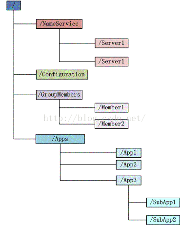 </div><br>

#### 5.Zookeeper通知机制

client端会对某个znode建立一个**watcher事件**，当该znode发生变化时，这些client会收到zk的通知，然后client可以根据znode变化来做出业务上的改变等。

#### 6.Zookeeper做了什么？

##### 1、命名服务（文件系统）

​	命名服务是指通过指定的名字来**获取资源**或者**服务的地址**，利用zk创建一个全局的路径，即是**唯一**的路径，这个路径就可以作为一个名字，指向集群中的集群，提供的服务的地址，或者一个远程的对象等等。

##### 2、配置管理

​	程序分布式的部署在不同的机器上，将程序的配置信息放在zk的**znode**下，当有配置发生改变时，也就是znode发生变化时，可以通过改变zk中某个目录节点的内容，利用**watcher**通知给各个客户端，从而更改配置。

##### 3、集群管理（文件系统、通知机制）

​	所谓集群管理无在乎两点：**是否有机器退出和加入、选举master**。 
​	对于第一点，所有机器约定在父目录下**创建临时目录节点**，然后监听父目录节点的子节点变化消息。一旦有机器挂掉，该机器与 zookeeper的连接断开，其所创建的临时目录节点被删除，**所有其他机器都收到通知：某个兄弟目录被删除**，于是，所有人都知道：它上船了。
​	新机器加入也是类似，**所有机器收到通知：新兄弟目录加入**，highcount又有了，对于第二点，我们稍微改变一下，**所有机器创建临时顺序编号目录节点，每次选取编号最小的机器作为master就好**。	

##### 4、分布式锁（文件系统、通知机制）

​	有了zookeeper的一致性文件系统，锁的问题变得容易。锁服务可以分为两类，一个是**保持独占**，另一个是**控制时序**。 
​	对于第一类，我们将zookeeper上的一个**znode看作是一把锁**，通过createznode的方式来实现。所有客户端都去创建 /distribute_lock 节点，最终成功创建的那个客户端也即拥有了这把锁。用完删除掉自己创建的distribute_lock 节点就释放出锁。 
​	对于第二类， /distribute_lock 已经预先存在，所有客户端在它下面创建临时顺序编号目录节点，和选master一样，**编号最小的获得锁**，用完删除，依次方便。

<div align="center">  </div><br>

在获取分布式锁的时候在locker节点下创建临时顺序节点，释放锁的时候删除该临时节点。客户端调用createNode方法在locker下创建临时顺序节点，
然后调用getChildren(“locker”)来获取locker下面的所有子节点，注意此时不用设置任何Watcher。客户端获取到所有的子节点path之后，如果发现自己创建的节点在所有创建的子节点序号最小，那么就认为该客户端获取到了锁。如果发现自己创建的节点并非locker所有子节点中最小的，说明自己还没有获取到锁，此时客户端需要找到**比自己小的那个节点**，然后对其调用**exist()**方法，同时对其注册事件监听器。之后，让这个被关注的节点删除，则客户端的Watcher会收到相应通知，此时再次判断自己创建的节点是否是locker子节点中序号最小的，如果是则获取到了锁，如果不是则重复以上步骤继续获取到比自己小的一个节点并注册监听。当前这个过程中还需要许多的逻辑判断。

<div align="center">  </div><br>

代码的实现主要是基于互斥锁，获取分布式锁的重点逻辑在于**BaseDistributedLock**，实现了基于Zookeeper实现分布式锁的细节。

##### 5、队列管理

两种类型的队列：
1、同步队列，当一个队列的成员都聚齐时，这个队列才可用，否则一直等待所有成员到达。 
2、队列按照 FIFO 方式进行入队和出队操作。 
第一类，在约定目录下创建临时目录节点，监听节点数目是否是我们要求的数目。 
第二类，和分布式锁服务中的控制时序场景基本原理一致，入列有编号，出列按编号。在特定的目录下创建**PERSISTENT_SEQUENTIAL**节点，创建成功时**Watcher**通知等待的队列，队列删除**序列号最小的节点**用以消费。此场景下Zookeeper的znode用于消息存储，znode存储的数据就是消息队列中的消息内容，SEQUENTIAL序列号就是消息的编号，按序取出即可。由于创建的节点是持久化的，所以**不必担心队列消息的丢失问题**。

#### 7.Zookeeper数据复制

Zookeeper作为一个集群提供一致的数据服务，自然，它要在**所有机器间**做数据复制。数据复制的好处： 
1、容错：一个节点出错，不致于让整个系统停止工作，别的节点可以接管它的工作； 
2、提高系统的扩展能力 ：把负载分布到多个节点上，或者增加节点来提高系统的负载能力； 
3、提高性能：让**客户端本地访问就近的节点，提高用户访问速度**。

从客户端读写访问的透明度来看，数据复制集群系统分下面两种： 
1、**写主**(WriteMaster) ：对数据的**修改提交给指定的节点**。读无此限制，可以读取任何一个节点。这种情况下客户端需要对读与写进行区别，俗称**读写分离**； 
2、**写任意**(Write Any)：对数据的**修改可提交给任意的节点**，跟读一样。这种情况下，客户端对集群节点的角色与变化透明。

对zookeeper来说，它采用的方式是**写任意**。通过增加机器，它的读吞吐能力和响应能力扩展性非常好，而写，随着机器的增多吞吐能力肯定下降（这也是它建立observer的原因），而响应能力则取决于具体实现方式，是**延迟复制保持最终一致性**，还是**立即复制快速响应**。

#### 8.Zookeeper工作原理

Zookeeper 的核心是**原子广播**，这个机制保证了**各个Server之间的同步**。实现这个机制的协议叫做**Zab协议**。Zab协议有两种模式，它们分别是**恢复模式（选主）**和**广播模式（同步）**。当服务启动或者在领导者崩溃后，Zab就进入了恢复模式，当领导者被选举出来，且大多数Server完成了和 leader的状态同步以后，恢复模式就结束了。状态同步保证了leader和Server具有相同的系统状态。

#### 9.zookeeper是如何保证事务的顺序一致性的？

zookeeper采用了**递增的事务Id**来标识，所有的proposal（提议）都在被提出的时候加上了zxid，zxid实际上是一个64位的数字，高32位是epoch（时期; 纪元; 世; 新时代）用来标识leader是否发生改变，如果有新的leader产生出来，epoch会自增，**低32位用来递增计数**。当新产生proposal的时候，会依据数据库的两阶段过程，首先会向其他的server发出事务执行请求，如果超过半数的机器都能执行并且能够成功，那么就会开始执行。

#### 10.Zookeeper 下 Server工作状态

每个Server在工作过程中有三种状态： 
LOOKING：当前Server**不知道leader是谁**，正在搜寻
LEADING：当前Server即为选举出来的leader
FOLLOWING：leader已经选举出来，当前Server与之同步

#### 11.zookeeper是如何选取主leader的？

当leader崩溃或者leader失去大多数的follower，这时zk进入恢复模式，恢复模式需要重新选举出一个新的leader，让所有的Server都恢复到一个正确的状态。Zk的选举算法有两种：一种是基于basic paxos实现的，另外一种是基于fast paxos算法实现的。系统默认的选举算法为**fast paxos**。

1、Zookeeper选主流程(basic paxos)
（1）选举线程由当前Server发起选举的线程担任，其主要功能是对投票结果进行统计，并选出推荐的Server； 
（2）选举线程首先向所有Server发起一次询问(包括自己)； 
（3）选举线程收到回复后，验证是否是自己发起的询问(验证zxid是否一致)，然后获取对方的id(myid)，并存储到当前询问对象列表中，最后获取对方提议的leader相关信息(id,zxid)，并将这些信息存储到当次选举的投票记录表中； 
（4）收到所有Server回复以后，就计算出zxid最大的那个Server，并将这个Server相关信息设置成下一次要投票的Server； 
（5）线程将当前zxid最大的Server设置为当前Server要推荐的Leader，如果此时获胜的Server获得n/2 + 1的Server票数，设置当前推荐的leader为获胜的Server，将根据获胜的Server相关信息设置自己的状态，否则，继续这个过程，直到leader被选举出来。 通过流程分析我们可以得出：要使Leader获得多数Server的支持，则Server总数必须是奇数2n+1，且存活的Server的数目不得少于n+1. 每个Server启动后都会重复以上流程。在恢复模式下，如果是刚从崩溃状态恢复的或者刚启动的server还会从磁盘快照中恢复数据和会话信息，zk会记录事务日志并定期进行快照，方便在恢复时进行状态恢复。

<div align="center">  </div><br>

2、Zookeeper选主流程(basic paxos)
fast paxos流程是在选举过程中，某Server首先向所有Server提议自己要成为leader，当其它Server收到提议以后，解决epoch和 zxid的冲突，并接受对方的提议，然后向对方发送接受提议完成的消息，重复这个流程，最后一定能选举出Leader。

<div align="center">  </div><br>

#### 12.Zookeeper同步流程

选完Leader以后，zk就进入状态同步过程。 
1、Leader等待server连接； 
2、Follower连接leader，将最大的zxid发送给leader； 
3、Leader根据follower的zxid确定同步点； 
4、完成同步后通知follower 已经成为uptodate状态； 
5、Follower收到uptodate消息后，又可以重新接受client的请求进行服务了。

<div align="center">  </div><br>

#### 13.分布式通知和协调

对于系统调度来说：操作人员发送通知实际是通过控制台**改变某个节点的状态**，**然后zk将这些变化发送给注册了这个节点的watcher的所有客户端**。
对于执行情况汇报：每个工作进程都在某个目录下**创建一个临时节点**。**并携带工作的进度数据**，这样**汇总的进程可以监控目录子节点的变化获得工作进度的实时的全局情况**。

#### 14.机器中为什么会有leader？

在分布式环境中，有些业务逻辑只需要集群中的某一台机器进行执行，**其他的机器可以共享这个结果**，这样可以大大**减少重复计算**，**提高性能**，于是就需要进行leader选举。

#### 15.zk节点宕机如何处理？

Zookeeper本身也是集群，推荐配置不少于3个服务器。Zookeeper自身也要保证当一个节点宕机时，其他节点会继续提供服务。
如果是一个Follower宕机，还有2台服务器提供访问，因为Zookeeper上的数据是有多个副本的，数据并不会丢失；
如果是一个Leader宕机，Zookeeper会选举出新的Leader。
ZK集群的机制是只要超过半数的节点正常，集群就能正常提供服务。只有在ZK节点挂得太多，只剩一半或不到一半节点能工作，集群才失效。
所以
3个节点的cluster可以挂掉1个节点(leader可以得到2票>1.5)
2个节点的cluster就不能挂掉任何1个节点了(leader可以得到1票<=1)

#### 16.zookeeper负载均衡和nginx负载均衡区别

zk的负载均衡是可以调控，nginx只是能调权重，其他需要可控的都需要自己写插件；但是nginx的吞吐量比zk大很多，应该说按业务选择用哪种方式。

#### 17.zookeeper watch机制

Watch机制官方声明：一个Watch事件是一个一次性的触发器，当被设置了Watch的数据发生了改变的时候，则服务器将这个改变发送给设置了Watch的客户端，以便通知它们。
Zookeeper机制的特点：
1、一次性触发数据发生改变时，一个watcher event会被发送到client，但是client**只会收到一次这样的信息**。
2、watcher event异步发送watcher的通知事件从server发送到client是**异步**的，这就存在一个问题，不同的客户端和服务器之间通过socket进行通信，由于**网络延迟或其他因素导致客户端在不通的时刻监听到事件**，由于Zookeeper本身提供了**ordering guarantee，即客户端监听事件后，才会感知它所监视znode发生了变化**。所以我们使用Zookeeper不能期望能够监控到节点每次的变化。Zookeeper**只能保证最终的一致性，而无法保证强一致性**。
3、数据监视Zookeeper有数据监视和子数据监视getdata() and exists()设置数据监视，getchildren()设置了子节点监视。
4、注册watcher **getData、exists、getChildren**
5、触发watcher **create、delete、setData**
6、**setData()**会触发znode上设置的data watch（如果set成功的话）。一个成功的**create()** 操作会触发被创建的znode上的数据watch，以及其父节点上的child watch。而一个成功的**delete()**操作将会同时触发一个znode的data watch和child watch（因为这样就没有子节点了），同时也会触发其父节点的child watch。
7、当一个客户端**连接到一个新的服务器上**时，watch将会被以任意会话事件触发。当**与一个服务器失去连接**的时候，是无法接收到watch的。而当client**重新连接**时，如果需要的话，所有先前注册过的watch，都会被重新注册。通常这是完全透明的。只有在一个特殊情况下，**watch可能会丢失**：对于一个未创建的znode的exist watch，如果在客户端断开连接期间被创建了，并且随后在客户端连接上之前又删除了，这种情况下，这个watch事件可能会被丢失。
8、Watch是轻量级的，其实就是本地JVM的**Callback**，服务器端只是存了是否有设置了Watcher的布尔类型

### 3、Netty

https://juejin.im/post/5bdaf8ea6fb9a0227b02275a

#### NIO

上面是一个传统处理http的服务器，但是在高并发的环境下，线程数量会比较多，System load也会比较高，于是就有了NIO。

他并不是Java独有的概念，NIO代表的一个词汇叫着IO多路复用。它是由操作系统提供的系统调用，早期这个操作系统调用的名字是select，但是性能低下，后来渐渐演化成了Linux下的epoll和Mac里的kqueue。我们一般就说是epoll，因为没有人拿苹果电脑作为服务器使用对外提供服务。而Netty就是基于Java NIO技术封装的一套框架。为什么要封装，因为原生的Java NIO使用起来没那么方便，而且还有臭名昭著的bug，Netty把它封装之后，提供了一个易于操作的使用模式和接口，用户使用起来也就便捷多了。

说NIO之前先说一下BIO（Blocking IO）,如何理解这个Blocking呢？

1. 客户端监听（Listen）时，Accept是阻塞的，只有新连接来了，Accept才会返回，主线程才能继
2. 读写socket时，Read是阻塞的，只有请求消息来了，Read才能返回，子线程才能继续处理
3. 读写socket时，Write是阻塞的，只有客户端把消息收了，Write才能返回，子线程才能继续读取下一个请求

传统的BIO模式下，从头到尾的所有线程都是阻塞的，这些线程就干等着，占用系统的资源，什么事也不干。

那么NIO是怎么做到非阻塞的呢。它用的是事件机制。它可以用一个线程把Accept，读写操作，请求处理的逻辑全干了。如果什么事都没得做，它也不会死循环，它会将线程休眠起来，直到下一个事件来了再继续干活，这样的一个线程称之为NIO线程。用伪代码表示：

```java
while true {
    events = takeEvents(fds)  // 获取事件，如果没有事件，线程就休眠
    for event in events {
        if event.isAcceptable {
            doAccept() // 新链接来了
        } elif event.isReadable {
            request = doRead() // 读消息
            if request.isComplete() {
                doProcess()
            }
        } elif event.isWriteable {
            doWrite()  // 写消息
        }
    }
}
```

Netty能够受到青睐的原因有三：

1. **并发高**
2. **传输快**
3. **封装好**

#### Netty为什么并发高

​	Netty是一款基于NIO（Nonblocking I/O，非阻塞IO）开发的网络通信框架，对比于BIO（Blocking I/O，阻塞IO），他的并发性能得到了很大提高，两张图让你了解BIO和NIO的区别：

**BIO**

<div align="center">  </div><br>

<div align="center">  </div><br>

​	从这两图可以看出，NIO的单线程能处理连接的数量比BIO要高出很多，而为什么单线程能处理更多的连接呢？原因就是图二中出现的`Selector`。
 	当一个连接建立之后，他有两个步骤要做，第一步是接收完客户端发过来的全部数据，第二步是服务端处理完请求业务之后返回response给客户端。NIO和BIO的区别主要是在第一步。
 在BIO中，等待客户端发数据这个过程是阻塞的，这样就造成了一个线程只能处理一个请求的情况，而机器能支持的最大线程数是有限的，这就是为什么BIO不能支持高并发的原因。
 	而NIO中，当一个Socket建立好之后，Thread并不会阻塞去接受这个Socket，而是将这个请求交给Selector，Selector会不断的去遍历所有的Socket，一旦有一个Socket建立完成，他会通知Thread，然后Thread处理完数据再返回给客户端——*这个过程是阻塞的*，这样就能让一个Thread处理更多的请求了。

#### 零拷贝

##### 传统意义的拷贝

是在发送数据的时候，传统的实现方式是：

1. `File.read(bytes)`

2. `Socket.send(bytes)`

   这种方式需要四次数据拷贝和四次上下文切换：

3. 数据从磁盘读取到内核的read buffer

4. 数据从内核缓冲区拷贝到用户缓冲区

5. 数据从用户缓冲区拷贝到内核的socket buffer

6. 数据从内核的socket buffer拷贝到网卡接口（硬件）的缓冲区

<div align="center"> 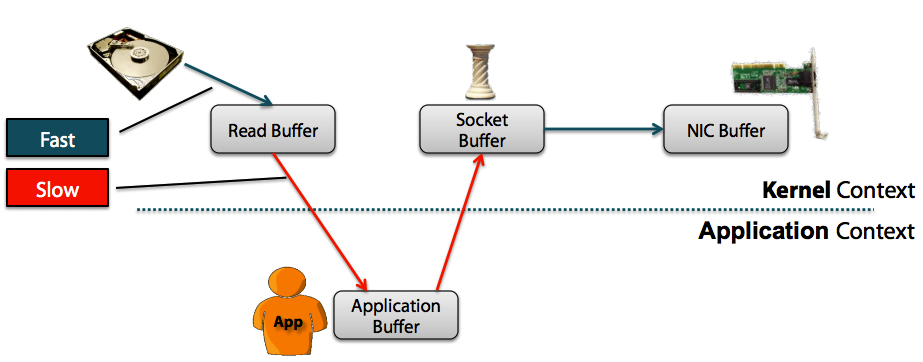 </div><br>

##### 零拷贝的概念

明显上面的第二步和第三步是没有必要的，通过java的FileChannel.transferTo方法，可以避免上面两次多余的拷贝（当然这需要底层操作系统支持）

1. 调用transferTo,数据从文件由DMA引擎拷贝到内核read buffer
2. 接着DMA从内核read buffer将数据拷贝到网卡接口buffer

上面的两次操作都不需要CPU参与，所以就达到了零拷贝。

<div align="center"> 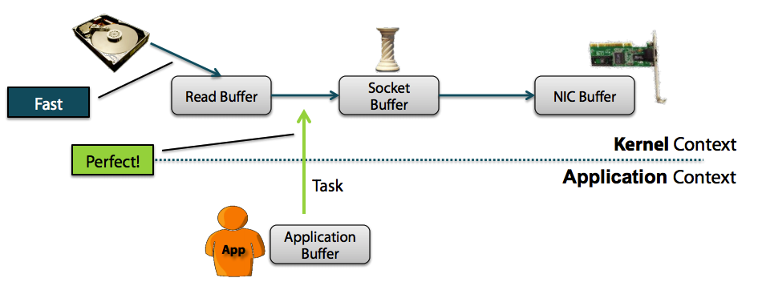 </div><br>

##### Netty中的零拷贝

主要体现在三个方面：

**1、bytebuffer**

Netty发送和接收消息主要使用bytebuffer，bytebuffer使用对外内存（DirectMemory）直接进行Socket读写。

原因：如果使用传统的堆内存进行Socket读写，JVM会将堆内存buffer拷贝一份到直接内存中然后再写入socket，多了一次缓冲区的内存拷贝。DirectMemory中可以直接通过DMA发送到网卡接口

**2、Composite Buffers**

传统的ByteBuffer，如果需要将两个ByteBuffer中的数据组合到一起，我们需要首先创建一个size=size1+size2大小的新的数组，然后将两个数组中的数据拷贝到新的数组中。但是使用Netty提供的组合ByteBuf，就可以避免这样的操作，因为CompositeByteBuf并没有真正将多个Buffer组合起来，而是保存了它们的引用，从而避免了数据的拷贝，实现了零拷贝。

**3、对于FileChannel.transferTo的使用**

Netty中使用了FileChannel的transferTo方法，该方法依赖于操作系统实现零拷贝。

#### 什么是TCP 粘包/拆包

##### 现象

先看如下代码，这个代码是使用netty在client端重复写100次数据给server端，ByteBuf是netty的一个字节容器，里面存放是的需要发送的数据

```java
public class FirstClientHandler extends ChannelInboundHandlerAdapter {    
    @Override    
    public void channelActive(ChannelHandlerContext ctx) {       
        for (int i = 0; i < 1000; i++) {            
            ByteBuf buffer = getByteBuf(ctx);            
            ctx.channel().writeAndFlush(buffer);        
        }    
    }    
    private ByteBuf getByteBuf(ChannelHandlerContext ctx) {        
        byte[] bytes = "你好，我的名字是1234567!".getBytes(Charset.forName("utf-8"));        
        ByteBuf buffer = ctx.alloc().buffer();        
        buffer.writeBytes(bytes);        
        return buffer;    
    }
}复制代码
```

从client端读取到的数据为：

<div align="center"> 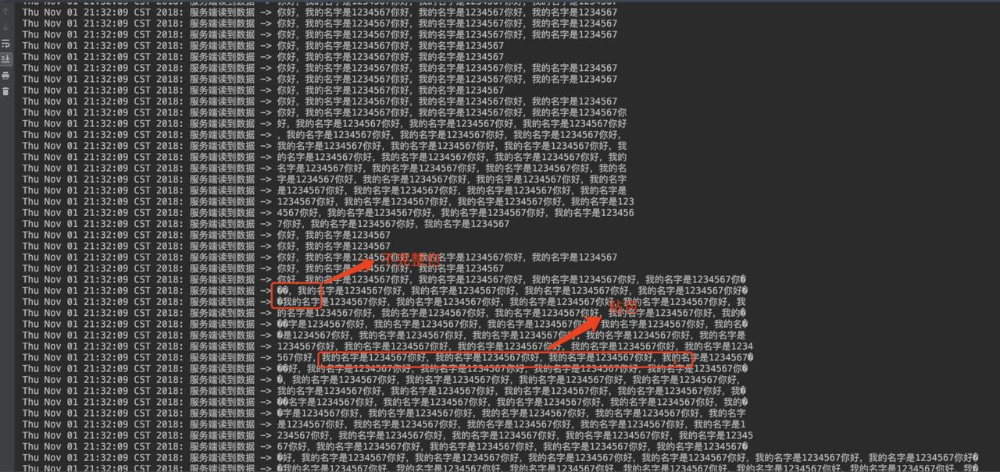 </div><br/>

从服务端的控制台输出可以看出，存在三种类型的输出

1. 一种是正常的字符串输出。
2. 一种是多个字符串“粘”在了一起，我们定义这种 ByteBuf 为粘包。
3. 一种是一个字符串被“拆”开，形成一个破碎的包，我们定义这种 ByteBuf 为半包。

##### 透过现象分析原因

​	应用层面使用了Netty，但是对于操作系统来说，只认TCP协议，尽管我们的应用层是按照 ByteBuf 为 单位来发送数据，server按照Bytebuf读取，但是到了底层操作系统仍然是按照字节流发送数据，因此，数据到了服务端，也是按照字节流的方式读入，然后到了 Netty 应用层面，重新拼装成 ByteBuf，而这里的 ByteBuf 与客户端按顺序发送的 ByteBuf 可能是不对等的。因此，我们需要在客户端根据自定义协议来组装我们应用层的数据包，然后在服务端根据我们的应用层的协议来组装数据包，这个过程通常在服务端称为拆包，而在客户端称为粘包。 

​	拆包和粘包是相对的，一端粘了包，另外一端就需要将粘过的包拆开，发送端将三个数据包粘成两个 TCP 数据包发送到接收端，接收端就需要根据应用协议将两个数据包重新组装成三个数据包。

##### 如何解决

​	在没有 Netty 的情况下，用户如果自己需要拆包，基本原理就是不断从 TCP 缓冲区中读取数据，每次读取完都需要判断是否是一个完整的数据包 如果当前读取的数据不足以拼接成一个完整的业务数据包，那就保留该数据，继续从 TCP 缓冲区中读取，直到得到一个完整的数据包。 如果当前读到的数据加上已经读取的数据足够拼接成一个数据包，那就将已经读取的数据拼接上本次读取的数据，构成一个完整的业务数据包传递到业务逻辑，多余的数据仍然保留，以便和下次读到的数据尝试拼接。 

而在Netty中，已经造好了许多类型的拆包器，我们直接用就好：

<div align="center">  </div><br/>

选好拆包器后，在代码中client段和server端将拆包器加入到chanelPipeline之中就好了:

如上实例中：

客户端：

```java
ch.pipeline().addLast(new FixedLengthFrameDecoder(31));复制代码
```

服务端：

```java
ch.pipeline().addLast(new FixedLengthFrameDecoder(31));复制代码
```

<div align="center"> 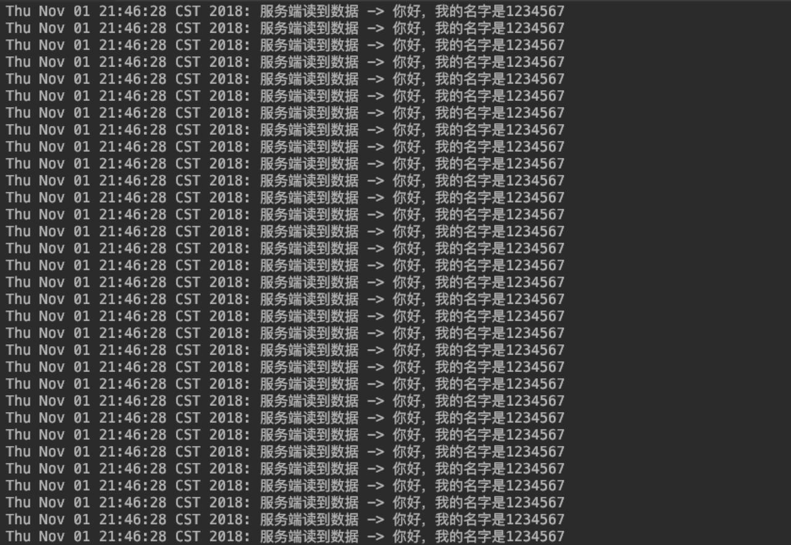 </div><br/

#### 模块组件

**Bootstrap、ServerBootstrap**

Bootstrap  意思是引导，一个 Netty 应用通常由一个 Bootstrap 开始，主要作用是配置整个 Netty 程序，串联各个组件，Netty 中  Bootstrap 类是客户端程序的启动引导类，ServerBootstrap 是服务端启动引导类。

**Future、ChannelFuture**

正如前面介绍，在 Netty 中所有的 IO 操作都是异步的，不能立刻得知消息是否被正确处理。

但是可以过一会等它执行完成或者直接注册一个监听，具体的实现就是通过 Future 和 ChannelFutures，他们可以注册一个监听，当操作执行成功或失败时监听会自动触发注册的监听事件。

**Channel**

Netty 网络通信的组件，能够用于执行网络 I/O 操作。Channel 为用户提供：

- 当前网络连接的通道的状态（例如是否打开？是否已连接？）
- 网络连接的配置参数 （例如接收缓冲区大小）
- 提供异步的网络 I/O 操作(如建立连接，读写，绑定端口)，异步调用意味着任何 I/O  调用都将立即返回，并且不保证在调用结束时所请求的 I/O 操作已完成。 调用立即返回一个 ChannelFuture 实例，通过注册监听器到  ChannelFuture 上，可以 I/O 操作成功、失败或取消时回调通知调用方。
- 支持关联 I/O 操作与对应的处理程序。

不同协议、不同的阻塞类型的连接都有不同的 Channel 类型与之对应。下面是一些常用的 Channel 类型：

- NioSocketChannel，异步的客户端 TCP Socket 连接。
- NioServerSocketChannel，异步的服务器端 TCP Socket 连接。
- NioDatagramChannel，异步的 UDP 连接。
- NioSctpChannel，异步的客户端 Sctp 连接。
- NioSctpServerChannel，异步的 Sctp 服务器端连接，这些通道涵盖了 UDP 和 TCP 网络 IO 以及文件 IO。

**Selector**

Netty 基于 Selector 对象实现 I/O 多路复用，通过 Selector 一个线程可以监听多个连接的 Channel 事件。

当向一个 Selector 中注册 Channel 后，Selector 内部的机制就可以自动不断地查询(Select) 这些注册的 Channel 是否有已就绪的 I/O 事件（例如可读，可写，网络连接完成等），这样程序就可以很简单地使用一个线程高效地管理多个 Channel 。

**NioEventLoop**

NioEventLoop 中维护了一个线程和任务队列，支持异步提交执行任务，线程启动时会调用 NioEventLoop 的 run 方法，执行 I/O 任务和非 I/O 任务：

- I/O 任务，即 selectionKey 中 ready 的事件，如 accept、connect、read、write 等，由 processSelectedKeys 方法触发。
- 非 IO 任务，添加到 taskQueue 中的任务，如 register0、bind0 等任务，由 runAllTasks 方法触发。

两种任务的执行时间比由变量 ioRatio 控制，默认为 50，则表示允许非 IO 任务执行的时间与 IO 任务的执行时间相等。

**NioEventLoopGroup**

NioEventLoopGroup，主要管理 eventLoop 的生命周期，可以理解为一个线程池，内部维护了一组线程，每个线程(NioEventLoop)负责处理多个 Channel 上的事件，而一个 Channel 只对应于一个线程。

**ChannelHandler**

ChannelHandler 是一个接口，处理 I/O 事件或拦截 I/O 操作，并将其转发到其 ChannelPipeline(业务处理链)中的下一个处理程序。

ChannelHandler 本身并没有提供很多方法，因为这个接口有许多的方法需要实现，方便使用期间，可以继承它的子类：

- ChannelInboundHandler 用于处理入站 I/O 事件。
- ChannelOutboundHandler 用于处理出站 I/O 操作。

或者使用以下适配器类：

- ChannelInboundHandlerAdapter 用于处理入站 I/O 事件。
- ChannelOutboundHandlerAdapter 用于处理出站 I/O 操作。
- ChannelDuplexHandler 用于处理入站和出站事件。

**ChannelHandlerContext**

保存 Channel 相关的所有上下文信息，同时关联一个 ChannelHandler 对象。

**ChannelPipline**

保存 ChannelHandler 的 List，用于处理或拦截 Channel 的入站事件和出站操作。

ChannelPipeline 实现了一种高级形式的拦截过滤器模式，使用户可以完全控制事件的处理方式，以及 Channel 中各个的 ChannelHandler 如何相互交互。

下图引用 Netty 的 Javadoc 4.1 中 ChannelPipeline 的说明，描述了 ChannelPipeline 中 ChannelHandler 通常如何处理 I/O 事件。

I/O 事件由 ChannelInboundHandler 或 ChannelOutboundHandler 处理，并通过调用 ChannelHandlerContext 中定义的事件传播方法。

例如 ChannelHandlerContext.fireChannelRead（Object）和 ChannelOutboundInvoker.write（Object）转发到其最近的处理程序。

<div align="center">  </div><br/>

​	入站事件由自下而上方向的入站处理程序处理，如图左侧所示。入站 Handler 处理程序通常处理由图底部的 I/O 线程生成的入站数据。

​	通常通过实际输入操作（例如 SocketChannel.read（ByteBuffer））从远程读取入站数据。

​	出站事件由上下方向处理，如图右侧所示。出站 Handler 处理程序通常会生成或转换出站传输，例如 write 请求。

​	I/O 线程通常执行实际的输出操作，例如 SocketChannel.write（ByteBuffer）。

​	在 Netty 中每个 Channel 都有且仅有一个 ChannelPipeline 与之对应，它们的组成关系如下：

<div align="center">  </div><br/>

​	一个Channel  包含了一个 ChannelPipeline，而 ChannelPipeline 中又维护了一个由 ChannelHandlerContext  组成的双向链表，并且每个 ChannelHandlerContext 中又关联着一个 ChannelHandler。

​	入站事件和出站事件在一个双向链表中，入站事件会从链表 head 往后传递到最后一个入站的 handler，出站事件会从链表 tail 往前传递到最前一个出站的 handler，两种类型的 handler 互不干扰。

#### 一、Netty框架的工作原理

```java
public static void main(String[] args) {
	// 创建mainReactor
	NioEventLoopGroup boosGroup = newNioEventLoopGroup();
	// 创建工作线程组
	NioEventLoopGroup workerGroup = newNioEventLoopGroup();

	finalServerBootstrap serverBootstrap = newServerBootstrap();
	serverBootstrap
	// 组装NioEventLoopGroup
	.group(boosGroup, workerGroup)
	// 设置channel类型为NIO类型
	.channel(NioServerSocketChannel.class)
	// 设置连接配置参数
	.option(ChannelOption.SO_BACKLOG, 1024)
	.childOption(ChannelOption.SO_KEEPALIVE, true)
	.childOption(ChannelOption.TCP_NODELAY, true)
	// 配置入站、出站事件handler
	.childHandler(newChannelInitializer<NioSocketChannel>() {
		@Override
		protected void initChannel(NioSocketChannel ch) {
			// 配置入站、出站事件channel
			ch.pipeline().addLast(...);
			ch.pipeline().addLast(...);
		}
	});

	// 绑定端口
	intport = 8080;
	serverBootstrap.bind(port).addListener(future -> {
        if(future.isSuccess()) {
            System.out.println(newDate() + ": 端口["+ port + "]绑定成功!");
        } else{
            System.err.println("端口["+ port + "]绑定失败!");
        }
	});
}
```

**基本过程描述如下：**

1. 初始化创建 2 个 NioEventLoopGroup：其中 boosGroup 用于 Accetpt 连接建立事件并分发请求，workerGroup 用于处理 I/O 读写事件和业务逻辑。
2. 基于 ServerBootstrap(服务端启动引导类)：配置 EventLoopGroup、Channel 类型，连接参数、配置入站、出站事件 handler。
3. 绑定端口：开始工作。

#### 二、Netty线程模型- Reactor 模型

**一个NIO线程+一个accept线程：**

<div align="center"> 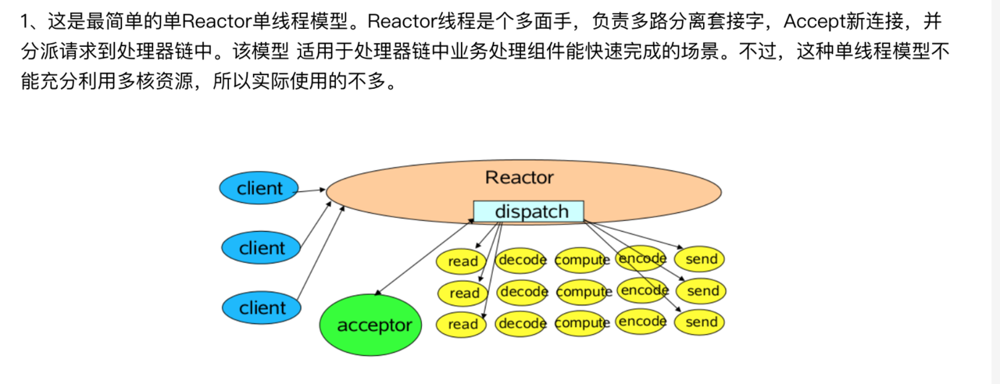 </div><br>


**Reactor多线程模型**

<div align="center">  </div><br>

**Reactor主从模型**

<div align="center"> 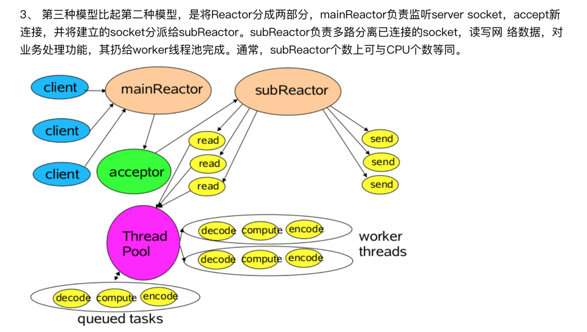 </div><br>

**Netty-Reactor主从模型详解**

<div align="center">  </div><br>

Server 端包含 1 个 Boss NioEventLoopGroup 和 1 个 Worker NioEventLoopGroup。

NioEventLoopGroup 相当于 1 个事件循环组，这个组里包含多个事件循环 NioEventLoop，每个 NioEventLoop 包含 1 个 Selector 和 1 个事件循环线程。

**每个 Boss NioEventLoop 循环执行的任务包含 3 步：**

1. 轮询 Accept 事件；
2. 处理 Accept I/O 事件，与 Client 建立连接，生成 NioSocketChannel，并将 NioSocketChannel 注册到某个 Worker NioEventLoop 的 Selector 上；
3. 处理任务队列中的任务，runAllTasks。任务队列中的任务包括用户调用 eventloop.execute 或 schedule 执行的任务，或者其他线程提交到该 eventloop 的任务。

**每个 Worker NioEventLoop 循环执行的任务包含 3 步：**

1. 轮询 Read、Write 事件；
2. 处理 I/O 事件，即 Read、Write 事件，在 NioSocketChannel 可读、可写事件发生时进行处理；
3. 处理任务队列中的任务，runAllTasks。

### 4、Jmq、Ump

https://www.jianshu.com/p/689ce4205021

https://tech.meituan.com/2016/07/01/mq-design.html

我们来看一个最简单的架构模型：

[](https://github.com/jasonGeng88/blog/blob/master/201705/assets/mq_01.png)

- Producer：消息生产者，负责产生和发送消息到 Broker；
- Broker：消息处理中心。负责消息存储、确认、重试等，一般其中会包含多个 queue；
- Consumer：消息消费者，负责从 Broker 中获取消息，并进行相应处理；

#### 为什么使用消息队列

其实就是问问你消息队列都有哪些使用场景，然后你项目里具体是什么场景，说说你在这个场景里用消息队列是什么？

面试官问你这个问题，**期望的一个回答**是说，你们公司有个什么**业务场景**，这个业务场景有个什么技术挑战，如果不用 MQ 可能会很麻烦，但是你现在用了 MQ 之后带给了你很多的好处。

先说一下消息队列常见的使用场景吧，其实场景有很多，但是比较核心的有 3 个：**解耦**、**异步**、**削峰**。

##### 解耦

看这么个场景。A 系统发送数据到 BCD 三个系统，通过接口调用发送。如果 E 系统也要这个数据呢？那如果 C 系统现在不需要了呢？A 系统负责人几乎崩溃......

[](https://github.com/Fi-Null/advanced-java/blob/master/images/mq-1.png)

在这个场景中，A 系统跟其它各种乱七八糟的系统严重耦合，A 系统产生一条比较关键的数据，很多系统都需要 A 系统将这个数据发送过来。A 系统要时时刻刻考虑 BCDE 四个系统如果挂了该咋办？要不要重发，要不要把消息存起来？头发都白了啊！

如果使用 MQ，A 系统产生一条数据，发送到 MQ 里面去，哪个系统需要数据自己去 MQ 里面消费。如果新系统需要数据，直接从 MQ 里消费即可；如果某个系统不需要这条数据了，就取消对 MQ 消息的消费即可。这样下来，A 系统压根儿不需要去考虑要给谁发送数据，不需要维护这个代码，也不需要考虑人家是否调用成功、失败超时等情况。

[](https://github.com/Fi-Null/advanced-java/blob/master/images/mq-2.png)

**总结**：通过一个 MQ，Pub/Sub 发布订阅消息这么一个模型，A 系统就跟其它系统彻底解耦了。

**面试技巧**：你需要去考虑一下你负责的系统中是否有类似的场景，就是一个系统或者一个模块，调用了多个系统或者模块，互相之间的调用很复杂，维护起来很麻烦。但是其实这个调用是不需要直接同步调用接口的，如果用 MQ 给它异步化解耦，也是可以的，你就需要去考虑在你的项目里，是不是可以运用这个 MQ 去进行系统的解耦。在简历中体现出来这块东西，用 MQ 作解耦。

##### 异步

再来看一个场景，A 系统接收一个请求，需要在自己本地写库，还需要在 BCD 三个系统写库，自己本地写库要 3ms，BCD 三个系统分别写库要 300ms、450ms、200ms。最终请求总延时是 3 + 300 + 450 + 200 = 953ms，接近 1s，用户感觉搞个什么东西，慢死了慢死了。用户通过浏览器发起请求，等待个 1s，这几乎是不可接受的。

[](https://github.com/Fi-Null/advanced-java/blob/master/images/mq-3.png)

一般互联网类的企业，对于用户直接的操作，一般要求是每个请求都必须在 200 ms 以内完成，对用户几乎是无感知的。

如果**使用 MQ**，那么 A 系统连续发送 3 条消息到 MQ 队列中，假如耗时 5ms，A 系统从接受一个请求到返回响应给用户，总时长是 3 + 5 = 8ms，对于用户而言，其实感觉上就是点个按钮，8ms 以后就直接返回了，爽！网站做得真好，真快！

[](https://github.com/Fi-Null/advanced-java/blob/master/images/mq-4.png)

##### 削峰

每天 0:00 到 12:00，A 系统风平浪静，每秒并发请求数量就 50 个。结果每次一到 12:00 ~ 13:00 ，每秒并发请求数量突然会暴增到 5k+ 条。但是系统是直接基于 MySQL 的，大量的请求涌入 MySQL，每秒钟对 MySQL 执行约 5k 条 SQL。

一般的 MySQL，扛到每秒 2k 个请求就差不多了，如果每秒请求到 5k 的话，可能就直接把 MySQL 给打死了，导致系统崩溃，用户也就没法再使用系统了。

但是高峰期一过，到了下午的时候，就成了低峰期，可能也就 1w 的用户同时在网站上操作，每秒中的请求数量可能也就 50 个请求，对整个系统几乎没有任何的压力。

[](https://github.com/Fi-Null/advanced-java/blob/master/images/mq-5.png)

如果使用 MQ，每秒 5k 个请求写入 MQ，A 系统每秒钟最多处理 2k 个请求，因为 MySQL 每秒钟最多处理 2k 个。A 系统从 MQ 中慢慢拉取请求，每秒钟就拉取 2k 个请求，不要超过自己每秒能处理的最大请求数量就 ok，这样下来，哪怕是高峰期的时候，A 系统也绝对不会挂掉。而 MQ 每秒钟 5k 个请求进来，就 2k 个请求出去，结果就导致在中午高峰期（1 个小时），可能有几十万甚至几百万的请求积压在 MQ 中。

[](https://github.com/Fi-Null/advanced-java/blob/master/images/mq-6.png)

这个短暂的高峰期积压是 ok 的，因为高峰期过了之后，每秒钟就 50 个请求进 MQ，但是 A 系统依然会按照每秒 2k 个请求的速度在处理。所以说，只要高峰期一过，A 系统就会快速将积压的消息给解决掉。

##### 消息通讯

https://cloud.tencent.com/developer/article/1006035

消息队列包括两种模式，点对点模式（point to point， queue）和发布/订阅模式（publish/subscribe，topic）。

###### 3.1 点对点模式

点对点模式下包括三个角色：

- 消息队列
- 发送者 (生产者)
- 接收者（消费者）


消息发送者生产消息发送到queue中，然后消息接收者从queue中取出并且消费消息。消息被消费以后，queue中不再有存储，所以消息接收者不可能消费到已经被消费的消息。

点对点模式特点：

- 每个消息只有一个接收者（Consumer）(即一旦被消费，消息就不再在消息队列中)；
- 发送者和接收者间没有依赖性，发送者发送消息之后，不管有没有接收者在运行，都不会影响到发送者下次发送消息；
- 接收者在成功接收消息之后需向队列应答成功，以便消息队列删除当前接收的消息；

###### 3.2 发布/订阅模式

发布/订阅模式下包括三个角色：

- 角色主题（Topic）
- 发布者(Publisher)
- 订阅者(Subscriber)


发布者将消息发送到Topic,系统将这些消息传递给多个订阅者。

发布/订阅模式特点：

- 每个消息可以有多个订阅者；
- 发布者和订阅者之间有时间上的依赖性。针对某个主题（Topic）的订阅者，它必须创建一个订阅者之后，才能消费发布者的消息。
- 为了消费消息，订阅者需要提前订阅该角色主题，并保持在线运行；

##### 消息队列有什么优缺点

优点上面已经说了，就是**在特殊场景下有其对应的好处**，**解耦**、**异步**、**削峰**。

缺点有以下几个：

- 系统可用性降低
  系统引入的外部依赖越多，越容易挂掉。本来你就是 A 系统调用 BCD 三个系统的接口就好了，人 ABCD 四个系统好好的，没啥问题，你偏加个 MQ 进来，万一 MQ 挂了咋整，MQ 一挂，整套系统崩溃的，你不就完了？如何保证消息队列的高可用，可以[点击这里查看](https://github.com/Fi-Null/advanced-java/blob/master/docs/high-concurrency/how-to-ensure-high-availability-of-message-queues.md)。
- 系统复杂度提高
  硬生生加个 MQ 进来，你怎么[保证消息没有重复消费](https://github.com/Fi-Null/advanced-java/blob/master/docs/high-concurrency/how-to-ensure-that-messages-are-not-repeatedly-consumed.md)？怎么[处理消息丢失的情况](https://github.com/Fi-Null/advanced-java/blob/master/docs/high-concurrency/how-to-ensure-the-reliable-transmission-of-messages.md)？怎么保证消息传递的顺序性？头大头大，问题一大堆，痛苦不已。
- 一致性问题
  A 系统处理完了直接返回成功了，人都以为你这个请求就成功了；但是问题是，要是 BCD 三个系统那里，BD 两个系统写库成功了，结果 C 系统写库失败了，咋整？你这数据就不一致了。

所以消息队列实际是一种非常复杂的架构，你引入它有很多好处，但是也得针对它带来的坏处做各种额外的技术方案和架构来规避掉，做好之后，你会发现，妈呀，系统复杂度提升了一个数量级，也许是复杂了 10 倍。但是关键时刻，用，还是得用的。

#### 如何保证消息队列的高可用？

##### Kafka 的高可用性

Kafka 一个最基本的架构认识：由多个 broker 组成，每个 broker 是一个节点；你创建一个 topic，这个 topic 可以划分为多个 partition，每个 partition 可以存在于不同的 broker 上，每个 partition 就放一部分数据。

这就是**天然的分布式消息队列**，就是说一个 topic 的数据，是**分散放在多个机器上的，每个机器就放一部分数据**。

实际上 RabbmitMQ 之类的，并不是分布式消息队列，它就是传统的消息队列，只不过提供了一些集群、HA(High Availability, 高可用性) 的机制而已，因为无论怎么玩儿，RabbitMQ 一个 queue 的数据都是放在一个节点里的，镜像集群下，也是每个节点都放这个 queue 的完整数据。

Kafka 0.8 以前，是没有 HA 机制的，就是任何一个 broker 宕机了，那个 broker 上的 partition 就废了，没法写也没法读，没有什么高可用性可言。

比如说，我们假设创建了一个 topic，指定其 partition 数量是 3 个，分别在三台机器上。但是，如果第二台机器宕机了，会导致这个 topic 的 1/3 的数据就丢了，因此这个是做不到高可用的。

[](https://github.com/Fi-Null/advanced-java/blob/master/images/kafka-before.png)

Kafka 0.8 以后，提供了 HA 机制，就是 replica（复制品） 副本机制。每个 partition 的数据都会同步到其它机器上，形成自己的多个 replica 副本。所有 replica 会选举一个 leader 出来，那么生产和消费都跟这个 leader 打交道，然后其他 replica 就是 follower。写的时候，leader 会负责把数据同步到所有 follower 上去，读的时候就直接读 leader 上的数据即可。只能读写 leader？很简单，**要是你可以随意读写每个 follower，那么就要 care 数据一致性的问题**，系统复杂度太高，很容易出问题。Kafka 会均匀地将一个 partition 的所有 replica 分布在不同的机器上，这样才可以提高容错性。

[](https://github.com/Fi-Null/advanced-java/blob/master/images/kafka-after.png)

这么搞，就有所谓的**高可用性**了，因为如果某个 broker 宕机了，没事儿，那个 broker上面的 partition 在其他机器上都有副本的，如果这上面有某个 partition 的 leader，那么此时会从 follower 中**重新选举**一个新的 leader 出来，大家继续读写那个新的 leader 即可。这就有所谓的高可用性了。

**写数据**的时候，生产者就写 leader，然后 leader 将数据落地写本地磁盘，接着其他 follower 自己主动从 leader 来 pull 数据。一旦所有 follower 同步好数据了，就会发送 ack 给 leader，leader 收到所有 follower 的 ack 之后，就会返回写成功的消息给生产者。（当然，这只是其中一种模式，还可以适当调整这个行为）

**消费**的时候，只会从 leader 去读，但是只有当一个消息已经被所有 follower 都同步成功返回 ack 的时候，这个消息才会被消费者读到。

看到这里，相信你大致明白了 Kafka 是如何保证高可用机制的了，对吧？不至于一无所知，现场还能给面试官画画图。要是遇上面试官确实是 Kafka 高手，深挖了问，那你只能说不好意思，太深入的你没研究过。

#### 如何保证消息不被重复消费？或者说，如何保证消息消费的幂等性？

上文谈到重复消息是不可能100%避免的，除非可以允许丢失，那么，顺序消息能否100%满足呢? 答案是可以，但条件更为苛刻：

1. 允许消息丢失。
2. 从发送方到服务方到接受者都是单点单线程。

所以绝对的顺序消息基本上是不能实现的，当然在METAQ/Kafka等pull模型的消息队列中，单线程生产/消费，排除消息丢失，也是一种顺序消息的解决方案。 一般来讲，一个主流消息队列的设计范式里，应该是不丢消息的前提下，尽量减少重复消息，不保证消息的投递顺序。 谈到重复消息，主要是两个话题：

1. 如何鉴别消息重复，并幂等的处理重复消息。
2. 一个消息队列如何尽量减少重复消息的投递。

先来看看第一个话题，每一个消息应该有它的唯一身份。不管是业务方自定义的，还是根据IP/PID/时间戳生成的MessageId，如果有地方记录这个MessageId，消息到来是能够进行比对就 能完成重复的鉴定。数据库的唯一键/bloom filter/分布式KV中的key，都是不错的选择。由于消息不能被永久存储，所以理论上都存在消息从持久化存储移除的瞬间上游还在投递的可能（上游因种种原因投递失败，不停重试，都到了下游清理消息的时间）。这种事情都是异常情况下才会发生的，毕竟是小众情况。两分钟消息都还没送达，多送一次又能怎样呢？幂等的处理消息是一门艺术，因为种种原因重复消息或者错乱的消息还是来到了，说两种通用的解决方案： 1. 版本号。 2. 状态机。

##### 版本号

举个简单的例子，一个产品的状态有上线/下线状态。如果消息1是下线，消息2是上线。不巧消息1判重失败，被投递了两次，且第二次发生在2之后，如果不做重复性判断，显然最终状态是错误的。 但是，如果每个消息自带一个版本号。上游发送的时候，标记消息1版本号是1，消息2版本号是2。如果再发送下线消息，则版本号标记为3。下游对于每次消息的处理，同时维护一个版本号。 每次只接受比当前版本号大的消息。初始版本为0，当消息1到达时，将版本号更新为1。消息2到来时，因为版本号>1.可以接收，同时更新版本号为2.当另一条下线消息到来时，如果版本号是3.则是真实的下线消息。如果是1，则是重复投递的消息。 如果业务方只关心消息重复不重复，那么问题就已经解决了。但很多时候另一个头疼的问题来了，就是消息顺序如果和想象的顺序不一致。比如应该的顺序是12，到来的顺序是21。则最后会发生状态错误。 参考TCP/IP协议，如果想让乱序的消息最后能够正确的被组织，那么就应该只接收比当前版本号大一的消息。并且在一个session周期内要一直保存各个消息的版本号。 如果到来的顺序是21，则先把2存起来，待1到来后，先处理1，再处理2，这样重复性和顺序性要求就都达到了。

##### 状态机

基于版本号来处理重复和顺序消息听起来是个不错的主意，但凡事总有瑕疵。使用版本号的最大问题是：

1. 对发送方必须要求消息带业务版本号。
2. 下游必须存储消息的版本号，对于要严格保证顺序的。

还不能只存储最新的版本号的消息，要把乱序到来的消息都存储起来。而且必须要对此做出处理。试想一个永不过期的”session”，比如一个物品的状态，会不停流转于上下线。那么中间环节的所有存储 就必须保留，直到在某个版本号之前的版本一个不丢的到来，成本太高。 就刚才的场景看，如果消息没有版本号，该怎么解决呢？业务方只需要自己维护一个状态机，定义各种状态的流转关系。例如，”下线”状态只允许接收”上线”消息，“上线”状态只能接收“下线消息”，如果上线收到上线消息，或者下线收到下线消息，在消息不丢失和上游业务正确的前提下。要么是消息发重了，要么是顺序到达反了。这时消费者只需要把“我不能处理这个消息”告诉投递者，要求投递者过一段时间重发即可。而且重发一定要有次数限制，比如5次，避免死循环，就解决了。 举例子说明，假设产品本身状态是下线，1是上线消息，2是下线消息，3是上线消息，正常情况下，消息应该的到来顺序是123，但实际情况下收到的消息状态变成了3123。 那么下游收到3消息的时候，判断状态机流转是下线->上线，可以接收消息。然后收到消息1，发现是上线->上线，拒绝接收，要求重发。然后收到消息2，状态是上线->下线，于是接收这个消息。 此时无论重发的消息1或者3到来，还是可以接收。另外的重发，在一定次数拒绝后停止重发，业务正确。

所以第二个问题来了，怎么保证消息队列消费的幂等性？

其实还是得结合业务来思考，我这里给几个思路：

- 比如你拿个数据要写库，你先根据主键查一下，如果这数据都有了，你就别插入了，update 一下好吧。
- 比如你是写 Redis，那没问题了，反正每次都是 set，天然幂等性。
- 比如你不是上面两个场景，那做的稍微复杂一点，你需要让生产者发送每条数据的时候，里面加一个全局唯一的 id，类似订单 id 之类的东西，然后你这里消费到了之后，先根据这个 id 去比如 Redis 里查一下，之前消费过吗？如果没有消费过，你就处理，然后这个 id 写 Redis。如果消费过了，那你就别处理了，保证别重复处理相同的消息即可。
- 比如基于数据库的唯一键来保证重复数据不会重复插入多条。因为有唯一键约束了，重复数据插入只会报错，不会导致数据库中出现脏数据。

[](https://github.com/Fi-Null/advanced-java/blob/master/images/mq-11.png)

当然，如何保证 MQ 的消费是幂等性的，需要结合具体的业务来看。

#### 如何保证消息的可靠性传输？或者说，如何处理消息丢失的问题？

这是个激动人心的话题，完全不丢消息，究竟可不可能？答案是，完全可能，前提是消息可能会重复，并且，在异常情况下，要接受消息的延迟。 方案说简单也简单，就是每当要发生不可靠的事情（RPC等）之前，先将消息落地，然后发送。当失败或者不知道成功失败（比如超时）时，消息状态是待发送，定时任务不停轮询所有待发送消息，最终一定可以送达。 具体来说：

1. producer往broker发送消息之前，需要做一次落地。
2. 请求到server后，server确保数据落地后再告诉客户端发送成功。
3. 支持广播的消息队列需要对每个待发送的endpoint，持久化一个发送状态，直到所有endpoint状态都OK才可删除消息。

对于各种不确定（超时、down机、消息没有送达、送达后数据没落地、数据落地了回复没收到），其实对于发送方来说，都是一件事情，就是消息没有送达。 重推消息所面临的问题就是消息重复。重复和丢失就像两个噩梦，你必须要面对一个。好在消息重复还有处理的机会，消息丢失再想找回就难了。 Anyway，作为一个成熟的消息队列，应该尽量在各个环节减少重复投递的可能性，不能因为重复有解决方案就放纵的乱投递。 最后说一句，不是所有的系统都要求最终一致性或者可靠投递，比如一个论坛系统、一个招聘系统。一个重复的简历或话题被发布，可能比丢失了一个发布显得更让用户无法接受。不断重复一句话，任何基础组件要服务于业务场景。

#### 如何解决消息队列的延时以及过期失效问题？消息队列满了以后该怎么处理？有几百万消息持续积压几小时，说说怎么解决？

##### 大量消息在 mq 里积压了几个小时了还没解决

几千万条数据在 MQ 里积压了七八个小时，从下午 4 点多，积压到了晚上 11 点多。这个是我们真实遇到过的一个场景，确实是线上故障了，这个时候要不然就是修复 consumer 的问题，让它恢复消费速度，然后傻傻的等待几个小时消费完毕。这个肯定不能在面试的时候说吧。

一个消费者一秒是 1000 条，一秒 3 个消费者是 3000 条，一分钟就是 18 万条。所以如果你积压了几百万到上千万的数据，即使消费者恢复了，也需要大概 1 小时的时间才能恢复过来。

一般这个时候，只能临时紧急扩容了，具体操作步骤和思路如下：

- 先修复 consumer 的问题，确保其恢复消费速度，然后将现有 consumer 都停掉。
- 新建一个 topic，partition 是原来的 10 倍，临时建立好原先 10 倍的 queue 数量。
- 然后写一个临时的分发数据的 consumer 程序，这个程序部署上去消费积压的数据，**消费之后不做耗时的处理**，直接均匀轮询写入临时建立好的 10 倍数量的 queue。
- 接着临时征用 10 倍的机器来部署 consumer，每一批 consumer 消费一个临时 queue 的数据。这种做法相当于是临时将 queue 资源和 consumer 资源扩大 10 倍，以正常的 10 倍速度来消费数据。
- 等快速消费完积压数据之后，**得恢复原先部署的架构**，**重新**用原先的 consumer 机器来消费消息。

##### mq 中的消息过期失效了

假设你用的是 RabbitMQ，RabbtiMQ 是可以设置过期时间的，也就是 TTL。如果消息在 queue 中积压超过一定的时间就会被 RabbitMQ 给清理掉，这个数据就没了。那这就是第二个坑了。这就不是说数据会大量积压在 mq 里，而是**大量的数据会直接搞丢**。

这个情况下，就不是说要增加 consumer 消费积压的消息，因为实际上没啥积压，而是丢了大量的消息。我们可以采取一个方案，就是**批量重导**，这个我们之前线上也有类似的场景干过。就是大量积压的时候，我们当时就直接丢弃数据了，然后等过了高峰期以后，比如大家一起喝咖啡熬夜到晚上12点以后，用户都睡觉了。这个时候我们就开始写程序，将丢失的那批数据，写个临时程序，一点一点的查出来，然后重新灌入 mq 里面去，把白天丢的数据给他补回来。也只能是这样了。

假设 1 万个订单积压在 mq 里面，没有处理，其中 1000 个订单都丢了，你只能手动写程序把那 1000 个订单给查出来，手动发到 mq 里去再补一次。

##### mq 都快写满了

如果消息积压在 mq 里，你很长时间都没有处理掉，此时导致 mq 都快写满了，咋办？这个还有别的办法吗？没有，谁让你第一个方案执行的太慢了，你临时写程序，接入数据来消费，**消费一个丢弃一个，都不要了**，快速消费掉所有的消息。然后走第二个方案，到了晚上再补数据吧。

#### 如果让你写一个消息队列，该如何进行架构设计？说一下你的思路。

http://youzhixueyuan.com/design-the-message-queue.html

##### [4.1 系统架构图](http://www.xuxueli.com/xxl-mq/#/?id=_41-%e7%b3%bb%e7%bb%9f%e6%9e%b6%e6%9e%84%e5%9b%be)


###### [角色解释:](http://www.xuxueli.com/xxl-mq/#/?id=%e8%a7%92%e8%89%b2%e8%a7%a3%e9%87%8a)

- Message : 消息实体;
- Broker : 消息代理中心, 负责连接Producer和Consumer;
- Topic : 消息主题, 每个消息队列的唯一性标示;
- Topic segment : 消息分段, 同一个Topic的消息队列,将会根据订阅的Consumer进行分片分组,每个Consumer拥有的消息片即一个segment;
- Producer : 消息生产者, 绑定一个消息Topic, 并向该Topic消息队列中生产消息;
- Consumer : 消息消费者, 绑定一个消息Topic, 只能消费该Topic消息队列中的消息;
- Consumer Group : 消费者分组，隔离消息；同一个Topic下一条消息消费一次；

###### [架构图模块解读:](http://www.xuxueli.com/xxl-mq/#/?id=%e6%9e%b6%e6%9e%84%e5%9b%be%e6%a8%a1%e5%9d%97%e8%a7%a3%e8%af%bb)

- Server
  - Broker: 消息代理中心, 系统核心组成模块, 负责接受消息生产者Producer推送生产的消息, 同时负责提供RPC服务供消费者Consumer使用来消费消息;
  - Message Queue: 消息存储模块, 目前底层使用mysql消息表;
- Registry Center
  - Broker Registry Center: Broker注册中心子模块, 供Broker注册RPC服务使用;
  - Consumer Registry Center: Consumer注册中心子模块, 供Consumer注册消费节点使用;
- Client
  - Producer: 消息生产者模块, 负责提供API接口供开发者调用,并生成和发送队列消息;
  - Consumer: 消息消费者模块, 负责订阅消息并消息;

##### [4.2 Message设计](http://www.xuxueli.com/xxl-mq/#/?id=_42-message%e8%ae%be%e8%ae%a1)

| 消息核心属性 | 说明                                                         |
| ------------ | ------------------------------------------------------------ |
| topic        | 消息主题                                                     |
| group        | 消息分组, 分组一致时消息仅消费一次；存在多个分组时，多个分组时【广播消费】； |
| data         | 消息数据                                                     |
| retryCount   | 重试次数, 执行失败且大于0时生效，每重试一次减一；            |
| shardingId   | 分片ID, 大于0时启用，否则使用消息ID；消费者通过该参数进行消息分片消费；分片ID不一致时分片【并发消费】、一致时【串行消费】； |
| timeout      | 超时时间，单位秒；大于0时生效，处于锁定运行状态且运行超时时，将主动标记运行失败； |
| effectTime   | 生效时间, new Date()立即执行, 否则在生效时间点之后开始执行;  |

##### [4.3 Broker设计](http://www.xuxueli.com/xxl-mq/#/?id=_43-broker%e8%ae%be%e8%ae%a1)

Broker(消息代理中心)：系统核心组成模块, 负责接受消息生产者Producer推送生产的消息, 同时负责提供RPC服务供消费者Consumer使用来消费消息；

Broker支持集群部署, 集群节点之间地位平等, 集群部署情况下可大大提高系统的消息吞吐量。

Broker通过内置注册中心实现集群功能, 各节点在启动时会自动注册到注册中心, Producer或Consumer在生产消息或者消费消息时,将会通过内置注册中心自动感知到在线的Broker节点。

Broker在接收到Produce的生产消息的RPC调用时, 并不会立即存储该消息, 而是立即push到内存队列中, 同时立即响应RPC调用。 内存队列将会异步将队列中的消息数据存储到Mysql中。

Broker在接收到 "消息锁定" 等同步RPC调用时, 将会触发同步调用, 采用乐观锁方式锁定消息;

##### [4.4 Registry Center设计](http://www.xuxueli.com/xxl-mq/#/?id=_44-registry-center%e8%ae%be%e8%ae%a1)

Registry Center(注册中心)主要分为两个子模块: Broker注册中心、Consumer注册中心;

- Broker注册中心子模块: 供Broker注册RPC服务使用;
- Consumer注册中心子模块: 供Consumer注册消费节点使用;

##### [4.5 Producer设计](http://www.xuxueli.com/xxl-mq/#/?id=_45-producer%e8%ae%be%e8%ae%a1)

Producer(消息生产者), 兼容“异步批量多线程生产”+“同步生产”两种方式，提升消息发送性能；

底层通讯全异步化：消息新增 + 消息新增接受 + 消息回调 + 消息回调接受；仅批量PULL消息与锁消息非异步；

##### [4.6 Consumer设计](http://www.xuxueli.com/xxl-mq/#/?id=_46-consumer%e8%ae%be%e8%ae%a1)

| MqConsumer注解属性 | 说明                                                         |
| ------------------ | ------------------------------------------------------------ |
| group              | 消息分组；为空时自动赋值UUID多分组【广播消费】；             |
| topic              | 消息主题                                                     |
| transaction        | 事务开关，开启消息事务性保证只会成功执行一次;关闭时可能重复消费，性能较优； |

消费者通过 "多线程轮训 + 消息分片 + PULL + 消息锁定" 的方式来实现:

- 多线程轮训: 该模式下每个Consumer将会存在一个线程, 如存在多个Consumer, 多个Consumer将会并行消息同一主题下的消息, 大大提高消息的消费速度;
  - 轮训延时自适应：线程轮训方式PULL消息，如若获取不到消息将会主动休眠，休眠时间依次递增10s，最长60s；即消息生产之后距离被消费存在 0~60s 的时间差，分钟范围内；
- 消息分片 : 队列中消息将会按照 "Registry Center" 中注册的Consumer列表顺序进行消息分段, 保证一条消息只会被分配给其中一个Consumer, 每个Consumer只会消费分配给自己的消息。 因此在多个Consumer并发消息时, 可以保证同一条消息不被多个Consumer竞争来重复消息。
  - 分片函数: MOD("消息分片ID", #{在线消费者总数}) = #{当前消费者排名} ,
  - 分片逻辑解释: 每个Consumer通过注册中心感知到在线所有的Consumer, 计算出在线Consumer总数total, 以及当前Consumer在所有Consumer中的排名rank; 把消息分片ID对在线Consumer总数total进行取模, 余数和当前Consumer排名rank一致的消息认定为分配给自己的消息;
- PULL : 每个Consumer将会轮训PULL消息分片分配给自己的消息, 顺序消费。
- 消息锁定: Consumer在消费每一条消息时,开启事务时，将会主动进行消息锁定, 通过数据库乐观锁来实现, 锁定成功后消息状态变更为执行中状态, 将不会被Consumer再次PULL到。因此, 可以更进一步保证每条消息只会被消费一次;
- 消息状态和日志: 消息执行结束后, 将会调用Broker的RPC服务修改消息状态并追加消息日志, Broker将会通过内存队列方式, 异步消息队列中变更存储到数据库中。

##### [4.7 延时消息](http://www.xuxueli.com/xxl-mq/#/?id=_47-%e5%bb%b6%e6%97%b6%e6%b6%88%e6%81%af)

支持设置消息的延迟生效时间, 到达设置的生效时间时该消息才会被消费；适用于延时消费场景，如订单超时取消等;

##### [4.8 事务性](http://www.xuxueli.com/xxl-mq/#/?id=_48-%e4%ba%8b%e5%8a%a1%e6%80%a7)

消费者开启事务开关后,消息事务性保证只会成功执行一次;

##### [4.9 失败重试](http://www.xuxueli.com/xxl-mq/#/?id=_49-%e5%a4%b1%e8%b4%a5%e9%87%8d%e8%af%95)

支持设置消息的重试次数, 在消息执行失败后将会按照设置的值进行消息重试执行,直至重试次数耗尽或者执行成功;

##### [4.10 超时控制](http://www.xuxueli.com/xxl-mq/#/?id=_410-%e8%b6%85%e6%97%b6%e6%8e%a7%e5%88%b6)

支持自定义消息超时时间，消息消费超时将会主动中断；

##### [4.11 海量数据堆积](http://www.xuxueli.com/xxl-mq/#/?id=_411-%e6%b5%b7%e9%87%8f%e6%95%b0%e6%8d%ae%e5%a0%86%e7%a7%af)

消息中心数据库，原生兼容支持 "MySQL、TIDB" 两种存储方式，前者支持千万级消息堆积，后者支持百亿级别消息堆积（TIDB理论上无上限）；

可视情况选择使用，当选择TIDB时，仅需要修改消息中心数据库连接jdbc地址配置即可，其他部分如SQL和驱动兼容MySQL和TIDB使用，不需修改。

#### 一、 消息队列概述

##### 2.5 消息通讯

https://cloud.tencent.com/developer/article/1006035

消息队列包括两种模式，点对点模式（point to point， queue）和发布/订阅模式（publish/subscribe，topic）。

###### 3.1 点对点模式

点对点模式下包括三个角色：

- 消息队列
- 发送者 (生产者)
- 接收者（消费者）


消息发送者生产消息发送到queue中，然后消息接收者从queue中取出并且消费消息。消息被消费以后，queue中不再有存储，所以消息接收者不可能消费到已经被消费的消息。

点对点模式特点：

- 每个消息只有一个接收者（Consumer）(即一旦被消费，消息就不再在消息队列中)；
- 发送者和接收者间没有依赖性，发送者发送消息之后，不管有没有接收者在运行，都不会影响到发送者下次发送消息；
- 接收者在成功接收消息之后需向队列应答成功，以便消息队列删除当前接收的消息；

###### 3.2 发布/订阅模式

发布/订阅模式下包括三个角色：

- 角色主题（Topic）
- 发布者(Publisher)
- 订阅者(Subscriber)


发布者将消息发送到Topic,系统将这些消息传递给多个订阅者。

发布/订阅模式特点：

- 每个消息可以有多个订阅者；
- 发布者和订阅者之间有时间上的依赖性。针对某个主题（Topic）的订阅者，它必须创建一个订阅者之后，才能消费发布者的消息。
- 为了消费消息，订阅者需要提前订阅该角色主题，并保持在线运行；

### 5、分布式锁

#### redis 分布式锁

官方叫做 `RedLock` 算法，是 redis 官方支持的分布式锁算法。

这个分布式锁有 3 个重要的考量点：

- 互斥（只能有一个客户端获取锁）
- 不能死锁
- 容错（只要大部分 redis 节点创建了这把锁就可以）

##### redis 最普通的分布式锁

第一个最普通的实现方式，就是在 redis 里创建一个 key，这样就算加锁。

```
SET my:lock 随机值 NX PX 30000

```

执行这个命令就 ok。

- `NX`：表示只有 `key` 不存在的时候才会设置成功。（如果此时 redis 中存在这个 key，那么设置失败，返回 `nil`）
- `PX 30000`：意思是 30s 后锁自动释放。别人创建的时候如果发现已经有了就不能加锁了。

释放锁就是删除 key ，但是一般可以用 `lua` 脚本删除，判断 value 一样才删除：

```java
-- 删除锁的时候，找到 key 对应的 value，跟自己传过去的 value 做比较，如果是一样的才删除。
if redis.call("get",KEYS[1]) == ARGV[1] then
    return redis.call("del",KEYS[1])
else
    return 0
end
```

为啥要用随机值呢？因为如果某个客户端获取到了锁，但是阻塞了很长时间才执行完，比如说超过了 30s，此时可能已经自动释放锁了，此时可能别的客户端已经获取到了这个锁，要是你这个时候直接删除 key 的话会有问题，所以得用随机值加上面的 `lua` 脚本来释放锁。

但是这样是肯定不行的。因为如果是普通的 redis 单实例，那就是单点故障。或者是 redis 普通主从，那 redis 主从异步复制，如果主节点挂了（key 就没有了），key 还没同步到从节点，此时从节点切换为主节点，别人就可以 set key，从而拿到锁。

##### RedLock 算法

这个场景是假设有一个 redis cluster，有 5 个 redis master 实例。然后执行如下步骤获取一把锁：

1. 获取当前时间戳，单位是毫秒；
2. 跟上面类似，轮流尝试在每个 master 节点上创建锁，过期时间较短，一般就几十毫秒；
3. 尝试在**大多数节点**上建立一个锁，比如 5 个节点就要求是 3 个节点 `n / 2 + 1`；
4. 客户端计算建立好锁的时间，如果建立锁的时间小于超时时间，就算建立成功了；
5. 要是锁建立失败了，那么就依次之前建立过的锁删除；
6. 只要别人建立了一把分布式锁，你就得**不断轮询去尝试获取锁**。

[](https://github.com/Fi-Null/advanced-java/blob/master/images/redis-redlock.png)

#### zk 分布式锁

zk 分布式锁，其实可以做的比较简单，就是某个节点尝试创建临时 znode，此时创建成功了就获取了这个锁；这个时候别的客户端来创建锁会失败，只能**注册个监听器**监听这个锁。释放锁就是删除这个 znode，一旦释放掉就会通知客户端，然后有一个等待着的客户端就可以再次重新加锁。

```java
/**
 * ZooKeeperSession
 * 
 * @author bingo
 * @since 2018/11/29
 *
 */
public class ZooKeeperSession {

    private static CountDownLatch connectedSemaphore = new CountDownLatch(1);

    private ZooKeeper zookeeper;
    private CountDownLatch latch;

    public ZooKeeperSession() {
        try {
            this.zookeeper = new ZooKeeper("192.168.31.187:2181,192.168.31.19:2181,192.168.31.227:2181", 50000, new ZooKeeperWatcher());
            try {
                connectedSemaphore.await();
            } catch (InterruptedException e) {
                e.printStackTrace();
            }

            System.out.println("ZooKeeper session established......");
        } catch (Exception e) {
            e.printStackTrace();
        }
    }

    /**
     * 获取分布式锁
     * 
     * @param productId
     */
    public Boolean acquireDistributedLock(Long productId) {
        String path = "/product-lock-" + productId;

        try {
            zookeeper.create(path, "".getBytes(), Ids.OPEN_ACL_UNSAFE, CreateMode.EPHEMERAL);
            return true;
        } catch (Exception e) {
            while (true) {
                try {
                    // 相当于是给node注册一个监听器，去看看这个监听器是否存在
                    Stat stat = zk.exists(path, true);

                    if (stat != null) {
                        this.latch = new CountDownLatch(1);
                        this.latch.await(waitTime, TimeUnit.MILLISECONDS);
                        this.latch = null;
                    }
                    zookeeper.create(path, "".getBytes(), Ids.OPEN_ACL_UNSAFE, CreateMode.EPHEMERAL);
                    return true;
                } catch (Exception ee) {
                    continue;
                }
            }

        }
        return true;
    }

    /**
     * 释放掉一个分布式锁
     * 
     * @param productId
     */
    public void releaseDistributedLock(Long productId) {
        String path = "/product-lock-" + productId;
        try {
            zookeeper.delete(path, -1);
            System.out.println("release the lock for product[id=" + productId + "]......");
        } catch (Exception e) {
            e.printStackTrace();
        }
    }

    /**
     * 建立zk session的watcher
     * 
     * @author bingo
     * @since 2018/11/29
     *
     */
    private class ZooKeeperWatcher implements Watcher {

        public void process(WatchedEvent event) {
            System.out.println("Receive watched event: " + event.getState());

            if (KeeperState.SyncConnected == event.getState()) {
                connectedSemaphore.countDown();
            }

            if (this.latch != null) {
                this.latch.countDown();
            }
        }

    }

    /**
     * 封装单例的静态内部类
     * 
     * @author bingo
     * @since 2018/11/29
     *
     */
    private static class Singleton {

        private static ZooKeeperSession instance;

        static {
            instance = new ZooKeeperSession();
        }

        public static ZooKeeperSession getInstance() {
            return instance;
        }

    }

    /**
     * 获取单例
     * 
     * @return
     */
    public static ZooKeeperSession getInstance() {
        return Singleton.getInstance();
    }

    /**
     * 初始化单例的便捷方法
     */
    public static void init() {
        getInstance();
    }

}
```

也可以采用另一种方式，创建临时顺序节点：

如果有一把锁，被多个人给竞争，此时多个人会排队，第一个拿到锁的人会执行，然后释放锁；后面的每个人都会去监听**排在自己前面**的那个人创建的 node 上，一旦某个人释放了锁，排在自己后面的人就会被 zookeeper 给通知，一旦被通知了之后，就 ok 了，自己就获取到了锁，就可以执行代码了。

```java
public class ZooKeeperDistributedLock implements Watcher {

    private ZooKeeper zk;
    private String locksRoot = "/locks";
    private String productId;
    private String waitNode;
    private String lockNode;
    private CountDownLatch latch;
    private CountDownLatch connectedLatch = new CountDownLatch(1);
    private int sessionTimeout = 30000;

    public ZooKeeperDistributedLock(String productId) {
        this.productId = productId;
        try {
            String address = "192.168.31.187:2181,192.168.31.19:2181,192.168.31.227:2181";
            zk = new ZooKeeper(address, sessionTimeout, this);
            connectedLatch.await();
        } catch (IOException e) {
            throw new LockException(e);
        } catch (KeeperException e) {
            throw new LockException(e);
        } catch (InterruptedException e) {
            throw new LockException(e);
        }
    }

    public void process(WatchedEvent event) {
        if (event.getState() == KeeperState.SyncConnected) {
            connectedLatch.countDown();
            return;
        }

        if (this.latch != null) {
            this.latch.countDown();
        }
    }

    public void acquireDistributedLock() {
        try {
            if (this.tryLock()) {
                return;
            } else {
                waitForLock(waitNode, sessionTimeout);
            }
        } catch (KeeperException e) {
            throw new LockException(e);
        } catch (InterruptedException e) {
            throw new LockException(e);
        }
    }

    public boolean tryLock() {
        try {
 		    // 传入进去的locksRoot + “/” + productId
		    // 假设productId代表了一个商品id，比如说1
		    // locksRoot = locks
		    // /locks/10000000000，/locks/10000000001，/locks/10000000002
            lockNode = zk.create(locksRoot + "/" + productId, new byte[0], ZooDefs.Ids.OPEN_ACL_UNSAFE, CreateMode.EPHEMERAL_SEQUENTIAL);
   
            // 看看刚创建的节点是不是最小的节点
	 	    // locks：10000000000，10000000001，10000000002
            List<String> locks = zk.getChildren(locksRoot, false);
            Collections.sort(locks);
	
            if(lockNode.equals(locksRoot+"/"+ locks.get(0))){
                //如果是最小的节点,则表示取得锁
                return true;
            }
	
            //如果不是最小的节点，找到比自己小1的节点
	  int previousLockIndex = -1;
            for(int i = 0; i < locks.size(); i++) {
		if(lockNode.equals(locksRoot + “/” + locks.get(i))) {
	         	    previousLockIndex = i - 1;
		    break;
		}
	   }
	   
	   this.waitNode = locks.get(previousLockIndex);
        } catch (KeeperException e) {
            throw new LockException(e);
        } catch (InterruptedException e) {
            throw new LockException(e);
        }
        return false;
    }

    private boolean waitForLock(String waitNode, long waitTime) throws InterruptedException, KeeperException {
        Stat stat = zk.exists(locksRoot + "/" + waitNode, true);
        if (stat != null) {
            this.latch = new CountDownLatch(1);
            this.latch.await(waitTime, TimeUnit.MILLISECONDS);
            this.latch = null;
        }
        return true;
    }

    public void unlock() {
        try {
            // 删除/locks/10000000000节点
            // 删除/locks/10000000001节点
            System.out.println("unlock " + lockNode);
            zk.delete(lockNode, -1);
            lockNode = null;
            zk.close();
        } catch (InterruptedException e) {
            e.printStackTrace();
        } catch (KeeperException e) {
            e.printStackTrace();
        }
    }

    public class LockException extends RuntimeException {
        private static final long serialVersionUID = 1L;

        public LockException(String e) {
            super(e);
        }

        public LockException(Exception e) {
            super(e);
        }
    }
}
```

#### redis 分布式锁和 zk 分布式锁的对比

- redis 分布式锁，其实**需要自己不断去尝试获取锁**，比较消耗性能。
- zk 分布式锁，获取不到锁，注册个监听器即可，不需要不断主动尝试获取锁，性能开销较小。

另外一点就是，如果是 redis 获取锁的那个客户端 出现 bug 挂了，那么只能等待超时时间之后才能释放锁；而 zk 的话，因为创建的是临时 znode，只要客户端挂了，znode 就没了，此时就自动释放锁。

redis 分布式锁大家没发现好麻烦吗？遍历上锁，计算时间等等......zk 的分布式锁语义清晰实现简单。

所以先不分析太多的东西，就说这两点，我个人实践认为 zk 的分布式锁比 redis 的分布式锁牢靠、而且模型简单易用。

## 五、项目经验

### 1、订单中心

### 2、 商家中心

### 3、合流墙系统

### 4、长链接服务

#### 一、Http

##### HTTP协议与TCP/IP协议的关系

​	HTTP的长连接和短连接本质上是TCP长连接和短连接。HTTP属于应用层协议，在传输层使用TCP协议，在网络层使用IP协议。 IP协议主要解决网络路由和寻址问题，TCP协议主要解决如何在IP层之上可靠地传递数据包，使得网络上接收端收到发送端所发出的所有包，并且顺序与发送顺序一致。TCP协议是可靠的、面向连接的。

##### 如何理解HTTP协议是无状态的

​	HTTP协议是无状态的，指的是协议对于事务处理没有记忆能力，服务器不知道客户端是什么状态。也就是说，打开一个服务器上的网页和上一次打开这个服务器上的网页之间没有任何联系。HTTP是一个无状态的面向连接的协议，无状态不代表HTTP不能保持TCP连接，更不能代表HTTP使用的是UDP协议（无连接）。

##### 什么是长连接、短连接？

​	在HTTP/1.0中默认使用短连接。也就是说，客户端和服务器每进行一次HTTP操作，就建立一次连接，任务结束就中断连接。当客户端浏览器访问的某个HTML或其他类型的Web页中包含有其他的Web资源（如JavaScript文件、图像文件、CSS文件等），每遇到这样一个Web资源，浏览器就会重新建立一个HTTP会话。

​	而从HTTP/1.1起，默认使用长连接，用以保持连接特性。使用长连接的HTTP协议，会在响应头加入这行代码：

```
Connection:keep-alive

```

​	在使用长连接的情况下，当一个网页打开完成后，客户端和服务器之间用于传输HTTP数据的TCP连接不会关闭，客户端再次访问这个服务器时，会继续使用这一条已经建立的连接。Keep-Alive不会永久保持连接，它有一个保持时间，可以在不同的服务器软件（如Apache）中设定这个时间。实现长连接需要客户端和服务端都支持长连接。

​	HTTP协议的长连接和短连接，实质上是TCP协议的长连接和短连接。

##### TCP连接

​	当网络通信时采用TCP协议时，在真正的读写操作之前，客户端与服务器端之间必须建立一个连接，当读写操作完成后，双方不再需要这个连接时可以释放这个连接。连接的建立依靠“三次握手”，而释放则需要“四次握手”，所以每个连接的建立都是需要资源消耗和时间消耗的。

​	经典的三次握手建立连接示意图：

<div align="center">  </div><br>

​	经典的四次握手关闭连接示意图：

<div align="center">  </div><br>

##### TCP短连接

模拟一下TCP短连接的情况：client向server发起连接请求，server接到请求，然后双方建立连接。client向server发送消息，server回应client，然后一次请求就完成了。这时候双方任意都可以发起close操作，不过一般都是client先发起close操作。上述可知，短连接一般只会在 client/server间传递一次请求操作。

短连接的优点是：管理起来比较简单，存在的连接都是有用的连接，不需要额外的控制手段。

##### TCP长连接

我们再模拟一下长连接的情况：client向server发起连接，server接受client连接，双方建立连接，client与server完成一次请求后，它们之间的连接并不会主动关闭，后续的读写操作会继续使用这个连接。

TCP的保活功能主要为服务器应用提供。如果客户端已经消失而连接未断开，则会使得服务器上保留一个半开放的连接，而服务器又在等待来自客户端的数据，此时服务器将永远等待客户端的数据。保活功能就是试图在服务端器端检测到这种半开放的连接。

如果一个给定的连接在两小时内没有任何动作，服务器就向客户发送一个探测报文段，根据客户端主机响应探测4个客户端状态：

- 客户主机依然正常运行，且服务器可达。此时客户的TCP响应正常，服务器将保活定时器复位。
- 客户主机已经崩溃，并且关闭或者正在重新启动。上述情况下客户端都不能响应TCP。服务端将无法收到客户端对探测的响应。服务器总共发送10个这样的探测，每个间隔75秒。若服务器没有收到任何一个响应，它就认为客户端已经关闭并终止连接。
- 客户端崩溃并已经重新启动。服务器将收到一个对其保活探测的响应，这个响应是一个复位，使得服务器终止这个连接。
- 客户机正常运行，但是服务器不可达。这种情况与第二种状态类似。

##### 长连接和短连接的优点和缺点

由上可以看出，长连接可以省去较多的TCP建立和关闭的操作，减少浪费，节约时间。对于频繁请求资源的客户端适合使用长连接。在长连接的应用场景下，client端一般不会主动关闭连接，当client与server之间的连接一直不关闭，随着客户端连接越来越多，server会保持过多连接。这时候server端需要采取一些策略，如关闭一些长时间没有请求发生的连接，这样可以避免一些恶意连接导致server端服务受损；如果条件允许则可以限制每个客户端的最大长连接数，这样可以完全避免恶意的客户端拖垮整体后端服务。

短连接对于服务器来说管理较为简单，存在的连接都是有用的连接，不需要额外的控制手段。但如果客户请求频繁，将在TCP的建立和关闭操作上浪费较多时间和带宽。

长连接和短连接的产生在于client和server采取的关闭策略。不同的应用场景适合采用不同的策略。

#### 二、Websocket

[WebSocket](https://link.jianshu.com/?t=http://websocket.org/) 是一种网络通信协议。[RFC6455](https://link.jianshu.com/?t=https://tools.ietf.org/html/rfc6455) 定义了它的通信标准。

WebSocket 是 HTML5 开始提供的一种在单个 TCP 连接上进行全双工通讯的协议。

##### 为什么需要 WebSocket ？

​	了解计算机网络协议的人，应该都知道：HTTP 协议是一种无状态的、无连接的、单向的应用层协议。它采用了请求/响应模型。通信请求只能由客户端发起，服务端对请求做出应答处理。

​	这种通信模型有一个弊端：HTTP 协议无法实现服务器主动向客户端发起消息。

​	这种单向请求的特点，注定了如果服务器有连续的状态变化，客户端要获知就非常麻烦。大多数 Web 应用程序将通过频繁的异步JavaScript和XML（AJAX）请求实现长轮询。轮询的效率低，非常浪费资源（因为必须不停连接，或者 HTTP 连接始终打开）。

<div align="center"> 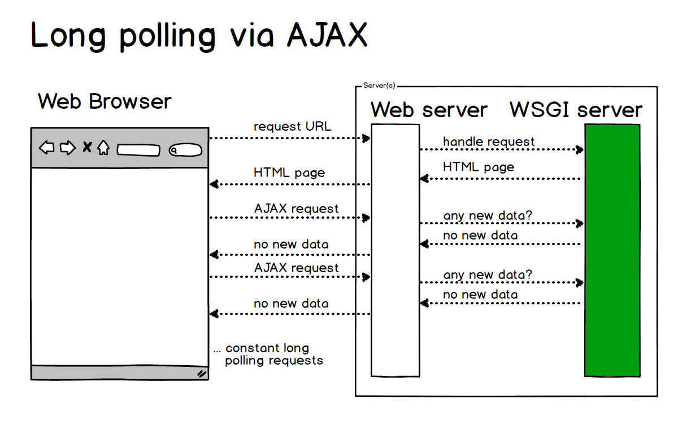 </div><br>

​	轮循，也叫短轮循，英文名也叫Polling。它很简单，只是用ajax隔一段时间，可能是1秒，2秒，时间自己设定，向服务器发送请求。这种方案会频繁地与服务器通讯，每次通讯都是发送完整的http请求，如果服务器经常有数据变动，有回应还好，有时候发送的请求都是没有意义，都是在等服务器端的回应，而服务器又没有任何改变，所以这种方式很消耗网络资源，很低效。

​	长轮循是对定时轮询的改进和提高，目地是为了降低无效的网络传输。这种方式也是通过ajax请求发送数据到服务器端，服务器端一直hold住这个连接，直到有数据到达，通过这种机制来减少无效的客户端和服务器间的交互，比如可以通过这种方式实现简易型的聊天室，但是，如果服务端的数据变更非常频繁的话，或者说访问的人非常多的时候，这种机制和定时轮询比较起来没有本质上的性能的提高。

​	因此，工程师们一直在思考，有没有更好的方法。WebSocket 就是这样发明的。WebSocket 连接允许客户端和服务器之间进行全双工通信，以便任一方都可以通过建立的连接将数据推送到另一端。WebSocket 只需要建立一次连接，就可以一直保持连接状态。这相比于轮询方式的不停建立连接显然效率要大大提高。

##### WebSocket 如何工作？

​	WebSocket是HTML5下一种新的协议。它实现了浏览器与服务器全双工通信，能更好的节省服务器资源和带宽并达到实时通讯的目的。它与HTTP一样通过已建立的TCP连接来传输数据，但是它和HTTP最大不同是：

- WebSocket是一种双向通信协议。在建立连接后，WebSocket服务器端和客户端都能主动发送数据给对方或向对方接收数据，就像Socket一样；
- WebSocket需要像TCP一样，先建立连接，连接成功后才能相互通信。

<div align="center"> 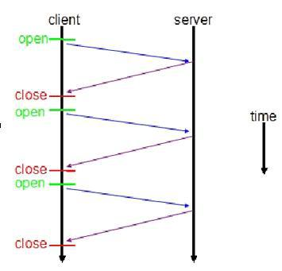 </div><br>

<div align="center">  </div><br>

相比HTTP长连接，WebSocket有以下特点：

- 是真正的全双工方式，建立连接后客户端与服务器端是完全平等的，可以互相主动请求。而HTTP长连接基于HTTP，是传统的客户端对服务器发起请求的模式。
- HTTP长连接中，每次数据交换除了真正的数据部分外，服务器和客户端还要大量交换HTTP header，信息交换效率很低。Websocket协议通过第一个request建立了TCP连接之后，之后交换的数据都不需要发送 HTTP header就能交换数据，这显然和原有的HTTP协议有区别所以它需要对服务器和客户端都进行升级才能实现（主流浏览器都已支持HTML5）。此外还有 multiplexing、不同的URL可以复用同一个WebSocket连接等功能。这些都是HTTP长连接不能做到的。

##### WebSocket 属性

以下是 WebSocket 对象的属性。假定我们使用了以上代码创建了 Socket 对象：

| 属性                  | 描述                                                         |
| --------------------- | ------------------------------------------------------------ |
| Socket.readyState     | 只读属性 **readyState** 表示连接状态，可以是以下值：0 - 表示连接尚未建立。1 - 表示连接已建立，可以进行通信。2 - 表示连接正在进行关闭。3 - 表示连接已经关闭或者连接不能打开。 |
| Socket.bufferedAmount | 只读属性 **bufferedAmount** 已被 send() 放入正在队列中等待传输，但是还没有发出的 UTF-8 文本字节数。 |

##### WebSocket 事件

以下是 WebSocket 对象的相关事件。假定我们使用了以上代码创建了 Socket 对象：

| 事件    | 事件处理程序     | 描述                       |
| ------- | ---------------- | -------------------------- |
| open    | Socket.onopen    | 连接建立时触发             |
| message | Socket.onmessage | 客户端接收服务端数据时触发 |
| error   | Socket.onerror   | 通信发生错误时触发         |
| close   | Socket.onclose   | 连接关闭时触发             |

##### WebSocket 方法

以下是 WebSocket 对象的相关方法。假定我们使用了以上代码创建了 Socket 对象：

| 方法           | 描述             |
| -------------- | ---------------- |
| Socket.send()  | 使用连接发送数据 |
| Socket.close() | 关闭连接         |

**示例**

```javascript
// 初始化一个 WebSocket 对象
var ws = new WebSocket("ws://localhost:9998/echo");

// 建立 web socket 连接成功触发事件
ws.onopen = function () {
  // 使用 send() 方法发送数据
  ws.send("发送数据");
  alert("数据发送中...");
};

// 接收服务端数据时触发事件
ws.onmessage = function (evt) {
  var received_msg = evt.data;
  alert("数据已接收...");
};

// 断开 web socket 连接成功触发事件
ws.onclose = function () {
  alert("连接已关闭...");
};
```

#### 三、C100k问题

https://www.cnblogs.com/davidwang456/p/5086962.html

https://colobu.com/2015/05/22/implement-C1000K-servers-by-spray-netty-undertow-and-node-js/

早期的系统，系统资源包括CPU、内存等都是非常有限的，系统为了保持公平，默认要限制进程对资源的使用情况。由于Linux的默认内核配置无法满足C100K的要求，因此需要对其进行适当的调优。

我们可以通过 `ulimit` 查看一下典型的机器默认的限制情况：

```
$ ulimit -a
core file size          (blocks, -c) 0
data seg size           (kbytes, -d) unlimited
scheduling priority             (-e) 0
file size               (blocks, -f) unlimited
pending signals                 (-i) 204800
max locked memory       (kbytes, -l) 32
max memory size         (kbytes, -m) unlimited
open files                      (-n) 1024
pipe size            (512 bytes, -p) 8
POSIX message queues     (bytes, -q) 819200
real-time priority              (-r) 0
stack size              (kbytes, -s) 10240
cpu time               (seconds, -t) unlimited
max user processes              (-u) 204800
virtual memory          (kbytes, -v) unlimited
file locks                      (-x) unlimited

```

比如其中的 `open files`，默认一个进程能打开的文件句柄数量为1024，对于一些需要大量文件句柄的程序，如web服务器、数据库程序等，1024往往是不够用的，在句柄使用完毕的时候，系统就会频繁出现emfile错误。

俗话说：一个巴掌拍不响，要完成 `C100K` 的目标，需要服务器端与客户端的紧密配合，下面将分别对这二者的调优进行介绍。

##### 客户端

###### 1：文件句柄数量受限

在Linux平台上，无论是编写客户端程序还是服务端程序，在进行高并发TCP连接处理时，由于每个TCP连接都要创建一个socket句柄，而每个socket句柄同时也是一个文件句柄，所以其最高并发数量要受到系统对用户单一进程同时可打开文件数量的限制以及整个系统可同时打开的文件数量限制。

###### 1.1：单一进程的文件句柄数量受限

###### 我们可以ulimit命令查看当前用户进程可打开的文件句柄数限制：

```
[root@localhost ~]# ulimit -n
1024

```

这表示当前用户的每个进程最多允许同时打开1024个文件，除去每个进程必然打开的标准输入、标准输出、标准错误、服务器监听socket、进程间通讯的unix域socket等文件，剩下的可用于客户端socket连接的文件数就只有大概1024-10=1014个左右。也就是说，在默认情况下，基于Linux的通讯程序最多允许同时1014个TCP并发连接。

对于想支持更高数量的TCP并发连接的通讯处理程序，就必须修改Linux对当前用户的进程可同时打开的文件数量的软限制（soft limit）和硬限制（hardlimit）。其中：

- 软限制是指Linux在当前系统能够承受的范围内进一步限制用户能同时打开的文件数。
- 硬限制是指根据系统硬件资源状况（主要是系统内存）计算出来的系统最多可同时打开的文件数量。

通常软限制小于或等于硬限制，可通过ulimit命令查看软限制和硬限制：

```
[root@localhost ~]# ulimit -Sn
1024

[root@localhost ~]# ulimit -Hn
4096

```

修改单一进程能同时打开的文件句柄数有2种方法：

1、直接使用ulimit命令，如：

```
[root@localhost ~]# ulimit -n 1048576

```

执行成功之后，ulimit n、Sn、Hn的值均会变为1048576。但该方法设置的值只会在当前终端有效，且设置的值不能高于方法2中设置的值。

2、对 `/etc/security/limits.conf` 文件，添加或修改：

```
* soft nofile 1048576
* hard nofile 1048576

```

其中，

- `*` 代表对所有用户有效，若仅想针对某个用户，可替换星号。
- soft即软限制，它只是一个警告值。
- hard代表硬限制，是一个真正意义的阈值，超过就会报错。
- nofile表示打开文件的最大数量。
- 1048576 = 1024 * 1024，为什么要取这个值呢？因为

> 在linux kernel 2.6.25之前通过ulimit -n(setrlimit(RLIMIT_NOFILE))设置每个进程的最大打开文件句柄数不能超过NR_OPEN（1024*1024）,也就是100多w（除非重新编译内核），而在25之后，内核导出了一个sys接口可以修改这个最大值（/proc/sys/fs /nr_open）.具体的changelog在<https://git.kernel.org/cgit/linux/kernel/git/torvalds/linux.git/commit/?id=9cfe015aa424b3c003baba3841a60dd9b5ad319b>

注意文件保存之后，需要注销或重启系统方能生效。

###### 1.2：整个系统的文件句柄数量受限

解决完单一进程的文件句柄数量受限问题后，还要解决整个系统的文件句柄数量受限问题。我们可通过以下命令查看Linux系统级的最大打开文件数限制：

```
[root@localhost ~]# cat /proc/sys/fs/file-max
98957

```

file-max表示系统所有进程最多允许同时打开的文件句柄数，是Linux系统级硬限制。通常，这个系统硬限制是Linux系统在启动时根据系统硬件资源状况计算出来的最佳的最大同时打开文件数限制，如果没有特殊需要，不应该修改此限制。

要修改它，需要对 `/etc/sysctl.conf` 文件，增加一行内容：

```
fs.file-max = 1048576

```

保存成功后，需执行下面命令使之生效：

```
[root@localhost ~]# sysctl -p

```

###### 2：端口数量受限

解决完文件句柄数量受限的问题后，就要解决IP端口数量受限的问题了。一般来说，对外提供请求的服务端不用考虑端口数量问题，只要监听某一个端口即可。可客户端要模拟大量的用户对服务端发起TCP请求，而每一个请求都需要一个端口，为了使一个客户端尽可能地模拟更多的用户，也就要使客户端拥有更多可使用的端口。

由于端口为16进制，即最大端口数为2的16次方65536（0-65535）。在Linux系统里，1024以下端口只有超级管理员用户（如root）才可以使用，普通用户只能使用大于等于1024的端口值。

我们可以通过以下命令查看系统提供的默认的端口范围：

```
[root@localhost ~]# cat /proc/sys/net/ipv4/ip_local_port_range
32768 61000

```

即只有61000-32768=28232个端口可以使用，即单个IP对外只能同时发送28232个TCP请求。

修改方法有以下2种：

1、执行以下命令：

```
echo "1024 65535"> /proc/sys/net/ipv4/ip_local_port_range

```

该方法立即生效，但重启后会失效。

2、修改 `/etc/sysctl.conf` 文件，增加一行内容：

```
net.ipv4.ip_local_port_range = 1024 65535

```

保存成功后，需执行下面命令使之生效：

```
[root@localhost ~]# sysctl -p

```

修改成功后，可用端口即增加到65535-1024=64511个，即单个客户端机器只能同时模拟64511个用户。要想突破这个限制，只能给该客户端增加IP地址，这样即可相应成倍地增加可用IP:PORT数。具体可参考[yongboy的这篇文章](http://www.blogjava.net/yongboy/archive/2013/04/09/397594.html)。

##### 服务端

###### 1：文件描述符数量受限

同客户端的问题1。

###### 2：TCP参数调优

要想提高服务端的性能，以达到我们高并发的目的，需要对系统的TCP参数进行适当的修改优化。

方法同样是修改 `/etc/sysctl.conf` 文件，增加以下内容：

```
net.ipv4.tcp_tw_reuse = 1 

```

当服务器需要在大量TCP连接之间切换时，会产生大量处于TIME_WAIT状态的连接。TIME_WAIT意味着连接本身是关闭的，但资源还没有释放。将net_ipv4_tcp_tw_reuse设置为1是让内核在安全时尽量回收连接，这比重新建立新连接要便宜得多。

```
net.ipv4.tcp_fin_timeout = 15

```

这是处于TIME_WAIT状态的连接在回收前必须等待的最小时间。改小它可以加快回收。

```
net.core.rmem_max = 16777216
net.core.wmem_max = 16777216

```

提高TCP的最大缓冲区大小，其中：

`net.core.rmem_max`：表示接收套接字缓冲区大小的最大值（以字节为单位）。

`net.core.wmem_max`：表示发送套接字缓冲区大小的最大值（以字节为单位）。

```
net.ipv4.tcp_rmem = 4096 87380 16777216
net.ipv4.tcp_wmem = 4096 65536 16777216

```

提高Linux内核自动对socket缓冲区进行优化的能力，其中：

`net.ipv4.tcp_rmem`：用来配置读缓冲的大小，第1个值为最小值，第2个值为默认值，第3个值为最大值。

`net.ipv4.tcp_wmem`：用来配置写缓冲的大小，第1个值为最小值，第2个值为默认值，第3个值为最大值。

```
net.core.netdev_max_backlog = 4096

```

每个网络接口接收数据包的速率比内核处理这些包的速率快时，允许送到队列的数据包的最大数目。默认为1000。

```
net.core.somaxconn = 4096

```

表示socket监听（listen）的backlog上限。什么是backlog呢？backlog就是socket的监听队列，当一个请求（request）尚未被处理或建立时，他会进入backlog。而socket server可以一次性处理backlog中的所有请求，处理后的请求不再位于监听队列中。当server处理请求较慢，以至于监听队列被填满后，新来的请求会被拒绝。默认为128。

```
net.ipv4.tcp_max_syn_backlog = 20480

```

表示SYN队列的长度，默认为1024，加大队列长度为8192，可以容纳更多等待连接的网络连接数。

```
net.ipv4.tcp_syncookies = 1

```

表示开启SYN Cookies。当出现SYN等待队列溢出时，启用cookies来处理，可防范少量SYN攻击，默认为0，表示关闭。

```
net.ipv4.tcp_max_tw_buckets = 360000

```

表示系统同时保持TIME_WAIT套接字的最大数量，如果超过这个数字，TIME_WAIT套接字将立刻被清除并打印警告信息。默认为180000。

```
net.ipv4.tcp_no_metrics_save = 1

```

一个tcp连接关闭后，把这个连接曾经有的参数比如慢启动门限snd_sthresh、拥塞窗口snd_cwnd，还有srtt等信息保存到dst_entry中，只要dst_entry没有失效，下次新建立相同连接的时候就可以使用保存的参数来初始化这个连接。

```
net.ipv4.tcp_syn_retries = 2

```

表示在内核放弃建立连接之前发送SYN包的数量，默认为4。

```
net.ipv4.tcp_synack_retries = 2

```

表示在内核放弃连接之前发送SYN+ACK包的数量，默认为5。

完整的TCP参数调优配置如下所示：

```
net.ipv4.tcp_tw_reuse = 1
net.ipv4.tcp_fin_timeout = 15
net.core.rmem_max = 16777216
net.core.wmem_max = 16777216
net.ipv4.tcp_rmem = 4096 87380 16777216
net.ipv4.tcp_wmem = 4096 65536 16777216
net.core.netdev_max_backlog = 4096
net.core.somaxconn = 4096
net.ipv4.tcp_max_syn_backlog = 20480
net.ipv4.tcp_syncookies = 1
net.ipv4.tcp_max_tw_buckets = 360000
net.ipv4.tcp_no_metrics_save = 1
net.ipv4.tcp_syn_retries = 2
net.ipv4.tcp_synack_retries = 2

```

###### 其它一些参数

```
vm.min_free_kbytes = 65536

```

用来确定系统开始回收内存的阀值，控制系统的空闲内存。值越高，内核越早开始回收内存，空闲内存越高。

```
vm.swappiness = 0

```

控制内核从物理内存移出进程，移到交换空间。该参数从0到100，当该参数=0，表示只要有可能就尽力避免交换进程移出物理内存;该参数=100，这告诉内核疯狂的将数据移出物理内存移到swap缓存中。

### 5、盘古系统

[Linux常用命令](https://github.com/jxnu-liguobin/Java-Learning-Summary/blob/master/src/cn/edu/jxnu/questions/Linux.md)

## 六、 架构

[限流算法](https://www.iminho.me/wiki/blog-4.html)

#### 1.大型网站架构演化

<div align="center"> 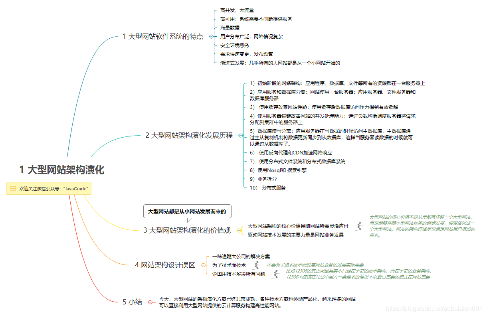 </div><br>

#### 2.大型架构模式

<div align="center"> 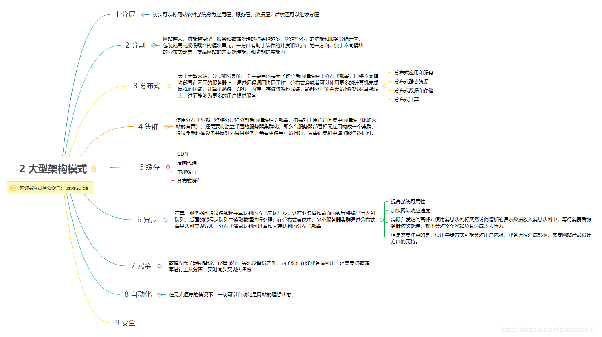 </div><br>

#### 3.大型网站核心架构要素

<div align="center"> 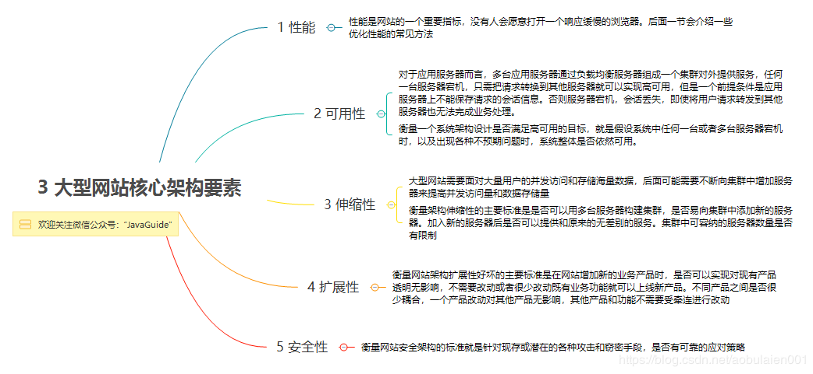 </div><br>

#### 4.瞬时响应:网站的高性能架构

<div align="center">  </div><br>

#### 5.万无一失:网站的高可用架构

<div align="center"> 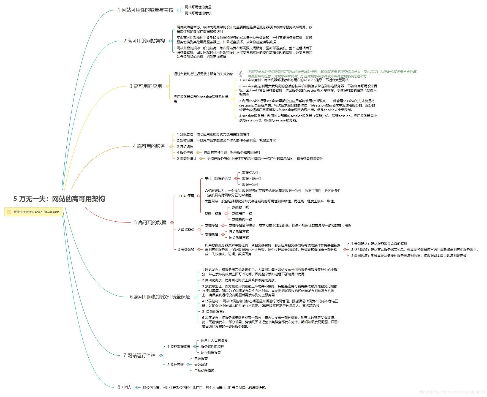 </div><br>

#### 6.永无止境:网站的伸缩性架构

<div align="center"> 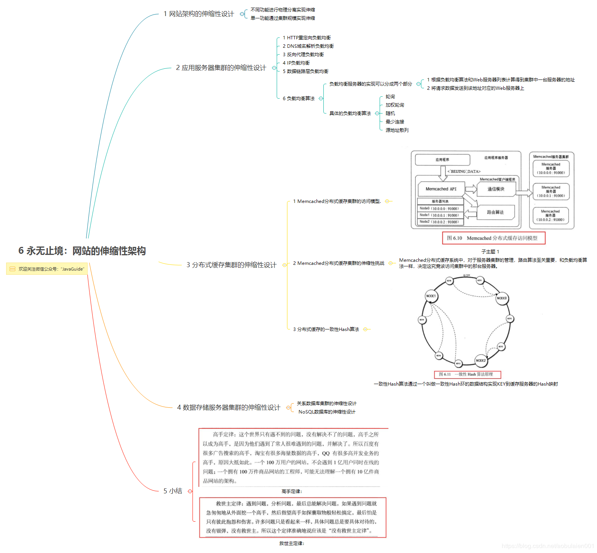 </div><br>

#### 7.随机应变:网站的可扩展性架构

<div align="center"> 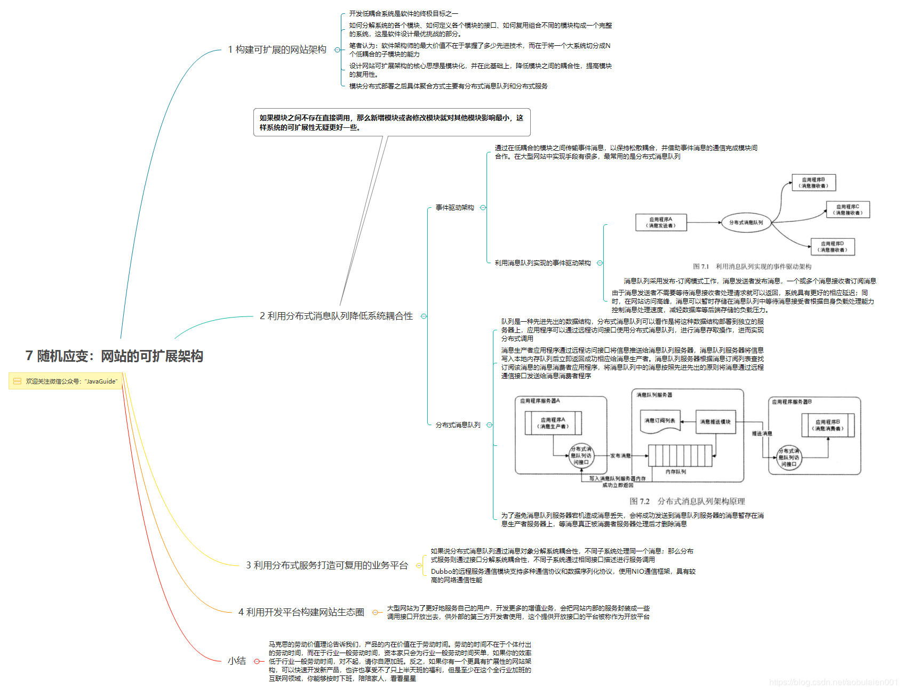 </div><br>

#### 8.固若金汤:网站的安全机构

<div align="center"> 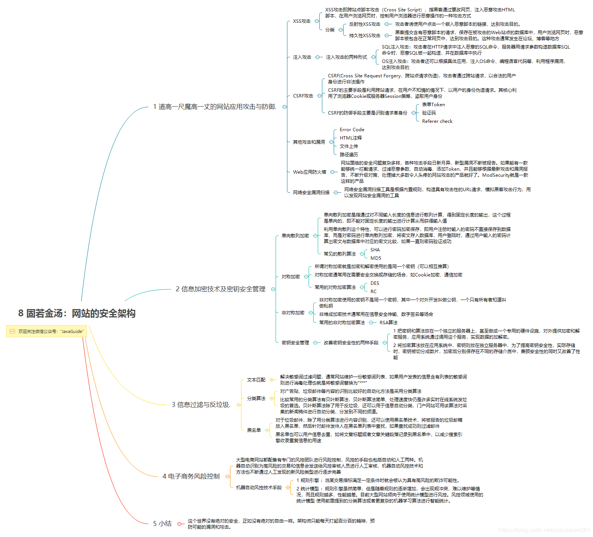 </div><br>

动态规划:

https://juejin.im/post/5a29d52cf265da43333e4da7

https://www.zhihu.com/question/23995189

https://www.liuchuo.net/archives/2325

https://www.liuchuo.net/archives/tag/leetcode-oj/page/2